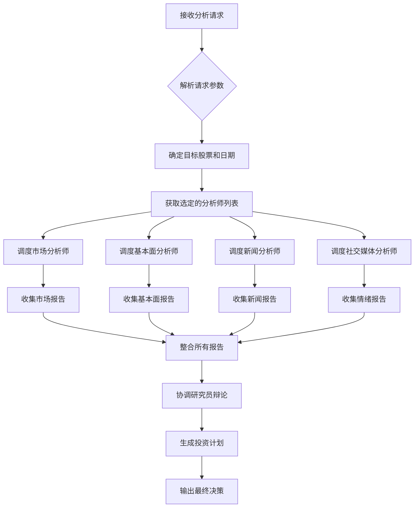
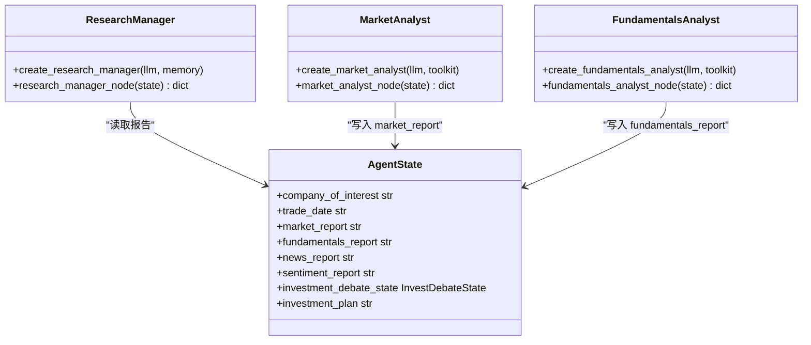
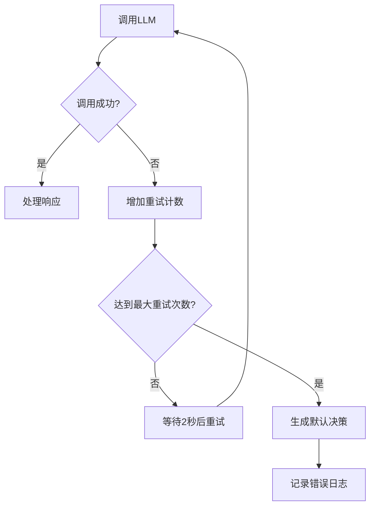
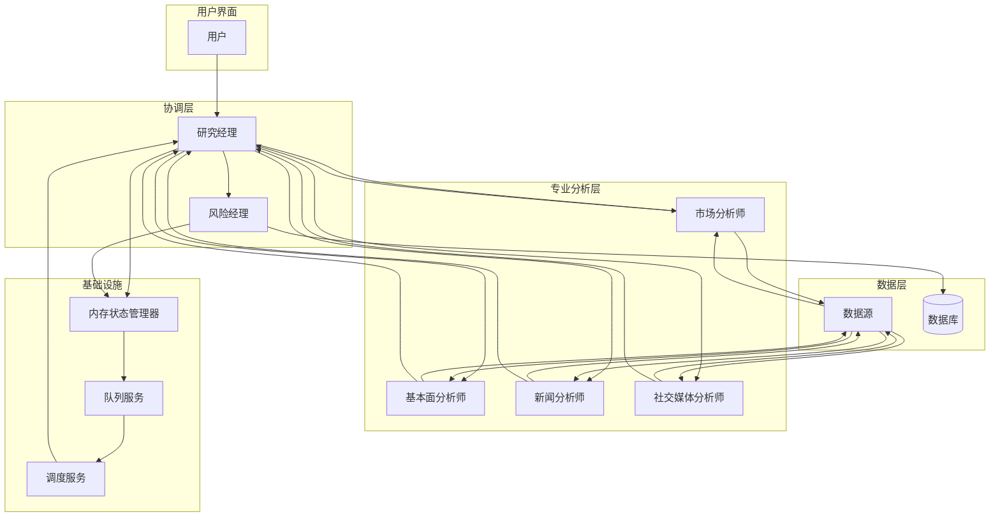

# 研究经理

<cite>
**本文档引用的文件**   
- [research_manager.py](file://tradingagents/agents/managers/research_manager.py)
- [risk_manager.py](file://tradingagents/agents/managers/risk_manager.py)
- [market_analyst.py](file://tradingagents/agents/analysts/market_analyst.py)
- [fundamentals_analyst.py](file://tradingagents/agents/analysts/fundamentals_analyst.py)
- [agent_states.py](file://tradingagents/agents/utils/agent_states.py)
- [trading_graph.py](file://tradingagents/graph/trading_graph.py)
- [memory_state_manager.py](file://app/services/memory_state_manager.py)
- [scheduler_service.py](file://app/services/scheduler_service.py)
- [queue_service.py](file://app/services/queue_service.py)
</cite>

## 目录
1. [引言](#引言)
2. [核心职责与工作流程](#核心职责与工作流程)
3. [任务编排与调度机制](#任务编排与调度机制)
4. [进度跟踪与结果整合](#进度跟踪与结果整合)
5. [异常处理与超时控制](#异常处理与超时控制)
6. [与风险经理的协作关系](#与风险经理的协作关系)
7. [系统架构与数据流](#系统架构与数据流)
8. [结论](#结论)

## 引言

研究经理是本多智能体系统中的核心协调者，扮演着投资组合经理和辩论主持人的双重角色。它负责接收用户的分析请求，将复杂的分析任务分解为可管理的子任务，并调度市场分析师、基本面分析师、新闻分析师等专业智能体协同工作。研究经理通过协调这些智能体的辩论，综合各方观点，最终形成明确的投资计划。本文档将详细阐述研究经理的核心职责、任务编排逻辑、进度跟踪机制以及与风险经理的协作流程。

**Section sources**
- [research_manager.py](file://tradingagents/agents/managers/research_manager.py#L1-L109)
- [trading_graph.py](file://tradingagents/graph/trading_graph.py#L1-L800)

## 核心职责与工作流程

研究经理的核心职责是作为多智能体系统的协调中枢，其工作流程始于接收一个包含股票代码、分析日期和用户配置的分析请求。它不直接进行数据分析，而是作为一个战略指挥官，启动并管理一个由多个专业分析师组成的“研究团队”。

其工作流程如下：
1.  **接收请求**：从系统接收包含 `company_of_interest`（目标公司）、`trade_date`（交易日期）和 `selected_analysts`（选定的分析师）等信息的分析请求。
2.  **任务分解**：根据 `selected_analysts` 配置，确定需要调用哪些专业分析师（如市场分析师、基本面分析师等）。
3.  **调度执行**：将分析任务分派给相应的专业分析师智能体。每个分析师会利用其专用工具（如获取市场数据、获取基本面数据）来收集信息并生成专业报告。
4.  **整合信息**：收集所有专业分析师生成的报告，包括市场报告、基本面报告、新闻报告和情绪报告。
5.  **主持辩论**：协调看涨（bull）和看跌（bear）研究员进行辩论，将辩论历史记录在 `investment_debate_state` 中。
6.  **形成决策**：基于所有收集到的报告和辩论结果，研究经理会生成一份全面的投资计划，明确给出买入、持有或卖出的建议，并提供详细的理由和目标价格分析。

**Section sources**
- [research_manager.py](file://tradingagents/agents/managers/research_manager.py#L10-L108)
- [agent_states.py](file://tradingagents/agents/utils/agent_states.py#L54-L87)

## 任务编排与调度机制

研究经理的任务编排机制是通过一个预定义的图（Graph）结构来实现的，该结构定义了智能体之间的交互顺序和条件逻辑。其调度机制依赖于 `tradingagents.graph.trading_graph.TradingAgentsGraph` 类。

### 任务编排逻辑

研究经理的节点函数 `research_manager_node` 是图中的一个关键节点。它遵循以下逻辑：
- **输入状态**：接收一个包含所有分析师报告和辩论历史的 `state` 对象。
- **信息整合**：将市场报告、情绪报告、新闻报告和基本面报告整合成一个综合的分析情境。
- **提示工程**：构建一个精心设计的提示词（Prompt），要求LLM（大语言模型）总结辩论双方的关键观点，并基于最强有力的论据做出明确的投资决策。
- **输出状态**：返回更新后的状态，其中包含最终的 `investment_plan` 和更新的 `investment_debate_state`。

**Diagram sources **
- [research_manager.py](file://tradingagents/agents/managers/research_manager.py#L10-L108)
- [trading_graph.py](file://tradingagents/graph/trading_graph.py#L193-L800)

### 与专业分析师的协作

研究经理与专业分析师的协作是通过状态（State）对象进行的。例如，市场分析师（`market_analyst.py`）在完成分析后，会将生成的 `market_report` 写入状态。研究经理在执行时，会从状态中读取这些报告。

**Diagram sources **
- [research_manager.py](file://tradingagents/agents/managers/research_manager.py#L10-L108)
- [market_analyst.py](file://tradingagents/agents/analysts/market_analyst.py#L97-L508)
- [fundamentals_analyst.py](file://tradingagents/agents/analysts/fundamentals_analyst.py#L98-L689)
- [agent_states.py](file://tradingagents/agents/utils/agent_states.py#L54-L87)

## 进度跟踪与结果整合

研究经理的进度跟踪和结果整合是整个分析流程顺利进行的关键。

### 进度跟踪机制

系统的进度跟踪由 `app.services.memory_state_manager.MemoryStateManager` 负责。研究经理本身不直接管理进度，但它所处的整个工作流会通过该管理器来更新状态。

- **任务状态**：每个分析任务都有一个唯一的 `task_id`，其状态（如 `PENDING`, `RUNNING`, `COMPLETED`）和进度百分比（`progress`）会被实时更新。
- **步骤映射**：进度百分比会映射到具体的分析步骤（如“市场分析”、“研究辩论”），以便向用户展示当前所处阶段。
- **预估时长**：系统会根据分析深度、选定的分析师数量和LLM提供商等因素，预估任务的总执行时间。

**Section sources**
- [memory_state_manager.py](file://app/services/memory_state_manager.py#L1-L421)

### 结果整合策略

研究经理的结果整合策略是其核心价值所在。它不仅仅是简单地拼接报告，而是进行深度的综合分析。

1.  **信息融合**：将来自不同来源的报告（市场、基本面、新闻、情绪）融合成一个全面的公司画像。
2.  **辩论评估**：批判性地评估看涨和看跌研究员的论点，识别最有说服力的证据。
3.  **决策制定**：基于融合后的信息和辩论结果，做出明确的投资决策，避免模棱两可的“持有”建议，除非有强有力的理由。
4.  **目标价格分析**：提供具体的目标价格区间和价格目标，考虑基本面估值、新闻影响、情绪驱动和风险调整情景。
5.  **学习与改进**：利用 `memory` 组件检索过去类似情况下的错误反思，以改进当前的决策过程。

**Section sources**
- [research_manager.py](file://tradingagents/agents/managers/research_manager.py#L32-L108)

## 异常处理与超时控制

研究经理及其所在的系统具备完善的异常处理和超时控制机制，以确保系统的健壮性。

### 工作流管理中的异常处理

虽然研究经理节点本身没有复杂的重试逻辑，但其协作的其他组件（如风险经理）和底层系统具备此功能。例如，风险经理在调用LLM时，会进行最多3次的重试。

**Diagram sources **
- [risk_manager.py](file://tradingagents/agents/managers/risk_manager.py#L68-L141)

### 超时控制

系统的超时控制是分层的：
- **LLM调用超时**：在创建LLM实例时，会设置 `timeout` 参数（如180秒），防止单次调用无限等待。
- **任务级超时**：`MemoryStateManager` 提供了 `cleanup_zombie_tasks` 方法，可以清理长时间（如超过2小时）处于 `RUNNING` 状态的“僵尸任务”，防止资源泄漏。
- **队列可见性超时**：`app.services.queue_service.QueueService` 实现了 `cleanup_expired_tasks` 方法，用于处理在规定时间内未被处理的过期任务。

**Section sources**
- [scheduler_service.py](file://app/services/scheduler_service.py#L783-L808)
- [queue_service.py](file://app/services/queue_service.py#L273-L311)
- [memory_state_manager.py](file://app/services/memory_state_manager.py#L356-L392)

## 与风险经理的协作关系

研究经理与风险经理构成了一个“决策-风控”的双层架构，二者紧密协作，共同完成投资决策。

1.  **职责分工**：
    *   **研究经理**：负责“进攻”，即寻找投资机会，形成投资计划（`investment_plan`）。
    *   **风险经理**：负责“防守”，即评估该投资计划的风险，做出最终的交易决策（`final_trade_decision`）。
2.  **工作流衔接**：
    *   研究经理完成其节点后，会将 `investment_plan` 和相关的分析报告传递给状态。
    *   随后，工作流会进入风险经理节点。风险经理会接收 `investment_plan` 作为输入，并协调激进、中性和保守风险分析师进行辩论。
    *   最终，风险经理会基于风险辩论的结果，对研究经理的投资计划进行修正或确认，生成最终的交易决策。
3.  **信息共享**：两者共享同一套状态对象，可以访问所有分析师的报告和辩论历史，确保决策基于完整的信息。

这种协作模式确保了投资决策既具有积极的进攻性，又经过了严格的风控审查，实现了收益与风险的平衡。

**Section sources**
- [research_manager.py](file://tradingagents/agents/managers/research_manager.py#L10-L108)
- [risk_manager.py](file://tradingagents/agents/managers/risk_manager.py#L9-L163)

## 系统架构与数据流

整个多智能体系统的架构是一个以状态机为核心的图结构。

**Diagram sources **
- [trading_graph.py](file://tradingagents/graph/trading_graph.py#L193-L800)
- [memory_state_manager.py](file://app/services/memory_state_manager.py#L1-L421)
- [queue_service.py](file://app/services/queue_service.py#L273-L311)
- [scheduler_service.py](file://app/services/scheduler_service.py#L492-L808)

## 结论

研究经理是本多智能体系统的核心协调者，它通过高效的任务编排、严谨的进度跟踪和深度的结果整合，将分散的专业智能体组织成一个高效的分析团队。它不仅负责生成投资计划，还与风险经理紧密协作，构建了一个完整的“研究-风控”决策闭环。其背后强大的异常处理和超时控制机制，确保了整个系统在复杂环境下的稳定运行。研究经理的设计体现了现代AI系统中模块化、协作化和流程化的设计思想。