# 社交媒体分析师

<cite>
**本文档引用文件**   
- [social_media_analyst.py](file://tradingagents/agents/analysts/social_media_analyst.py)
- [social_media_crawler.py](file://examples/crawlers/social_media_crawler.py)
- [social_media_service.py](file://app/services/social_media_service.py)
- [social_media.py](file://app/routers/social_media.py)
- [agent_utils.py](file://tradingagents/agents/utils/agent_utils.py)
- [chinese-social-media-integration.md](file://docs/localization/chinese-social-media-integration.md)
</cite>

## 目录
1. [引言](#引言)
2. [系统架构](#系统架构)
3. [核心功能分析](#核心功能分析)
4. [数据采集与处理](#数据采集与处理)
5. [情绪分析模型](#情绪分析模型)
6. [话题聚类与预警机制](#话题聚类与预警机制)
7. [信息整合方式](#信息整合方式)
8. [API接口说明](#api接口说明)
9. [配置与部署](#配置与部署)
10. [总结](#总结)

## 引言

社交媒体分析师是本系统中的关键智能体之一，专注于监控和分析中国主要社交媒体平台上的投资者情绪。该智能体通过采集微博、雪球等平台的用户讨论数据，运用自然语言处理技术识别市场情绪变化，为投资决策提供重要参考。

**Section sources**
- [social_media_analyst.py](file://tradingagents/agents/analysts/social_media_analyst.py#L1-L232)

## 系统架构

社交媒体分析师系统采用分层架构设计，包含数据采集层、数据处理层、分析服务层和应用接口层。各组件协同工作，实现从原始数据到深度分析报告的完整流程。

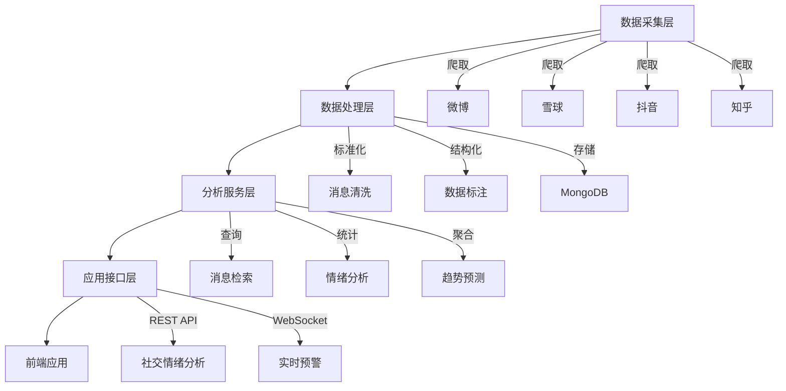

**Diagram sources**
- [social_media_crawler.py](file://examples/crawlers/social_media_crawler.py#L33-L542)
- [social_media_service.py](file://app/services/social_media_service.py#L1-L353)
- [social_media.py](file://app/routers/social_media.py#L1-L359)

**Section sources**
- [social_media_crawler.py](file://examples/crawlers/social_media_crawler.py#L1-L542)
- [social_media_service.py](file://app/services/social_media_service.py#L1-L353)

## 核心功能分析

社交媒体分析师具备三大核心能力：舆情监控、情绪分析和异常预警。这些功能共同构成了完整的投资者情绪分析体系。

### 舆情监控能力

社交媒体分析师能够实时监控多个平台的用户讨论，重点关注与特定股票相关的讨论热度和关键意见领袖(KOL)观点。

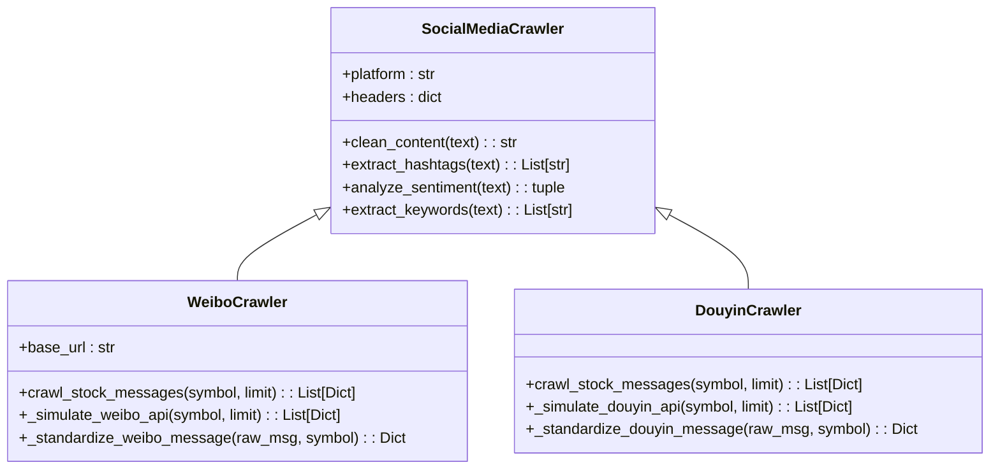

**Diagram sources**
- [social_media_crawler.py](file://examples/crawlers/social_media_crawler.py#L33-L542)

### 情绪分析能力

情绪分析模块采用基于规则和关键词的方法，对文本内容进行情感倾向判断，量化投资者情绪强度。

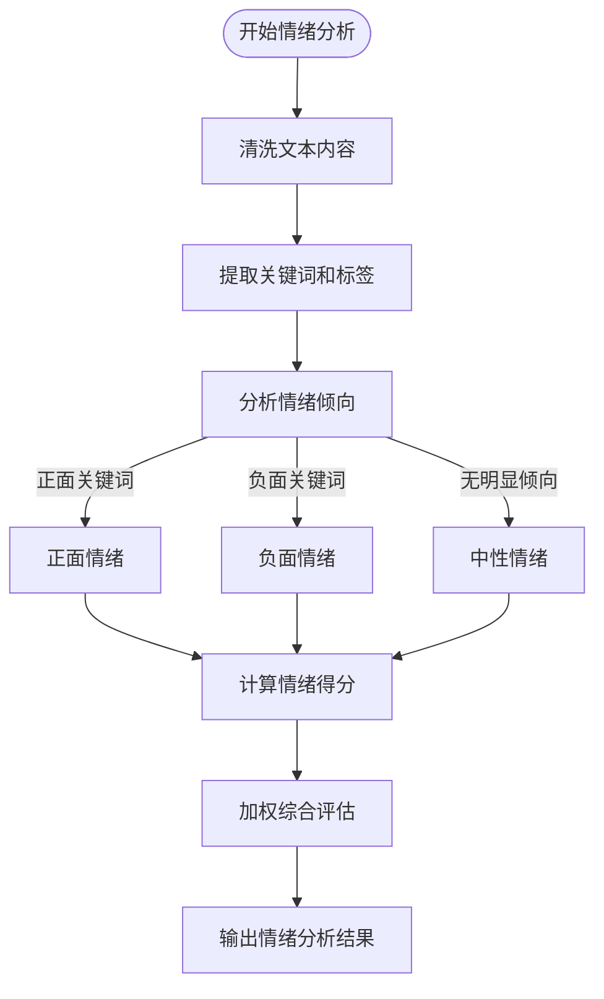

**Diagram sources**
- [social_media_crawler.py](file://examples/crawlers/social_media_crawler.py#L81-L100)
- [internal_message_crawler.py](file://examples/crawlers/internal_message_crawler.py#L97-L108)

**Section sources**
- [social_media_crawler.py](file://examples/crawlers/social_media_crawler.py#L81-L100)

## 数据采集与处理

社交媒体数据采集系统负责从多个平台获取原始讨论数据，并进行标准化处理。

### 数据采集流程

数据采集流程包括平台适配、请求发送、响应解析和数据标准化四个主要步骤。

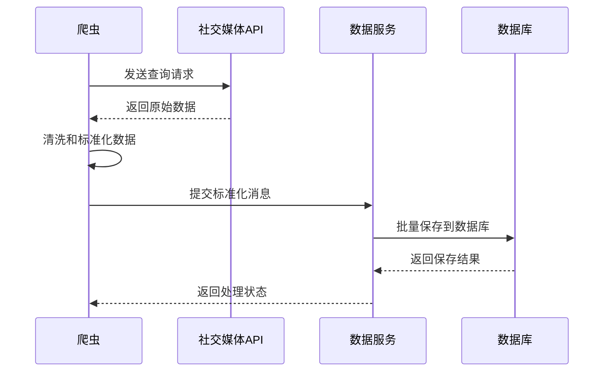

**Diagram sources**
- [social_media_crawler.py](file://examples/crawlers/social_media_crawler.py#L167-L184)
- [social_media_service.py](file://app/services/social_media_service.py#L80-L137)

### 数据结构定义

系统定义了统一的数据结构来存储社交媒体消息，确保数据的一致性和可查询性。

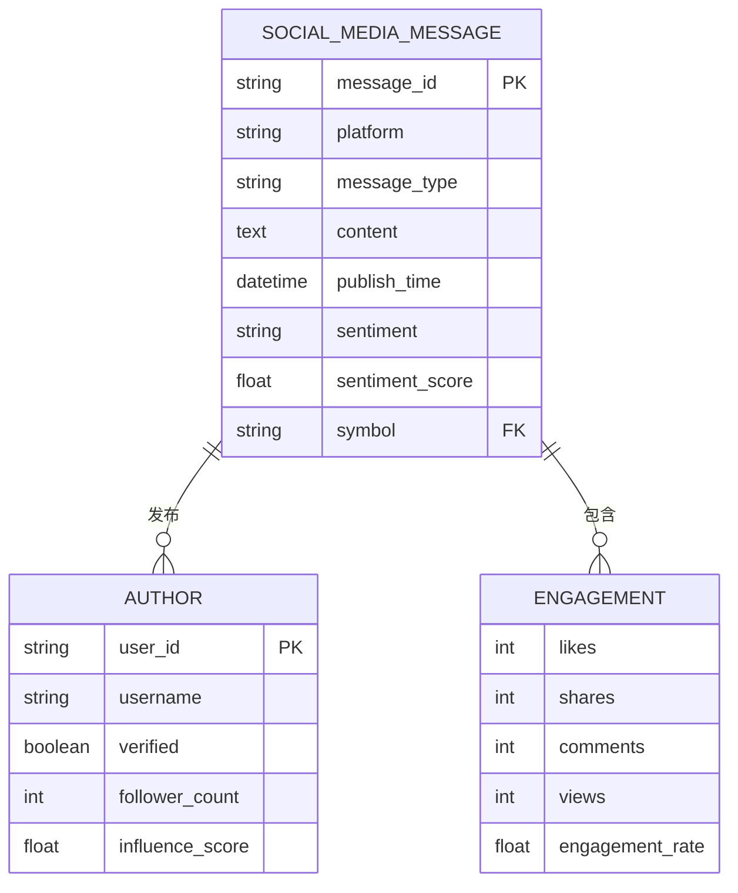

**Diagram sources**
- [social_media.py](file://app/routers/social_media.py#L20-L41)
- [social_media_service.py](file://app/services/social_media_service.py#L56-L353)

**Section sources**
- [social_media.py](file://app/routers/social_media.py#L20-L41)

## 情绪分析模型

情绪分析模型是社交媒体分析师的核心，通过多种技术手段评估投资者情绪。

### 情绪强度评估

系统采用多维度指标评估情绪强度，包括情绪倾向、影响力和可信度。

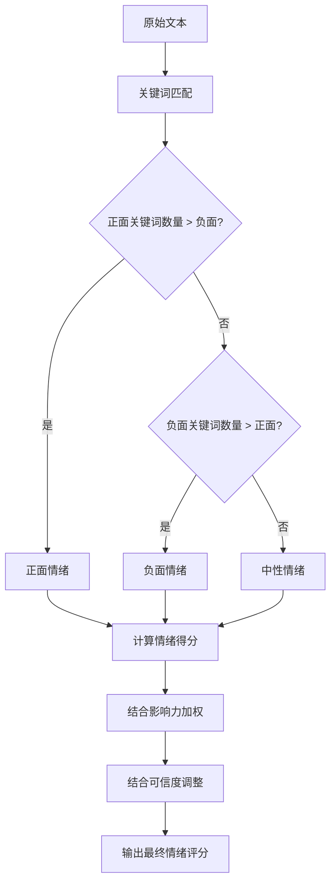

**Diagram sources**
- [social_media_crawler.py](file://examples/crawlers/social_media_crawler.py#L81-L100)
- [social_media_crawler.py](file://examples/crawlers/social_media_crawler.py#L119-L132)

### 情绪变化趋势分析

系统能够分析情绪随时间的变化趋势，识别情绪转折点。

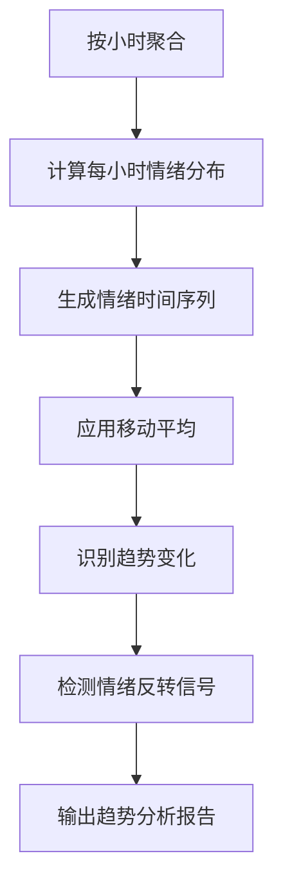

**Diagram sources**
- [social_media.py](file://app/routers/social_media.py#L291-L318)
- [chinese-social-media-integration.md](file://docs/localization/chinese-social-media-integration.md#L634-L659)

**Section sources**
- [social_media.py](file://app/routers/social_media.py#L265-L337)

## 话题聚类与预警机制

系统具备话题聚类和异常情绪预警能力，能够及时发现市场热点和潜在风险。

### 话题聚类算法

采用基于关键词和标签的聚类算法，将相似讨论归为同一话题。

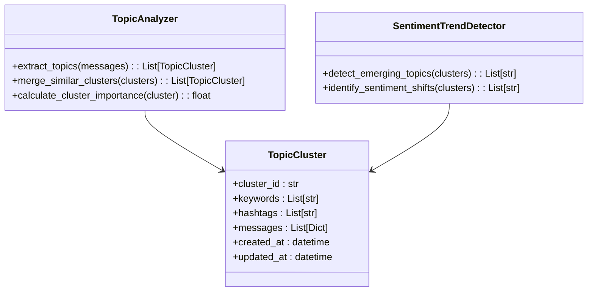

**Diagram sources**
- [chinese-social-media-integration.md](file://docs/localization/chinese-social-media-integration.md#L110-L126)
- [internal_message_crawler.py](file://examples/crawlers/internal_message_crawler.py#L110-L140)

### 异常情绪预警机制

建立多级预警机制，当检测到异常情绪波动时触发预警。

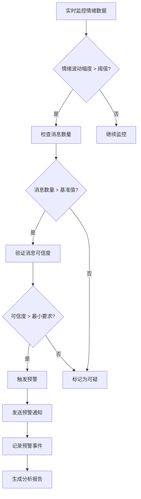

**Diagram sources**
- [chinese-social-media-integration.md](file://docs/localization/chinese-social-media-integration.md#L206-L223)
- [agent_utils.py](file://tradingagents/agents/utils/agent_utils.py#L1287-L1359)

**Section sources**
- [agent_utils.py](file://tradingagents/agents/utils/agent_utils.py#L1287-L1359)

## 信息整合方式

社交媒体分析师与其他分析模块协同工作，提供全面的市场洞察。

### 与新闻分析师的整合

社交媒体情绪分析与新闻事件分析相结合，提供更完整的市场图景。

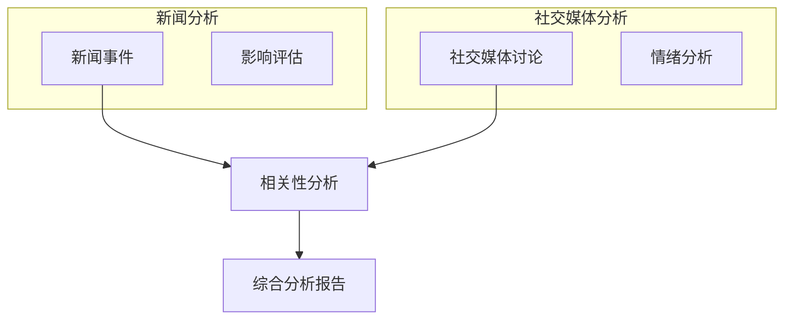

**Diagram sources**
- [social_media_analyst.py](file://tradingagents/agents/analysts/social_media_analyst.py#L116-L156)
- [chinese-social-media-integration.md](file://docs/localization/chinese-social-media-integration.md#L85-L108)

### 与市场分析师的整合

将社交媒体情绪指标整合到技术分析和基本面分析中。

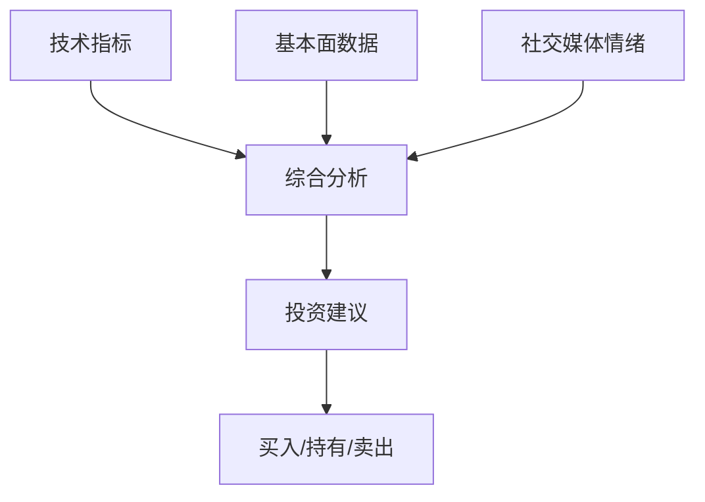

**Diagram sources**
- [social_media_analyst.py](file://tradingagents/agents/analysts/social_media_analyst.py#L140-L153)
- [analysis.py](file://app/models/analysis.py#L33-L54)

**Section sources**
- [social_media_analyst.py](file://tradingagents/agents/analysts/social_media_analyst.py#L140-L153)

## API接口说明

系统提供RESTful API接口，支持外部系统集成和数据查询。

### 主要API端点

| 端点 | 方法 | 描述 | 参数 |
|------|------|------|------|
| /api/social-media/save | POST | 批量保存社交媒体消息 | messages, symbol |
| /api/social-media/query | POST | 查询社交媒体消息 | query parameters |
| /api/social-media/latest/{symbol} | GET | 获取最新消息 | symbol, platform, limit |
| /api/social-media/search | GET | 全文搜索消息 | query, symbol, platform |
| /api/social-media/sentiment-analysis/{symbol} | GET | 获取情绪分析 | symbol, platform, hours_back |

**Section sources**
- [social_media.py](file://app/routers/social_media.py#L68-L337)

## 配置与部署

系统支持灵活的配置选项，可根据需求进行定制化部署。

### 环境变量配置

```bash
# 中国社交媒体平台API密钥
WEIBO_API_KEY=your_weibo_api_key
WEIBO_API_SECRET=your_weibo_api_secret

# 财经数据源
CAILIANSHE_API_KEY=your_cailianshe_key
EASTMONEY_API_KEY=your_eastmoney_key

# 替代Reddit的配置
USE_CHINESE_SOCIAL_MEDIA=true
SOCIAL_MEDIA_PLATFORMS=weibo,xueqiu,eastmoney_guba
```

**Section sources**
- [chinese-social-media-integration.md](file://docs/localization/chinese-social-media-integration.md#L189-L202)

## 总结

社交媒体分析师通过整合微博、雪球等中国主要社交媒体平台的数据，运用自然语言处理技术进行投资者情绪分析，为投资决策提供重要参考。系统具备完整的数据采集、处理、分析和预警能力，能够有效识别市场情绪变化趋势和潜在风险。

该智能体与其他分析模块协同工作，将社交媒体情绪指标整合到全面的市场分析框架中，提升了投资分析的准确性和时效性。未来可进一步优化情绪分析算法，增加更多数据源，提升系统的智能化水平。