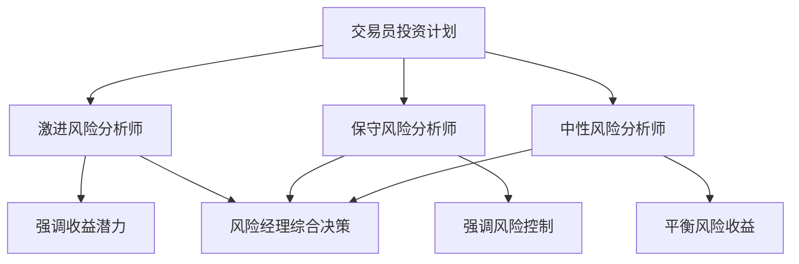
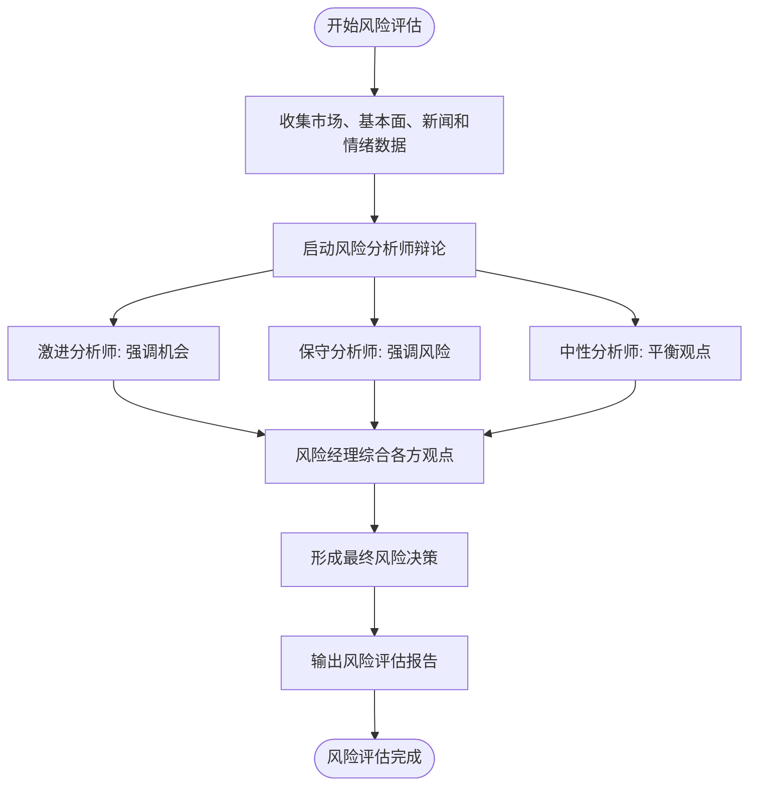
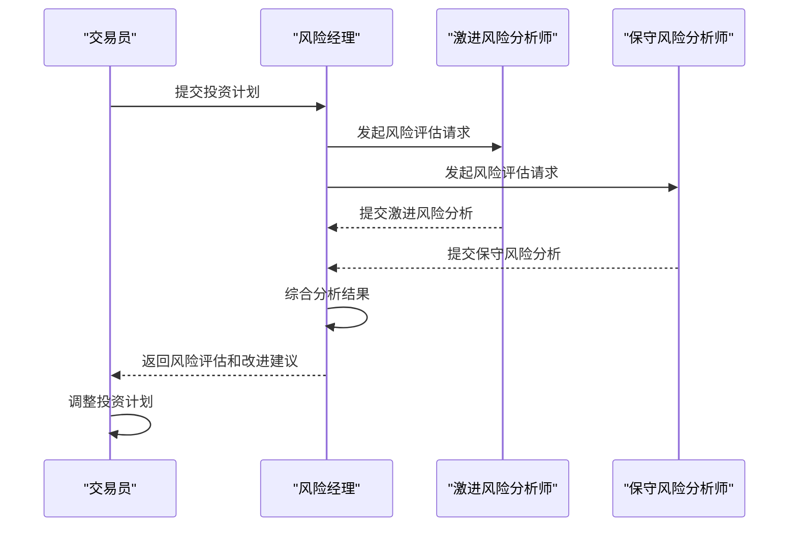
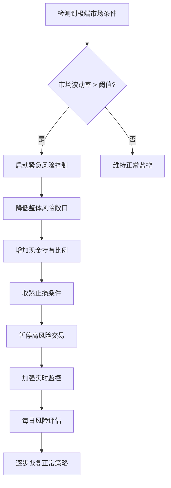
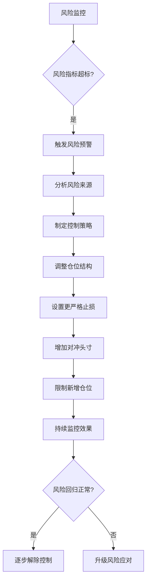
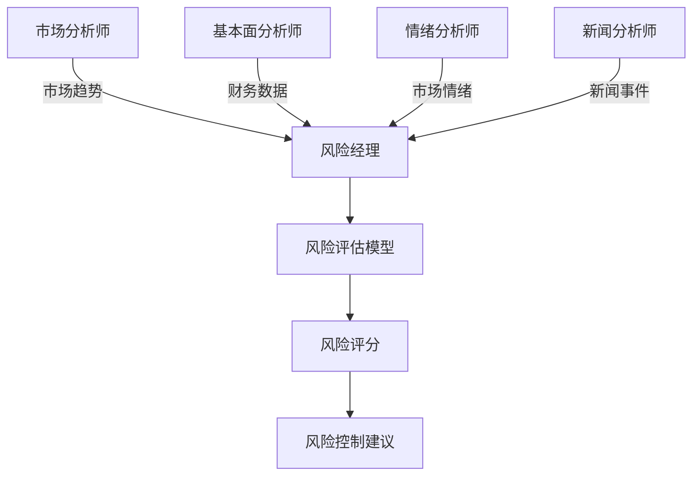

# 风险经理

<cite>
**本文档引用的文件**
- [risk_manager.py](file://tradingagents/agents/managers/risk_manager.py)
- [conservative_debator.py](file://tradingagents/agents/risk_mgmt/conservative_debator.py)
- [aggresive_debator.py](file://tradingagents/agents/risk_mgmt/aggresive_debator.py)
- [neutral_debator.py](file://tradingagents/agents/risk_mgmt/neutral_debator.py)
- [risk-management.md](file://docs/agents/v0.1.13/risk-management.md)
- [managers.md](file://docs/agents/v0.1.13/managers.md)
- [cli/main.py](file://cli/main.py)
</cite>

## 目录
1. [引言](#引言)
2. [核心风险评估能力](#核心风险评估能力)
3. [风险评分模型与评估流程](#风险评分模型与评估流程)
4. [压力测试与极端市场应对](#压力测试与极端市场应对)
5. [风险预警与控制机制](#风险预警与控制机制)
6. [协作模式](#协作模式)
7. [配置与监控](#配置与监控)

## 引言

风险经理是 TradingAgents 框架中的核心风险控制角色，负责对投资决策进行全面的风险评估和控制。通过协调激进、保守和中性三位风险分析师的多角度辩论，风险经理最终形成综合性的风险管理决策，确保投资组合在可控风险范围内运作。该智能体不仅评估市场波动、个股特有和组合集中度等风险，还与交易员、研究经理和各专业分析师紧密协作，构建了一个动态、智能的风险管理体系。

## 核心风险评估能力

风险经理的核心能力体现在对多种风险的全面评估上，通过多维度分析确保投资决策的稳健性。

### 市场波动风险评估

风险经理通过整合市场研究报告、情绪分析和新闻数据，全面评估市场波动风险。系统会识别宏观经济风险、政策监管风险、利率汇率风险和地缘政治风险等系统性风险因素，同时关注行业周期风险、公司特定风险和竞争环境风险等非系统性风险。

### 个股特有风险评估

对于个股特有风险，风险经理从多个维度进行深入分析：
- **财务风险**：评估债务负担、偿债能力、现金流稳定性和盈利质量
- **运营风险**：识别业务模式风险、管理层风险、内控制度风险和合规风险
- **估值风险**：分析估值模型选择、参数敏感性、假设条件评估和比较基准选择

### 组合集中度风险评估

风险经理严格监控投资组合的集中度风险，通过以下指标进行控制：
- **最大单一仓位**：限制单只股票的持仓比例
- **最大行业敞口**：控制特定行业的投资比例
- **相关性阈值**：监控资产间的相关性，避免过度集中
- **组合VaR**：计算和监控整个投资组合的价值-at-风险

**Section sources**
- [risk-management.md](file://docs/agents/v0.1.13/risk-management.md#L125-L160)
- [managers.md](file://docs/agents/v0.1.13/managers.md#L196-L204)

## 风险评分模型与评估流程

风险经理采用多智能体辩论机制来构建其风险评分模型，通过不同风险偏好的分析师之间的互动，形成全面的风险评估。

### 多角度风险分析师

风险评估流程由三位具有不同风险偏好的分析师共同完成：



**Diagram sources**
- [risk-management.md](file://docs/agents/v0.1.13/risk-management.md#L45-L86)
- [managers.md](file://docs/agents/v0.1.13/managers.md#L196-L204)

### 风险评估流程

风险评估流程遵循严格的步骤，确保全面性和客观性：



**Diagram sources**
- [risk_manager.py](file://tradingagents/agents/managers/risk_manager.py#L35-L54)
- [conservative_debator.py](file://tradingagents/agents/risk_mgmt/conservative_debator.py#L40-L52)

### 与交易员的交互机制

风险经理与交易员之间存在紧密的交互机制，确保风险控制与投资决策的协调一致：



**Diagram sources**
- [risk_manager.py](file://tradingagents/agents/managers/risk_manager.py#L20-L21)
- [cli/main.py](file://cli/main.py#L1474-L1538)

## 压力测试与极端市场应对

风险经理具备完善的压力测试机制和极端市场条件下的应对策略，确保系统在各种市场环境下的稳健性。

### 压力测试方法

系统采用定期的压力测试来评估投资组合在极端市场条件下的表现：

```python
risk_config = {
    "stress_test_frequency": "weekly",  # 压力测试频率
    "max_portfolio_var": 0.05,         # 最大组合VaR
    "rebalance_trigger": 0.05,         # 再平衡触发阈值
}
```

压力测试包括模拟各种极端市场情景，如市场崩盘、流动性枯竭、重大政策变化等，评估投资组合的潜在损失和恢复能力。

### 极端市场应对策略

在极端市场条件下，风险经理会启动应急预案：



**Diagram sources**
- [risk-management.md](file://docs/agents/v0.1.13/risk-management.md#L181-L194)
- [risk_manager.py](file://tradingagents/agents/managers/risk_manager.py#L124-L142)

## 风险预警与控制机制

风险经理建立了完善的风险预警和控制机制，确保风险在可控范围内。

### 风险预警阈值设置

系统设置了多层次的风险预警阈值：

```python
risk_config = {
    "max_single_position": 0.05,       # 最大单一仓位5%
    "max_sector_exposure": 0.20,       # 最大行业敞口20%
    "correlation_threshold": 0.70,     # 相关性阈值70%
}
```

当任何指标超过预设阈值时，系统会自动触发预警，并采取相应的控制措施。

### 风险控制措施

风险经理实施多种风险控制措施：



**Diagram sources**
- [risk-management.md](file://docs/agents/v0.1.13/risk-management.md#L187-L192)
- [managers.md](file://docs/agents/v0.1.13/managers.md#L220-L242)

## 协作模式

风险经理与系统内其他智能体保持着高效的协作模式，确保风险管理融入整个投资决策流程。

### 与研究经理的协作

风险经理与研究经理协同工作，将风险视角融入研究过程：

```mermaid
graph TB
subgraph 研究团队
RM[研究经理]
BR[看跌研究员]
BRB[看涨研究员]
end
subgraph 风险管理团队
RSKM[风险经理]
AGG[激进风险分析师]
CON[保守风险分析师]
NEU[中性风险分析师]
end
RM --> RSKM : 提供研究结论
RSKM --> RM : 返回风险评估
AGG & CON & NEU --> RSKM : 提交风险分析
RSKM --> TRADER : 最终风险决策
```

**Diagram sources**
- [managers.md](file://docs/agents/v0.1.13/managers.md#L196-L204)
- [risk-management.md](file://docs/agents/v0.1.13/risk-management.md#L45-L86)

### 与各专业分析师的协作

风险经理整合各专业分析师的分析结果，形成全面的风险评估：



**Diagram sources**
- [risk-management.md](file://docs/agents/v0.1.13/risk-management.md#L31-L40)
- [cli/main.py](file://cli/main.py#L887-L928)

## 配置与监控

风险经理的运作基于可配置的风险参数，并通过详细的日志和监控确保透明度和可追溯性。

### 风险管理配置

系统提供了灵活的风险管理配置选项：

```python
risk_config = {
    "risk_tolerance": "moderate",      # 风险容忍度
    "max_portfolio_var": 0.05,         # 最大组合VaR
    "max_single_position": 0.05,       # 最大单一仓位
    "max_sector_exposure": 0.20,       # 最大行业敞口
    "correlation_threshold": 0.70,     # 相关性阈值
    "rebalance_trigger": 0.05,         # 再平衡触发阈值
    "stress_test_frequency": "weekly"  # 压力测试频率
}
```

**Section sources**
- [risk-management.md](file://docs/agents/v0.1.13/risk-management.md#L186-L194)

### 日志和监控

系统实施了详细的日志记录和监控机制：

```python
# 风险管理活动日志
logger.info(f"🛡️ [风险管理] 开始风险评估: {company_name}")
logger.info(f"📊 [风险分析] 股票类型: {stock_type}, 货币: {currency_unit}")
logger.debug(f"⚠️ [风险因素] 识别到 {len(risk_factors)} 个风险因素")
logger.warning(f"🚨 [风险预警] 发现高风险因素: {high_risk_factors}")
logger.info(f"✅ [风险评估] 风险分析完成，风险等级: {risk_level}")
```

**Section sources**
- [risk-management.md](file://docs/agents/v0.1.13/risk-management.md#L202-L207)