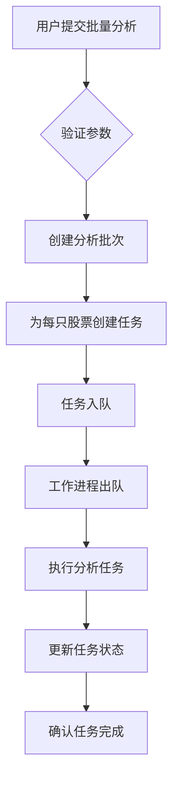
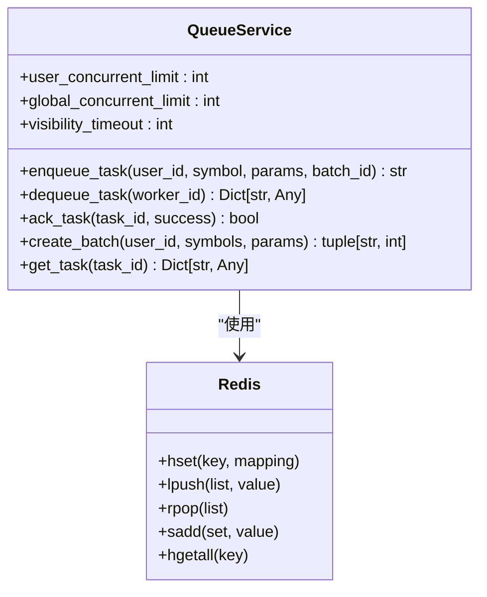
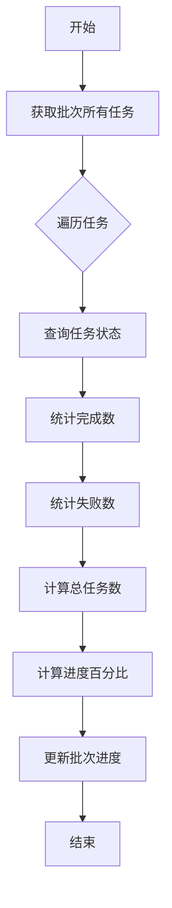
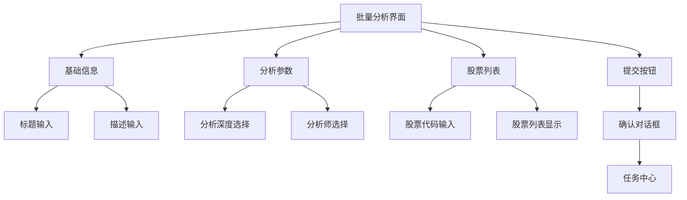

# 批量分析

<cite>
**本文档引用的文件**   
- [batch_analysis.py](file://examples/batch_analysis.py)
- [analysis.py](file://app/routers/analysis.py)
- [analysis_service.py](file://app/services/analysis_service.py)
- [analysis.py](file://app/models/analysis.py)
- [system-architecture.md](file://docs/architecture/v0.1.16/system-architecture.md)
- [api-specification.md](file://docs/design/v0.1.16/api-specification.md)
- [queue_service.py](file://app/services/queue_service.py)
- [BatchAnalysis.vue](file://frontend/src/views/Analysis/BatchAnalysis.vue)
- [analysis.ts](file://frontend/src/api/analysis.ts)
</cite>

## 目录
1. [批量分析与单个分析的核心区别](#批量分析与单个分析的核心区别)
2. [任务调度机制](#任务调度机制)
3. [并发控制策略](#并发控制策略)
4. [进度跟踪实现](#进度跟踪实现)
5. [API接口规范](#api接口规范)
6. [前端用户交互设计](#前端用户交互设计)
7. [性能优化建议](#性能优化建议)
8. [失败重试与错误恢复](#失败重试与错误恢复)
9. [API调用示例](#api调用示例)

## 批量分析与单个分析的核心区别

批量分析功能与单个分析在核心设计上存在显著差异。单个分析是针对单只股票的独立分析流程，而批量分析则是对多只股票进行并发处理的复杂任务系统。

批量分析通过创建一个分析批次（batch）来管理多个独立的分析任务。每个批次包含多个任务，这些任务可以并发执行，从而大大提高了分析效率。系统通过`analysis_batches`集合存储批次信息，通过`analysis_tasks`集合存储单个任务信息，实现了批次与任务的分离管理。

与单个分析相比，批量分析增加了批次级别的状态管理、整体进度计算、任务统计等功能。批次状态包括`pending`（待处理）、`processing`（处理中）、`completed`（已完成）、`failed`（失败）等，能够全面反映整个批次的执行情况。

**Section sources**
- [system-architecture.md](file://docs/architecture/v0.1.16/system-architecture.md#L267-L293)
- [analysis.py](file://app/models/analysis.py#L106-L136)

## 任务调度机制

批量分析的任务调度机制基于Redis实现的先进先出（FIFO）队列。当用户提交批量分析请求时，系统会为每只股票创建一个独立的分析任务，并将这些任务依次加入全局任务队列。

调度机制的核心组件是`QueueService`，它负责任务的入队、出队和状态管理。任务入队时，系统会检查用户和全局的并发限制，确保不会超出系统承载能力。任务出队时，工作进程会从队列头部获取任务，并将其标记为"处理中"状态。



**Diagram sources**
- [queue_service.py](file://app/services/queue_service.py#L45-L200)
- [analysis.py](file://app/routers/analysis.py#L771-L872)

## 并发控制策略

系统的并发控制策略通过多层次的限制机制来确保系统的稳定性和公平性。首先，系统设置了用户级别的并发限制，默认每个用户最多同时执行3个分析任务。其次，系统还设置了全局并发限制，防止系统资源被过度占用。

并发控制的核心实现位于`QueueService`类中，通过Redis的集合（SET）数据结构来跟踪每个用户的处理中任务。当用户提交新任务时，系统会检查该用户的处理中任务数量是否已达到限制。如果已达到限制，新任务将被拒绝或排队等待。



**Diagram sources**
- [queue_service.py](file://app/services/queue_service.py#L45-L200)

## 进度跟踪实现

批量分析的进度跟踪实现分为任务级别和批次级别两个层次。任务级别的进度通过`RedisProgressTracker`实现，将整个分析流程划分为多个步骤，每个步骤分配相应的权重，从而实现精确的进度计算。

批次级别的进度则基于其包含的所有任务的完成情况来计算。系统会定期查询批次中所有任务的状态，统计已完成和失败的任务数量，然后计算整体进度百分比。进度计算公式为：`进度 = (已完成任务数 + 失败任务数) / 总任务数 * 100`。



**Diagram sources**
- [sse.py](file://app/routers/sse.py#L141-L189)
- [system-architecture.md](file://docs/architecture/v0.1.16/system-architecture.md#L343-L345)

## API接口规范

批量分析的API接口遵循RESTful设计原则，提供了完整的任务管理功能。主要接口包括批量分析提交、批次状态查询、任务取消等。

### 请求参数

| 参数 | 类型 | 必填 | 说明 |
|------|------|------|------|
| title | string | 是 | 批次标题 |
| symbols | array | 是 | 股票代码列表（最多10个） |
| parameters | object | 否 | 分析参数 |

### 响应格式

成功响应：
```json
{
  "success": true,
  "data": {
    "batch_id": "批次ID",
    "total_tasks": "总任务数",
    "task_ids": ["任务ID列表"],
    "mapping": [{"symbol": "股票代码", "task_id": "任务ID"}],
    "status": "submitted"
  },
  "message": "批量分析任务已提交"
}
```

错误响应：
```json
{
  "success": false,
  "message": "错误信息"
}
```

**Section sources**
- [api-specification.md](file://docs/design/v0.1.16/api-specification.md#L96-L109)
- [analysis.py](file://app/routers/analysis.py#L771-L872)

## 前端用户交互设计

前端批量分析界面设计注重用户体验和操作效率。界面分为三个主要部分：基础信息输入区、分析参数配置区和股票列表管理区。

用户首先填写批次标题和描述，然后选择分析深度、分析师类型等参数。系统提供了直观的进度条和状态指示器，让用户能够实时了解分析进度。提交后，系统会显示一个确认对话框，告知用户任务已成功提交，并提供前往任务中心查看进度的选项。



**Diagram sources**
- [BatchAnalysis.vue](file://frontend/src/views/Analysis/BatchAnalysis.vue#L115-L526)

## 性能优化建议

为了获得最佳的批量分析性能，建议遵循以下优化策略：

1. **合理设置批次大小**：系统限制单个批次最多包含10只股票。建议根据实际需求合理设置批次大小，避免一次性提交过多任务导致系统负载过高。

2. **调整并发数**：系统默认的并发数设置为3。在资源充足的环境下，可以适当增加并发数以提高分析速度，但需注意不要超出系统承载能力。

3. **选择合适的分析深度**：不同分析深度对应不同的执行时间。1级快速分析约需2-4分钟，5级全面分析约需15-25分钟。建议根据实际需求选择合适的分析深度。

4. **利用缓存机制**：系统会对高频查询结果进行缓存，减少数据库查询压力。确保Redis服务正常运行以获得最佳性能。

**Section sources**
- [batch-analysis-limits.md](file://docs/api/batch-analysis-limits.md#L154-L157)
- [analysis.py](file://app/models/analysis.py#L33-L42)

## 失败重试与错误恢复

批量分析系统内置了完善的失败重试和错误恢复机制。每个分析任务都配置了最大重试次数（默认3次），当任务执行失败时，系统会自动尝试重新执行，直到达到最大重试次数。

重试机制通过任务的`retry_count`和`max_retries`字段实现。每次执行失败后，`retry_count`会递增，当达到`max_retries`时，任务状态将被标记为"失败"。系统还会记录最后一次错误信息，便于问题排查。

错误恢复策略包括：
- 任务级别的自动重试
- 批次级别的状态聚合
- 详细的错误日志记录
- 用户友好的错误提示

**Section sources**
- [analysis.py](file://app/models/analysis.py#L95-L98)
- [analysis_service.py](file://app/services/analysis_service.py#L513-L614)

## API调用示例

以下是一个通过API调用批量分析功能的Python示例：

```python
import requests
import json

# 批量分析请求
batch_request = {
    "title": "科技股分析",
    "symbols": ["AAPL", "MSFT", "GOOGL"],
    "parameters": {
        "research_depth": "标准",
        "selected_analysts": ["market", "fundamentals"]
    }
}

# 发送请求
response = requests.post(
    "http://localhost:8000/api/analysis/batch",
    headers={"Authorization": "Bearer your_token"},
    json=batch_request
)

# 处理响应
if response.status_code == 200:
    result = response.json()
    print(f"批量分析已提交，批次ID: {result['data']['batch_id']}")
else:
    print(f"提交失败: {response.text}")
```

**Section sources**
- [batch_analysis.py](file://examples/batch_analysis.py#L1-L170)
- [analysis.ts](file://frontend/src/api/analysis.ts#L178-L185)