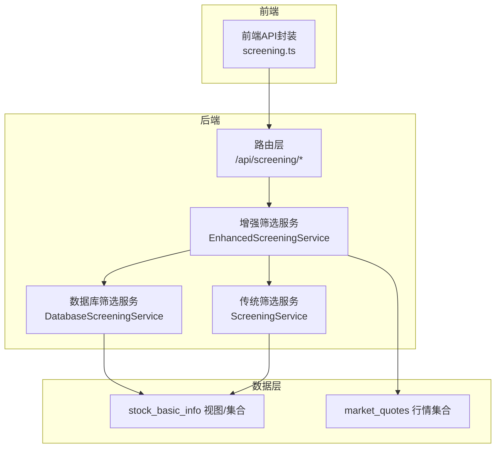
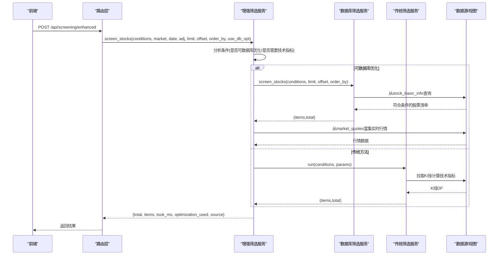
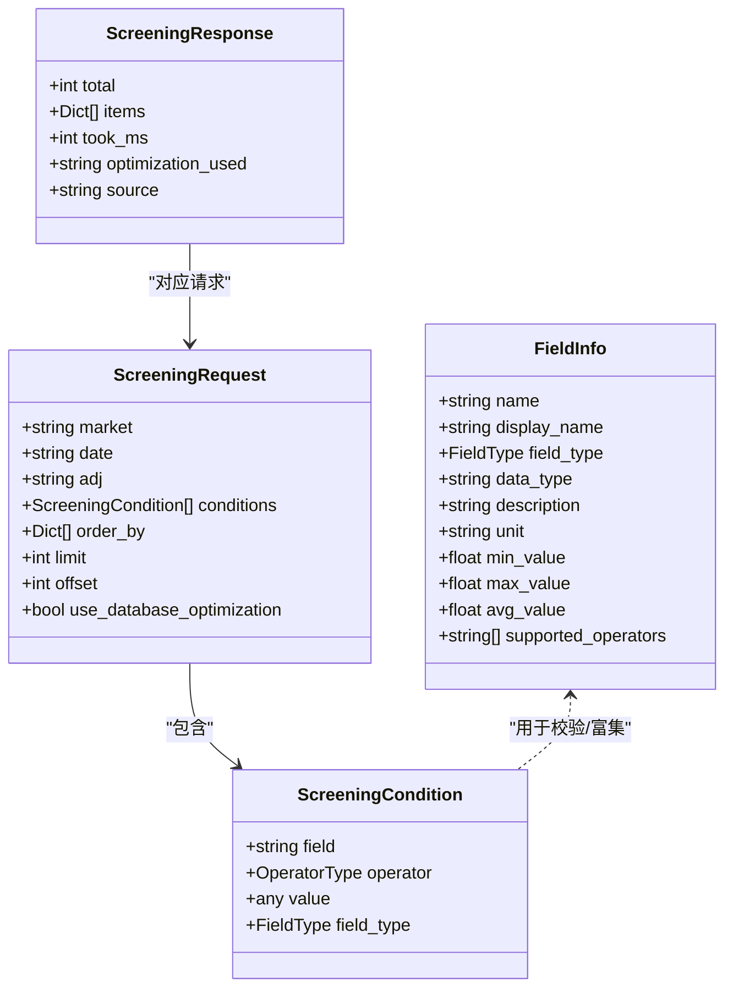
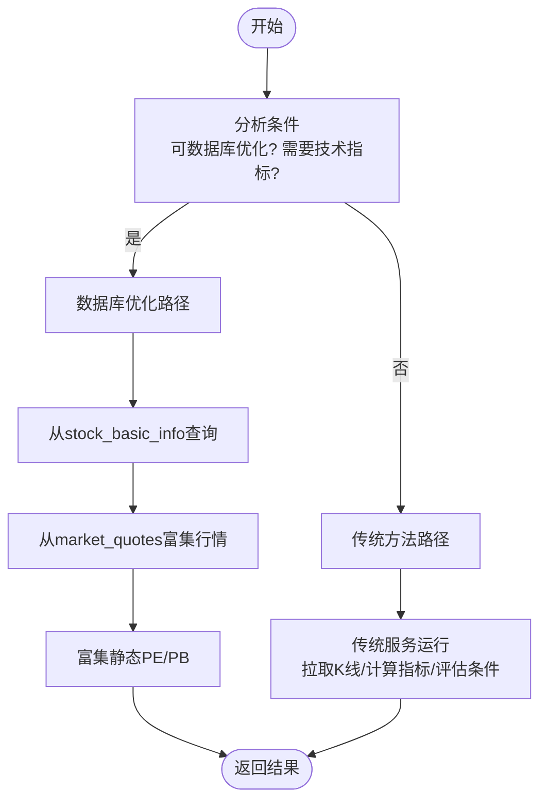
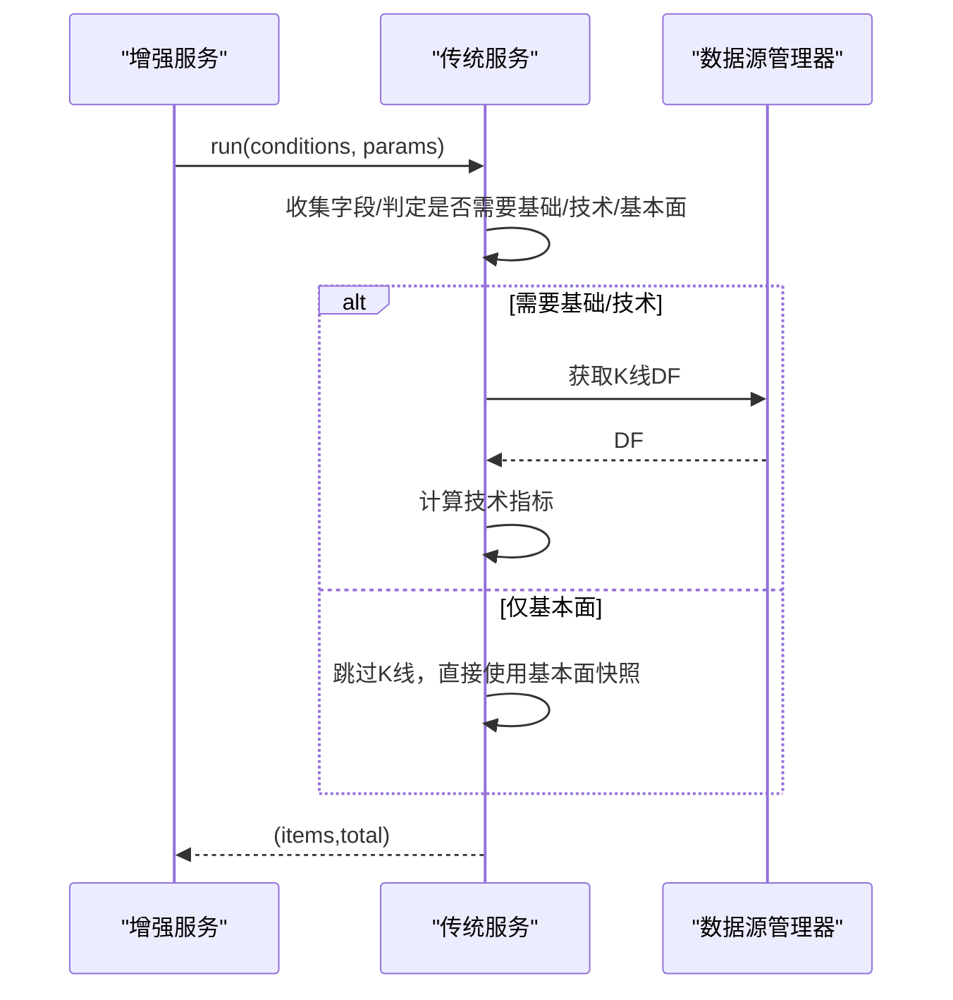
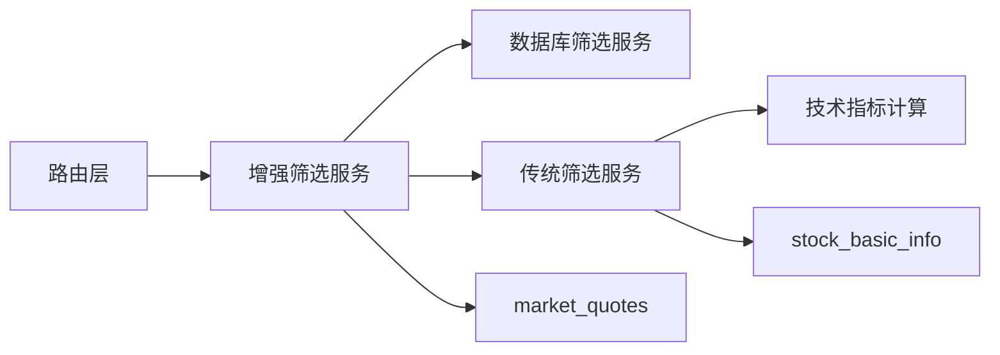

# 使用案例

<cite>
**本文引用的文件**
- [app/models/screening.py](file://app/models/screening.py)
- [app/services/enhanced_screening_service.py](file://app/services/enhanced_screening_service.py)
- [app/services/screening_service.py](file://app/services/screening_service.py)
- [app/services/screening/eval_utils.py](file://app/services/screening/eval_utils.py)
- [app/routers/screening.py](file://app/routers/screening.py)
- [tests/test_enhanced_screening.py](file://tests/test_enhanced_screening.py)
- [scripts/test_screening_view.py](file://scripts/test_screening_view.py)
- [tests/test_screening_fields.py](file://tests/test_screening_fields.py)
- [frontend/src/api/screening.ts](file://frontend/src/api/screening.ts)
</cite>

## 目录
1. [简介](#简介)
2. [项目结构](#项目结构)
3. [核心组件](#核心组件)
4. [架构总览](#架构总览)
5. [详细组件分析](#详细组件分析)
6. [依赖关系分析](#依赖关系分析)
7. [性能考量](#性能考量)
8. [故障排查指南](#故障排查指南)
9. [结论](#结论)
10. [附录](#附录)

## 简介
本文件面向希望使用系统“智能筛选”能力的用户与开发者，提供从入门到进阶的使用案例与最佳实践。内容覆盖：
- 多种投资策略的筛选案例（价值投资、成长股、趋势投资等）
- 筛选条件设置流程、预期结果与实际应用效果
- 复杂条件构建（多条件组合、嵌套逻辑组、动态阈值）
- 筛选结果分析方法与后续操作建议（导出、加入自选股等）

## 项目结构
筛选功能由“路由层 → 增强服务 → 传统服务/数据库服务 → 数据源/视图”的链路构成，支持两种调用路径：
- 传统路径：兼容旧格式条件，走“传统服务”，必要时拉取K线与技术指标
- 增强路径：新格式条件，自动决策“数据库优化”或“传统方法”，并进行结果富集

图表来源
- [app/routers/screening.py](file://app/routers/screening.py#L155-L215)
- [app/services/enhanced_screening_service.py](file://app/services/enhanced_screening_service.py#L34-L136)
- [app/services/screening_service.py](file://app/services/screening_service.py#L77-L241)

章节来源
- [app/routers/screening.py](file://app/routers/screening.py#L1-L215)
- [app/services/enhanced_screening_service.py](file://app/services/enhanced_screening_service.py#L1-L136)
- [app/services/screening_service.py](file://app/services/screening_service.py#L1-L241)

## 核心组件
- 筛选模型与字段信息：定义操作符、字段类型、字段元信息与统计信息
- 增强筛选服务：根据条件分析自动选择数据库优化或传统方法，并进行结果富集
- 传统筛选服务：按需拉取K线与技术指标，评估条件并通过排序/分页返回
- 路由层：对外暴露“增强筛选”“传统筛选”“字段配置”等接口

章节来源
- [app/models/screening.py](file://app/models/screening.py#L1-L347)
- [app/services/enhanced_screening_service.py](file://app/services/enhanced_screening_service.py#L1-L136)
- [app/services/screening_service.py](file://app/services/screening_service.py#L1-L241)
- [app/routers/screening.py](file://app/routers/screening.py#L1-L215)

## 架构总览
增强筛选的执行流程如下：

图表来源
- [app/routers/screening.py](file://app/routers/screening.py#L192-L215)
- [app/services/enhanced_screening_service.py](file://app/services/enhanced_screening_service.py#L34-L136)
- [app/services/screening_service.py](file://app/services/screening_service.py#L77-L241)

## 详细组件分析

### 组件A：筛选模型与字段体系
- 操作符类型：支持数值比较、区间、集合包含、字符串包含、技术指标“向上/向下穿越”
- 字段类型：基础信息、技术指标、基本面
- 字段信息：包含字段名、显示名、数据类型、单位、支持的操作符、统计信息与可选值
- 预定义字段覆盖：股票代码/名称/行业/地区/市场、总/流通市值、PE/PB/PE_TTM/PB_Mrq/ROE、换手率/量比、价格/涨跌幅/成交额、均线/RSI/KDJ/MACD等

图表来源
- [app/models/screening.py](file://app/models/screening.py#L33-L103)
- [app/models/screening.py](file://app/models/screening.py#L104-L347)

章节来源
- [app/models/screening.py](file://app/models/screening.py#L1-L347)

### 组件B：增强筛选服务（智能路径选择）
- 条件分析：统计“是否可数据库优化”“是否需要技术指标”“条件类型分布”等
- 路径选择：当满足“可数据库优化且不需要技术指标”时走数据库路径；否则走传统路径
- 结果富集：数据库路径下从行情集合补充实时价格/涨跌幅/成交额；并基于静态数据补充PE/PB
- 性能统计：记录耗时、优化方式、数据源

图表来源
- [app/services/enhanced_screening_service.py](file://app/services/enhanced_screening_service.py#L34-L136)

章节来源
- [app/services/enhanced_screening_service.py](file://app/services/enhanced_screening_service.py#L1-L136)

### 组件C：传统筛选服务（K线与技术指标）
- 自动识别所需字段：基础行情、技术指标、基本面
- 按需拉取K线并计算指标（MA/EMA/MACD/RSI/KDJ/BOLL/ATR等）
- 条件评估：支持“交叉穿越”等技术条件
- 排序与分页：按允许字段排序，支持多字段排序

图表来源
- [app/services/screening_service.py](file://app/services/screening_service.py#L77-L241)
- [app/services/screening/eval_utils.py](file://app/services/screening/eval_utils.py#L78-L158)

章节来源
- [app/services/screening_service.py](file://app/services/screening_service.py#L1-L241)
- [app/services/screening/eval_utils.py](file://app/services/screening/eval_utils.py#L1-L168)

### 组件D：路由层（对外接口）
- /api/screening/enhanced：新格式条件，自动优化
- /api/screening/run：兼容旧格式条件，内部转为新格式后调用增强服务
- /api/screening/fields：返回字段配置与分类
- /api/screening/fields/{field_name}：返回单字段详细信息
- /api/screening/validate：校验条件合法性
- /api/screening/industries：按行业聚合统计（用于UI筛选）

章节来源
- [app/routers/screening.py](file://app/routers/screening.py#L1-L215)
- [app/routers/screening.py](file://app/routers/screening.py#L233-L379)

## 依赖关系分析
- 增强服务依赖：数据库筛选服务（用于数据库优化路径）、传统筛选服务（用于传统路径）、MongoDB视图/集合（stock_basic_info、market_quotes）
- 传统服务依赖：统一数据源管理器（按优先级降级）、技术指标计算工具
- 路由层依赖：增强服务、认证中间件

图表来源
- [app/routers/screening.py](file://app/routers/screening.py#L1-L215)
- [app/services/enhanced_screening_service.py](file://app/services/enhanced_screening_service.py#L1-L136)
- [app/services/screening_service.py](file://app/services/screening_service.py#L1-L241)

章节来源
- [app/routers/screening.py](file://app/routers/screening.py#L1-L215)
- [app/services/enhanced_screening_service.py](file://app/services/enhanced_screening_service.py#L1-L136)
- [app/services/screening_service.py](file://app/services/screening_service.py#L1-L241)

## 性能考量
- 数据库优化路径：当条件仅涉及基础字段且无需技术指标时，直接在stock_basic_info上查询，显著降低延迟
- 传统路径：需要拉取K线并计算指标，适合技术面条件
- 结果富集：数据库路径会从market_quotes补充实时行情，避免外部多次调用
- 排序与分页：仅对允许字段排序，避免无效计算

章节来源
- [app/services/enhanced_screening_service.py](file://app/services/enhanced_screening_service.py#L34-L136)
- [app/services/screening_service.py](file://app/services/screening_service.py#L171-L186)

## 故障排查指南
- 条件校验失败：使用“/api/screening/validate”接口验证字段与操作符是否匹配、值类型是否正确
- 字段不可用：确认字段是否在支持列表内，以及是否支持对应操作符
- 性能异常：切换use_database_optimization开关观察差异；若条件包含技术指标，传统路径为预期行为
- 行情缺失：数据库路径富集行情失败会忽略并记录警告，不影响主流程

章节来源
- [app/services/enhanced_screening_service.py](file://app/services/enhanced_screening_service.py#L279-L337)
- [app/routers/screening.py](file://app/routers/screening.py#L262-L271)

## 结论
系统提供了灵活、高性能的智能筛选能力：既能快速处理大量基础字段筛选，也能在需要时拉取K线与技术指标进行深入分析。通过“增强筛选服务”的自动路径选择与结果富集，用户可在不同策略场景下获得一致、可解释的结果。

## 附录

### 使用案例：价值投资（低市盈率、高股息率）
- 策略要点
  - 低PE：总市值≥某阈值，PE在合理区间
  - 高ROE：ROE高于行业平均水平
  - 行业/地区过滤：聚焦稳健行业或特定区域
- 设置步骤
  - 获取字段配置：GET /api/screening/fields
  - 构建条件：PE在区间、ROE>阈值、行业/地区包含/在集合内
  - 排序：按PE升序或ROE降序
  - 执行：POST /api/screening/enhanced 或兼容接口
- 预期结果
  - 返回符合价值投资理念的股票清单，具备较低估值与较高盈利能力
- 实际应用效果
  - 数据库优化路径下响应迅速；若条件涉及技术指标则自动切换传统路径
- 复杂条件示例
  - 多条件组合：PE区间 + ROE阈值 + 行业包含 + 地区在集合
  - 动态阈值：根据历史统计信息调整PE/ROE阈值

章节来源
- [app/models/screening.py](file://app/models/screening.py#L171-L215)
- [app/routers/screening.py](file://app/routers/screening.py#L192-L215)
- [tests/test_enhanced_screening.py](file://tests/test_enhanced_screening.py#L42-L84)

### 使用案例：成长股（高营收增长率、高ROE）
- 策略要点
  - 高ROE：反映盈利能力持续性
  - 高营收增长：关注收入与利润增长潜力
  - 市值与流动性：总市值适中、换手率合理
- 设置步骤
  - 条件：ROE>阈值、营收增长率字段（若存在）>阈值、总市值在范围、换手率>阈值
  - 排序：按ROE/营收增长率降序
  - 执行：POST /api/screening/enhanced
- 预期结果
  - 返回具备高成长潜力的公司清单
- 实际应用效果
  - 若仅使用基础字段，数据库优化路径即可高效返回；若涉及技术指标，系统自动切换传统路径

章节来源
- [app/models/screening.py](file://app/models/screening.py#L208-L215)
- [app/models/screening.py](file://app/models/screening.py#L216-L271)
- [app/routers/screening.py](file://app/routers/screening.py#L192-L215)
- [tests/test_enhanced_screening.py](file://tests/test_enhanced_screening.py#L139-L182)

### 使用案例：趋势投资（均线多头排列、成交量放大）
- 策略要点
  - 均线多头：短期均线上穿长期均线
  - 成交量放大：量比/成交额超过阈值
  - 技术指标辅助：RSI/KDJ/MACD处于合适区间
- 设置步骤
  - 条件：ma20>阈值、量比>阈值、RSI/KDJ/MACD满足多头形态
  - 排序：按量比/涨跌幅降序
  - 执行：POST /api/screening/run（兼容旧格式）或 /api/screening/enhanced
- 预期结果
  - 返回具备短期趋势动能的股票清单
- 实际应用效果
  - 传统路径自动拉取K线并计算指标，确保技术条件准确

章节来源
- [app/models/screening.py](file://app/models/screening.py#L273-L346)
- [app/services/screening/eval_utils.py](file://app/services/screening/eval_utils.py#L78-L158)
- [app/services/screening_service.py](file://app/services/screening_service.py#L102-L165)
- [app/routers/screening.py](file://app/routers/screening.py#L155-L215)

### 复杂条件构建示例
- 多条件组合
  - AND/OR逻辑：通过嵌套逻辑组组织多个条件
  - 示例：总市值区间 AND (PE<=阈值 OR PB<=阈值) AND 行业包含
- 嵌套逻辑组
  - 使用children数组组织子条件，logic字段控制AND/OR
- 动态阈值设置
  - 使用字段统计信息（最小/最大/平均/中位数/标准差）指导阈值设定
  - 通过“/api/screening/fields/{field_name}”获取字段统计

章节来源
- [app/services/enhanced_screening_service.py](file://app/services/enhanced_screening_service.py#L279-L337)
- [app/routers/screening.py](file://app/routers/screening.py#L233-L271)

### 筛选结果分析与后续操作
- 结果分析
  - 查看total/items数量、took_ms、optimization_used、source
  - 对比不同策略阈值下的命中率与收益分布
- 后续操作建议
  - 导出到Excel：后端提供报告导出能力（参考相关模块与脚本）
  - 加入自选股：结合收藏/标签模块进行管理
  - 持续跟踪：定期重新筛选并更新阈值

章节来源
- [app/services/enhanced_screening_service.py](file://app/services/enhanced_screening_service.py#L120-L136)
- [frontend/src/api/screening.ts](file://frontend/src/api/screening.ts#L1-L63)

### API参考与前端对接
- 前端API封装
  - run：POST /api/screening/run
  - getFields：GET /api/screening/fields
  - getIndustries：GET /api/screening/industries
- 请求体字段
  - conditions：新格式条件列表（ScreeningCondition）
  - order_by：排序字段与方向
  - limit/offset：分页
  - use_database_optimization：是否启用数据库优化

章节来源
- [frontend/src/api/screening.ts](file://frontend/src/api/screening.ts#L1-L63)
- [app/routers/screening.py](file://app/routers/screening.py#L192-L215)

### 实战示例参考
- 增强筛选测试：展示字段获取、基础筛选、复杂条件、性能对比、条件校验
- 视图筛选测试：展示仅基础字段的高效筛选与排序
- 字段映射测试：验证前后端字段一致性

章节来源
- [tests/test_enhanced_screening.py](file://tests/test_enhanced_screening.py#L1-L192)
- [scripts/test_screening_view.py](file://scripts/test_screening_view.py#L1-L115)
- [tests/test_screening_fields.py](file://tests/test_screening_fields.py#L1-L89)