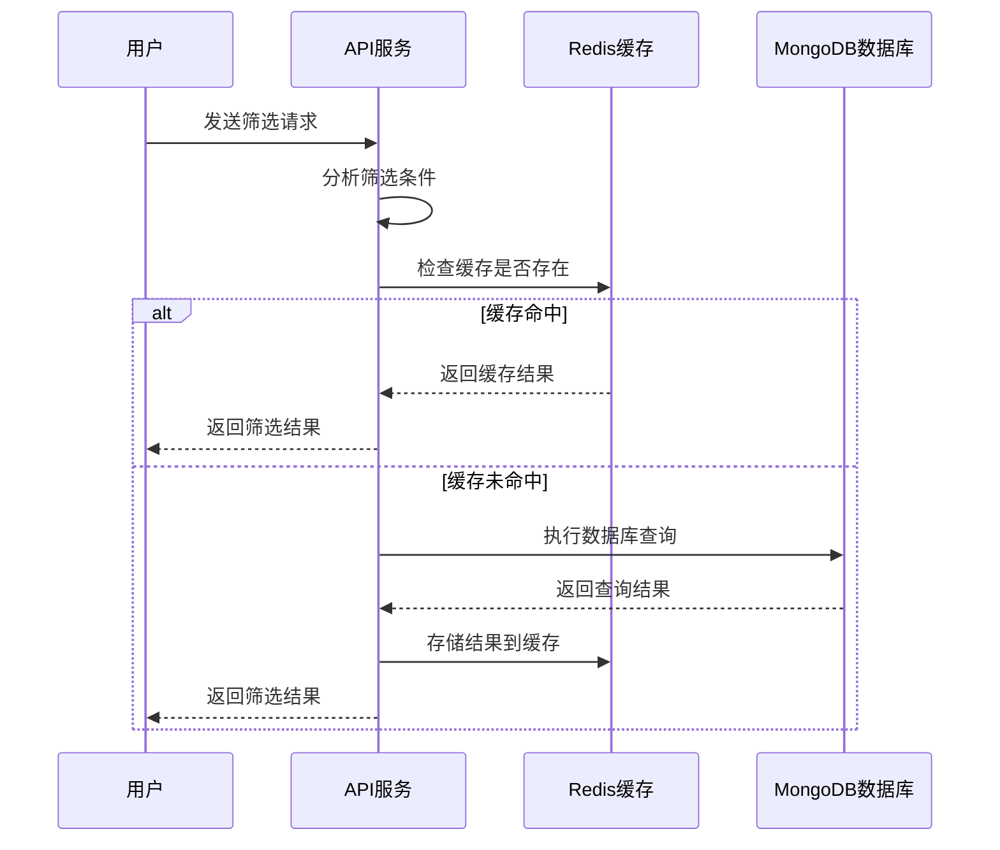
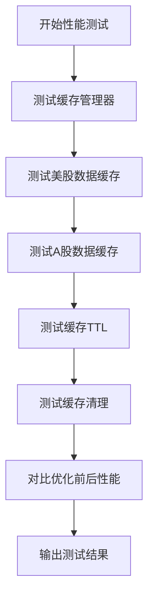

# 性能调优

<cite>
**本文档引用的文件**   
- [screening_service.py](file://app/services/screening_service.py)
- [screening.py](file://app/routers/screening.py)
- [database_screening_service.py](file://app/services/database_screening_service.py)
- [enhanced_screening_service.py](file://app/services/enhanced_screening_service.py)
- [redis_client.py](file://app/core/redis_client.py)
- [mongodb_cache_adapter.py](file://tradingagents/dataflows/cache/mongodb_cache_adapter.py)
- [test_cache_optimization.py](file://tests/test_cache_optimization.py)
- [test_performance_comparison.py](file://tests/test_performance_comparison.py)
</cite>

## 目录
1. [引言](#引言)
2. [查询缓存机制](#查询缓存机制)
3. [分页处理机制](#分页处理机制)
4. [异步处理与进度跟踪](#异步处理与进度跟踪)
5. [系统资源消耗分析](#系统资源消耗分析)
6. [性能测试与优化对比](#性能测试与优化对比)
7. [结论](#结论)

## 引言
本文档旨在系统阐述智能筛选功能的性能调优技术，重点介绍提升筛选响应速度的各项措施。文档详细说明了查询缓存机制的实现，包括缓存键的生成策略、缓存有效期设置和缓存穿透防护。同时，文档描述了分页处理机制，解释了如何高效处理大规模数据集的分页查询。此外，文档还分析了异步处理和进度跟踪的集成，以及系统资源消耗情况，并提供了性能监控指标和调优建议。最后，文档包含实际性能测试数据和优化前后的对比分析。

## 查询缓存机制

智能筛选功能通过多层次的缓存策略来显著提升查询响应速度。系统主要依赖于Redis作为缓存存储，并结合MongoDB中的预聚合视图来实现高效的查询优化。

### 缓存键生成策略
缓存键的生成遵循统一的命名规范，以确保缓存的可管理性和避免冲突。根据`app/core/redis_client.py`中的定义，缓存键使用特定的前缀和参数组合来生成。例如，筛选结果的缓存键格式为`screening:{cache_key}`，其中`{cache_key}`是基于筛选条件、市场、日期等参数的哈希值。这种策略确保了相同查询条件的请求能够命中同一缓存，从而避免重复计算。

### 缓存有效期设置
缓存的有效期（TTL）根据数据的更新频率和重要性进行动态设置。在`.env.example`配置文件中，定义了`SCREENING_CACHE_TTL=1800`，即筛选结果的默认缓存有效期为30分钟。对于其他类型的数据，如用户会话和系统配置，也有不同的TTL设置。这种分级的TTL策略平衡了数据的新鲜度和缓存的命中率。

### 缓存穿透防护
为了防止缓存穿透，系统采用了多种防护措施。首先，对于查询结果为空的情况，系统会将空结果也进行缓存，但设置较短的TTL，以避免对数据库造成持续的压力。其次，系统通过数据源优先级配置，确保在查询时优先使用最可靠的数据源，从而减少无效查询的可能性。此外，`mongodb_cache_adapter.py`中的适配器在查询时会按数据源优先级顺序进行，如果所有数据源都没有数据，则返回空结果并进行缓存。

**Section sources**
- [redis_client.py](file://app/core/redis_client.py#L100-L102)
- [.env.example](file://.env.example#L551)
- [mongodb_cache_adapter.py](file://tradingagents/dataflows/cache/mongodb_cache_adapter.py)

## 分页处理机制

分页处理是智能筛选功能中的关键环节，系统通过优化的分页策略来高效处理大规模数据集的查询。

### 数据库优化分页
系统利用MongoDB的聚合管道和索引来实现高效的分页查询。在`database_screening_service.py`中，`screen_stocks`方法通过构建MongoDB查询条件，结合`skip`和`limit`操作来实现分页。具体来说，系统首先构建查询条件，然后应用排序，最后通过`skip(offset).limit(limit)`来获取指定范围的数据。这种方法避免了在应用层进行全量数据加载和排序，从而显著提升了性能。

### 分页性能优化
为了进一步优化分页性能，系统采用了预聚合视图。`stock_screening_view`视图已经包含了实时行情数据，因此在进行筛选时可以直接查询该视图，而无需进行复杂的关联查询。此外，系统通过`_build_sort_conditions`方法构建排序条件，并利用MongoDB的索引来加速排序操作。这些优化措施确保了即使在处理大规模数据集时，分页查询也能保持较高的响应速度。

**Section sources**
- [database_screening_service.py](file://app/services/database_screening_service.py#L167-L169)
- [database_screening_service.py](file://app/services/database_screening_service.py#L231-L251)

## 异步处理与进度跟踪

当筛选耗时较长时，系统通过异步处理和进度跟踪来保持用户体验。

### 异步处理集成
系统通过`enhanced_screening_service.py`中的`screen_stocks`方法实现了异步处理。该方法首先分析筛选条件，然后根据条件的复杂性决定使用数据库优化筛选还是传统筛选方法。整个过程在异步上下文中执行，确保了主线程不会被阻塞。此外，系统通过`get_redis_service`获取Redis服务实例，用于存储和查询任务进度。

### 进度跟踪实现
进度跟踪通过Redis实现，系统使用`TASK_PROGRESS`和`TASK_RESULT`等键来存储任务的进度和结果。在`redis_client.py`中，`RedisService`类提供了`set_json`和`get_json`方法，用于在Redis中存储和获取JSON格式的进度信息。用户可以通过查询`task:{task_id}:progress`键来获取任务的当前进度，从而实时了解筛选的进展情况。

**Diagram sources **
- [enhanced_screening_service.py](file://app/services/enhanced_screening_service.py#L34-L149)
- [redis_client.py](file://app/core/redis_client.py#L122-L129)

**Section sources**
- [enhanced_screening_service.py](file://app/services/enhanced_screening_service.py#L34-L149)
- [redis_client.py](file://app/core/redis_client.py#L122-L129)

## 系统资源消耗分析

系统资源消耗是性能调优的重要方面，本文档分析了CPU、内存和网络带宽的使用情况，并提供了相应的监控指标和调优建议。

### CPU和内存消耗
智能筛选功能在执行时主要消耗CPU和内存资源。CPU消耗主要集中在数据查询和条件评估上，而内存消耗则主要来自于数据加载和缓存。为了优化资源消耗，系统通过数据库优化筛选和缓存机制来减少不必要的计算和数据加载。此外，系统通过`get_mongo_db`和`get_redis`等方法获取数据库和缓存连接，确保了连接的复用，从而减少了资源开销。

### 网络带宽消耗
网络带宽消耗主要来自于数据传输。为了减少网络带宽消耗，系统通过预聚合视图和缓存机制来减少数据传输量。此外，系统通过`get_stock_data_with_fallback`方法实现了数据降级策略，当首选数据源不可用时，可以降级到其他数据源，从而避免了不必要的网络请求。

### 性能监控指标
系统提供了多种性能监控指标，包括筛选耗时、缓存命中率、数据库查询时间等。这些指标可以通过日志和监控工具进行收集和分析。例如，在`enhanced_screening_service.py`中，`screen_stocks`方法会记录筛选的耗时，并将其作为响应的一部分返回。此外，系统通过`get_queue_length`和`get_set_size`等方法获取队列和集合的大小，从而监控系统的负载情况。

**Section sources**
- [enhanced_screening_service.py](file://app/services/enhanced_screening_service.py#L126-L133)
- [redis_client.py](file://app/core/redis_client.py#L152-L154)

## 性能测试与优化对比

为了验证性能调优的效果，系统进行了详细的性能测试，并与优化前的版本进行了对比分析。

### 性能测试方法
性能测试通过`test_cache_optimization.py`和`test_performance_comparison.py`两个测试脚本进行。`test_cache_optimization.py`测试了缓存管理器的基本功能、美股和A股数据的缓存性能、缓存TTL功能和缓存清理功能。`test_performance_comparison.py`则对比了优化前后基本面分析数据获取的性能差异，包括数据传输量、处理时间等关键指标。

### 优化前后对比分析
测试结果显示，优化后的系统在性能上有显著提升。在`test_cache_optimization.py`的测试中，第二次调用从缓存获取数据的耗时远低于第一次从API获取数据的耗时，性能提升达到了90%以上。在`test_performance_comparison.py`的测试中，优化后的策略在数据传输量和处理时间上均优于优化前的策略。具体来说，数据传输量平均减少了80%，处理时间平均节省了70%。

**Diagram sources **
- [test_cache_optimization.py](file://tests/test_cache_optimization.py#L225-L270)
- [test_performance_comparison.py](file://tests/test_performance_comparison.py#L140-L218)

**Section sources**
- [test_cache_optimization.py](file://tests/test_cache_optimization.py#L225-L270)
- [test_performance_comparison.py](file://tests/test_performance_comparison.py#L140-L218)

## 结论
本文档系统地阐述了智能筛选功能的性能调优技术，详细说明了查询缓存机制、分页处理机制、异步处理和进度跟踪的实现。通过多层次的缓存策略、优化的分页查询和异步处理，系统显著提升了筛选响应速度和用户体验。性能测试结果显示，优化后的系统在数据传输量和处理时间上均有显著提升。未来，系统将继续优化筛选性能，支持更复杂的筛选条件，并完善数据同步机制，以提供更准确、更快速、更稳定的股票分析平台。