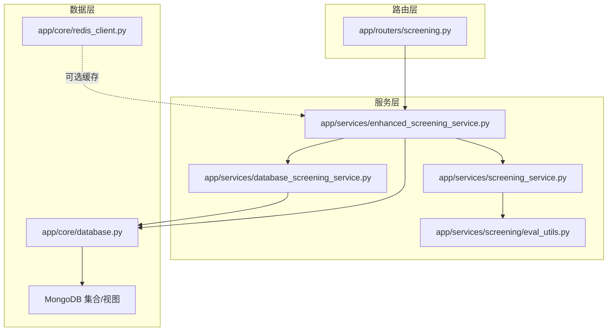
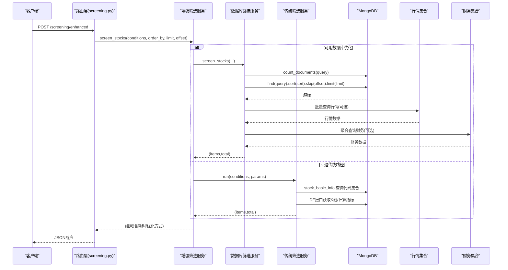
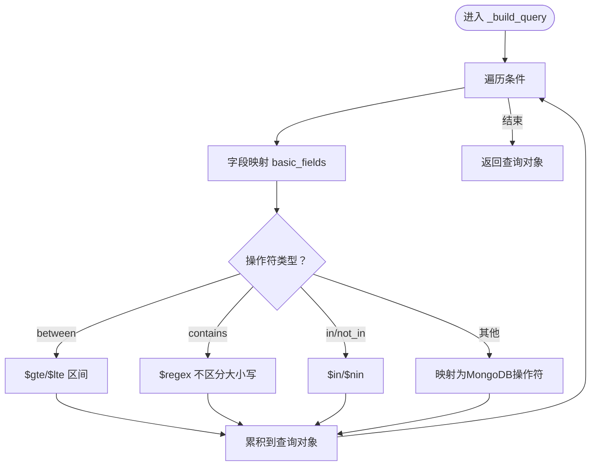
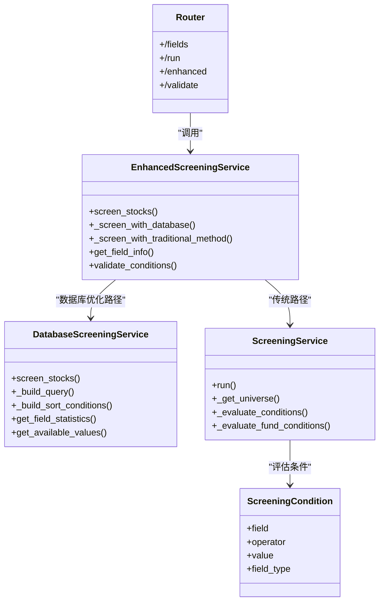

# 技术实现

<cite>
**本文引用的文件**
- [app/models/screening.py](file://app/models/screening.py)
- [app/services/database_screening_service.py](file://app/services/database_screening_service.py)
- [app/services/enhanced_screening_service.py](file://app/services/enhanced_screening_service.py)
- [app/services/screening_service.py](file://app/services/screening_service.py)
- [app/services/screening/eval_utils.py](file://app/services/screening/eval_utils.py)
- [app/routers/screening.py](file://app/routers/screening.py)
- [app/core/database.py](file://app/core/database.py)
- [app/core/redis_client.py](file://app/core/redis_client.py)
- [app/middleware/error_handler.py](file://app/middleware/error_handler.py)
- [app/core/logging_config.py](file://app/core/logging_config.py)
- [docs/architecture/cache/CACHE_REFACTORING_SUMMARY.md](file://docs/architecture/cache/CACHE_REFACTORING_SUMMARY.md)
- [scripts/maintenance/optimize_mongodb_indexes.py](file://scripts/maintenance/optimize_mongodb_indexes.py)
- [tests/services/test_screening_roe_field.py](file://tests/services/test_screening_roe_field.py)
</cite>

## 目录
1. [简介](#简介)
2. [项目结构](#项目结构)
3. [核心组件](#核心组件)
4. [架构总览](#架构总览)
5. [详细组件分析](#详细组件分析)
6. [依赖分析](#依赖分析)
7. [性能考虑](#性能考虑)
8. [故障排查指南](#故障排查指南)
9. [结论](#结论)

## 简介
本技术实现文档聚焦于后端智能筛选功能，系统性解析从用户输入到数据库查询的完整链路，涵盖查询构建器、MongoDB查询生成逻辑、数据库索引优化策略、性能调优（缓存、分页、大数据响应优化）、筛选条件解析引擎、以及错误处理与日志记录策略。文档同时提供类图与序列图帮助读者快速把握组件交互与数据流。

## 项目结构
筛选能力由“路由层-服务层-数据层”三层协作构成：
- 路由层负责接收请求、参数转换与调用服务；
- 服务层包含增强筛选服务与传统筛选服务，前者优先走数据库优化路径，后者走历史K线与技术指标计算路径；
- 数据层通过数据库管理器与视图/索引初始化，支撑高性能筛选。

图表来源
- [app/routers/screening.py](file://app/routers/screening.py#L1-L379)
- [app/services/enhanced_screening_service.py](file://app/services/enhanced_screening_service.py#L1-L349)
- [app/services/screening_service.py](file://app/services/screening_service.py#L1-L242)
- [app/services/database_screening_service.py](file://app/services/database_screening_service.py#L1-L599)
- [app/services/screening/eval_utils.py](file://app/services/screening/eval_utils.py#L1-L168)
- [app/core/database.py](file://app/core/database.py#L1-L443)
- [app/core/redis_client.py](file://app/core/redis_client.py#L1-L203)

章节来源
- [app/routers/screening.py](file://app/routers/screening.py#L1-L379)
- [app/services/enhanced_screening_service.py](file://app/services/enhanced_screening_service.py#L1-L349)
- [app/services/screening_service.py](file://app/services/screening_service.py#L1-L242)
- [app/services/database_screening_service.py](file://app/services/database_screening_service.py#L1-L599)
- [app/core/database.py](file://app/core/database.py#L1-L443)

## 核心组件
- 筛选模型与字段定义：定义操作符、字段类型、请求/响应模型及字段信息，确保前端输入与后端处理的一致性。
- 增强筛选服务：根据条件分析自动选择数据库优化或传统路径，并在数据库路径下进行视图查询、排序、分页与富集。
- 数据库筛选服务：将筛选条件映射为MongoDB查询，构建聚合与排序，补充财务数据，支持可选值与统计信息。
- 传统筛选服务：基于统一数据源DF接口拉取K线，计算技术指标，评估条件，支持纯基本面场景。
- 评估工具：提取条件字段、评估叶子节点、安全数值转换，保证DSL解析与执行的健壮性。
- 路由与转换：将旧版条件格式转换为新版，处理单位转换、数据源优先级、排序与分页。
- 数据库与索引：初始化视图与索引，创建stock_screening_view，聚合基础信息、行情与财务数据；提供索引优化脚本。
- 缓存与Redis：Redis键命名规范、JSON序列化/反序列化、队列/集合/分布式锁等通用能力。
- 错误处理与日志：全局错误中间件、结构化日志配置、错误日志分离策略。

章节来源
- [app/models/screening.py](file://app/models/screening.py#L1-L347)
- [app/services/enhanced_screening_service.py](file://app/services/enhanced_screening_service.py#L1-L349)
- [app/services/database_screening_service.py](file://app/services/database_screening_service.py#L1-L599)
- [app/services/screening_service.py](file://app/services/screening_service.py#L1-L242)
- [app/services/screening/eval_utils.py](file://app/services/screening/eval_utils.py#L1-L168)
- [app/routers/screening.py](file://app/routers/screening.py#L1-L379)
- [app/core/database.py](file://app/core/database.py#L1-L443)
- [app/core/redis_client.py](file://app/core/redis_client.py#L1-L203)
- [app/middleware/error_handler.py](file://app/middleware/error_handler.py#L1-L89)
- [app/core/logging_config.py](file://app/core/logging_config.py#L1-L424)

## 架构总览
增强筛选服务作为中枢，依据条件分析决定路径：
- 数据库优化路径：使用stock_screening_view视图，直接在MongoDB内完成筛选、排序与分页，必要时批量补充财务数据。
- 传统路径：通过统一数据源DF接口获取K线，计算技术指标，评估条件，支持纯基本面场景。

图表来源
- [app/routers/screening.py](file://app/routers/screening.py#L192-L271)
- [app/services/enhanced_screening_service.py](file://app/services/enhanced_screening_service.py#L34-L136)
- [app/services/database_screening_service.py](file://app/services/database_screening_service.py#L96-L186)
- [app/services/screening_service.py](file://app/services/screening_service.py#L77-L186)

## 详细组件分析

### 查询构建器与MongoDB查询生成
- 条件映射：将前端条件字段映射到视图字段，操作符映射到MongoDB操作符（如$gte/$lte/$regex等）。
- 查询构建：遍历条件，构造顶层查询对象；对between、contains、in/not_in等特殊操作符分别处理。
- 排序构建：将order_by映射为排序键值对，支持升/降序。
- 分页与总数：count_documents统计总数，find().skip().limit()实现分页。
- 视图富集：当视图中缺少字段（如部分财务指标）时，批量查询财务集合进行补充。

图表来源
- [app/services/database_screening_service.py](file://app/services/database_screening_service.py#L191-L229)

章节来源
- [app/services/database_screening_service.py](file://app/services/database_screening_service.py#L191-L229)
- [app/services/database_screening_service.py](file://app/services/database_screening_service.py#L231-L251)
- [app/services/database_screening_service.py](file://app/services/database_screening_service.py#L117-L186)

### 数据库索引优化策略
- 视图stock_screening_view：聚合stock_basic_info、market_quotes、stock_financial_data，形成筛选所需字段的统一视图。
- 基础索引：stock_basic_info上建立复合索引（如(code,source)唯一、industry、pe、pb、total_mv等），market_quotes上建立索引（如code唯一、pct_chg、amount、updated_at）。
- 索引优化脚本：提供自动化脚本分析现有索引、创建优化索引、测试查询性能并生成报告。

章节来源
- [app/core/database.py](file://app/core/database.py#L232-L369)
- [scripts/maintenance/optimize_mongodb_indexes.py](file://scripts/maintenance/optimize_mongodb_indexes.py#L254-L302)

### 筛选条件解析引擎
- 条件模型：ScreeningCondition定义字段、操作符、值与字段类型；ScreeningRequest定义市场、日期、复权、条件、排序、分页与优化开关。
- 字段信息：BASIC_FIELDS_INFO预定义字段清单、数据类型、单位、支持的操作符，用于前端展示与校验。
- 评估工具：收集条件字段、评估叶子节点（比较/区间/交叉）、安全数值转换，保证DSL解析与执行的健壮性。
- 传统路径字段：ScreeningService定义ALLOWED_FIELDS、ALLOWED_OPS，区分基础行情、技术指标、基本面字段，决定是否需要K线与指标计算。

章节来源
- [app/models/screening.py](file://app/models/screening.py#L33-L103)
- [app/models/screening.py](file://app/models/screening.py#L104-L347)
- [app/services/screening/eval_utils.py](file://app/services/screening/eval_utils.py#L1-L168)
- [app/services/screening_service.py](file://app/services/screening_service.py#L24-L56)

### 增强筛选服务与路由转换
- 增强筛选：根据条件分析决定使用数据库优化或传统路径；在数据库路径下，自动从数据源优先级配置中选择数据源；富集实时行情与静态PE/PB；统计耗时与优化方式。
- 路由转换：将旧版条件格式转换为新版，处理字段/操作符映射与单位转换（如市值单位万元→亿元）；支持排序与分页；记录日志与错误处理。

章节来源
- [app/services/enhanced_screening_service.py](file://app/services/enhanced_screening_service.py#L34-L136)
- [app/routers/screening.py](file://app/routers/screening.py#L74-L153)
- [app/routers/screening.py](file://app/routers/screening.py#L155-L231)

### 传统筛选服务（K线与技术指标）
- 获取股票池：从stock_basic_info查询A股代码集合，兜底策略与异常处理。
- 数据拉取与派生：通过统一数据源DF接口获取K线，重命名列、计算pct_chg等派生指标。
- 指标计算：按需计算MA/EMA/MACD/RSI/KDJ/BOLL/ATR等指标。
- 条件评估：对叶子节点进行比较/区间/交叉判断；对纯基本面条件使用快照评估。
- 排序与分页：按order_by字段排序，再切片返回。

章节来源
- [app/services/screening_service.py](file://app/services/screening_service.py#L77-L186)
- [app/services/screening_service.py](file://app/services/screening_service.py#L187-L242)

### 类图：核心组件交互

图表来源
- [app/models/screening.py](file://app/models/screening.py#L33-L103)
- [app/services/enhanced_screening_service.py](file://app/services/enhanced_screening_service.py#L24-L136)
- [app/services/database_screening_service.py](file://app/services/database_screening_service.py#L16-L116)
- [app/services/screening_service.py](file://app/services/screening_service.py#L77-L186)
- [app/routers/screening.py](file://app/routers/screening.py#L192-L271)

## 依赖分析
- 组件耦合与内聚
  - 增强筛选服务对数据库筛选服务与传统筛选服务的依赖清晰，职责边界明确。
  - 数据库筛选服务与视图/索引初始化紧密耦合，确保查询性能。
  - 传统筛选服务依赖统一数据源DF接口，减少对具体数据源的耦合。
- 外部依赖与集成点
  - MongoDB：视图聚合、索引、聚合统计。
  - Redis：键命名规范与通用服务封装（JSON序列化、队列/集合/分布式锁），可用于可选缓存。
  - FastAPI中间件：全局错误处理中间件统一异常响应。
  - 日志系统：结构化日志配置与错误日志分离。

章节来源
- [app/services/enhanced_screening_service.py](file://app/services/enhanced_screening_service.py#L1-L349)
- [app/services/database_screening_service.py](file://app/services/database_screening_service.py#L1-L599)
- [app/services/screening_service.py](file://app/services/screening_service.py#L1-L242)
- [app/core/database.py](file://app/core/database.py#L232-L369)
- [app/core/redis_client.py](file://app/core/redis_client.py#L1-L203)
- [app/middleware/error_handler.py](file://app/middleware/error_handler.py#L1-L89)
- [app/core/logging_config.py](file://app/core/logging_config.py#L1-L424)

## 性能考虑
- 查询缓存机制
  - Redis键命名规范：提供SCREENING_CACHE等键前缀，便于统一管理与清理。
  - JSON序列化/反序列化：支持结构化缓存数据。
  - 可选集成缓存策略：通过环境变量启用集成缓存（MongoDB+Redis），提升重复操作性能。
- 分页处理
  - 数据库路径：count_documents统计总数，find().skip().limit()实现分页，避免一次性返回大量数据。
  - 传统路径：对结果集进行排序与切片，控制返回规模。
- 大数据量下的响应优化
  - 视图聚合：将基础信息、行情与财务数据聚合到stock_screening_view，减少多次查询。
  - 索引优化：针对高频查询字段建立复合索引，降低COLLSCAN风险。
  - 单次筛选样本限制：传统路径对样本规模进行限制，避免长时间计算。
- 实时PE/PB富集
  - 增强筛选服务在数据库路径下直接从stock_basic_info获取静态PE/PB，避免批量动态计算带来的性能问题。

章节来源
- [app/core/redis_client.py](file://app/core/redis_client.py#L70-L103)
- [app/core/redis_client.py](file://app/core/redis_client.py#L110-L171)
- [docs/architecture/cache/CACHE_REFACTORING_SUMMARY.md](file://docs/architecture/cache/CACHE_REFACTORING_SUMMARY.md#L146-L212)
- [app/services/enhanced_screening_service.py](file://app/services/enhanced_screening_service.py#L118-L136)
- [app/services/database_screening_service.py](file://app/services/database_screening_service.py#L117-L186)
- [app/services/screening_service.py](file://app/services/screening_service.py#L77-L100)

## 故障排查指南
- 错误处理中间件
  - 统一捕获异常，记录请求ID、路径、方法与异常详情；按异常类型返回标准化错误响应。
- 日志记录策略
  - 结构化日志配置：支持控制台与文件处理器，可配置JSON格式与轮转策略。
  - 错误日志分离：将WARNING及以上级别单独输出到error.log，便于快速定位问题。
- 数据库健康检查
  - 数据库管理器提供健康检查与连接池配置，便于诊断连接与超时问题。
- 测试用例参考
  - 针对ROE字段的查询构建与结果格式化的单元测试，可作为筛选逻辑正确性的验证参考。

章节来源
- [app/middleware/error_handler.py](file://app/middleware/error_handler.py#L1-L89)
- [app/core/logging_config.py](file://app/core/logging_config.py#L1-L424)
- [app/core/database.py](file://app/core/database.py#L134-L178)
- [tests/services/test_screening_roe_field.py](file://tests/services/test_screening_roe_field.py#L1-L77)

## 结论
该智能筛选功能通过“增强筛选服务+数据库优化路径”的组合，实现了高并发、低延迟的股票筛选体验。查询构建器将前端条件精确映射到MongoDB查询，配合视图与索引优化显著提升性能；传统路径保留对技术指标与基本面的灵活评估能力。结合Redis键规范、结构化日志与错误日志分离策略，系统在可维护性与可观测性方面也具备良好基础。建议持续关注索引优化脚本与缓存策略的落地，以应对更大规模数据与更高并发场景。