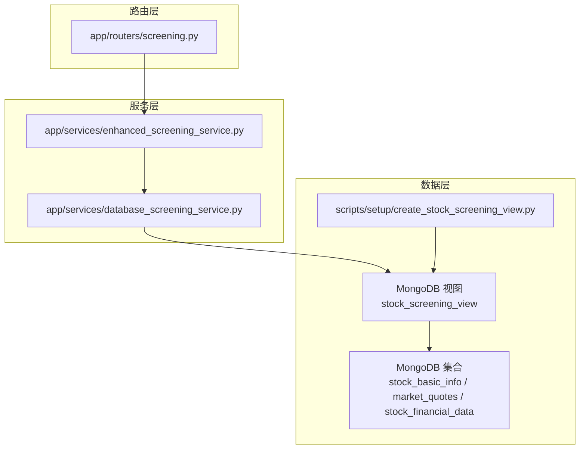
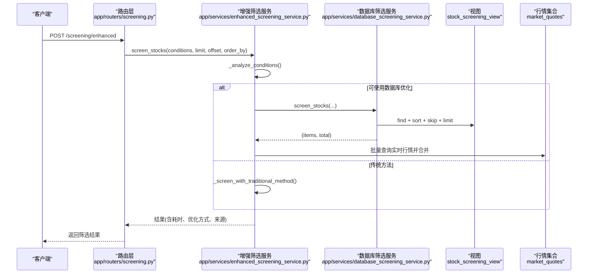
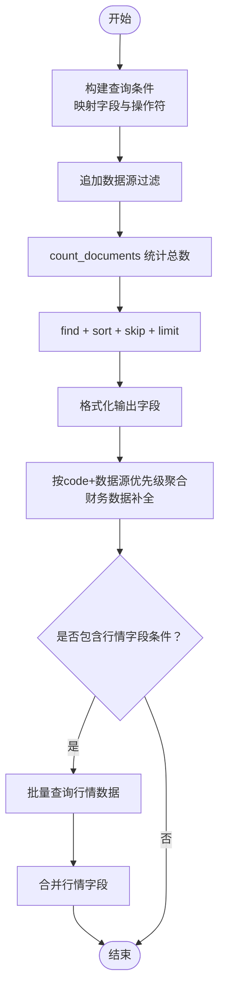
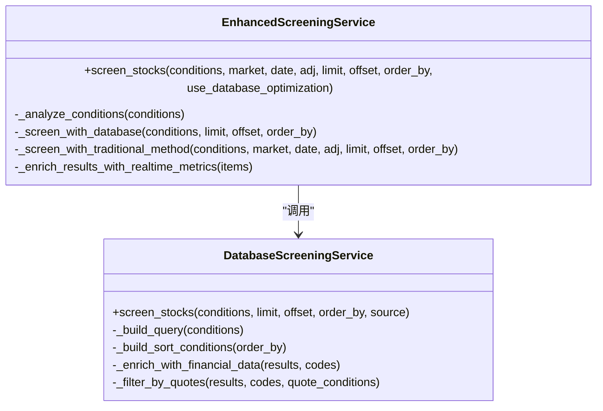
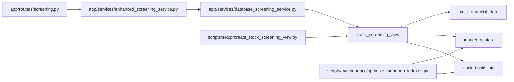

# 数据库优化

<cite>
**本文引用的文件**
- [app/services/database_screening_service.py](file://app/services/database_screening_service.py)
- [app/services/enhanced_screening_service.py](file://app/services/enhanced_screening_service.py)
- [app/models/screening.py](file://app/models/screening.py)
- [app/routers/screening.py](file://app/routers/screening.py)
- [scripts/setup/create_stock_screening_view.py](file://scripts/setup/create_stock_screening_view.py)
- [scripts/maintenance/optimize_mongodb_indexes.py](file://scripts/maintenance/optimize_mongodb_indexes.py)
- [docs/maintenance/mongodb_index_optimization.md](file://docs/maintenance/mongodb_index_optimization.md)
- [tests/services/test_screening_roe_field.py](file://tests/services/test_screening_roe_field.py)
- [tests/services/test_quotes_ingestion_and_enrichment.py](file://tests/services/test_quotes_ingestion_and_enrichment.py)
</cite>

## 目录
1. [简介](#简介)
2. [项目结构](#项目结构)
3. [核心组件](#核心组件)
4. [架构总览](#架构总览)
5. [详细组件分析](#详细组件分析)
6. [依赖关系分析](#依赖关系分析)
7. [性能考量](#性能考量)
8. [故障排查指南](#故障排查指南)
9. [结论](#结论)
10. [附录](#附录)

## 简介
本技术文档聚焦于智能筛选功能的数据库优化，围绕 MongoDB 查询性能优化策略展开，涵盖索引设计方案（复合索引、字段排序、覆盖索引）、查询执行计划分析方法、数据模型优化（字段命名规范、数据类型选择、集合划分策略）、索引创建语句与性能测试对比，以及在大规模筛选场景下分片与分区策略的影响。文档以仓库中现有的筛选服务、视图创建脚本、索引优化脚本与相关测试为依据，提供可落地的优化建议与实操步骤。

## 项目结构
筛选功能由三层组成：
- 路由层：对外提供筛选接口，负责参数解析与结果封装
- 服务层：增强筛选服务与数据库筛选服务，分别负责策略选择与数据库查询
- 数据层：通过视图整合基础信息、行情与财务数据，支撑筛选查询

图表来源
- [app/routers/screening.py](file://app/routers/screening.py#L192-L231)
- [app/services/enhanced_screening_service.py](file://app/services/enhanced_screening_service.py#L35-L120)
- [app/services/database_screening_service.py](file://app/services/database_screening_service.py#L96-L186)
- [scripts/setup/create_stock_screening_view.py](file://scripts/setup/create_stock_screening_view.py#L163-L191)

章节来源
- [app/routers/screening.py](file://app/routers/screening.py#L192-L231)
- [app/services/enhanced_screening_service.py](file://app/services/enhanced_screening_service.py#L35-L120)
- [app/services/database_screening_service.py](file://app/services/database_screening_service.py#L96-L186)
- [scripts/setup/create_stock_screening_view.py](file://scripts/setup/create_stock_screening_view.py#L163-L191)

## 核心组件
- 增强筛选服务：根据条件分析与字段类型，自动选择数据库优化路径或传统方法；在数据库路径下，直接从行情集合富集实时价格、涨跌幅、成交额等字段，并补充静态 PE/PB。
- 数据库筛选服务：面向 stock_screening_view 的筛选服务，支持基础字段、财务指标、交易指标与部分技术指标字段的查询；支持 between、in、regex 等操作符；默认按总市值降序排序。
- 字段模型：定义支持的筛选字段、数据类型、单位、支持的操作符及统计信息；为筛选 UI 提供字段元数据。
- 视图创建：将 stock_basic_info、market_quotes、stock_financial_data 通过 $lookup 与 $unwind 组合，形成 stock_screening_view，便于在单一查询中完成多源数据的联合筛选。
- 索引优化：提供自动化脚本与文档，指导复合索引设计、覆盖查询与性能测试。

章节来源
- [app/services/enhanced_screening_service.py](file://app/services/enhanced_screening_service.py#L35-L120)
- [app/services/database_screening_service.py](file://app/services/database_screening_service.py#L16-L116)
- [app/models/screening.py](file://app/models/screening.py#L103-L347)
- [scripts/setup/create_stock_screening_view.py](file://scripts/setup/create_stock_screening_view.py#L35-L132)
- [docs/maintenance/mongodb_index_optimization.md](file://docs/maintenance/mongodb_index_optimization.md#L49-L95)

## 架构总览
筛选流程从路由进入，增强筛选服务根据条件与字段类型选择数据库优化路径或传统方法；数据库优化路径通过数据库筛选服务直接查询 stock_screening_view，随后对结果进行实时行情富集与静态 PE/PB 补充。

图表来源
- [app/routers/screening.py](file://app/routers/screening.py#L192-L231)
- [app/services/enhanced_screening_service.py](file://app/services/enhanced_screening_service.py#L35-L120)
- [app/services/database_screening_service.py](file://app/services/database_screening_service.py#L96-L186)

## 详细组件分析

### 数据库筛选服务（DatabaseScreeningService）
- 视图与集合：使用 stock_screening_view 作为查询目标，内部已通过 $lookup 联合行情与财务数据，减少多次查询。
- 字段映射：将前端字段映射到视图字段，支持基础信息、财务指标、交易指标与实时行情字段。
- 操作符支持：支持 >、<、>=、<=、==、!=、between、in、not_in、contains 等。
- 查询构建：根据条件构造查询对象，追加数据源过滤；默认按 total_mv 降序排序。
- 结果富集：当视图中缺少财务字段（如 ROE）时，按 code 与数据源优先级从 stock_financial_data 聚合最新一期数据进行补全。
- 实时行情二次筛选：对基础筛选结果，按行情字段进行二次过滤，再合并行情数据。

图表来源
- [app/services/database_screening_service.py](file://app/services/database_screening_service.py#L191-L389)
- [app/services/database_screening_service.py](file://app/services/database_screening_service.py#L464-L555)

章节来源
- [app/services/database_screening_service.py](file://app/services/database_screening_service.py#L16-L116)
- [app/services/database_screening_service.py](file://app/services/database_screening_service.py#L191-L389)
- [app/services/database_screening_service.py](file://app/services/database_screening_service.py#L464-L555)

### 增强筛选服务（EnhancedScreeningService）
- 条件分析：委托工具函数分析条件是否可走数据库优化路径（字段支持、不涉及技术指标）。
- 数据库优化路径：直接调用数据库筛选服务；随后从 market_quotes 批量富集实时行情字段，避免外部调用。
- 传统路径：将条件转换为传统服务格式，使用统一数据源接口与指标库进行筛选。
- 静态 PE/PB：在筛选场景使用静态 PE/PB，避免批量计算带来的性能问题。

图表来源
- [app/services/enhanced_screening_service.py](file://app/services/enhanced_screening_service.py#L35-L120)
- [app/services/database_screening_service.py](file://app/services/database_screening_service.py#L96-L186)

章节来源
- [app/services/enhanced_screening_service.py](file://app/services/enhanced_screening_service.py#L35-L120)
- [app/services/enhanced_screening_service.py](file://app/services/enhanced_screening_service.py#L120-L232)

### 字段模型与支持能力
- 字段类型：basic（基础信息）、technical（技术指标）、fundamental（基本面）。
- 支持字段：code、name、industry、area、market、list_date、total_mv、circ_mv、pe、pb、pe_ttm、pb_mrq、roe、turnover_rate、volume_ratio、close、pct_chg、amount、volume、以及各类技术指标。
- 操作符：数值型支持 between、>, <, >=, <=；字符串支持 contains；集合支持 in、not_in。
- 统计信息：提供字段 min/max/avg/count 等统计，辅助筛选 UI 与阈值设定。

章节来源
- [app/models/screening.py](file://app/models/screening.py#L103-L347)

### 视图创建与索引策略
- 视图创建：通过 $lookup + $unwind 将 stock_basic_info、market_quotes、stock_financial_data 联合，形成 stock_screening_view，便于在单一查询中完成多源数据的联合筛选。
- 源集合索引：在 stock_basic_info、market_quotes 等源集合上创建复合索引，以支撑视图查询与筛选性能。

章节来源
- [scripts/setup/create_stock_screening_view.py](file://scripts/setup/create_stock_screening_view.py#L35-L132)
- [scripts/setup/create_stock_screening_view.py](file://scripts/setup/create_stock_screening_view.py#L163-L191)

### 索引优化脚本与文档
- 自动化脚本：分析现有索引、创建优化索引、测试查询性能、生成报告；支持后台创建索引，避免阻塞业务。
- 文档指南：强调 ESR 原则（等值-排序-范围）、覆盖查询、慢查询日志监控与定期维护。

章节来源
- [scripts/maintenance/optimize_mongodb_indexes.py](file://scripts/maintenance/optimize_mongodb_indexes.py#L1-L120)
- [scripts/maintenance/optimize_mongodb_indexes.py](file://scripts/maintenance/optimize_mongodb_indexes.py#L186-L252)
- [docs/maintenance/mongodb_index_optimization.md](file://docs/maintenance/mongodb_index_optimization.md#L49-L95)

## 依赖关系分析
- 路由层依赖增强筛选服务；增强筛选服务依赖数据库筛选服务与传统筛选服务；数据库筛选服务依赖视图与源集合。
- 视图依赖 stock_basic_info、market_quotes、stock_financial_data；索引创建脚本在源集合上建立复合索引以提升查询效率。

图表来源
- [app/routers/screening.py](file://app/routers/screening.py#L192-L231)
- [app/services/enhanced_screening_service.py](file://app/services/enhanced_screening_service.py#L35-L120)
- [app/services/database_screening_service.py](file://app/services/database_screening_service.py#L96-L186)
- [scripts/setup/create_stock_screening_view.py](file://scripts/setup/create_stock_screening_view.py#L35-L132)
- [scripts/maintenance/optimize_mongodb_indexes.py](file://scripts/maintenance/optimize_mongodb_indexes.py#L254-L303)

章节来源
- [app/routers/screening.py](file://app/routers/screening.py#L192-L231)
- [app/services/enhanced_screening_service.py](file://app/services/enhanced_screening_service.py#L35-L120)
- [app/services/database_screening_service.py](file://app/services/database_screening_service.py#L96-L186)
- [scripts/setup/create_stock_screening_view.py](file://scripts/setup/create_stock_screening_view.py#L35-L132)
- [scripts/maintenance/optimize_mongodb_indexes.py](file://scripts/maintenance/optimize_mongodb_indexes.py#L254-L303)

## 性能考量
- 查询执行计划分析
  - 使用 explain 输出的关键指标：executionTimeMillis、totalDocsExamined、totalKeysExamined、stage、indexName。
  - 识别 COLLSCAN（全集合扫描）与 IXSCAN（索引扫描），优先确保使用索引扫描。
- 复合索引设计
  - ESR 原则：等值字段优先、排序字段居中、范围字段靠后。
  - 在 stock_daily_quotes 集合上，针对常见查询模式创建复合索引，例如按 symbol+trade_date+data_source+period 的组合索引。
- 覆盖查询
  - 当查询仅需索引中的字段时，MongoDB 可直接从索引返回结果，无需访问文档，显著降低 IO。
- 索引维护
  - 定期监控慢查询日志，使用自动化脚本分析现有索引并创建优化索引。
  - 定期检查索引大小与使用情况，删除未使用的索引，避免写入开销与存储浪费。
- 数据模型优化
  - 字段命名采用统一规范，避免同义字段（如 total_mv 与 market_cap），减少歧义。
  - 数值型字段使用整数或浮点数，字符串字段使用小写与统一编码，便于索引与查询。
  - 集合划分策略：按数据源与时间维度划分，配合复合索引提升查询效率。

章节来源
- [docs/maintenance/mongodb_index_optimization.md](file://docs/maintenance/mongodb_index_optimization.md#L49-L95)
- [scripts/maintenance/optimize_mongodb_indexes.py](file://scripts/maintenance/optimize_mongodb_indexes.py#L186-L252)

## 故障排查指南
- 筛选结果字段缺失
  - ROE 等财务字段可能不在视图中，数据库筛选服务会按 code 与数据源优先级从 stock_financial_data 聚合最新一期数据进行补全；若仍缺失，检查数据源优先级与财务数据是否存在。
- 实时行情富集失败
  - 增强筛选服务在数据库优化路径下会从 market_quotes 批量富集 close、pct_chg、amount 等字段；若失败会记录警告并忽略，不影响整体结果。
- 查询性能差
  - 使用 explain 分析查询计划，确认是否使用索引扫描；若出现 COLLSCAN，检查复合索引是否覆盖查询条件。
- 单测参考
  - ROE 条件构建与结果格式化的测试，验证 between 操作符映射与结果字段完整性。
  - 增强筛选对 DB 路径的富集行为测试，验证行情字段合并逻辑。

章节来源
- [app/services/database_screening_service.py](file://app/services/database_screening_service.py#L253-L319)
- [app/services/enhanced_screening_service.py](file://app/services/enhanced_screening_service.py#L92-L118)
- [tests/services/test_screening_roe_field.py](file://tests/services/test_screening_roe_field.py#L1-L77)
- [tests/services/test_quotes_ingestion_and_enrichment.py](file://tests/services/test_quotes_ingestion_and_enrichment.py#L1-L75)

## 结论
通过视图整合多源数据、在源集合上建立复合索引、使用 explain 分析查询计划与覆盖查询策略，可显著提升筛选查询性能。增强筛选服务在数据库优化路径下具备良好的扩展性与性能表现，同时通过静态 PE/PB 与批量行情富集避免了昂贵的实时计算与外部调用。建议持续监控慢查询日志，定期运行索引优化脚本，保持索引与查询模式的匹配度。

## 附录

### 索引创建语句（基于现有实现与文档）
以下为针对 stock_daily_quotes 集合的复合索引建议（按 ESR 原则与查询模式设计）。请根据实际部署环境与查询频率调整字段顺序与唯一性约束。

- 复合唯一索引（防止重复数据）
  - 索引键：symbol、trade_date、data_source、period
  - 唯一性：开启
  - 用途：匹配 update 等写入场景的查询条件，避免重复插入
- 查询优化索引（按股票代码+周期查询）
  - 索引键：symbol、period、trade_date（降序）
  - 唯一性：关闭
  - 用途：按股票代码与周期查询历史数据
- 查询优化索引（按股票代码查询）
  - 索引键：symbol、trade_date（降序）
  - 唯一性：关闭
  - 用途：按股票代码查询历史数据
- 查询优化索引（按日期查询）
  - 索引键：trade_date（降序）
  - 唯一性：关闭
  - 用途：按日期范围查询
- 查询优化索引（按数据源查询）
  - 索引键：data_source
  - 唯一性：关闭
  - 用途：按数据源过滤

章节来源
- [docs/maintenance/mongodb_index_optimization.md](file://docs/maintenance/mongodb_index_optimization.md#L136-L187)
- [scripts/maintenance/optimize_mongodb_indexes.py](file://scripts/maintenance/optimize_mongodb_indexes.py#L53-L89)

### 性能测试与对比方法
- 使用 explain("executionStats") 获取执行时间、扫描文档数、扫描索引键数、返回文档数与查询阶段。
- 对比优化前后的执行时间与扫描数量，确认索引是否生效。
- 建议定期运行索引优化脚本，生成优化报告并纳入运维流程。

章节来源
- [scripts/maintenance/optimize_mongodb_indexes.py](file://scripts/maintenance/optimize_mongodb_indexes.py#L186-L252)
- [docs/maintenance/mongodb_index_optimization.md](file://docs/maintenance/mongodb_index_optimization.md#L200-L258)

### 数据分片与分区策略（适用于大规模筛选）
- 分片键选择：建议以高选择性的字段作为分片键，如 symbol 或 data_source，确保查询能命中特定分片。
- 时间分区：对历史数据按 trade_date 进行分区，结合复合索引提升范围查询性能。
- 写入与读取平衡：在写入热点与查询热点之间平衡分片策略，避免过度分片导致查询跨分片成本过高。

[本节为通用实践建议，不直接分析具体文件，故不附“章节来源”]