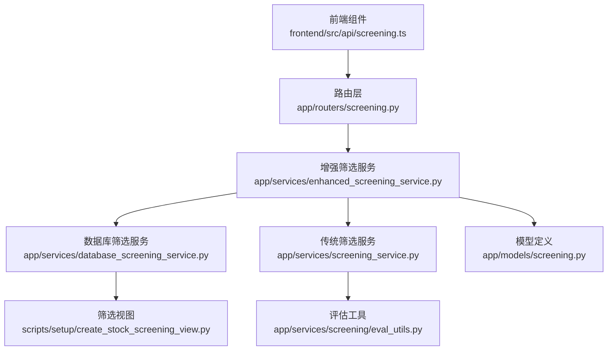
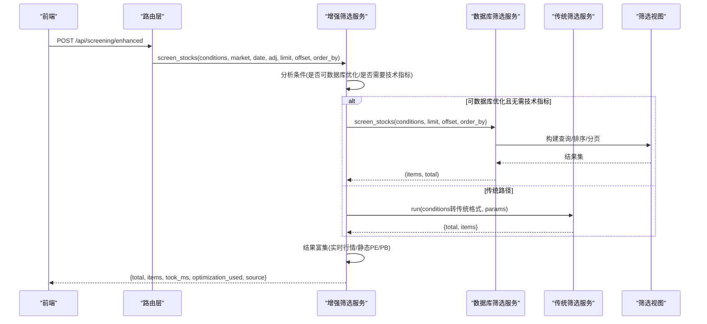
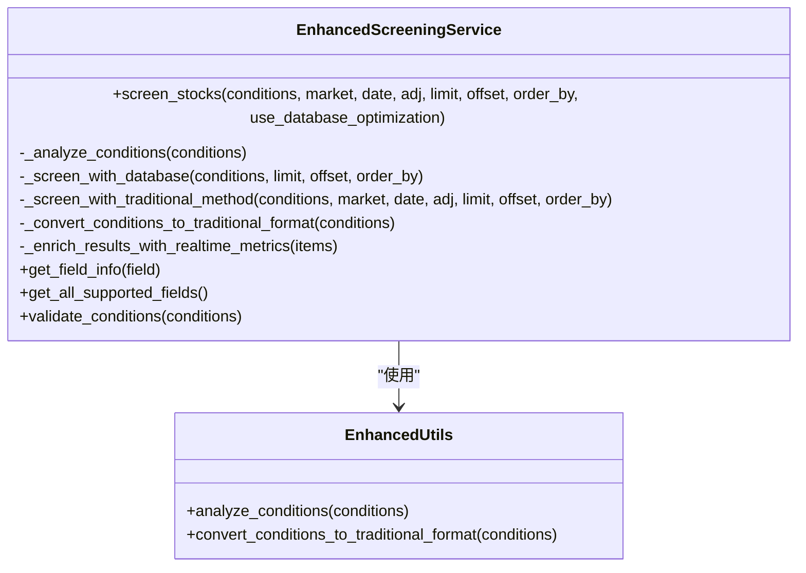
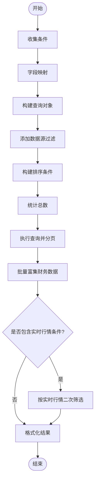
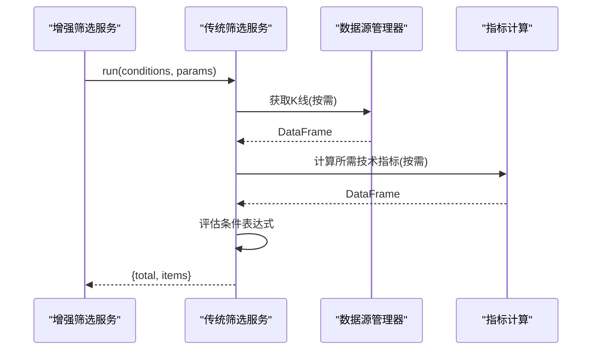
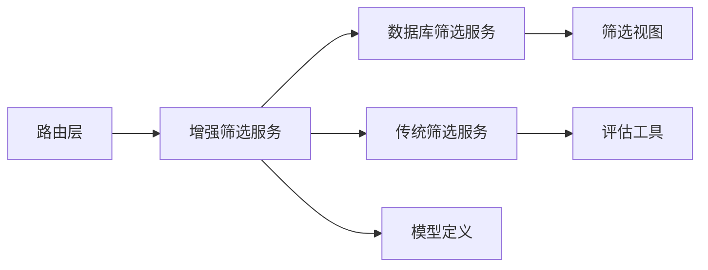

# 查询构建

<cite>
**本文引用的文件**
- [app/models/screening.py](file://app/models/screening.py)
- [app/routers/screening.py](file://app/routers/screening.py)
- [app/services/enhanced_screening_service.py](file://app/services/enhanced_screening_service.py)
- [app/services/database_screening_service.py](file://app/services/database_screening_service.py)
- [app/services/screening_service.py](file://app/services/screening_service.py)
- [app/services/screening/eval_utils.py](file://app/services/screening/eval_utils.py)
- [app/services/enhanced_screening/utils.py](file://app/services/enhanced_screening/utils.py)
- [frontend/src/api/screening.ts](file://frontend/src/api/screening.ts)
- [scripts/setup/create_stock_screening_view.py](file://scripts/setup/create_stock_screening_view.py)
- [tests/test_enhanced_screening.py](file://tests/test_enhanced_screening.py)
- [tests/test_screening_fields.py](file://tests/test_screening_fields.py)
</cite>

## 目录
1. [简介](#简介)
2. [项目结构](#项目结构)
3. [核心组件](#核心组件)
4. [架构总览](#架构总览)
5. [详细组件分析](#详细组件分析)
6. [依赖关系分析](#依赖关系分析)
7. [性能考量](#性能考量)
8. [故障排查指南](#故障排查指南)
9. [结论](#结论)
10. [附录](#附录)

## 简介
本技术文档聚焦“智能筛选”功能的查询构建技术，系统阐述从用户界面筛选条件到后端查询对象的完整转化链路。内容涵盖：
- 筛选条件解析引擎的实现原理与设计模式
- 条件表达式解析、逻辑运算符处理与字段映射机制
- 查询构建器的核心类结构与关键代码片段路径
- 复杂嵌套查询（多条件组合、范围查询、模糊匹配）的构建流程
- 查询验证机制与安全校验
- 与前端筛选组件的交互协议与数据格式约定

## 项目结构
筛选能力由三层协作构成：
- 路由层：接收前端请求，执行条件格式转换与路由决策
- 服务层：增强筛选服务负责策略选择与结果富集；数据库筛选服务负责数据库优化路径；传统筛选服务负责技术指标路径
- 模型层：定义筛选条件、字段信息与响应结构

图表来源
- [app/routers/screening.py](file://app/routers/screening.py#L1-L200)
- [app/services/enhanced_screening_service.py](file://app/services/enhanced_screening_service.py#L1-L200)
- [app/services/database_screening_service.py](file://app/services/database_screening_service.py#L1-L200)
- [app/services/screening_service.py](file://app/services/screening_service.py#L1-L120)
- [app/services/screening/eval_utils.py](file://app/services/screening/eval_utils.py#L1-L120)
- [scripts/setup/create_stock_screening_view.py](file://scripts/setup/create_stock_screening_view.py#L24-L160)
- [app/models/screening.py](file://app/models/screening.py#L1-L120)

章节来源
- [app/routers/screening.py](file://app/routers/screening.py#L1-L200)
- [app/services/enhanced_screening_service.py](file://app/services/enhanced_screening_service.py#L1-L120)
- [app/services/database_screening_service.py](file://app/services/database_screening_service.py#L1-L120)
- [app/services/screening_service.py](file://app/services/screening_service.py#L1-L120)
- [app/services/screening/eval_utils.py](file://app/services/screening/eval_utils.py#L1-L120)
- [scripts/setup/create_stock_screening_view.py](file://scripts/setup/create_stock_screening_view.py#L24-L160)
- [app/models/screening.py](file://app/models/screening.py#L1-L120)

## 核心组件
- 筛选模型与字段信息
  - 定义操作符类型、字段类型、单个条件、请求体、响应体与字段信息
  - 预置基础字段信息与支持的操作符
- 路由层
  - 提供字段配置、运行筛选、增强筛选、字段验证、行业列表等接口
  - 负责将传统格式条件转换为新格式，并进行单位转换与字段映射
- 增强筛选服务
  - 条件分析与策略选择：自动判断是否可走数据库优化路径
  - 结果富集：补充实时行情与静态PE/PB
  - 条件验证：基于字段信息进行合法性校验
- 数据库筛选服务
  - 基于MongoDB视图的高效筛选
  - 字段映射、操作符映射、排序与分页
  - 实时行情二次筛选与财务数据富集
- 传统筛选服务
  - 基于统一数据源接口与指标计算的全量评估
  - 仅在需要技术指标或非数据库字段时启用
- 评估工具
  - 条件收集、表达式求值、数值安全转换
- 增强筛选工具
  - 条件分析与传统格式转换

章节来源
- [app/models/screening.py](file://app/models/screening.py#L1-L347)
- [app/routers/screening.py](file://app/routers/screening.py#L1-L200)
- [app/services/enhanced_screening_service.py](file://app/services/enhanced_screening_service.py#L1-L200)
- [app/services/database_screening_service.py](file://app/services/database_screening_service.py#L1-L200)
- [app/services/screening_service.py](file://app/services/screening_service.py#L1-L200)
- [app/services/screening/eval_utils.py](file://app/services/screening/eval_utils.py#L1-L168)
- [app/services/enhanced_screening/utils.py](file://app/services/enhanced_screening/utils.py#L1-L77)

## 架构总览
下图展示了从路由到服务再到数据库视图的整体流程，以及两种筛选路径的选择逻辑。

图表来源
- [app/routers/screening.py](file://app/routers/screening.py#L190-L231)
- [app/services/enhanced_screening_service.py](file://app/services/enhanced_screening_service.py#L34-L150)
- [app/services/database_screening_service.py](file://app/services/database_screening_service.py#L96-L190)
- [app/services/screening_service.py](file://app/services/screening_service.py#L77-L186)
- [scripts/setup/create_stock_screening_view.py](file://scripts/setup/create_stock_screening_view.py#L24-L160)

## 详细组件分析

### 组件A：增强筛选服务（策略选择与结果富集）
- 设计要点
  - 条件分析：统计基础/财务/技术条件数量，判定是否可走数据库优化路径
  - 路径选择：当条件全部为基础字段且无需技术指标时，走数据库优化；否则走传统路径
  - 结果富集：对数据库优化路径的结果补充实时行情与静态PE/PB
  - 条件验证：基于字段信息校验字段名、操作符与数值类型
- 关键代码片段路径
  - 策略选择与富集：[app/services/enhanced_screening_service.py](file://app/services/enhanced_screening_service.py#L34-L150)
  - 条件分析工具：[app/services/enhanced_screening/utils.py](file://app/services/enhanced_screening/utils.py#L11-L54)
  - 传统格式转换：[app/services/enhanced_screening/utils.py](file://app/services/enhanced_screening/utils.py#L56-L77)
  - 字段信息与验证：[app/services/enhanced_screening_service.py](file://app/services/enhanced_screening_service.py#L233-L337)

图表来源
- [app/services/enhanced_screening_service.py](file://app/services/enhanced_screening_service.py#L1-L200)
- [app/services/enhanced_screening/utils.py](file://app/services/enhanced_screening/utils.py#L1-L77)

章节来源
- [app/services/enhanced_screening_service.py](file://app/services/enhanced_screening_service.py#L1-L200)
- [app/services/enhanced_screening/utils.py](file://app/services/enhanced_screening/utils.py#L1-L77)

### 组件B：数据库筛选服务（查询构建与字段映射）
- 设计要点
  - 字段映射：将后端字段名映射到视图字段
  - 操作符映射：将业务操作符映射到MongoDB操作符
  - 查询构建：遍历条件，逐个映射并拼装查询对象
  - 排序与分页：根据order_by生成排序规则，应用skip/limit
  - 实时行情二次筛选：对基础筛选结果按实时行情字段再次过滤
  - 财务数据富集：批量查询财务数据并合并到结果
- 关键代码片段路径
  - 字段与操作符映射：[app/services/database_screening_service.py](file://app/services/database_screening_service.py#L23-L69)
  - 查询构建：[app/services/database_screening_service.py](file://app/services/database_screening_service.py#L191-L229)
  - 排序构建：[app/services/database_screening_service.py](file://app/services/database_screening_service.py#L231-L251)
  - 实时行情二次筛选：[app/services/database_screening_service.py](file://app/services/database_screening_service.py#L464-L555)
  - 财务数据富集：[app/services/database_screening_service.py](file://app/services/database_screening_service.py#L253-L319)

图表来源
- [app/services/database_screening_service.py](file://app/services/database_screening_service.py#L96-L190)
- [app/services/database_screening_service.py](file://app/services/database_screening_service.py#L191-L229)
- [app/services/database_screening_service.py](file://app/services/database_screening_service.py#L231-L251)
- [app/services/database_screening_service.py](file://app/services/database_screening_service.py#L253-L319)
- [app/services/database_screening_service.py](file://app/services/database_screening_service.py#L464-L555)

章节来源
- [app/services/database_screening_service.py](file://app/services/database_screening_service.py#L1-L200)
- [app/services/database_screening_service.py](file://app/services/database_screening_service.py#L200-L400)

### 组件C：传统筛选服务（技术指标路径）
- 设计要点
  - 仅在需要技术指标或非数据库字段时启用
  - 通过统一数据源接口获取K线，计算所需技术指标
  - 评估条件表达式，支持跨期交叉等高级条件
- 关键代码片段路径
  - 条件收集与评估工具：[app/services/screening/eval_utils.py](file://app/services/screening/eval_utils.py#L1-L168)
  - 传统筛选主流程：[app/services/screening_service.py](file://app/services/screening_service.py#L77-L186)

图表来源
- [app/services/screening_service.py](file://app/services/screening_service.py#L77-L186)
- [app/services/screening/eval_utils.py](file://app/services/screening/eval_utils.py#L78-L158)

章节来源
- [app/services/screening_service.py](file://app/services/screening_service.py#L1-L200)
- [app/services/screening/eval_utils.py](file://app/services/screening/eval_utils.py#L1-L168)

### 组件D：路由层（条件转换与接口）
- 设计要点
  - 提供字段配置、运行筛选、增强筛选、字段验证、行业列表等接口
  - 将传统格式条件转换为新格式，进行字段与操作符映射，处理单位转换
- 关键代码片段路径
  - 字段配置与接口：[app/routers/screening.py](file://app/routers/screening.py#L47-L68)
  - 传统条件转换：[app/routers/screening.py](file://app/routers/screening.py#L74-L153)
  - 传统筛选接口：[app/routers/screening.py](file://app/routers/screening.py#L155-L190)
  - 增强筛选接口：[app/routers/screening.py](file://app/routers/screening.py#L192-L231)
  - 字段验证接口：[app/routers/screening.py](file://app/routers/screening.py#L262-L271)
  - 行业列表接口：[app/routers/screening.py](file://app/routers/screening.py#L275-L379)

章节来源
- [app/routers/screening.py](file://app/routers/screening.py#L1-L200)
- [app/routers/screening.py](file://app/routers/screening.py#L200-L379)

### 组件E：模型层（字段与条件定义）
- 设计要点
  - 定义操作符类型、字段类型、单个条件、请求体、响应体与字段信息
  - 预置基础字段信息与支持的操作符，便于前端展示与后端校验
- 关键代码片段路径
  - 操作符与字段类型：[app/models/screening.py](file://app/models/screening.py#L10-L31)
  - 单个条件与请求体：[app/models/screening.py](file://app/models/screening.py#L33-L70)
  - 字段信息与预置字段：[app/models/screening.py](file://app/models/screening.py#L71-L347)

章节来源
- [app/models/screening.py](file://app/models/screening.py#L1-L347)

## 依赖关系分析
- 组件耦合与内聚
  - 增强筛选服务内聚度高，负责策略选择与结果富集，依赖数据库与传统服务
  - 数据库筛选服务专注于查询构建与视图交互，依赖统一配置管理器获取数据源优先级
  - 传统筛选服务依赖统一数据源接口与指标计算库
- 外部依赖
  - MongoDB视图：stock_screening_view，聚合了基础信息、行情与财务数据
  - 统一配置管理器：用于获取数据源优先级
- 循环依赖规避
  - 模型与服务解耦，避免直接相互导入

图表来源
- [app/routers/screening.py](file://app/routers/screening.py#L1-L200)
- [app/services/enhanced_screening_service.py](file://app/services/enhanced_screening_service.py#L1-L120)
- [app/services/database_screening_service.py](file://app/services/database_screening_service.py#L1-L120)
- [app/services/screening_service.py](file://app/services/screening_service.py#L1-L120)
- [app/services/screening/eval_utils.py](file://app/services/screening/eval_utils.py#L1-L120)
- [scripts/setup/create_stock_screening_view.py](file://scripts/setup/create_stock_screening_view.py#L24-L160)

章节来源
- [app/routers/screening.py](file://app/routers/screening.py#L1-L200)
- [app/services/enhanced_screening_service.py](file://app/services/enhanced_screening_service.py#L1-L120)
- [app/services/database_screening_service.py](file://app/services/database_screening_service.py#L1-L120)
- [app/services/screening_service.py](file://app/services/screening_service.py#L1-L120)
- [app/services/screening/eval_utils.py](file://app/services/screening/eval_utils.py#L1-L120)
- [scripts/setup/create_stock_screening_view.py](file://scripts/setup/create_stock_screening_view.py#L24-L160)

## 性能考量
- 数据库优化路径
  - 通过视图一次性聚合基础信息、行情与财务数据，减少多次查询
  - 使用索引字段与精确操作符映射，避免全表扫描
- 传统路径
  - 仅在需要技术指标时加载K线并计算指标，避免不必要的数据拉取
  - 对结果进行分页与排序，控制内存占用
- 结果富集
  - 数据库优化路径通过一次批量查询行情数据，避免多次外部调用
  - 静态PE/PB富集避免动态计算带来的性能开销

[本节为通用性能讨论，无需列出具体文件来源]

## 故障排查指南
- 常见问题
  - 条件无效：检查字段名与操作符是否在支持列表中
  - 数据源优先级：确认配置管理器返回的启用数据源列表
  - 视图缺失：确认stock_screening_view已创建并包含所需字段
- 关键定位点
  - 条件验证：[app/services/enhanced_screening_service.py](file://app/services/enhanced_screening_service.py#L279-L337)
  - 数据库筛选异常：[app/services/database_screening_service.py](file://app/services/database_screening_service.py#L117-L190)
  - 传统筛选异常：[app/services/screening_service.py](file://app/services/screening_service.py#L206-L241)
  - 视图创建：[scripts/setup/create_stock_screening_view.py](file://scripts/setup/create_stock_screening_view.py#L24-L160)
- 测试参考
  - 增强筛选测试：[tests/test_enhanced_screening.py](file://tests/test_enhanced_screening.py#L1-L192)
  - 字段映射测试：[tests/test_screening_fields.py](file://tests/test_screening_fields.py#L1-L89)

章节来源
- [app/services/enhanced_screening_service.py](file://app/services/enhanced_screening_service.py#L279-L337)
- [app/services/database_screening_service.py](file://app/services/database_screening_service.py#L117-L190)
- [app/services/screening_service.py](file://app/services/screening_service.py#L206-L241)
- [scripts/setup/create_stock_screening_view.py](file://scripts/setup/create_stock_screening_view.py#L24-L160)
- [tests/test_enhanced_screening.py](file://tests/test_enhanced_screening.py#L1-L192)
- [tests/test_screening_fields.py](file://tests/test_screening_fields.py#L1-L89)

## 结论
该筛选系统通过“增强筛选服务”的策略选择，实现了数据库优化与传统路径的无缝切换。模型层提供统一的字段与条件定义，路由层负责格式转换与接口暴露，服务层分别承担查询构建与技术指标评估。整体设计在保证安全性与可扩展性的同时，兼顾了性能与用户体验。

[本节为总结性内容，无需列出具体文件来源]

## 附录

### 复杂嵌套查询构建示例
- 多条件组合
  - 增强筛选服务会先分析条件类型，再决定是否走数据库优化路径
  - 数据库路径：逐条条件映射并拼装查询对象
  - 传统路径：将条件转换为传统格式后进行表达式求值
- 范围查询
  - between操作符在数据库路径中映射为范围查询，在传统路径中按区间判断
- 模糊匹配
  - contains操作符在数据库路径中映射为正则匹配（不区分大小写）

章节来源
- [app/services/enhanced_screening_service.py](file://app/services/enhanced_screening_service.py#L151-L204)
- [app/services/database_screening_service.py](file://app/services/database_screening_service.py#L191-L229)
- [app/services/screening/eval_utils.py](file://app/services/screening/eval_utils.py#L78-L158)

### 查询验证机制
- 字段与操作符校验：基于预置字段信息进行合法性检查
- 数值类型与范围校验：针对数值字段的between与单值进行类型与范围校验
- 错误与警告汇总：返回结构化的验证结果

章节来源
- [app/services/enhanced_screening_service.py](file://app/services/enhanced_screening_service.py#L279-L337)
- [app/models/screening.py](file://app/models/screening.py#L71-L120)

### 前后端交互协议与数据格式
- 前端接口定义
  - 运行筛选、获取字段配置、获取行业列表
  - 排序字段与方向、分页参数
- 后端接口定义
  - 字段配置响应：包含字段信息与分类
  - 筛选响应：包含总数、条目、耗时、优化方式与数据源

章节来源
- [frontend/src/api/screening.ts](file://frontend/src/api/screening.ts#L1-L65)
- [app/routers/screening.py](file://app/routers/screening.py#L47-L68)
- [app/routers/screening.py](file://app/routers/screening.py#L155-L231)