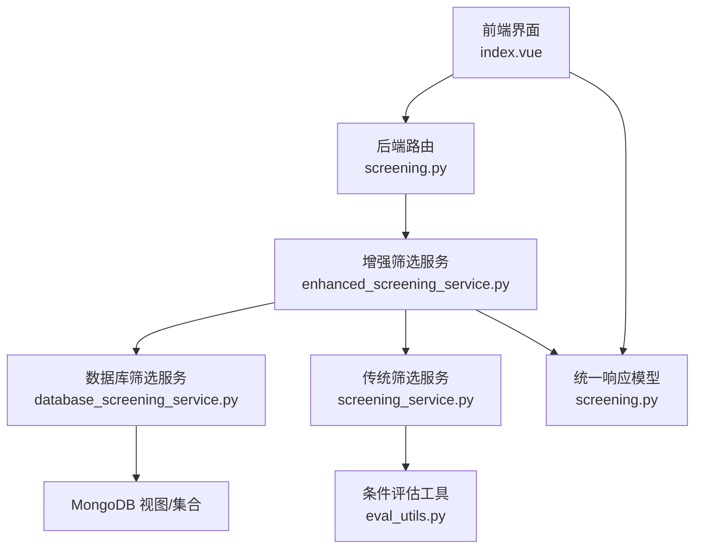
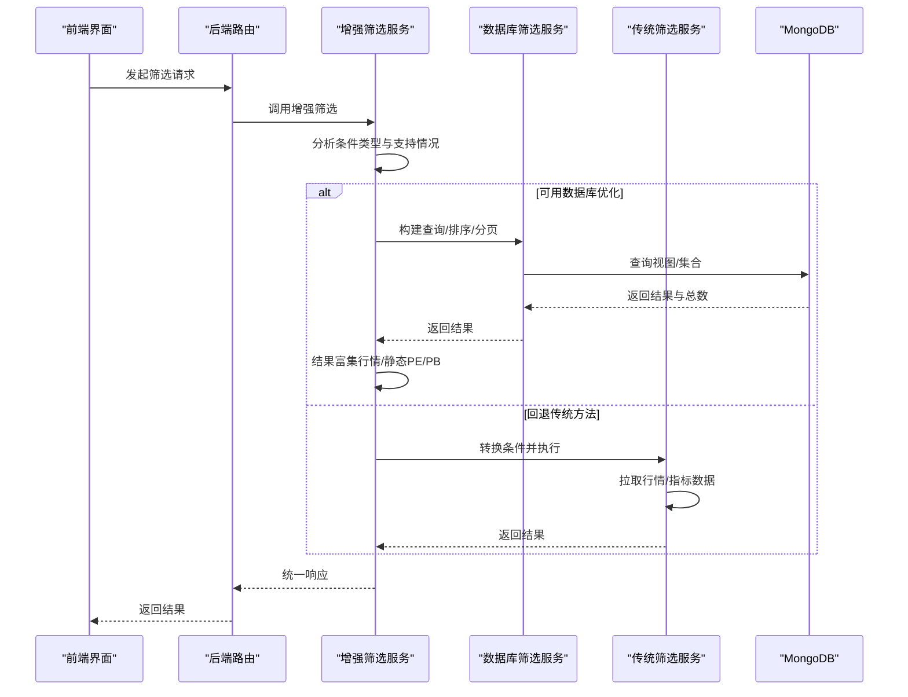
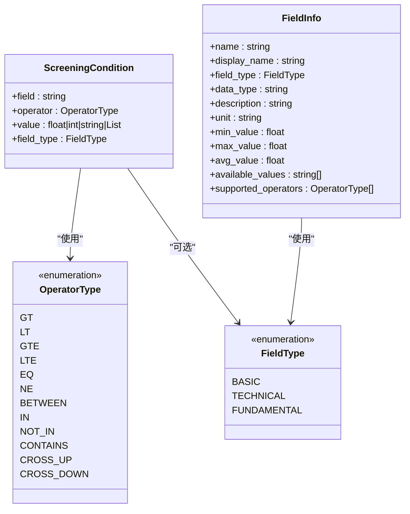
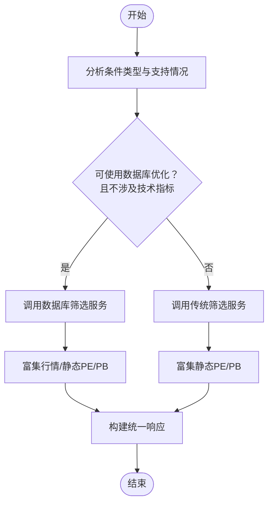
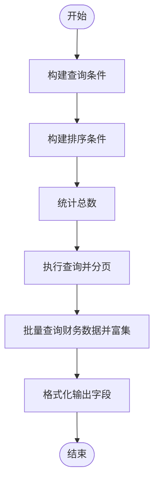
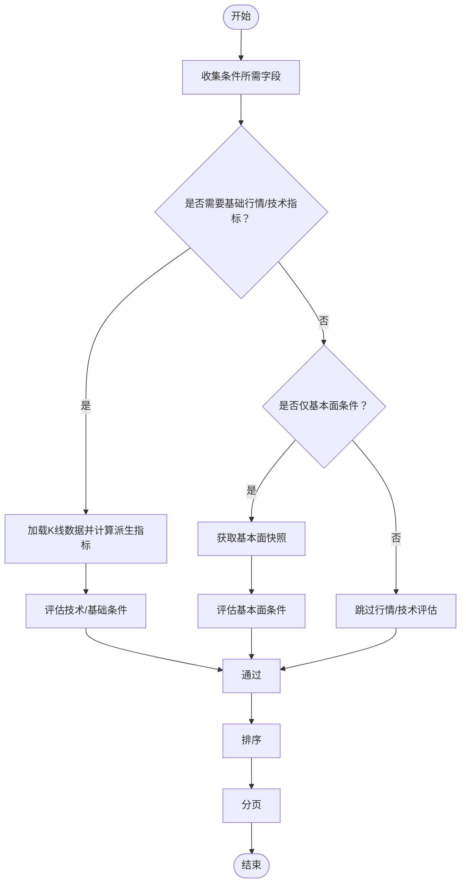
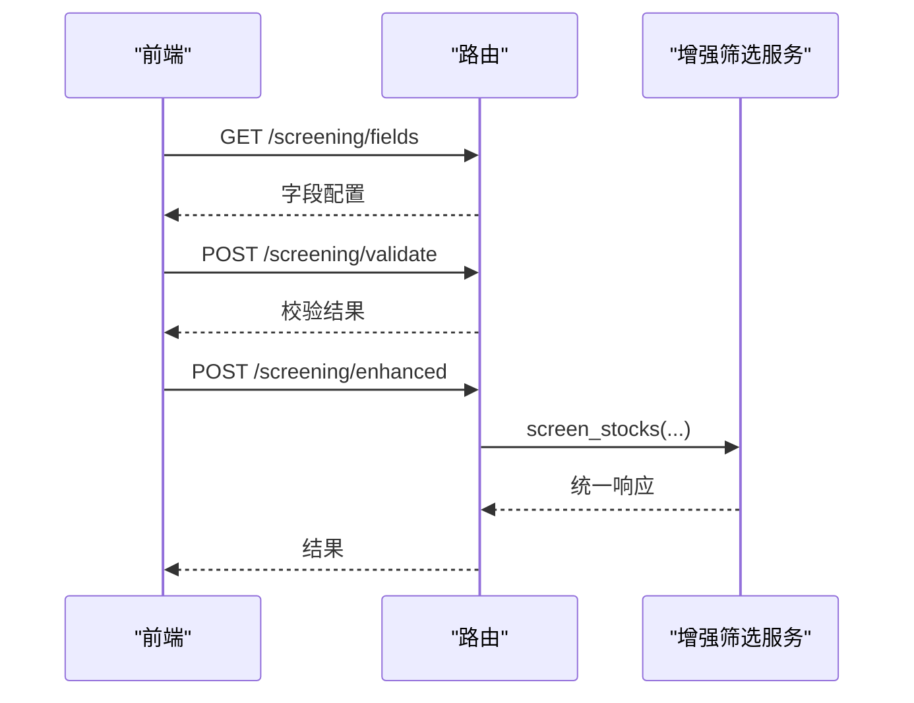
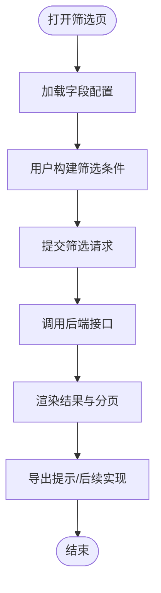
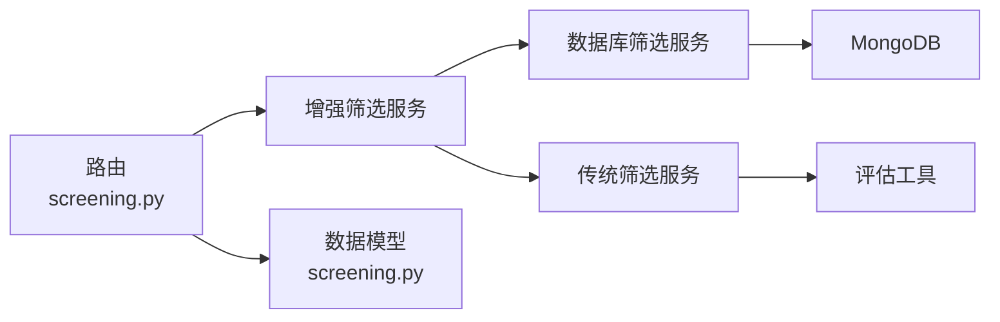

# 智能筛选

<cite>
**本文引用的文件**
- [app/models/screening.py](file://app/models/screening.py)
- [app/services/enhanced_screening_service.py](file://app/services/enhanced_screening_service.py)
- [app/services/database_screening_service.py](file://app/services/database_screening_service.py)
- [app/services/screening_service.py](file://app/services/screening_service.py)
- [app/services/screening/eval_utils.py](file://app/services/screening/eval_utils.py)
- [app/routers/screening.py](file://app/routers/screening.py)
- [frontend/src/views/Screening/index.vue](file://frontend/src/views/Screening/index.vue)
- [tests/test_enhanced_screening.py](file://tests/test_enhanced_screening.py)
- [tests/services/test_screening_roe_field.py](file://tests/services/test_screening_roe_field.py)
- [scripts/test_screening_view.py](file://scripts/test_screening_view.py)
- [docs/maintenance/mongodb_index_optimization.md](file://docs/maintenance/mongodb_index_optimization.md)
</cite>

## 目录
1. [简介](#简介)
2. [项目结构](#项目结构)
3. [核心组件](#核心组件)
4. [架构总览](#架构总览)
5. [详细组件分析](#详细组件分析)
6. [依赖关系分析](#依赖关系分析)
7. [性能考虑](#性能考虑)
8. [故障排查指南](#故障排查指南)
9. [结论](#结论)
10. [附录](#附录)

## 简介
本文件面向“智能筛选”功能，系统化阐述筛选条件的配置方式与逻辑运算规则、后端实现（查询构建、数据库索引优化与性能调优）、前端交互设计（条件添加/编辑/删除）、筛选结果展示与导出选项，并提供常见策略示例（价值投资、成长股等）及筛选器扩展机制与复杂条件构建案例。目标是帮助开发者与使用者快速理解并高效使用筛选能力。

## 项目结构
智能筛选由“前端界面 + 后端路由 + 增强筛选服务 + 数据库筛选服务 + 传统筛选服务 + 条件评估工具”构成，形成“自动择优”的筛选路径：优先走数据库优化路径，否则回退到传统方法。

图表来源
- [app/routers/screening.py](file://app/routers/screening.py#L1-L272)
- [app/services/enhanced_screening_service.py](file://app/services/enhanced_screening_service.py#L1-L349)
- [app/services/database_screening_service.py](file://app/services/database_screening_service.py#L1-L599)
- [app/services/screening_service.py](file://app/services/screening_service.py#L1-L242)
- [app/services/screening/eval_utils.py](file://app/services/screening/eval_utils.py#L1-L28)

章节来源
- [app/routers/screening.py](file://app/routers/screening.py#L1-L272)
- [app/services/enhanced_screening_service.py](file://app/services/enhanced_screening_service.py#L1-L349)
- [app/services/database_screening_service.py](file://app/services/database_screening_service.py#L1-L599)
- [app/services/screening_service.py](file://app/services/screening_service.py#L1-L242)
- [app/services/screening/eval_utils.py](file://app/services/screening/eval_utils.py#L1-L28)

## 核心组件
- 数据模型与字段定义：定义筛选条件、字段信息、支持的操作符与字段类型，确保前后端一致。
- 增强筛选服务：根据条件类型与支持情况，自动选择数据库优化或传统方法，并对结果进行富集与统计。
- 数据库筛选服务：基于 MongoDB 视图/集合构建查询、排序、分页与统计，支持字段映射与数据源优先级。
- 传统筛选服务：面向技术指标/行情的筛选，按需拉取行情与指标数据，评估条件并通过排序/分页返回。
- 条件评估工具：抽取条件字段、安全数值转换、条件评估辅助。
- 后端路由：提供字段配置、条件校验、增强筛选接口与传统筛选接口。
- 前端界面：提供筛选条件面板、字段配置加载、结果分页与导出提示。

章节来源
- [app/models/screening.py](file://app/models/screening.py#L1-L347)
- [app/services/enhanced_screening_service.py](file://app/services/enhanced_screening_service.py#L1-L349)
- [app/services/database_screening_service.py](file://app/services/database_screening_service.py#L1-L599)
- [app/services/screening_service.py](file://app/services/screening_service.py#L1-L242)
- [app/services/screening/eval_utils.py](file://app/services/screening/eval_utils.py#L1-L28)
- [app/routers/screening.py](file://app/routers/screening.py#L1-L272)
- [frontend/src/views/Screening/index.vue](file://frontend/src/views/Screening/index.vue#L1-L200)

## 架构总览
智能筛选采用“自动择优”的双通道策略：
- 数据库优化路径：当条件全部为数据库支持字段且不涉及技术指标时，直接走数据库视图/集合，具备高性能与低延迟优势。
- 传统路径：当条件包含技术指标或数据库不支持字段时，回退到传统方法，按需拉取行情与指标数据进行评估。

图表来源
- [app/routers/screening.py](file://app/routers/screening.py#L193-L215)
- [app/services/enhanced_screening_service.py](file://app/services/enhanced_screening_service.py#L34-L136)
- [app/services/database_screening_service.py](file://app/services/database_screening_service.py#L96-L186)
- [app/services/screening_service.py](file://app/services/screening_service.py#L77-L187)

## 详细组件分析

### 数据模型与字段信息
- 字段类型：基础信息、技术指标、基本面。
- 操作符：比较（>, <, >=, <=, ==, !=）、区间（between）、集合（in/not_in）、字符串包含（contains）、技术穿越（cross_up/cross_down）。
- 字段信息：包含显示名、数据类型、单位、描述、支持的操作符、统计信息与可选值等。
- 预定义字段：覆盖代码、名称、行业、地区、市场、市值、PE/PB/PE_TTM/PB_Mrq/ROE、换手率/量比、收盘价/涨跌幅/成交额/成交量、MA20/RSI14/KDJ/MACD等。

图表来源
- [app/models/screening.py](file://app/models/screening.py#L10-L347)

章节来源
- [app/models/screening.py](file://app/models/screening.py#L1-L347)

### 增强筛选服务（EnhancedScreeningService）
- 条件分析：统计基础/基本面/技术条件数量、是否可使用数据库优化、是否需要技术指标等。
- 自动择优：当条件可被数据库优化且不涉及技术指标时，走数据库路径；否则走传统路径。
- 结果富集：从行情集合补充实时行情，从静态基础信息补充PE/PB等指标。
- 字段信息：聚合统计与可选值，支持按字段查询。
- 条件校验：校验字段存在性、操作符支持性与数值范围。

图表来源
- [app/services/enhanced_screening_service.py](file://app/services/enhanced_screening_service.py#L34-L136)
- [app/services/enhanced_screening_service.py](file://app/services/enhanced_screening_service.py#L151-L204)
- [app/services/enhanced_screening_service.py](file://app/services/enhanced_screening_service.py#L212-L232)

章节来源
- [app/services/enhanced_screening_service.py](file://app/services/enhanced_screening_service.py#L1-L349)

### 数据库筛选服务（DatabaseScreeningService）
- 字段映射：将前端字段映射到视图/集合字段，支持等值、范围、集合、字符串包含等操作符。
- 查询构建：遍历条件，生成MongoDB查询对象；支持between、regex、$in/$nin等。
- 排序与分页：支持多字段排序，默认按总市值降序；分页通过skip/limit实现。
- 统计与可选值：提供字段统计（min/max/avg/count）与distinct可选值。
- 数据源优先级：根据配置选择优先数据源，保证一致性。
- 结果富集：批量查询财务数据（如ROE）并填充到结果中。

图表来源
- [app/services/database_screening_service.py](file://app/services/database_screening_service.py#L191-L229)
- [app/services/database_screening_service.py](file://app/services/database_screening_service.py#L231-L251)
- [app/services/database_screening_service.py](file://app/services/database_screening_service.py#L253-L318)
- [app/services/database_screening_service.py](file://app/services/database_screening_service.py#L324-L388)

章节来源
- [app/services/database_screening_service.py](file://app/services/database_screening_service.py#L1-L599)

### 传统筛选服务（ScreeningService）
- 条件字段收集：从条件树中提取所需字段，判断是否需要基础行情、技术指标或基本面快照。
- 数据源管理：通过统一数据源管理器获取K线数据，统一列名并计算派生指标（如pct_chg）。
- 技术指标计算：按需计算MA/EMA/MACD/RSI/KDJ/ATR/BOLL等指标。
- 条件评估：委托评估工具进行DSL解析与条件判断。
- 结果排序与分页：按order_by字段排序，再截取limit/offset。

图表来源
- [app/services/screening_service.py](file://app/services/screening_service.py#L77-L187)
- [app/services/screening_service.py](file://app/services/screening_service.py#L188-L205)
- [app/services/screening/eval_utils.py](file://app/services/screening/eval_utils.py#L1-L28)

章节来源
- [app/services/screening_service.py](file://app/services/screening_service.py#L1-L242)
- [app/services/screening/eval_utils.py](file://app/services/screening/eval_utils.py#L1-L28)

### 后端路由与接口
- 字段配置接口：返回字段信息与分类，供前端渲染筛选面板。
- 条件校验接口：校验字段、操作符与数值合法性。
- 增强筛选接口：支持更丰富的条件格式与性能统计。
- 传统筛选接口：兼容旧格式，内部转为新格式后调用增强服务。

图表来源
- [app/routers/screening.py](file://app/routers/screening.py#L47-L71)
- [app/routers/screening.py](file://app/routers/screening.py#L246-L271)
- [app/routers/screening.py](file://app/routers/screening.py#L193-L215)

章节来源
- [app/routers/screening.py](file://app/routers/screening.py#L1-L272)

### 前端筛选界面交互设计
- 条件面板：包含市场类型、行业分类、市值范围、PE/PB/ROE、涨跌幅、成交量等筛选项。
- 条件构建：前端将用户选择转换为条件数组（字段、操作符、值），支持区间与集合。
- 加载字段配置：调用后端字段接口，动态渲染筛选项。
- 结果展示：分页展示，支持切换每页大小与页码。
- 导出提示：当前导出功能处于开发中，后续可扩展为CSV/JSON/Excel导出。

图表来源
- [frontend/src/views/Screening/index.vue](file://frontend/src/views/Screening/index.vue#L1-L200)
- [frontend/src/views/Screening/index.vue](file://frontend/src/views/Screening/index.vue#L678-L719)

章节来源
- [frontend/src/views/Screening/index.vue](file://frontend/src/views/Screening/index.vue#L1-L200)
- [frontend/src/views/Screening/index.vue](file://frontend/src/views/Screening/index.vue#L678-L719)

## 依赖关系分析
- 增强筛选服务依赖数据库筛选服务与传统筛选服务，同时依赖字段信息模型与评估工具。
- 数据库筛选服务依赖MongoDB集合（视图/基础信息/财务数据/行情数据）与统一配置管理。
- 传统筛选服务依赖统一数据源管理器与指标计算库。
- 路由层依赖增强筛选服务与字段信息模型。

图表来源
- [app/routers/screening.py](file://app/routers/screening.py#L1-L272)
- [app/services/enhanced_screening_service.py](file://app/services/enhanced_screening_service.py#L1-L349)
- [app/services/database_screening_service.py](file://app/services/database_screening_service.py#L1-L599)
- [app/services/screening_service.py](file://app/services/screening_service.py#L1-L242)
- [app/services/screening/eval_utils.py](file://app/services/screening/eval_utils.py#L1-L28)
- [app/models/screening.py](file://app/models/screening.py#L1-L347)

章节来源
- [app/routers/screening.py](file://app/routers/screening.py#L1-L272)
- [app/services/enhanced_screening_service.py](file://app/services/enhanced_screening_service.py#L1-L349)
- [app/services/database_screening_service.py](file://app/services/database_screening_service.py#L1-L599)
- [app/services/screening_service.py](file://app/services/screening_service.py#L1-L242)
- [app/services/screening/eval_utils.py](file://app/services/screening/eval_utils.py#L1-L28)
- [app/models/screening.py](file://app/models/screening.py#L1-L347)

## 性能考虑
- 数据库优化路径：优先使用数据库视图/集合，避免逐股票拉取行情与指标，显著降低延迟与吞吐压力。
- 字段映射与操作符：将前端字段映射到数据库字段，使用$gte/$lte/$in/$regex等原生操作符，便于索引命中。
- 排序与分页：默认按总市值降序，减少不必要的排序成本；分页通过skip/limit实现，建议配合索引优化。
- 统计与可选值：提供字段统计与distinct可选值，辅助前端渲染与条件构建。
- 索引优化：参考维护文档，为高频查询字段建立复合索引，避免COLLSCAN，提升查询性能。

章节来源
- [app/services/database_screening_service.py](file://app/services/database_screening_service.py#L191-L229)
- [app/services/database_screening_service.py](file://app/services/database_screening_service.py#L231-L251)
- [docs/maintenance/mongodb_index_optimization.md](file://docs/maintenance/mongodb_index_optimization.md#L1-L347)

## 故障排查指南
- 条件校验失败：检查字段是否存在、操作符是否支持、数值类型与范围是否正确。
- 数据库筛选异常：确认字段映射、操作符支持、数据源优先级配置与集合存在性。
- 传统筛选性能问题：关注是否触发技术指标计算与行情拉取，适当简化条件或启用数据库优化。
- 前端导出提示：当前导出功能开发中，后续可扩展CSV/JSON/Excel导出。

章节来源
- [app/services/enhanced_screening_service.py](file://app/services/enhanced_screening_service.py#L279-L337)
- [app/services/database_screening_service.py](file://app/services/database_screening_service.py#L118-L189)
- [frontend/src/views/Screening/index.vue](file://frontend/src/views/Screening/index.vue#L678-L719)

## 结论
智能筛选通过“自动择优”的策略，在保证灵活性的同时最大化性能：数据库优化路径适用于大量基础/基本面字段的筛选；传统路径适用于需要技术指标或外部数据的场景。配合完善的字段模型、条件校验与富集能力，以及前端友好的交互设计，能够满足从入门到进阶的投资策略筛选需求。

## 附录

### 筛选条件配置与逻辑运算规则
- 字段与操作符：参见字段信息模型，涵盖比较、区间、集合、字符串包含与技术穿越等。
- 条件构建：前端将用户输入转换为条件数组，后端统一解析与执行。
- 条件校验：在增强服务中进行字段存在性、操作符支持性与数值合法性检查。

章节来源
- [app/models/screening.py](file://app/models/screening.py#L10-L347)
- [app/services/enhanced_screening_service.py](file://app/services/enhanced_screening_service.py#L279-L337)

### 后端实现要点
- 查询构建：数据库服务将条件映射为MongoDB查询对象，支持between、regex、$in/$nin等。
- 排序与分页：支持多字段排序与分页，避免一次性返回海量数据。
- 富集与统计：从行情集合与财务集合富集实时数据与财务指标，提供字段统计与可选值。

章节来源
- [app/services/database_screening_service.py](file://app/services/database_screening_service.py#L191-L229)
- [app/services/database_screening_service.py](file://app/services/database_screening_service.py#L231-L251)
- [app/services/database_screening_service.py](file://app/services/database_screening_service.py#L324-L388)

### 前端交互设计
- 条件面板：市场类型、行业、市值范围、PE/PB/ROE、涨跌幅、成交量等。
- 字段配置：调用后端接口动态加载字段信息，渲染筛选项。
- 结果展示：分页展示，支持切换每页大小与页码。
- 导出提示：当前导出功能开发中，后续可扩展为CSV/JSON/Excel导出。

章节来源
- [frontend/src/views/Screening/index.vue](file://frontend/src/views/Screening/index.vue#L1-L200)
- [frontend/src/views/Screening/index.vue](file://frontend/src/views/Screening/index.vue#L678-L719)

### 筛选结果展示与数据导出
- 展示：返回统一响应，包含总数、条目列表、耗时、优化方式与数据源。
- 导出：当前前端导出提示为开发中，后续可扩展为CSV/JSON/Excel导出。

章节来源
- [app/routers/screening.py](file://app/routers/screening.py#L193-L215)
- [frontend/src/views/Screening/index.vue](file://frontend/src/views/Screening/index.vue#L678-L719)

### 常用筛选策略示例
- 价值投资筛选：低PE/低PB、ROE较高、市值适中、涨跌幅稳定。
- 成长股筛选：PE/ROE适度、ROE持续提升、成交量活跃、短期涨幅可观。
- 主题/周期策略：按行业/地区筛选，叠加换手率与涨跌幅条件。

章节来源
- [tests/test_enhanced_screening.py](file://tests/test_enhanced_screening.py#L49-L191)

### 筛选器扩展机制
- 新增字段：在字段信息模型中增加新字段定义，声明类型、数据类型、支持的操作符与单位。
- 新增操作符：在模型中扩展操作符枚举，并在数据库服务中映射到MongoDB操作符。
- 新增评估逻辑：在评估工具中扩展相关逻辑，或在传统服务中扩展指标计算与评估。

章节来源
- [app/models/screening.py](file://app/models/screening.py#L10-L347)
- [app/services/database_screening_service.py](file://app/services/database_screening_service.py#L56-L68)
- [app/services/screening_service.py](file://app/services/screening_service.py#L24-L56)

### 复杂筛选条件构建案例
- 示例1：ROE区间 + 涨跌幅区间 + 成交额阈值，使用数据库优化路径。
- 示例2：市值区间 + PE/PB阈值 + 地区集合，使用数据库优化路径。
- 示例3：传统路径（涉及技术指标）：MA/RSI/KDJ/MACD等条件组合。

章节来源
- [tests/services/test_screening_roe_field.py](file://tests/services/test_screening_roe_field.py#L1-L45)
- [scripts/test_screening_view.py](file://scripts/test_screening_view.py#L58-L77)
- [tests/test_enhanced_screening.py](file://tests/test_enhanced_screening.py#L117-L191)