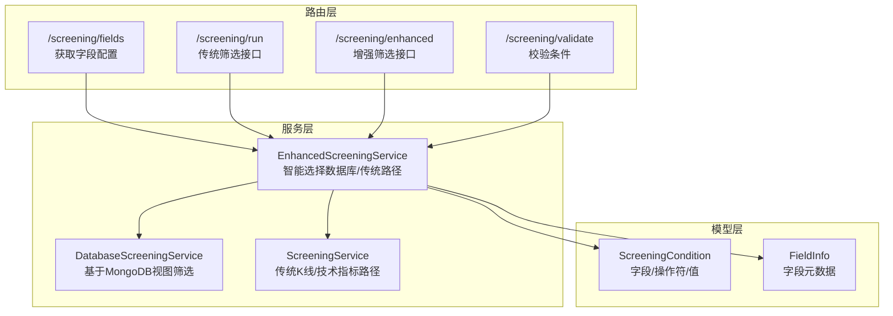
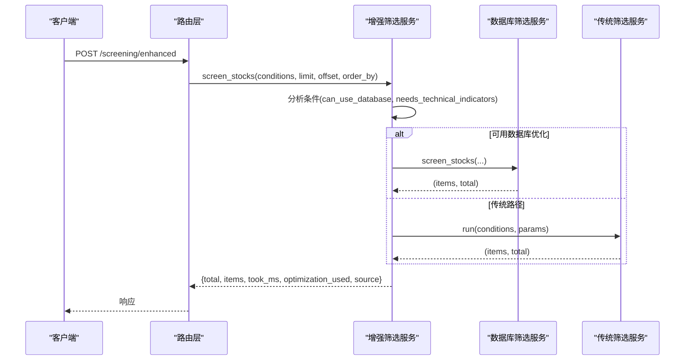
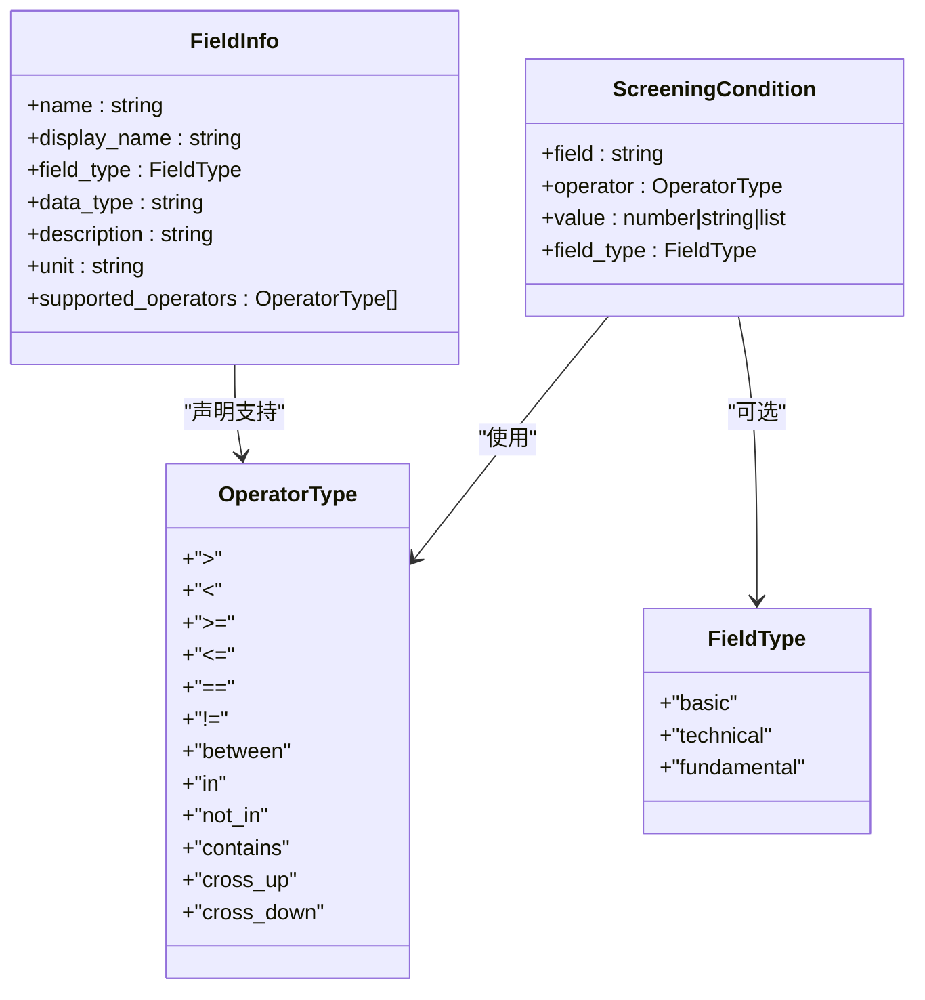
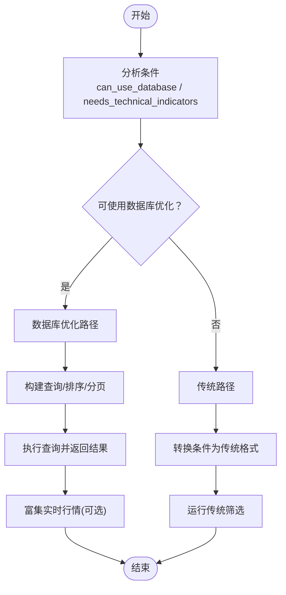
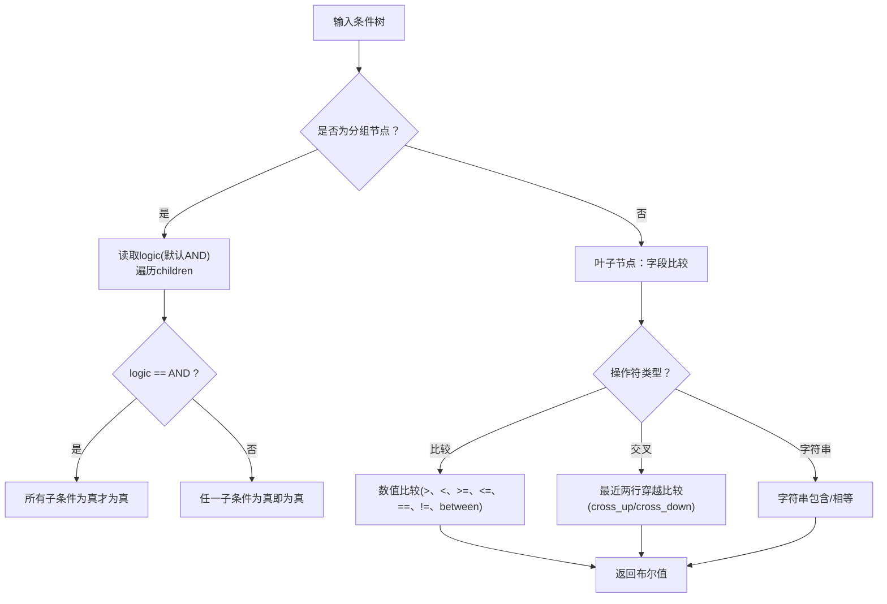
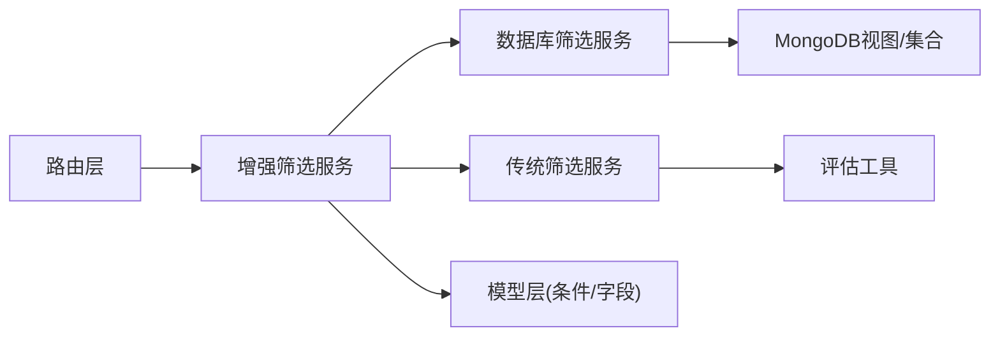

# 筛选配置指南

<cite>
**本文引用的文件**
- [app/models/screening.py](file://app/models/screening.py)
- [app/routers/screening.py](file://app/routers/screening.py)
- [app/services/enhanced_screening_service.py](file://app/services/enhanced_screening_service.py)
- [app/services/database_screening_service.py](file://app/services/database_screening_service.py)
- [app/services/screening_service.py](file://app/services/screening_service.py)
- [app/services/screening/eval_utils.py](file://app/services/screening/eval_utils.py)
- [tests/test_enhanced_screening.py](file://tests/test_enhanced_screening.py)
- [tests/services/test_screening_roe_field.py](file://tests/services/test_screening_roe_field.py)
</cite>

## 目录
1. [简介](#简介)
2. [项目结构](#项目结构)
3. [核心组件](#核心组件)
4. [架构总览](#架构总览)
5. [详细组件分析](#详细组件分析)
6. [依赖关系分析](#依赖关系分析)
7. [性能考量](#性能考量)
8. [故障排查指南](#故障排查指南)
9. [结论](#结论)
10. [附录](#附录)

## 简介
本指南面向使用者与开发者，系统讲解“智能筛选”配置方式与逻辑运算规则，涵盖：
- 如何通过后端接口配置筛选条件（新增/编辑/删除）
- 支持的筛选指标类型（如市盈率、市净率、ROE等）及其参数
- 条件之间的逻辑关系（与、或、非）构建方法与嵌套规则
- 复杂条件组的组合与优先级
- 配置数据的存储位置与同步机制
- 常见配置错误排查与最佳实践

## 项目结构
筛选功能由三层组成：
- 路由层：提供筛选接口与字段配置接口
- 服务层：增强筛选服务与数据库/传统筛选服务
- 模型层：筛选条件、字段信息与支持的操作符定义

图表来源
- [app/routers/screening.py](file://app/routers/screening.py#L47-L231)
- [app/services/enhanced_screening_service.py](file://app/services/enhanced_screening_service.py#L34-L149)
- [app/services/database_screening_service.py](file://app/services/database_screening_service.py#L16-L59)
- [app/services/screening_service.py](file://app/services/screening_service.py#L58-L110)
- [app/models/screening.py](file://app/models/screening.py#L10-L120)

章节来源
- [app/routers/screening.py](file://app/routers/screening.py#L47-L231)
- [app/services/enhanced_screening_service.py](file://app/services/enhanced_screening_service.py#L34-L149)
- [app/services/database_screening_service.py](file://app/services/database_screening_service.py#L16-L59)
- [app/services/screening_service.py](file://app/services/screening_service.py#L58-L110)
- [app/models/screening.py](file://app/models/screening.py#L10-L120)

## 核心组件
- 筛选条件模型：定义字段、操作符、值与字段类型
- 字段信息模型：字段名、显示名、类型、数据类型、单位、支持的操作符
- 增强筛选服务：根据条件自动选择数据库优化或传统路径，并返回性能统计
- 数据库筛选服务：基于MongoDB视图进行高效筛选
- 传统筛选服务：按需加载K线与技术指标，适合技术指标/交叉条件
- 评估工具：条件收集、条件评估、安全数值转换

章节来源
- [app/models/screening.py](file://app/models/screening.py#L10-L120)
- [app/services/enhanced_screening_service.py](file://app/services/enhanced_screening_service.py#L24-L149)
- [app/services/database_screening_service.py](file://app/services/database_screening_service.py#L16-L59)
- [app/services/screening_service.py](file://app/services/screening_service.py#L17-L57)
- [app/services/screening/eval_utils.py](file://app/services/screening/eval_utils.py#L12-L168)

## 架构总览
增强筛选服务根据条件分析结果选择最优路径：
- 若条件全部为基础字段且无需技术指标，则走数据库优化路径（使用MongoDB视图）
- 否则走传统路径（按需拉取K线与技术指标）

图表来源
- [app/routers/screening.py](file://app/routers/screening.py#L192-L231)
- [app/services/enhanced_screening_service.py](file://app/services/enhanced_screening_service.py#L34-L149)
- [app/services/database_screening_service.py](file://app/services/database_screening_service.py#L96-L186)
- [app/services/screening_service.py](file://app/services/screening_service.py#L77-L187)

## 详细组件分析

### 筛选条件与字段模型
- 支持的操作符：大于、小于、大于等于、小于等于、等于、不等于、区间、包含、字符串包含、技术指标穿越（向上/向下）
- 字段类型：基础信息、技术指标、基本面
- 预定义字段：股票代码、名称、行业、地区、市场、总市值、流通市值、市盈率、市净率、滚动市盈率、最新市净率、净资产收益率、换手率、量比、价格、涨跌幅、成交额、成交量、均线、RSI、KDJ、MACD等

图表来源
- [app/models/screening.py](file://app/models/screening.py#L10-L120)
- [app/models/screening.py](file://app/models/screening.py#L170-L347)

章节来源
- [app/models/screening.py](file://app/models/screening.py#L10-L120)
- [app/models/screening.py](file://app/models/screening.py#L170-L347)

### 增强筛选服务与路径选择
- 条件分析：统计是否可使用数据库优化、是否需要技术指标
- 数据库优化路径：直接使用MongoDB视图，支持排序与分页，返回性能统计
- 传统路径：按需加载K线与技术指标，适合技术穿越等条件
- 结果富集：数据库路径下补充实时行情；两种路径均返回耗时与来源

图表来源
- [app/services/enhanced_screening_service.py](file://app/services/enhanced_screening_service.py#L151-L204)
- [app/services/database_screening_service.py](file://app/services/database_screening_service.py#L96-L186)
- [app/services/screening_service.py](file://app/services/screening_service.py#L77-L187)

章节来源
- [app/services/enhanced_screening_service.py](file://app/services/enhanced_screening_service.py#L151-L204)
- [app/services/database_screening_service.py](file://app/services/database_screening_service.py#L96-L186)
- [app/services/screening_service.py](file://app/services/screening_service.py#L77-L187)

### 数据库筛选服务（MongoDB视图）
- 使用视图“stock_screening_view”，包含基础信息与实时行情字段
- 支持的操作符：>, <, >=, <=, ==, !=, between, in, not_in, contains
- 字段映射：将后端字段映射到视图字段
- 排序默认按总市值降序
- 可选富集财务数据（如ROE等）

章节来源
- [app/services/database_screening_service.py](file://app/services/database_screening_service.py#L16-L59)
- [app/services/database_screening_service.py](file://app/services/database_screening_service.py#L191-L229)
- [app/services/database_screening_service.py](file://app/services/database_screening_service.py#L231-L251)
- [app/services/database_screening_service.py](file://app/services/database_screening_service.py#L253-L323)
- [app/services/database_screening_service.py](file://app/services/database_screening_service.py#L324-L389)

### 传统筛选服务（技术指标/交叉条件）
- 按需加载K线与技术指标（如MA、EMA、MACD、RSI、KDJ等）
- 仅在需要时计算技术指标，避免不必要的开销
- 评估叶子节点与分组节点的逻辑（AND/OR），支持“交叉穿越”条件

章节来源
- [app/services/screening_service.py](file://app/services/screening_service.py#L17-L57)
- [app/services/screening_service.py](file://app/services/screening_service.py#L77-L187)
- [app/services/screening/eval_utils.py](file://app/services/screening/eval_utils.py#L78-L158)

### 条件逻辑与嵌套规则
- 分组节点：包含“logic”（AND/OR）与“children”
- 叶子节点：包含“field”、“op”、“value”或“right_field”
- 评估工具支持：
  - 收集条件涉及的字段
  - 评估技术/基本面条件
  - 安全数值转换

图表来源
- [app/services/screening/eval_utils.py](file://app/services/screening/eval_utils.py#L78-L158)
- [app/services/screening/eval_utils.py](file://app/services/screening/eval_utils.py#L12-L28)

章节来源
- [app/services/screening/eval_utils.py](file://app/services/screening/eval_utils.py#L78-L158)
- [app/services/screening/eval_utils.py](file://app/services/screening/eval_utils.py#L12-L28)

### 支持的筛选指标与参数
- 基础信息：股票代码、名称、行业、地区、市场
- 市值：总市值、流通市值（单位：亿元）
- 估值指标：市盈率、市净率、滚动市盈率、最新市净率（单位：倍）
- 盈利能力：净资产收益率（单位：%）
- 交易指标：换手率、量比（单位：%、倍）
- 价格与涨跌幅：收盘价、涨跌幅、成交额、成交量（单位：元、手）
- 技术指标：20日均线、RSI、KDJ、MACD等

章节来源
- [app/models/screening.py](file://app/models/screening.py#L103-L347)

### 配置接口与字段管理
- 获取字段配置：返回字段与分类
- 传统筛选接口：兼容旧格式，支持字段/操作符映射与市值单位转换
- 增强筛选接口：支持新格式条件，返回性能统计与来源
- 条件校验接口：验证字段、操作符与值类型

章节来源
- [app/routers/screening.py](file://app/routers/screening.py#L47-L153)
- [app/routers/screening.py](file://app/routers/screening.py#L155-L231)
- [app/routers/screening.py](file://app/routers/screening.py#L233-L271)

## 依赖关系分析
- 增强筛选服务依赖数据库筛选服务与传统筛选服务
- 路由层依赖增强筛选服务与模型层
- 评估工具被传统筛选服务与增强筛选服务复用
- 数据库筛选服务依赖MongoDB视图与金融数据集合

图表来源
- [app/routers/screening.py](file://app/routers/screening.py#L47-L231)
- [app/services/enhanced_screening_service.py](file://app/services/enhanced_screening_service.py#L34-L149)
- [app/services/database_screening_service.py](file://app/services/database_screening_service.py#L16-L59)
- [app/services/screening_service.py](file://app/services/screening_service.py#L17-L57)
- [app/services/screening/eval_utils.py](file://app/services/screening/eval_utils.py#L12-L168)

章节来源
- [app/routers/screening.py](file://app/routers/screening.py#L47-L231)
- [app/services/enhanced_screening_service.py](file://app/services/enhanced_screening_service.py#L34-L149)
- [app/services/database_screening_service.py](file://app/services/database_screening_service.py#L16-L59)
- [app/services/screening_service.py](file://app/services/screening_service.py#L17-L57)
- [app/services/screening/eval_utils.py](file://app/services/screening/eval_utils.py#L12-L168)

## 性能考量
- 数据库优化路径：直接使用视图与索引，支持排序与分页，返回耗时与来源
- 传统路径：按需加载K线与技术指标，避免不必要的计算
- 结果富集：数据库路径下批量查询实时行情，避免多次外部调用
- 性能对比测试：增强筛选服务提供性能对比示例，便于评估优化效果

章节来源
- [app/services/enhanced_screening_service.py](file://app/services/enhanced_screening_service.py#L118-L149)
- [tests/test_enhanced_screening.py](file://tests/test_enhanced_screening.py#L49-L148)

## 故障排查指南
- 常见错误
  - 字段不支持：检查字段是否在支持列表中
  - 操作符不支持：检查字段支持的操作符集合
  - 值类型不匹配：数值字段需为数字或区间数组
  - 交叉条件数据不足：至少需要两行数据才能进行穿越判断
  - 数据库查询异常：检查视图是否存在、字段映射是否正确
- 排查步骤
  - 使用“/screening/validate”接口验证条件
  - 使用“/screening/fields”接口查看字段与支持的操作符
  - 对复杂条件进行拆分与逐个验证
  - 检查数据库视图与集合是否存在及字段映射
- 参考测试
  - ROE字段查询构建与结果格式化测试
  - 增强筛选性能对比测试

章节来源
- [app/services/enhanced_screening_service.py](file://app/services/enhanced_screening_service.py#L279-L337)
- [tests/services/test_screening_roe_field.py](file://tests/services/test_screening_roe_field.py#L1-L45)
- [tests/test_enhanced_screening.py](file://tests/test_enhanced_screening.py#L49-L148)

## 结论
本指南梳理了筛选配置的完整流程：从字段与操作符定义，到条件逻辑与嵌套规则，再到路径选择与性能优化。通过增强筛选服务与数据库/传统路径的协同，系统能够在保证灵活性的同时兼顾性能。建议在配置复杂条件时，优先采用数据库优化路径，并通过校验接口与测试用例确保正确性。

## 附录

### 配置数据存储位置与同步机制
- 存储位置
  - 字段元数据：模型层预定义（后端）
  - 筛选条件：请求体中传递（后端）
  - 数据库视图：MongoDB集合“stock_screening_view”
  - 实时行情：MongoDB集合“market_quotes”
  - 财务数据：MongoDB集合“stock_financial_data”
- 同步机制
  - 数据库视图与行情数据由数据源同步服务维护
  - 增强筛选服务在执行时根据数据源优先级选择数据源
  - 配置变更通过系统配置管理（参考配置系统文档）

章节来源
- [app/services/database_screening_service.py](file://app/services/database_screening_service.py#L16-L59)
- [app/services/database_screening_service.py](file://app/services/database_screening_service.py#L121-L145)
- [app/services/database_screening_service.py](file://app/services/database_screening_service.py#L253-L323)