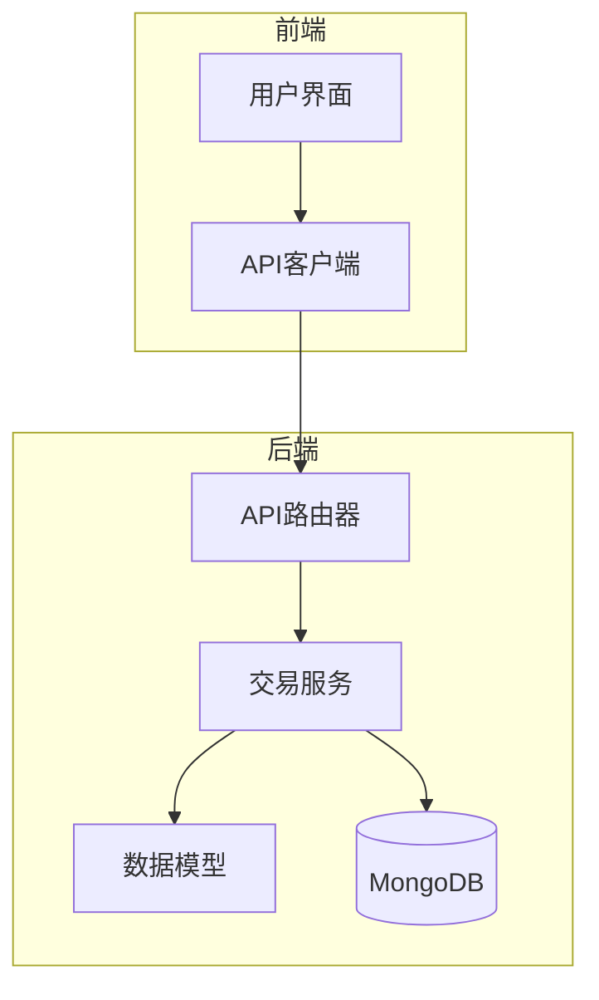
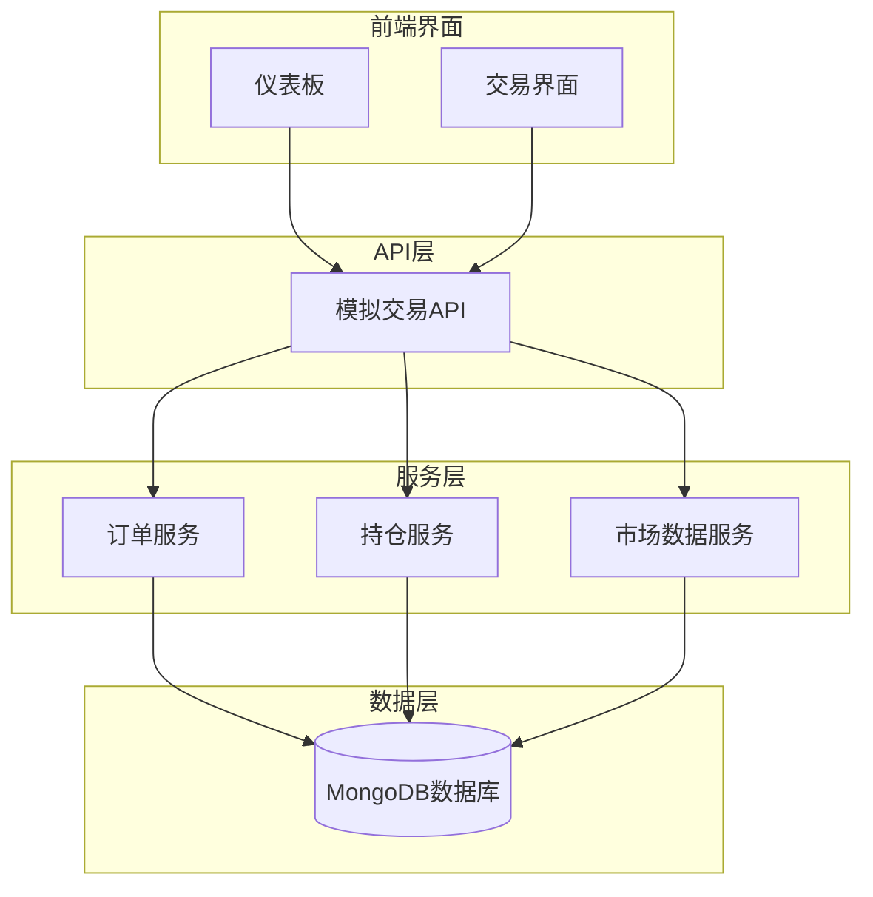
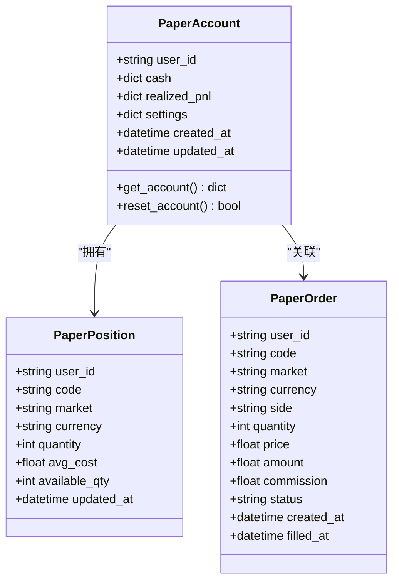
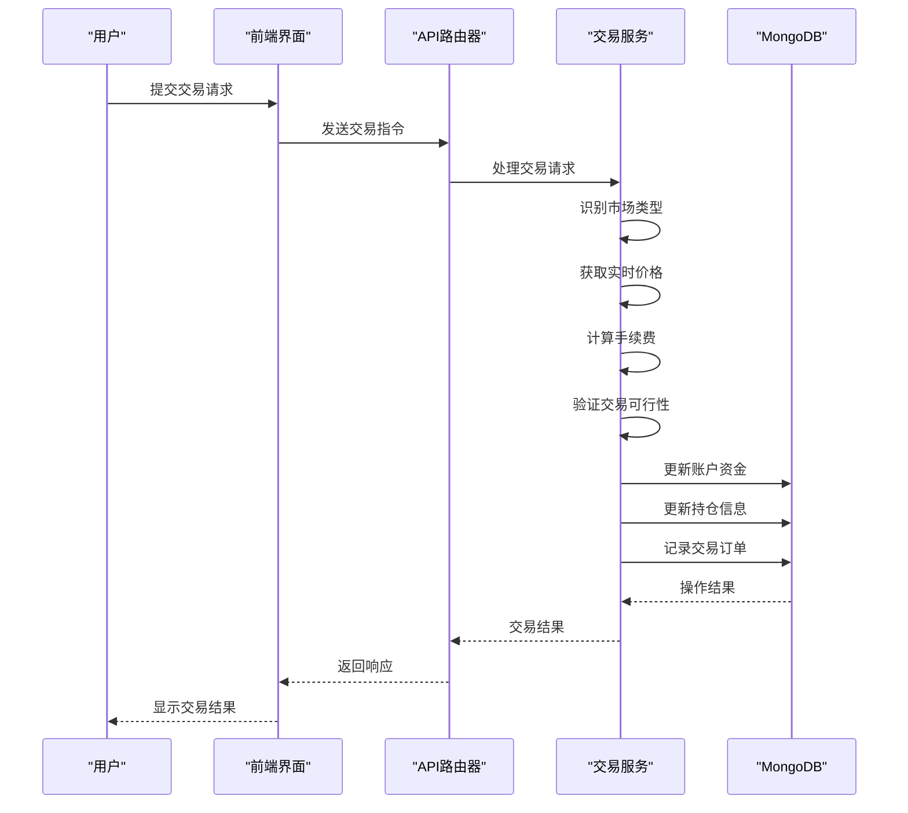
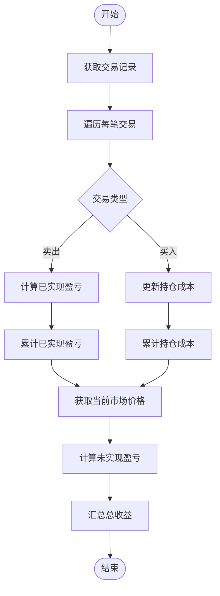
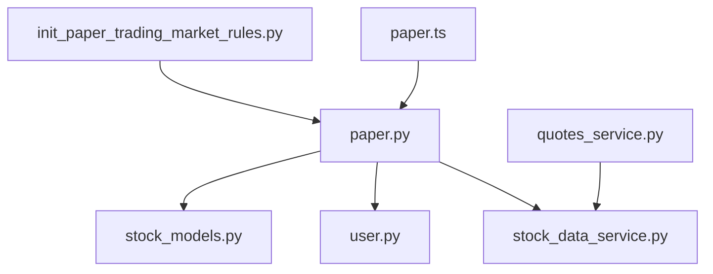

# 模拟交易

<cite>
**本文档引用的文件**   
- [paper.py](file://app/routers/paper.py)
- [stock_models.py](file://app/models/stock_models.py)
- [stock_data_service.py](file://app/services/stock_data_service.py)
- [init_paper_trading_market_rules.py](file://scripts/init_paper_trading_market_rules.py)
- [user.py](file://app/models/user.py)
- [paper.ts](file://frontend/src/api/paper.ts)
- [paper_trading_multi_market_design.md](file://docs/design/paper_trading_multi_market_design.md)
- [quotes_service.py](file://app/services/quotes_service.py)
</cite>

## 目录
1. [引言](#引言)
2. [项目结构](#项目结构)
3. [核心组件](#核心组件)
4. [架构概述](#架构概述)
5. [详细组件分析](#详细组件分析)
6. [依赖分析](#依赖分析)
7. [性能考虑](#性能考虑)
8. [故障排除指南](#故障排除指南)
9. [结论](#结论)

## 引言
本文档详细介绍了模拟交易系统的功能和使用场景。系统支持多市场（A股、港股、美股）的模拟交易，提供完整的交易流程管理，包括账户创建、资金管理、交易执行、持仓跟踪和收益计算。系统通过与真实市场数据同步，为用户提供逼真的交易体验，同时支持交易策略的测试和绩效评估。

## 项目结构
模拟交易系统采用分层架构设计，主要包含路由层、服务层、模型层和数据访问层。系统通过API接口与前端交互，使用MongoDB存储账户、持仓、订单和交易记录。市场规则配置独立管理，支持不同市场的交易规则差异。

**图表来源**
- [paper.py](file://app/routers/paper.py#L1-L585)
- [paper.ts](file://frontend/src/api/paper.ts#L1-L67)

**章节来源**
- [paper.py](file://app/routers/paper.py#L1-L585)
- [paper.ts](file://frontend/src/api/paper.ts#L1-L67)

## 核心组件
模拟交易系统的核心组件包括账户管理、交易执行、价格撮合和收益计算。系统支持多货币账户，初始资金根据不同市场进行配置。交易执行采用市价单即时成交机制，价格基于实时市场数据。收益计算包括已实现盈亏和未实现盈亏，支持多维度的绩效评估。

**章节来源**
- [paper.py](file://app/routers/paper.py#L1-L585)
- [init_paper_trading_market_rules.py](file://scripts/init_paper_trading_market_rules.py#L1-L261)

## 架构概述
系统采用微服务架构，各组件职责明确，通过API进行通信。交易服务负责订单处理和持仓管理，市场数据服务提供实时价格信息，账户服务管理用户资金。系统通过异步处理提高性能，确保交易操作的及时响应。

**图表来源**
- [paper.py](file://app/routers/paper.py#L1-L585)
- [paper_trading_multi_market_design.md](file://docs/design/paper_trading_multi_market_design.md#L336-L361)

## 详细组件分析

### 账户管理分析
账户管理组件负责用户模拟账户的创建和管理。系统为新用户自动创建账户，分配初始资金。账户支持多货币，根据不同市场配置初始资金。用户可以查看账户余额、持仓市值和总资产。

**图表来源**
- [paper.py](file://app/routers/paper.py#L65-L115)
- [init_paper_trading_market_rules.py](file://scripts/init_paper_trading_market_rules.py#L20-L129)

**章节来源**
- [paper.py](file://app/routers/paper.py#L270-L341)
- [init_paper_trading_market_rules.py](file://scripts/init_paper_trading_market_rules.py#L20-L129)

### 交易执行分析
交易执行组件处理用户的买入和卖出请求。系统根据股票代码自动识别市场类型，获取实时价格，计算手续费，并验证交易可行性。交易采用市价单即时成交机制，确保用户体验的流畅性。

**图表来源**
- [paper.py](file://app/routers/paper.py#L344-L530)
- [paper.ts](file://frontend/src/api/paper.ts#L50-L56)

**章节来源**
- [paper.py](file://app/routers/paper.py#L344-L530)
- [paper.ts](file://frontend/src/api/paper.ts#L50-L56)

### 收益计算分析
收益计算组件负责计算用户的已实现盈亏和未实现盈亏。系统根据交易记录计算卖出股票的已实现盈亏，根据当前市场价格计算持仓股票的未实现盈亏。收益计算支持多货币，确保不同市场交易的收益准确反映。

**图表来源**
- [paper.py](file://app/routers/paper.py#L274-L339)
- [paper.py](file://app/routers/paper.py#L494-L528)

**章节来源**
- [paper.py](file://app/routers/paper.py#L274-L339)
- [paper.py](file://app/routers/paper.py#L494-L528)

## 依赖分析
系统各组件之间存在明确的依赖关系。API路由器依赖于交易服务，交易服务依赖于数据库访问和市场数据服务。前端界面通过API与后端交互，不直接访问数据库。这种分层依赖结构确保了系统的可维护性和可扩展性。

**图表来源**
- [paper.py](file://app/routers/paper.py#L8-L11)
- [paper.ts](file://frontend/src/api/paper.ts#L1-L2)
- [quotes_service.py](file://app/services/quotes_service.py#L10-L11)

**章节来源**
- [paper.py](file://app/routers/paper.py#L8-L11)
- [paper.ts](file://frontend/src/api/paper.ts#L1-L2)
- [quotes_service.py](file://app/services/quotes_service.py#L10-L11)

## 性能考虑
系统在设计时充分考虑了性能因素。通过缓存机制减少数据库访问，使用异步处理提高响应速度。批量操作优化了大量数据处理的效率，索引优化确保了查询性能。系统还实现了限流机制，防止过度请求影响稳定性。

## 故障排除指南
当系统出现问题时，首先检查API响应状态码和错误信息。对于交易失败，检查资金是否充足、持仓是否足够、市场是否开放。对于数据同步问题，检查数据源配置和网络连接。系统日志提供了详细的执行信息，有助于定位问题根源。

**章节来源**
- [paper.py](file://app/routers/paper.py#L373-L407)
- [paper.py](file://app/routers/paper.py#L453-L459)

## 结论
模拟交易系统提供了一个功能完整、性能优越的交易平台，支持多市场、多货币的模拟交易。系统架构清晰，组件职责明确，易于维护和扩展。通过与真实市场数据同步，系统为用户提供了逼真的交易体验，是测试交易策略和提升投资技能的理想工具。