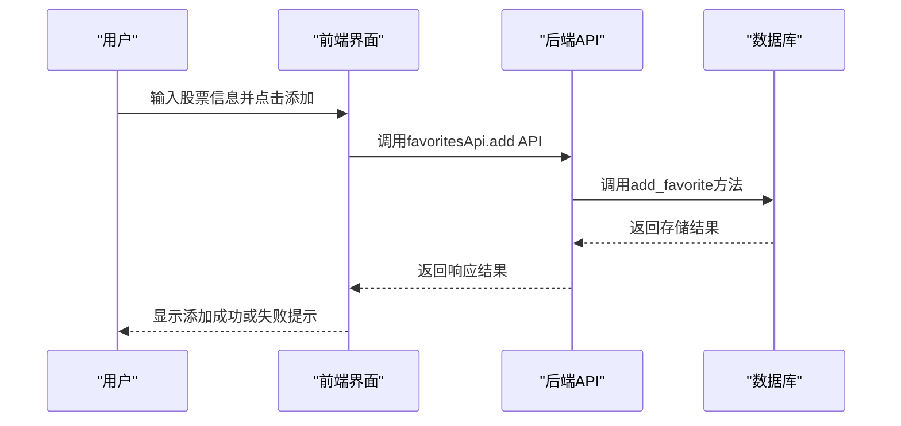
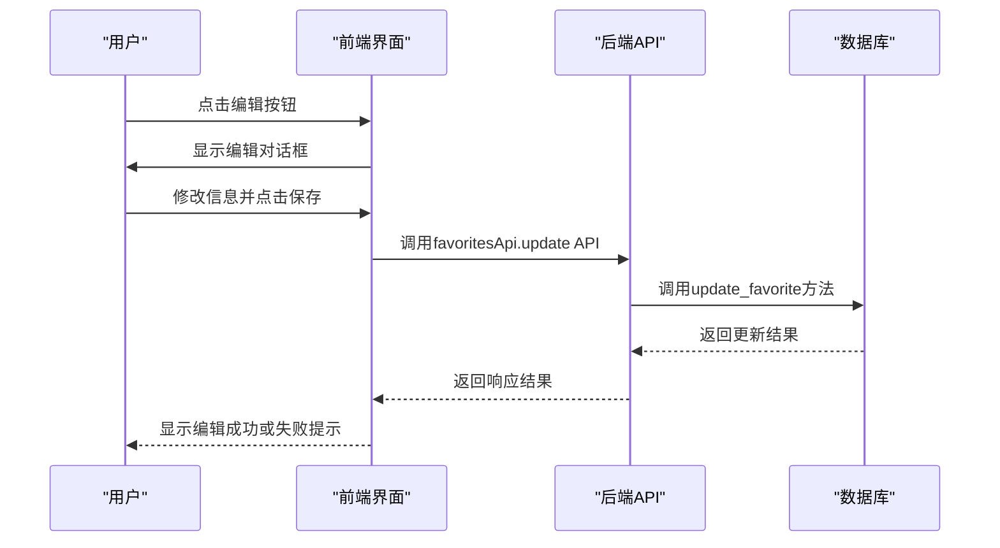
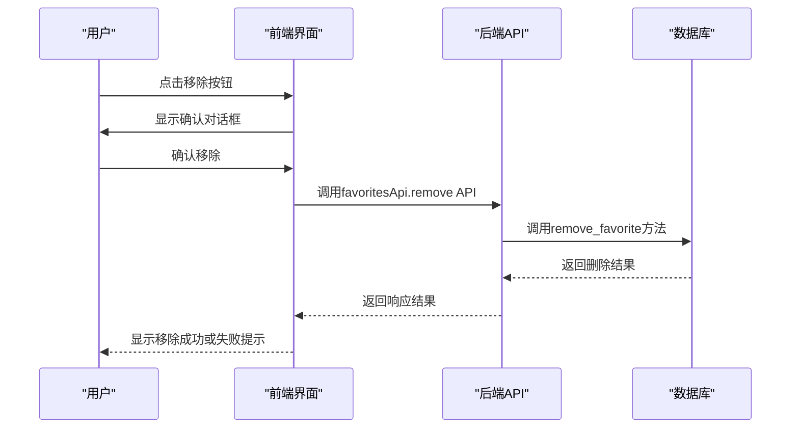
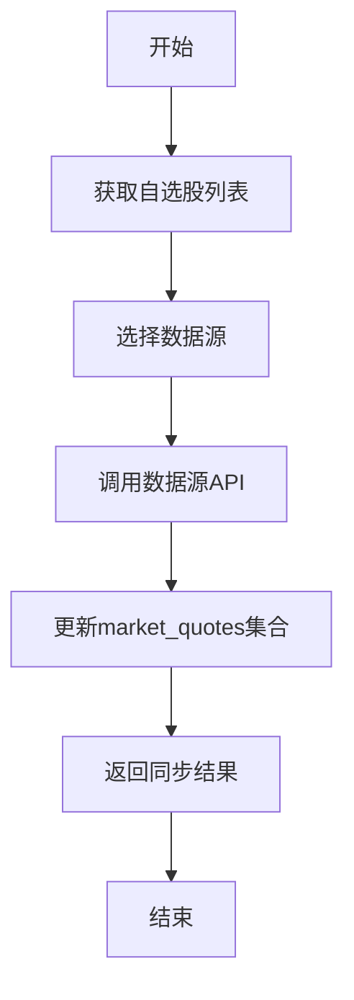
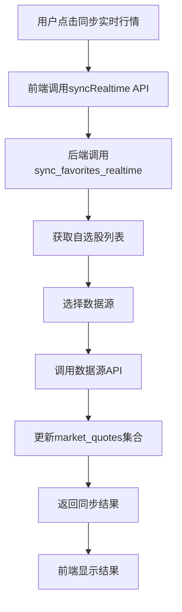
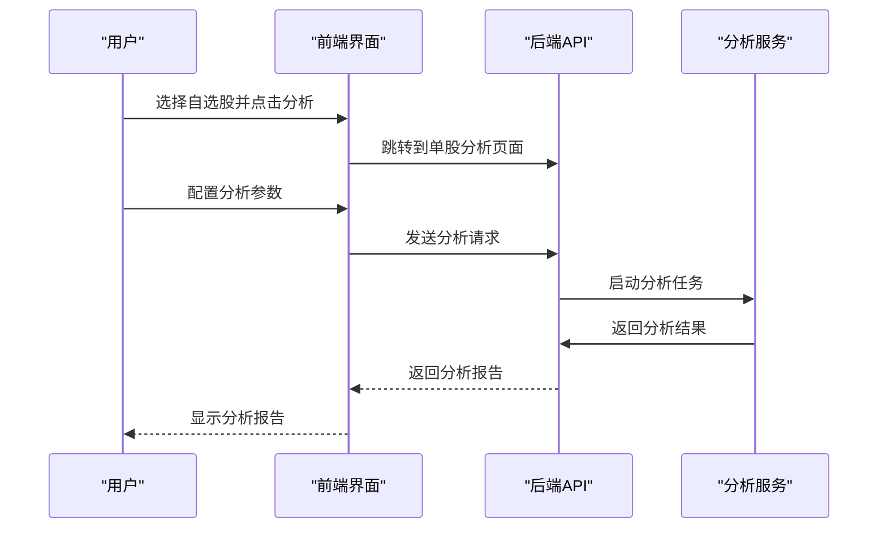
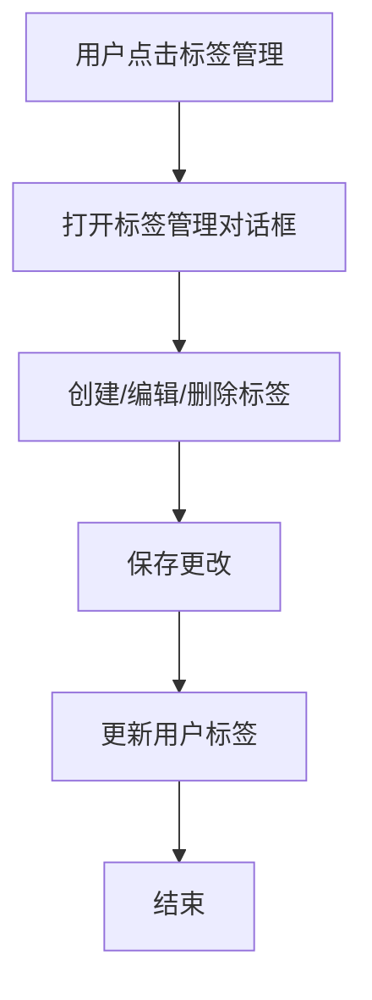

# 自选股管理

<cite>
**本文档引用文件**   
- [favorites.py](file://app/routers/favorites.py)
- [favorites_service.py](file://app/services/favorites_service.py)
- [index.vue](file://frontend/src/views/Favorites/index.vue)
- [favorites.ts](file://frontend/src/api/favorites.ts)
- [user.py](file://app/models/user.py)
- [stock_models.py](file://app/models/stock_models.py)
</cite>

## 目录
1. [引言](#引言)
2. [自选股功能概述](#自选股功能概述)
3. [自选股操作管理](#自选股操作管理)
4. [自选股数据存储结构](#自选股数据存储结构)
5. [前端界面布局设计](#前端界面布局设计)
6. [自选股与分析功能集成](#自选股与分析功能集成)
7. [自选股分组管理](#自选股分组管理)
8. [最佳实践案例](#最佳实践案例)
9. [结论](#结论)

## 引言

自选股管理是投资分析系统中的核心功能之一，为投资者提供了一个个性化的股票监控和分析平台。通过自选股功能，用户可以将关注的股票添加到个人列表中，进行集中管理和深度分析。该功能不仅提升了投资决策的效率，还通过实时数据同步和智能分析，帮助用户及时把握市场动态。自选股管理功能涵盖了从创建、编辑、删除到数据分析的完整生命周期，支持多市场（A股、港股、美股）和多维度（技术面、基本面、情绪面）的综合分析。

**自选股管理的重要性体现在以下几个方面：**
- **个性化监控**：用户可以根据自己的投资策略和兴趣，选择并跟踪特定股票。
- **高效分析**：一键式批量分析功能，快速获取多只股票的综合评估报告。
- **数据整合**：整合来自不同数据源（如Tushare、AkShare）的实时行情、历史数据和财务信息。
- **智能提醒**：支持价格提醒和标签管理，帮助用户及时响应市场变化。

## 自选股功能概述

自选股管理功能为用户提供了一套完整的股票管理解决方案，包括添加、编辑、删除自选股，以及查看实时行情、涨跌幅排行等。用户可以通过分析股票后点击"添加到自选"，或在"自选股"页面手动添加股票。自选股功能还支持批量分析、价格提醒和分组管理，帮助用户更好地组织和分析投资组合。

### 核心功能
- **添加自选股**：支持手动添加和从分析结果中添加。
- **实时行情同步**：定期同步自选股的实时行情数据。
- **批量分析**：一键分析多只自选股，生成综合报告。
- **标签管理**：为自选股添加标签，便于分类和筛选。
- **分组管理**：创建不同的分组，如核心持仓、观察名单、行业板块等。

## 自选股操作管理

自选股的操作管理包括创建、编辑和删除三个主要功能。这些操作通过前端界面和后端API协同完成，确保数据的一致性和用户体验的流畅性。

### 创建自选股

用户可以通过两种方式创建自选股：
1. **从分析结果中添加**：在股票分析页面，点击"添加到自选"按钮。
2. **手动添加**：在"自选股"页面，点击"添加自选股"按钮，输入股票代码、名称、市场类型等信息。

**创建流程：**
1. 用户在前端界面输入股票信息。
2. 前端调用`favoritesApi.add` API，发送添加请求。
3. 后端`favorites_service.add_favorite`方法处理请求，将股票信息存储到数据库。
4. 返回成功或失败的响应，前端根据响应结果更新界面。



**Diagram sources**
- [favorites.ts](file://frontend/src/api/favorites.ts#L41-L42)
- [favorites_service.py](file://app/services/favorites_service.py#L154-L235)
- [favorites.py](file://app/routers/favorites.py#L40-L59)

### 编辑自选股

编辑自选股功能允许用户修改已添加股票的标签、备注和价格提醒等信息。

**编辑流程：**
1. 用户在自选股列表中点击"编辑"按钮。
2. 前端弹出编辑对话框，显示当前股票信息。
3. 用户修改信息后，点击"保存"按钮。
4. 前端调用`favoritesApi.update` API，发送更新请求。
5. 后端`favorites_service.update_favorite`方法处理请求，更新数据库中的记录。
6. 返回成功或失败的响应，前端根据响应结果更新界面。



**Diagram sources**
- [favorites.ts](file://frontend/src/api/favorites.ts#L48-L49)
- [favorites_service.py](file://app/services/favorites_service.py#L263-L313)
- [favorites.py](file://app/routers/favorites.py#L71-L108)

### 删除自选股

删除自选股功能允许用户从列表中移除不再关注的股票。

**删除流程：**
1. 用户在自选股列表中点击"移除"按钮。
2. 前端弹出确认对话框，提示用户确认操作。
3. 用户确认后，前端调用`favoritesApi.remove` API，发送删除请求。
4. 后端`favorites_service.remove_favorite`方法处理请求，从数据库中删除记录。
5. 返回成功或失败的响应，前端根据响应结果更新界面。



**Diagram sources**
- [favorites.ts](file://frontend/src/api/favorites.ts#L55-L56)
- [favorites_service.py](file://app/services/favorites_service.py#L236-L262)
- [favorites.py](file://app/routers/favorites.py#L150-L184)

## 自选股数据存储结构

自选股数据的存储结构设计旨在支持高效的数据访问和灵活的扩展性。数据存储主要涉及两个核心模型：`FavoriteStock` 和 `User`，以及相关的数据库集合。

### 数据模型

#### FavoriteStock 模型
`FavoriteStock` 模型定义了自选股的基本信息，包括股票代码、名称、市场类型、添加时间、标签、备注和价格提醒等。

```python
class FavoriteStock(BaseModel):
    """自选股信息"""
    stock_code: str = Field(..., description="股票代码")
    stock_name: str = Field(..., description="股票名称")
    market: str = Field(..., description="市场类型")
    added_at: datetime = Field(default_factory=now_tz, description="添加时间")
    tags: List[str] = Field(default_factory=list, description="用户标签")
    notes: str = Field(default="", description="用户备注")
    alert_price_high: Optional[float] = Field(None, description="价格上限提醒")
    alert_price_low: Optional[float] = Field(None, description="价格下限提醒")
```

#### User 模型
`User` 模型包含了用户的自选股列表，通过 `favorite_stocks` 字段存储。

```python
class User(BaseModel):
    """用户模型"""
    id: Optional[PyObjectId] = Field(default_factory=PyObjectId, alias="_id")
    username: str = Field(..., min_length=3, max_length=50)
    email: str = Field(..., pattern=r'^[^@]+@[^@]+\.[^@]+$')
    hashed_password: str
    is_active: bool = True
    is_verified: bool = False
    is_admin: bool = False
    created_at: datetime = Field(default_factory=now_tz)
    updated_at: datetime = Field(default_factory=now_tz)
    last_login: Optional[datetime] = None
    preferences: UserPreferences = Field(default_factory=UserPreferences)
    favorite_stocks: List[FavoriteStock] = Field(default_factory=list, description="用户自选股列表")
```

### 数据库集合

#### user_favorites 集合
`user_favorites` 集合用于存储用户的自选股信息，结构如下：

```json
{
  "user_id": "用户ID",
  "favorites": [
    {
      "stock_code": "股票代码",
      "stock_name": "股票名称",
      "market": "市场类型",
      "added_at": "添加时间",
      "tags": ["标签1", "标签2"],
      "notes": "备注信息",
      "alert_price_high": 100.0,
      "alert_price_low": 80.0
    }
  ],
  "created_at": "创建时间",
  "updated_at": "更新时间"
}
```

#### market_quotes 集合
`market_quotes` 集合用于存储实时行情数据，支持自选股的实时价格和涨跌幅显示。

```json
{
  "code": "股票代码",
  "close": "收盘价",
  "pct_chg": "涨跌幅%",
  "amount": "成交额",
  "open": "开盘价",
  "high": "最高价",
  "low": "最低价",
  "pre_close": "前收盘价",
  "trade_date": "交易日期",
  "updated_at": "更新时间"
}
```

### 同步机制

自选股的实时行情数据通过定时任务从外部数据源（如Tushare、AkShare）同步到 `market_quotes` 集合。同步机制包括以下步骤：

1. **获取自选股列表**：从 `user_favorites` 集合中获取用户的自选股代码列表。
2. **调用数据源API**：根据配置的数据源（Tushare或AkShare），调用相应的API获取实时行情数据。
3. **更新数据库**：将获取到的行情数据更新到 `market_quotes` 集合。
4. **返回同步结果**：返回同步成功的股票数量和失败的股票列表。



**Diagram sources**
- [favorites_service.py](file://app/services/favorites_service.py#L57-L152)
- [favorites.py](file://app/routers/favorites.py#L223-L302)

## 前端界面布局设计

自选股的前端界面设计注重用户体验和功能性，提供了清晰的布局和便捷的操作。

### 界面布局

#### 操作栏
操作栏位于页面顶部，包含搜索框、市场筛选、板块筛选、交易所筛选、标签筛选和操作按钮。

- **搜索框**：支持按股票代码或名称搜索。
- **市场筛选**：支持A股、港股、美股的筛选。
- **板块筛选**：支持主板、创业板、科创板、北交所的筛选。
- **交易所筛选**：支持上海证券交易所、深圳证券交易所、北京证券交易所的筛选。
- **标签筛选**：支持按用户标签筛选。
- **操作按钮**：包括刷新、同步实时行情、批量同步数据、标签管理和添加自选股。

#### 自选股列表
自选股列表以表格形式展示，包含以下列：
- **股票代码**：可点击跳转到股票详情页。
- **股票名称**：显示股票名称。
- **市场**：显示市场类型。
- **板块**：显示所属板块。
- **交易所**：显示交易所名称。
- **当前价格**：显示实时价格。
- **涨跌幅**：显示涨跌幅，正数为红色，负数为绿色。
- **标签**：显示用户标签，不同标签用不同颜色区分。
- **添加时间**：显示添加时间。
- **操作**：包括编辑、同步、分析和移除按钮。

### 交互设计

#### 添加自选股对话框
添加自选股对话框包含以下字段：
- **市场类型**：选择A股、港股或美股。
- **股票代码**：输入股票代码，支持自动获取股票名称。
- **股票名称**：显示或手动输入股票名称。

#### 编辑自选股对话框
编辑自选股对话框包含以下字段：
- **股票信息**：显示股票代码、名称和市场类型。
- **标签**：支持多选和创建新标签。
- **备注**：输入备注信息。

#### 同步实时行情
同步实时行情功能允许用户手动触发实时行情的同步。点击"同步实时行情"按钮后，系统会调用后端API，从配置的数据源获取最新的行情数据，并更新到数据库。



**Diagram sources**
- [index.vue](file://frontend/src/views/Favorites/index.vue#L65-L101)
- [favorites.ts](file://frontend/src/api/favorites.ts#L72-L81)
- [favorites.py](file://app/routers/favorites.py#L223-L302)

## 自选股与分析功能集成

自选股与分析功能的集成是系统的核心价值之一，通过一键分析自选股组合，用户可以快速获取多维度的投资建议。

### 一键分析流程

1. **选择自选股**：用户在自选股列表中选择需要分析的股票。
2. **触发分析**：点击"分析"按钮，系统跳转到单股分析页面。
3. **配置分析参数**：用户可以选择分析师组合、研究深度和分析选项。
4. **开始分析**：点击"开始分析"按钮，系统启动分析任务。
5. **查看报告**：分析完成后，用户可以查看详细的分析报告。



**Diagram sources**
- [index.vue](file://frontend/src/views/Favorites/index.vue#L986-L991)
- [SingleAnalysis.vue](file://frontend/src/views/Analysis/SingleAnalysis.vue#L1-L29)
- [analysis.py](file://app/routers/analysis.py)

### 分析师团队

系统集成了多个专业分析师团队，提供多维度的分析视角：

- **市场分析师**：技术指标分析（K线、均线、MACD等）、价格趋势预测、支撑阻力位分析。
- **社交媒体分析师**：投资者情绪监测、社交媒体热度分析、市场情绪指标。
- **新闻分析师**：重大新闻事件影响、政策解读分析、行业动态跟踪。
- **基本面分析师**：财务报表分析、估值模型计算、行业对比分析、盈利能力评估。

## 自选股分组管理

自选股分组管理功能允许用户将自选股按不同的维度进行分类，如行业、概念、投资策略等，便于管理和分析。

### 分组类型

- **行业分组**：按行业分类，如银行、证券、保险、房地产、医药生物等。
- **概念分组**：按概念分类，如新能源、人工智能、5G等。
- **投资策略分组**：按投资策略分类，如价值投资、成长投资、趋势投资等。
- **自定义分组**：用户可以根据自己的需求创建自定义分组。

### 分组管理操作

#### 创建分组
1. 用户点击"标签管理"按钮。
2. 在标签管理对话框中，输入新的标签名称。
3. 选择标签颜色，点击"添加"按钮。

#### 编辑分组
1. 用户在标签管理对话框中选择需要编辑的标签。
2. 修改标签名称或颜色，点击"保存"按钮。

#### 删除分组
1. 用户在标签管理对话框中选择需要删除的标签。
2. 点击"删除"按钮，确认删除操作。



**Diagram sources**
- [index.vue](file://frontend/src/views/Favorites/index.vue#L91-L93)
- [favorites_service.py](file://app/services/favorites_service.py#L364-L387)
- [favorites.py](file://app/routers/favorites.py#L203-L215)

## 最佳实践案例

### 案例一：行业板块分析

**背景**：投资者关注新能源行业，希望对行业内主要公司进行综合分析。

**步骤**：
1. 创建"新能源"标签，并为相关股票添加该标签。
2. 在自选股列表中筛选"新能源"标签的股票。
3. 选择所有筛选出的股票，点击"批量分析"按钮。
4. 配置分析参数，选择"市场分析师"和"基本面分析师"。
5. 开始分析，获取每只股票的技术面和基本面评估。
6. 根据分析报告，筛选出最具投资价值的股票。

### 案例二：核心持仓监控

**背景**：投资者持有核心股票组合，需要定期监控其表现。

**步骤**：
1. 创建"核心持仓"标签，并为持仓股票添加该标签。
2. 设置价格提醒，当股价达到预设的高点或低点时，系统发送通知。
3. 定期点击"同步实时行情"按钮，确保数据的实时性。
4. 每月进行一次全面分析，评估持仓股票的最新状况。
5. 根据分析结果，调整投资策略。

## 结论

自选股管理功能是投资分析系统的重要组成部分，为用户提供了一个高效、灵活的股票管理平台。通过创建、编辑、删除自选股，用户可以个性化地跟踪关注的股票。自选股数据的存储结构设计合理，支持实时行情同步和多维度分析。前端界面布局清晰，操作便捷，提升了用户体验。自选股与分析功能的集成，使得用户可以一键获取多只股票的综合评估报告，辅助投资决策。分组管理功能进一步增强了自选股的组织和管理能力。通过最佳实践案例，展示了自选股管理在实际投资中的应用价值。