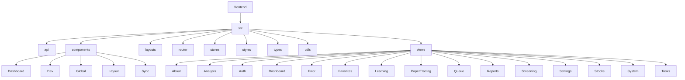
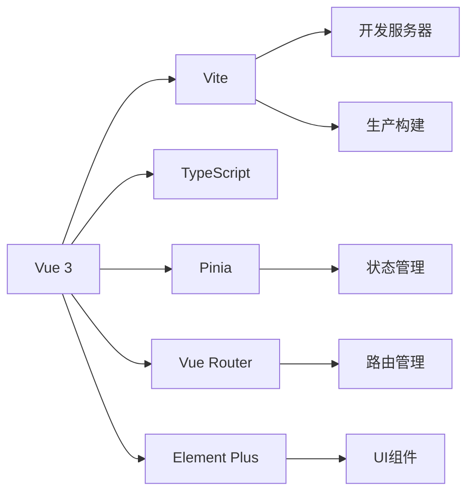
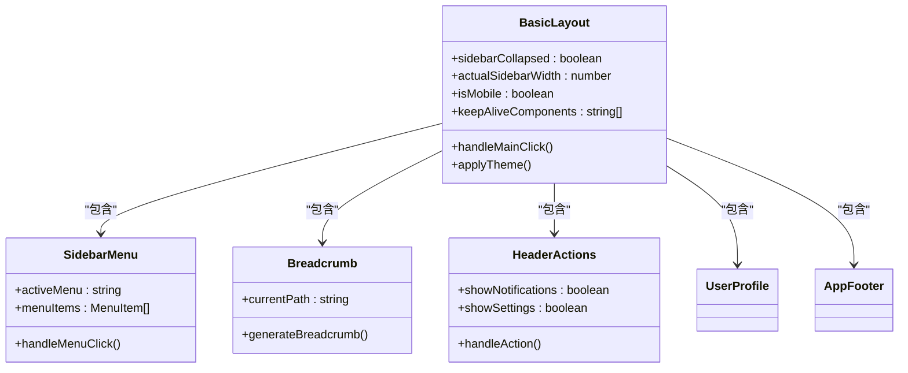
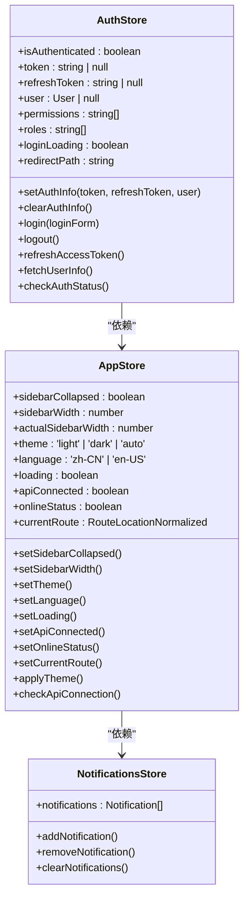
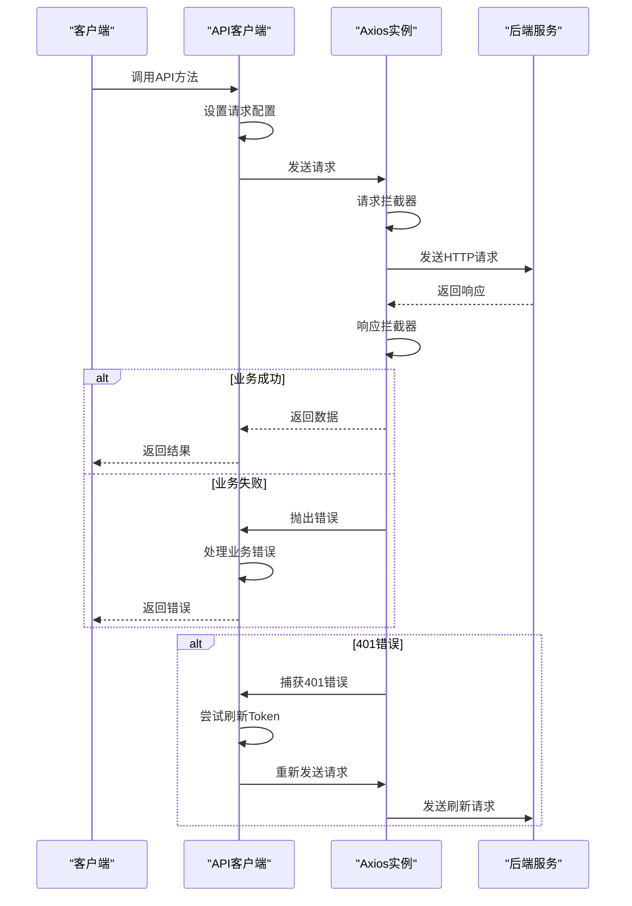
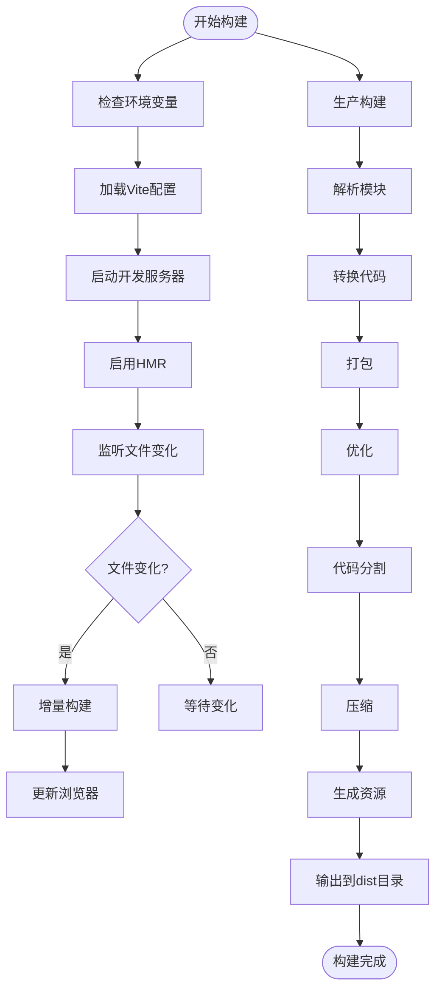
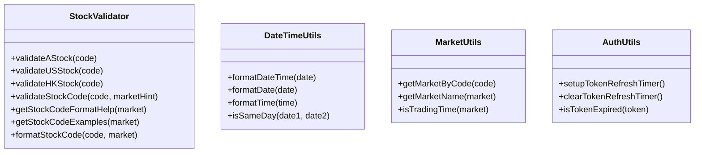

# 前端架构

<cite>
**本文档引用文件**   
- [package.json](file://frontend/package.json)
- [vite.config.ts](file://frontend/vite.config.ts)
- [main.ts](file://frontend/src/main.ts)
- [index.ts](file://frontend/src/router/index.ts)
- [BasicLayout.vue](file://frontend/src/layouts/BasicLayout.vue)
- [auth.ts](file://frontend/src/stores/auth.ts)
- [request.ts](file://frontend/src/api/request.ts)
- [SidebarMenu.vue](file://frontend/src/components/Layout/SidebarMenu.vue)
- [tsconfig.json](file://frontend/tsconfig.json)
- [variables.scss](file://frontend/src/styles/variables.scss)
- [index.vue](file://frontend/src/views/Dashboard/index.vue)
- [stockValidator.ts](file://frontend/src/utils/stockValidator.ts)
</cite>

## 目录
1. [项目结构](#项目结构)
2. [核心架构](#核心架构)
3. [组件化架构设计](#组件化架构设计)
4. [状态管理实现](#状态管理实现)
5. [API客户端封装](#api客户端封装)
6. [响应式设计与跨浏览器兼容性](#响应式设计与跨浏览器兼容性)
7. [构建流程与性能优化](#构建流程与性能优化)
8. [TypeScript与类型安全](#typescript与类型安全)
9. [Element Plus定制化方案](#element-plus定制化方案)

## 项目结构

前端项目位于`frontend`目录下，采用Vue 3 + Vite的现代前端技术栈。项目结构清晰，遵循模块化设计原则，主要目录包括：

- `src/api`：API接口定义和客户端封装
- `src/components`：可复用的UI组件和功能组件
- `src/layouts`：页面布局组件
- `src/router`：路由配置
- `src/stores`：Pinia状态管理
- `src/styles`：全局样式和SCSS变量
- `src/types`：TypeScript类型定义
- `src/utils`：工具函数
- `src/views`：页面视图组件



**Diagram sources**
- [package.json](file://frontend/package.json)

**Section sources**
- [package.json](file://frontend/package.json)

## 核心架构

系统基于Vue 3的组合式API和Vite构建，采用模块化架构设计。核心架构包括：

- **Vue 3**：使用Composition API和响应式系统
- **Vite**：作为构建工具，提供快速的开发服务器和高效的生产构建
- **TypeScript**：提供完整的类型安全
- **Pinia**：状态管理
- **Vue Router**：路由管理
- **Element Plus**：UI组件库



**Diagram sources**
- [package.json](file://frontend/package.json)
- [vite.config.ts](file://frontend/vite.config.ts)
- [main.ts](file://frontend/src/main.ts)

**Section sources**
- [package.json](file://frontend/package.json)
- [vite.config.ts](file://frontend/vite.config.ts)
- [main.ts](file://frontend/src/main.ts)

## 组件化架构设计

### 布局组件

布局组件位于`src/components/Layout`目录，包括：

- `AppFooter.vue`：页脚组件
- `Breadcrumb.vue`：面包屑导航
- `HeaderActions.vue`：头部操作区
- `SidebarMenu.vue`：侧边栏菜单
- `UserProfile.vue`：用户信息

`BasicLayout.vue`作为基础布局组件，包含侧边栏、头部导航和主内容区，实现了响应式设计。



**Diagram sources**
- [BasicLayout.vue](file://frontend/src/layouts/BasicLayout.vue)
- [SidebarMenu.vue](file://frontend/src/components/Layout/SidebarMenu.vue)

**Section sources**
- [BasicLayout.vue](file://frontend/src/layouts/BasicLayout.vue)
- [SidebarMenu.vue](file://frontend/src/components/Layout/SidebarMenu.vue)

### 功能组件

功能组件按业务领域组织，包括：

- `Dashboard`：仪表板相关组件
- `Dev`：开发调试组件
- `Global`：全局通用组件
- `Sync`：数据同步相关组件

这些组件封装了特定业务功能，通过props和emit实现组件间通信。

### UI组件

UI组件基于Element Plus进行二次封装和定制，包括：

- 表单组件
- 表格组件
- 对话框组件
- 通知组件
- 加载状态组件

通过SCSS变量和主题配置，实现了统一的视觉风格。

## 状态管理实现

### Pinia Store设计

状态管理使用Pinia实现，主要store包括：

- `app.ts`：应用全局状态
- `auth.ts`：认证状态
- `notifications.ts`：通知状态



**Diagram sources**
- [auth.ts](file://frontend/src/stores/auth.ts)
- [app.ts](file://frontend/src/stores/app.ts)

**Section sources**
- [auth.ts](file://frontend/src/stores/auth.ts)
- [app.ts](file://frontend/src/stores/app.ts)

### 认证状态管理

`auth.ts`实现了完整的认证状态管理，包括：

- Token存储和验证
- 用户信息管理
- 权限检查
- 自动刷新Token
- 全局错误处理

状态持久化通过localStorage实现，确保页面刷新后状态不丢失。

## API客户端封装

### 请求封装模式

API客户端封装在`src/api/request.ts`中，采用axios作为HTTP客户端，实现了：

- 请求拦截器：添加认证头、请求ID、语言头
- 响应拦截器：统一错误处理、业务状态码检查
- 自动Token刷新
- 请求重试机制
- 错误消息去重



**Diagram sources**
- [request.ts](file://frontend/src/api/request.ts)

**Section sources**
- [request.ts](file://frontend/src/api/request.ts)

### API模块组织

API模块按业务领域组织在`src/api`目录下，包括：

- `analysis.ts`：分析相关API
- `auth.ts`：认证相关API
- `cache.ts`：缓存相关API
- `config.ts`：配置相关API
- `favorites.ts`：自选股相关API
- `logs.ts`：日志相关API
- `modelCapabilities.ts`：模型能力相关API
- `multiMarket.ts`：多市场相关API
- `news.ts`：新闻相关API
- `notifications.ts`：通知相关API
- `operationLogs.ts`：操作日志相关API
- `paper.ts`：模拟交易相关API
- `scheduler.ts`：调度相关API
- `screening.ts`：筛选相关API
- `stockSync.ts`：股票同步相关API
- `stocks.ts`：股票相关API
- `sync.ts`：同步相关API
- `tags.ts`：标签相关API
- `templates.ts`：模板相关API
- `usage.ts`：使用统计相关API

每个API模块导出一个对象，包含该领域所有API方法。

## 响应式设计与跨浏览器兼容性

### 响应式设计实现

响应式设计通过以下方式实现：

- **CSS媒体查询**：在SCSS中定义断点变量
- **Flexbox布局**：使用flex布局实现自适应
- **Grid布局**：在复杂布局中使用CSS Grid
- **移动端适配**：针对移动设备优化交互

```scss
// 断点变量
$breakpoint-xs: 480px;
$breakpoint-sm: 768px;
$breakpoint-md: 992px;
$breakpoint-lg: 1200px;
$breakpoint-xl: 1920px;

// 移动端适配
@media (max-width: 768px) {
  .sidebar {
    transform: translateX(-100%);
    
    &:not(.collapsed) {
      transform: translateX(0);
    }
  }
  
  .main-container {
    margin-left: 0 !important;
  }
}
```

### 跨浏览器兼容性策略

跨浏览器兼容性通过以下方式保证：

- **Vite构建配置**：设置`build.target: 'es2020'`
- **Polyfill**：按需引入polyfill
- **CSS前缀**：使用PostCSS自动添加浏览器前缀
- **特性检测**：在关键功能处进行特性检测

## 构建流程与性能优化

### 构建流程

构建流程由Vite驱动，配置在`vite.config.ts`中：

- **开发服务器**：支持HMR（热模块替换）
- **生产构建**：代码分割、压缩、资源优化
- **代理配置**：开发环境API代理
- **别名配置**：路径别名简化导入



**Diagram sources**
- [vite.config.ts](file://frontend/vite.config.ts)

**Section sources**
- [vite.config.ts](file://frontend/vite.config.ts)

### 代码分割策略

代码分割策略包括：

- **路由级分割**：每个路由组件异步加载
- **组件级分割**：大组件异步加载
- **库级分割**：第三方库单独打包

### 性能优化措施

性能优化措施包括：

- **懒加载**：路由和组件懒加载
- **缓存策略**：合理使用keep-alive
- **图片优化**：按需加载图片
- **减少重绘**：优化CSS和DOM操作
- **资源压缩**：代码压缩和Gzip

## TypeScript与类型安全

### 类型定义

TypeScript类型定义在`src/types`目录下，包括：

- `analysis.ts`：分析相关类型
- `auth.ts`：认证相关类型
- `config.ts`：配置相关类型
- `router.d.ts`：路由相关类型

### 类型安全实践

类型安全实践包括：

- **严格模式**：在`tsconfig.json`中启用严格类型检查
- **接口定义**：为所有数据结构定义接口
- **泛型使用**：在API客户端中使用泛型
- **类型守卫**：使用类型守卫确保类型安全

```json
{
  "compilerOptions": {
    "strict": true,
    "noUnusedLocals": true,
    "noUnusedParameters": true,
    "noImplicitReturns": true,
    "skipLibCheck": true
  }
}
```

**Section sources**
- [tsconfig.json](file://frontend/tsconfig.json)

## Element Plus定制化方案

### 主题定制

主题定制通过SCSS变量实现：

```scss
// 颜色变量
$primary-color: #409EFF;
$success-color: #67C23A;
$warning-color: #E6A23C;
$danger-color: #F56C6C;
$info-color: #909399;

// 间距变量
$spacing-xs: 4px;
$spacing-sm: 8px;
$spacing-md: 16px;
$spacing-lg: 24px;
$spacing-xl: 32px;

// 字体大小
$font-size-xs: 12px;
$font-size-sm: 14px;
$font-size-md: 16px;
$font-size-lg: 18px;
$font-size-xl: 20px;
```

### 组件定制

组件定制包括：

- **全局配置**：在`main.ts`中配置Element Plus
- **样式覆盖**：通过CSS类名覆盖默认样式
- **主题切换**：支持亮色、暗色和自动主题

```typescript
// main.ts中Element Plus配置
app.use(ElementPlus, {
  size: 'default',
  zIndex: 3000,
  locale: zhCn,
  message: {
    max: 3,
    grouping: true,
    duration: 3000,
  },
})
```

### 工具函数

工具函数在`src/utils`目录下，包括：

- `auth.ts`：认证相关工具
- `datetime.ts`：日期时间处理
- `market.ts`：市场相关工具
- `stock.ts`：股票相关工具
- `stockValidator.ts`：股票代码验证



**Diagram sources**
- [stockValidator.ts](file://frontend/src/utils/stockValidator.ts)

**Section sources**
- [stockValidator.ts](file://frontend/src/utils/stockValidator.ts)