# 后端架构

<cite>
**本文档引用的文件**   
- [main.py](file://app/main.py)
- [config.py](file://app/core/config.py)
- [error_handler.py](file://app/middleware/error_handler.py)
- [request_id.py](file://app/middleware/request_id.py)
- [rate_limit.py](file://app/middleware/rate_limit.py)
- [database.py](file://app/core/database.py)
- [auth_db.py](file://app/routers/auth_db.py)
- [analysis.py](file://app/routers/analysis.py)
- [auth_service.py](file://app/services/auth_service.py)
- [analysis_service.py](file://app/services/analysis_service.py)
- [logging_config.py](file://app/core/logging_config.py)
- [user.py](file://app/models/user.py)
- [stock_models.py](file://app/models/stock_models.py)
</cite>

## 目录
1. [简介](#简介)
2. [项目结构](#项目结构)
3. [核心组件](#核心组件)
4. [架构概述](#架构概述)
5. [详细组件分析](#详细组件分析)
6. [依赖分析](#依赖分析)
7. [性能考虑](#性能考虑)
8. [故障排除指南](#故障排除指南)
9. [结论](#结论)

## 简介
本项目是一个基于FastAPI的后端服务，为股票分析与批量队列系统提供API支持。系统采用微服务架构设计，通过模块化组织实现了认证、分析、筛选、队列管理等多个功能模块的职责分离。后端服务使用Uvicorn作为ASGI服务器，支持异步处理，确保了高并发场景下的性能表现。系统通过依赖注入机制实现模块解耦，利用Pydantic模型进行数据验证，并通过中间件实现异常处理、请求日志记录和速率限制等功能。API版本控制策略清晰，请求处理流程规范，同时集成了性能监控机制以保障系统稳定性。

## 项目结构
项目采用分层架构设计，主要分为应用层、核心层、模型层、路由层、服务层和工具层。应用层包含主入口文件`main.py`，负责应用的初始化和生命周期管理。核心层包含配置、数据库、日志等基础设施。模型层定义了数据结构和验证规则。路由层组织了API端点，服务层实现了业务逻辑，工具层提供了辅助功能。

**图源**
- [main.py](file://app/main.py#L604-L764)
- [config.py](file://app/core/config.py#L22-L301)
- [database.py](file://app/core/database.py#L30-L443)
- [logging_config.py](file://app/core/logging_config.py#L66-L424)
- [user.py](file://app/models/user.py#L73-L172)
- [stock_models.py](file://app/models/stock_models.py#L54-L246)
- [auth_db.py](file://app/routers/auth_db.py#L35-L200)
- [analysis.py](file://app/routers/analysis.py#L25-L200)
- [auth_service.py](file://app/services/auth_service.py#L13-L61)
- [analysis_service.py](file://app/services/analysis_service.py#L46-L200)

## 核心组件
系统的核心组件包括FastAPI应用实例、配置管理、数据库连接、日志系统、认证服务和分析服务。FastAPI应用通过`lifespan`上下文管理器管理应用的生命周期，在启动时初始化数据库连接、配置日志系统、设置调度器等。配置管理基于Pydantic Settings，从环境变量和`.env`文件中加载配置。数据库连接使用Motor异步驱动连接MongoDB，使用Redis异步客户端连接Redis。日志系统支持多种输出格式和级别，可根据环境动态调整。认证服务基于JWT实现，分析服务封装了TradingAgents的核心分析功能。

**节源**
- [main.py](file://app/main.py#L215-L601)
- [config.py](file://app/core/config.py#L22-L301)
- [database.py](file://app/core/database.py#L30-L443)
- [logging_config.py](file://app/core/logging_config.py#L66-L424)
- [auth_service.py](file://app/services/auth_service.py#L13-L61)
- [analysis_service.py](file://app/services/analysis_service.py#L46-L200)

## 架构概述
系统采用分层架构，从上到下分为API层、服务层、数据访问层和外部服务层。API层由FastAPI路由组成，处理HTTP请求和响应。服务层实现业务逻辑，通过依赖注入获取所需服务。数据访问层封装了对MongoDB和Redis的访问。外部服务层包括TradingAgents核心库、第三方数据源等。

**图源**
- [main.py](file://app/main.py#L686-L731)
- [auth_db.py](file://app/routers/auth_db.py#L35-L200)
- [analysis.py](file://app/routers/analysis.py#L25-L200)
- [auth_service.py](file://app/services/auth_service.py#L13-L61)
- [analysis_service.py](file://app/services/analysis_service.py#L46-L200)
- [database.py](file://app/core/database.py#L30-L443)

## 详细组件分析
### 认证服务分析
认证服务基于JWT实现，提供用户登录、令牌验证等功能。用户登录时，服务验证用户名和密码，成功后生成访问令牌和刷新令牌。令牌验证通过中间件在每个请求中自动执行，提取用户信息并注入请求上下文。

#### 认证服务类图

**图源**
- [auth_service.py](file://app/services/auth_service.py#L13-L61)

### 分析服务分析
分析服务是系统的核心业务组件，负责执行股票分析任务。服务通过队列管理分析任务，支持单股分析和批量分析。任务提交后立即返回任务ID，实际分析在后台异步执行。服务通过进度跟踪器实时更新任务状态，客户端可通过任务ID查询进度。

#### 分析服务序列图

**图源**
- [analysis.py](file://app/routers/analysis.py#L40-L95)
- [analysis_service.py](file://app/services/analysis_service.py#L46-L200)

### 数据模型分析
系统使用Pydantic模型进行数据验证和序列化。用户模型定义了用户信息、偏好设置和权限。股票模型定义了股票基础信息和实时行情数据结构。模型通过字段验证确保数据完整性，并通过序列化器控制JSON输出格式。

#### 数据模型类图

```mermaid
classDiagram
class User {
+id : PyObjectId
+username : str
+email : str
+hashed_password : str
+is_active : bool
+is_admin : bool
+preferences : UserPreferences
+favorite_stocks : List[FavoriteStock]
}
class UserPreferences {
+default_market : str
+default_depth : str
+default_analysts : List[str]
+auto_refresh : bool
+refresh_interval : int
}
class FavoriteStock {
+stock_code : str
+stock_name : str
+market : str
+added_at : datetime
}
class StockBasicInfoExtended {
+symbol : str
+full_symbol : str
+name : str
+market_info : MarketInfo
+technical_indicators : TechnicalIndicators
}
User --> UserPreferences : "包含"
User --> FavoriteStock : "包含"
```

**图源**
- [user.py](file://app/models/user.py#L73-L172)
- [stock_models.py](file://app/models/stock_models.py#L54-L246)

## 依赖分析
系统依赖关系清晰，各组件通过接口或依赖注入进行通信。主应用依赖核心配置、数据库和日志系统。路由层依赖服务层，服务层依赖数据访问层。中间件独立于业务逻辑，通过FastAPI的中间件机制注入请求处理流程。

**图源**
- [main.py](file://app/main.py#L28-L39)
- [auth_db.py](file://app/routers/auth_db.py#L12-L14)
- [analysis.py](file://app/routers/analysis.py#L15-L19)
- [auth_service.py](file://app/services/auth_service.py#L7-L8)
- [analysis_service.py](file://app/services/analysis_service.py#L32-L38)
- [database.py](file://app/core/database.py#L15-L16)
- [logging_config.py](file://app/core/logging_config.py#L8-L9)

## 性能考虑
系统在性能方面进行了多项优化。使用Uvicorn作为ASGI服务器，支持异步处理，提高了并发能力。数据库连接使用连接池，减少了连接开销。Redis用于缓存和队列，减轻了数据库压力。速率限制中间件防止API滥用。日志系统支持异步写入，避免阻塞主线程。分析任务在后台执行，不阻塞HTTP请求。

## 故障排除指南
常见问题包括数据库连接失败、认证失败、分析任务卡住等。数据库连接失败时，检查MongoDB和Redis服务是否正常运行，检查连接字符串是否正确。认证失败时，检查JWT密钥是否匹配，检查用户状态是否激活。分析任务卡住时，检查队列服务是否正常，检查后台工作进程是否运行。日志文件是排查问题的重要工具，应首先查看相关日志。

**节源**
- [database.py](file://app/core/database.py#L41-L133)
- [auth_service.py](file://app/services/auth_service.py#L27-L61)
- [analysis_service.py](file://app/services/analysis_service.py#L46-L200)

## 结论
本后端架构文档详细描述了基于FastAPI的后端服务架构。系统采用模块化设计，职责清晰，扩展性强。通过依赖注入实现模块解耦，提高了代码的可测试性和可维护性。Pydantic模型确保了数据的完整性和一致性。中间件机制提供了统一的异常处理、日志记录和安全控制。Uvicorn服务器和异步编程模型保证了系统的高性能。整体架构设计合理，能够满足股票分析系统的业务需求和技术要求。