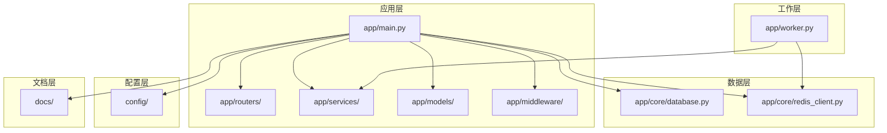
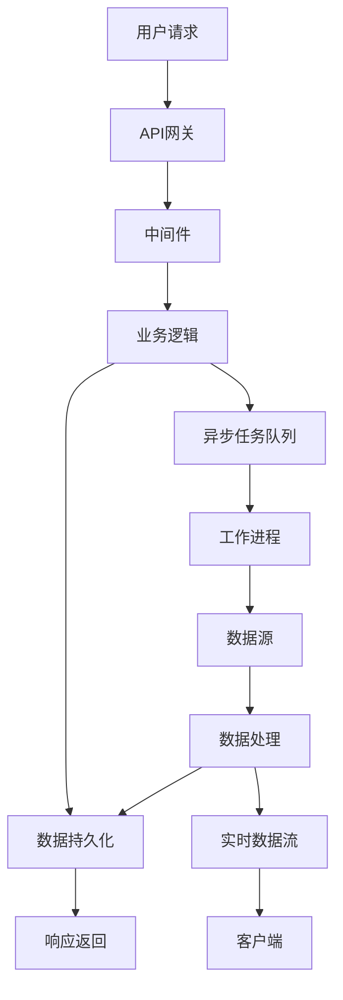
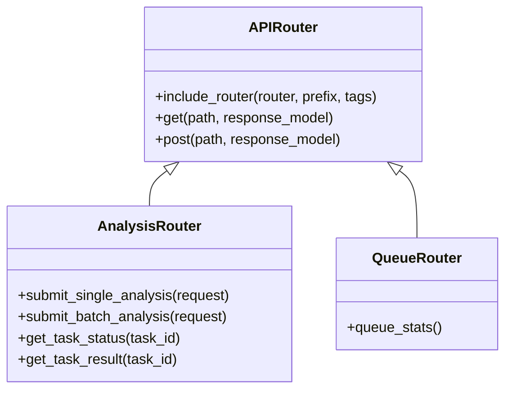
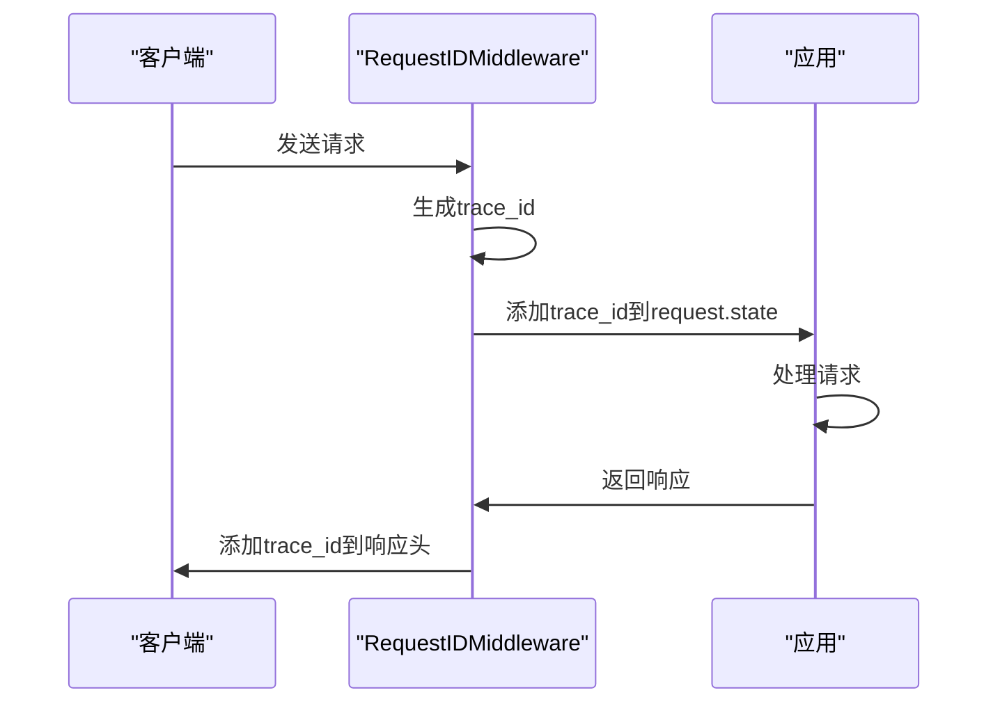
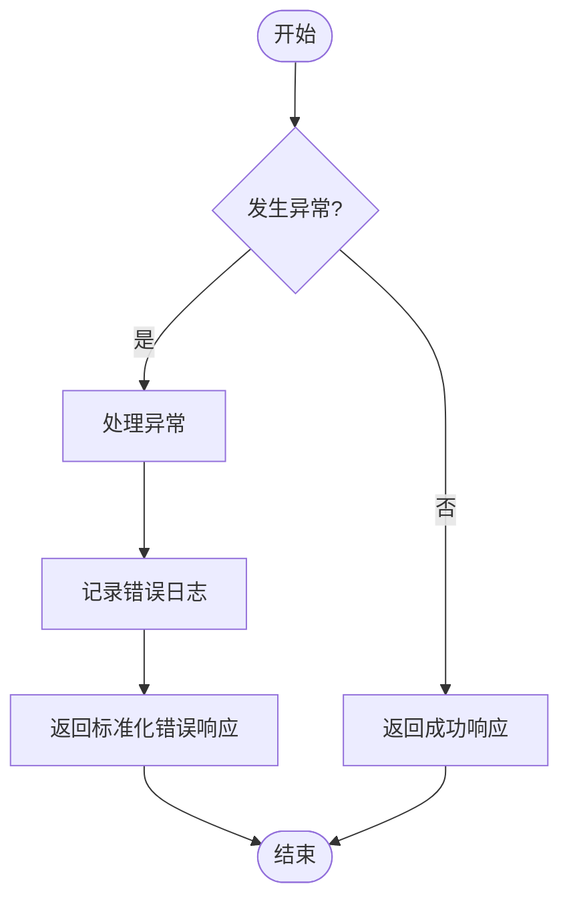
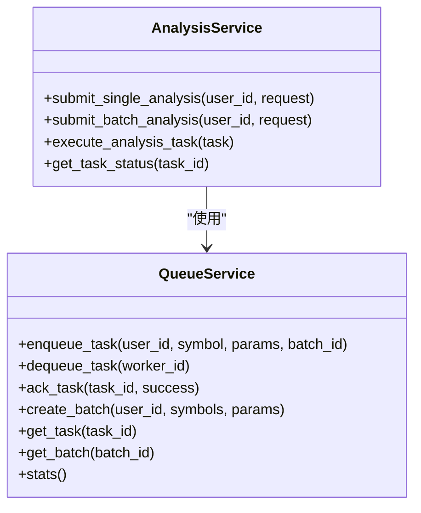
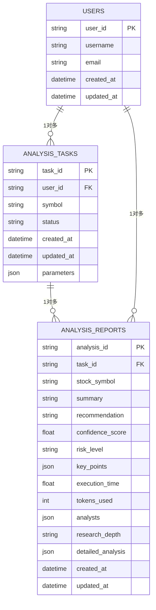
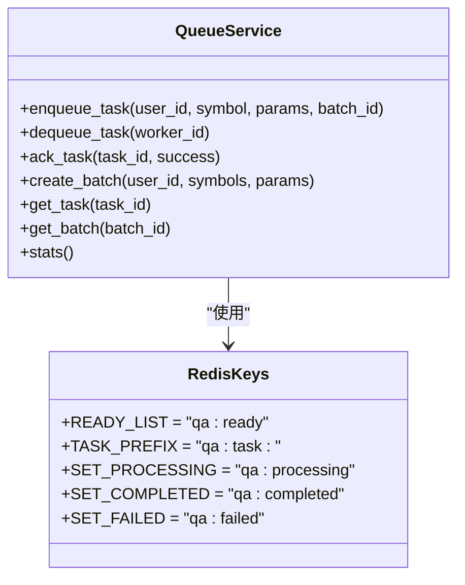
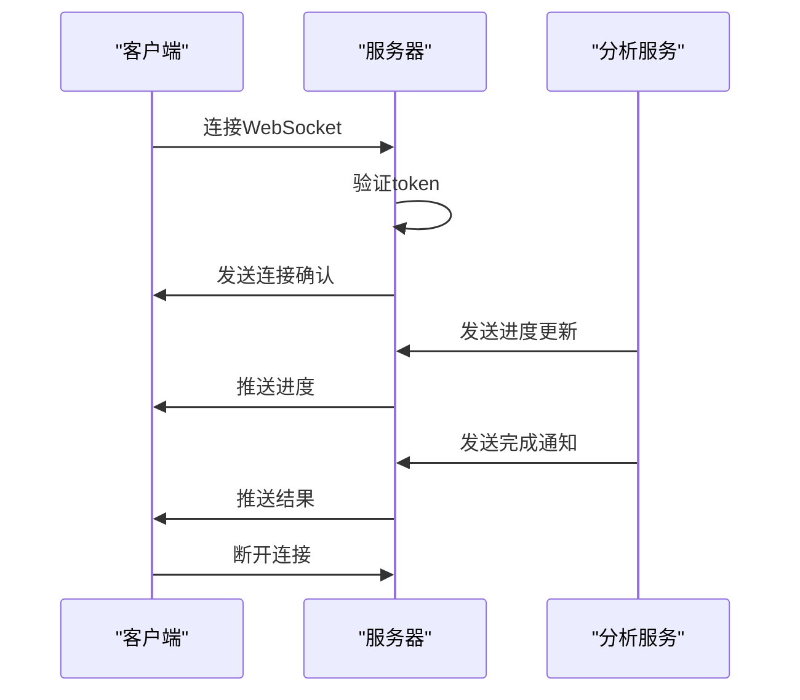
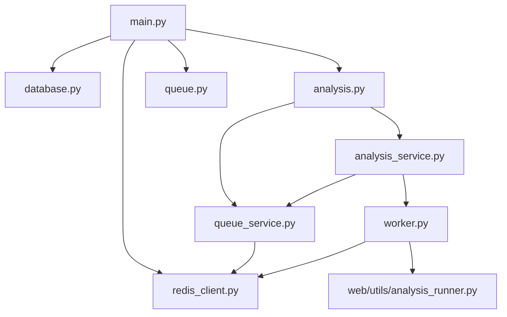

# 数据流架构

<cite>
**本文档引用的文件**   
- [main.py](file://app/main.py)
- [database.py](file://app/core/database.py)
- [redis_client.py](file://app/core/redis_client.py)
- [worker.py](file://app/worker.py)
- [queue_service.py](file://app/services/queue_service.py)
- [analysis.py](file://app/routers/analysis.py)
- [analysis_service.py](file://app/services/analysis_service.py)
- [websocket_notifications.py](file://app/routers/websocket_notifications.py)
- [quotes_ingestion_service.py](file://app/services/quotes_ingestion_service.py)
- [request_id.py](file://app/middleware/request_id.py)
- [error_handler.py](file://app/middleware/error_handler.py)
</cite>

## 目录
1. [引言](#引言)
2. [项目结构](#项目结构)
3. [核心组件](#核心组件)
4. [架构概述](#架构概述)
5. [详细组件分析](#详细组件分析)
6. [依赖分析](#依赖分析)
7. [性能考虑](#性能考虑)
8. [故障排除指南](#故障排除指南)
9. [结论](#结论)
10. [附录](#附录) (如有必要)

## 引言
本项目是一个基于FastAPI的股票分析与批量队列系统，旨在为用户提供全面的股票市场分析服务。系统通过集成多个数据源（如Tushare、AKShare、BaoStock）获取实时和历史股票数据，并利用大语言模型（LLM）进行深度分析。核心功能包括单股分析、批量分析、实时行情同步、财务数据同步等。系统采用微服务架构，通过Redis作为消息队列和缓存，MongoDB作为主数据库，实现了高并发、高可用的数据处理能力。用户可以通过API提交分析任务，系统在后台异步执行并返回结果，同时支持WebSocket实时推送分析进度。整体架构设计注重可扩展性和灵活性，支持多数据源优先级配置和动态调度，确保了系统的稳定性和高效性。

## 项目结构
项目采用模块化设计，主要分为以下几个部分：
- `app/`：核心应用模块，包含主应用、中间件、模型、路由、服务等。
- `cli/`：命令行接口，用于初始化和管理数据源。
- `config/`：配置文件，包括日志配置等。
- `docker/`：Docker相关配置。
- `docs/`：文档目录，包含详细的架构、API、配置等文档。
- `examples/`：示例代码。
- `frontend/`：前端应用。
- `install/`：安装配置。
- `nginx/`：Nginx配置。
- `reports/`：报告输出。
- `scripts/`：各种脚本，用于系统维护和数据处理。
- `tests/`：测试代码。
- `tradingagents/`：核心分析引擎。
- `utils/`：工具函数。
- `web/`：Web应用。



**图源**
- [main.py](file://app/main.py#L1-L764)
- [database.py](file://app/core/database.py#L1-L443)
- [redis_client.py](file://app/core/redis_client.py#L1-L203)
- [worker.py](file://app/worker.py#L1-L240)

**节源**
- [main.py](file://app/main.py#L1-L764)
- [database.py](file://app/core/database.py#L1-L443)
- [redis_client.py](file://app/core/redis_client.py#L1-L203)
- [worker.py](file://app/worker.py#L1-L240)

## 核心组件

系统的核心组件包括：
- **API网关**：通过FastAPI实现，处理所有外部请求，提供RESTful API。
- **中间件**：包括请求ID生成、错误处理、日志记录等，确保请求的可追踪性和系统的稳定性。
- **业务逻辑**：由多个服务类实现，如`AnalysisService`、`QueueService`等，处理具体的业务逻辑。
- **数据持久化**：使用MongoDB存储分析任务、结果和系统配置，使用Redis作为消息队列和缓存。
- **异步任务队列**：基于Redis实现，支持批量分析任务的异步处理。
- **实时数据流**：通过WebSocket实现，向客户端推送分析进度和结果。

**节源**
- [main.py](file://app/main.py#L1-L764)
- [analysis_service.py](file://app/services/analysis_service.py#L1-L955)
- [queue_service.py](file://app/services/queue_service.py#L1-L364)
- [websocket_notifications.py](file://app/routers/websocket_notifications.py#L1-L305)

## 架构概述

系统采用分层架构，从用户请求到数据持久化，整个数据流清晰明确。用户通过API网关提交分析请求，中间件处理请求并生成唯一ID，业务逻辑层解析请求并创建分析任务，任务被放入Redis队列，工作进程从队列中取出任务并执行分析，结果存储到MongoDB，同时通过WebSocket向客户端推送进度。



**图源**
- [main.py](file://app/main.py#L1-L764)
- [analysis.py](file://app/routers/analysis.py#L1-L1259)
- [analysis_service.py](file://app/services/analysis_service.py#L1-L955)
- [worker.py](file://app/worker.py#L1-L240)

## 详细组件分析

### API网关分析
API网关是系统的入口，负责接收和处理所有外部请求。通过FastAPI框架实现，提供了丰富的路由和中间件支持。

#### 路由配置


**图源**
- [main.py](file://app/main.py#L686-L731)
- [analysis.py](file://app/routers/analysis.py#L25-L800)
- [queue.py](file://app/routers/queue.py#L1-L10)

### 中间件分析
中间件负责处理请求的通用逻辑，如请求ID生成、错误处理、日志记录等。

#### 请求ID中间件


**图源**
- [request_id.py](file://app/middleware/request_id.py#L1-L76)

#### 错误处理中间件


**图源**
- [error_handler.py](file://app/middleware/error_handler.py#L1-L89)

### 业务逻辑分析
业务逻辑层是系统的核心，负责处理具体的业务需求，如分析任务的创建、执行和状态查询。

#### 分析服务


**图源**
- [analysis_service.py](file://app/services/analysis_service.py#L1-L955)
- [queue_service.py](file://app/services/queue_service.py#L1-L364)

### 数据持久化分析
数据持久化层负责数据的存储和检索，使用MongoDB和Redis两种数据库。

#### MongoDB数据模型


**图源**
- [analysis_service.py](file://app/services/analysis_service.py#L27-L29)
- [models/analysis.py](file://app/models/analysis.py)

### 异步任务队列分析
异步任务队列基于Redis实现，支持批量分析任务的异步处理，确保系统的高并发能力。

#### 队列服务


**图源**
- [queue_service.py](file://app/services/queue_service.py#L1-L364)
- [redis_client.py](file://app/core/redis_client.py#L70-L102)

### 实时数据流分析
实时数据流通过WebSocket实现，向客户端推送分析进度和结果，提供实时的用户体验。

#### WebSocket通知


**图源**
- [websocket_notifications.py](file://app/routers/websocket_notifications.py#L1-L305)

## 依赖分析

系统依赖关系复杂，涉及多个模块和外部服务。通过依赖注入和模块化设计，确保了各组件之间的松耦合。



**图源**
- [main.py](file://app/main.py#L28-L40)
- [analysis.py](file://app/routers/analysis.py#L16-L17)
- [analysis_service.py](file://app/services/analysis_service.py#L34-L35)
- [worker.py](file://app/worker.py#L22-L23)

**节源**
- [main.py](file://app/main.py#L1-L764)
- [database.py](file://app/core/database.py#L1-L443)
- [redis_client.py](file://app/core/redis_client.py#L1-L203)
- [analysis.py](file://app/routers/analysis.py#L1-L1259)
- [analysis_service.py](file://app/services/analysis_service.py#L1-L955)
- [queue_service.py](file://app/services/queue_service.py#L1-L364)
- [worker.py](file://app/worker.py#L1-L240)

## 性能考虑

系统在设计时充分考虑了性能问题，通过多种手段优化了数据处理和响应速度。

- **数据库优化**：使用MongoDB的索引和聚合管道，提高查询效率。
- **缓存机制**：利用Redis缓存频繁访问的数据，减少数据库压力。
- **异步处理**：通过异步任务队列，避免阻塞主线程，提高系统吞吐量。
- **并发控制**：限制用户和系统的并发任务数，防止资源耗尽。
- **超时机制**：设置任务的可见性超时，防止任务长时间占用资源。

## 故障排除指南

### 常见问题
- **任务卡住**：检查Redis队列是否正常，确认工作进程是否运行。
- **数据不一致**：检查MongoDB的索引和数据同步任务。
- **WebSocket连接失败**：检查token是否正确，确认服务器是否支持WebSocket。

### 调试工具
- **日志**：查看`app/main.py`中的日志输出，定位问题。
- **API测试**：使用`/api/test-log`端点测试中间件是否工作。
- **数据库检查**：直接查询MongoDB和Redis，验证数据状态。

**节源**
- [main.py](file://app/main.py#L678-L684)
- [database.py](file://app/core/database.py#L134-L177)
- [redis_client.py](file://app/core/redis_client.py#L40-L46)

## 结论

本系统通过模块化设计和分层架构，实现了高效、稳定的股票分析服务。API网关、中间件、业务逻辑、数据持久化、异步任务队列和实时数据流等组件协同工作，确保了系统的高可用性和高性能。通过合理的依赖管理和性能优化，系统能够应对高并发场景，为用户提供优质的分析体验。

## 附录

### 配置文件示例
```json
{
  "MONGODB_HOST": "localhost",
  "MONGODB_PORT": 27017,
  "MONGODB_DATABASE": "tradingagents",
  "REDIS_HOST": "localhost",
  "REDIS_PORT": 6379,
  "REDIS_DB": 0,
  "DEBUG": true
}
```

### API端点列表
| 端点 | 方法 | 描述 |
| --- | --- | --- |
| `/api/analysis/single` | POST | 提交单股分析任务 |
| `/api/analysis/batch` | POST | 提交批量分析任务 |
| `/api/analysis/tasks/{task_id}/status` | GET | 获取任务状态 |
| `/api/analysis/tasks/{task_id}/result` | GET | 获取任务结果 |
| `/api/queue/stats` | GET | 获取队列统计信息 |
| `/api/ws/notifications` | WebSocket | WebSocket通知端点 |
| `/api/ws/tasks/{task_id}` | WebSocket | 任务进度WebSocket端点 |
| `/api/system/config` | GET | 获取系统配置摘要 |
| `/api/system/health` | GET | 健康检查 |
| `/api/system/logs` | GET | 获取日志 |