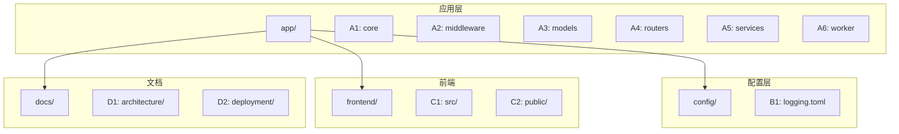
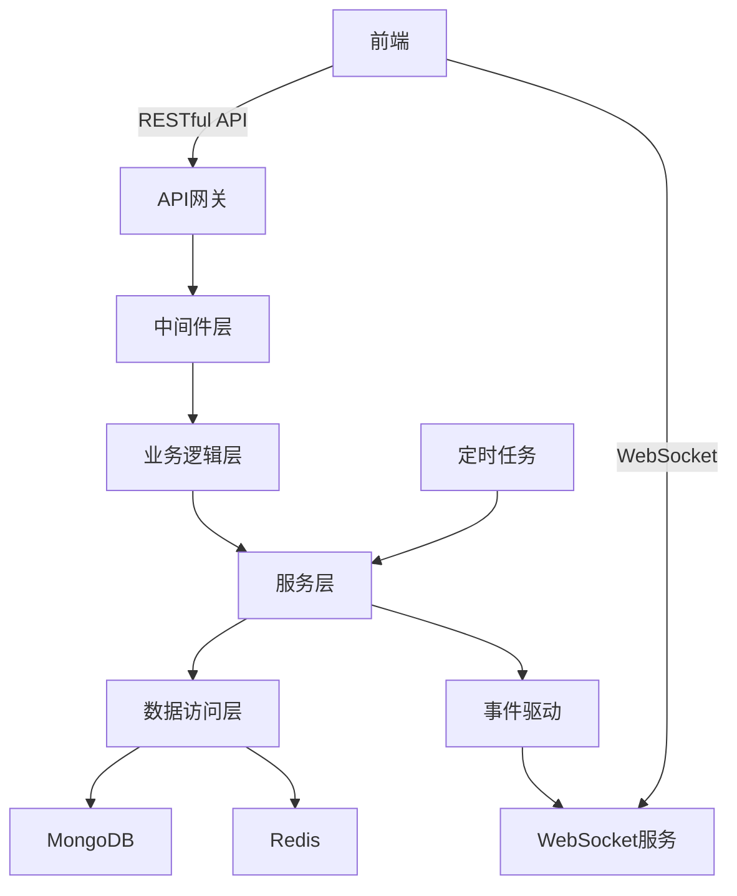
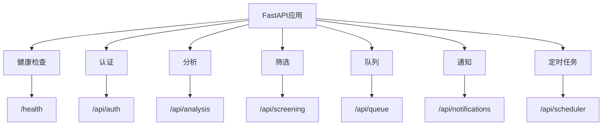
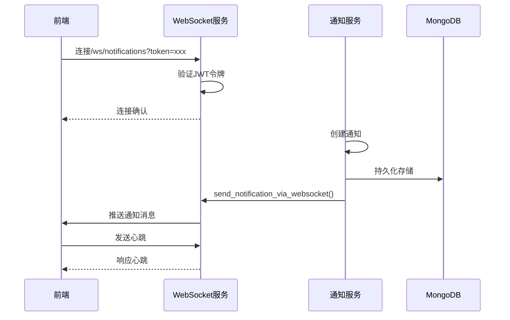
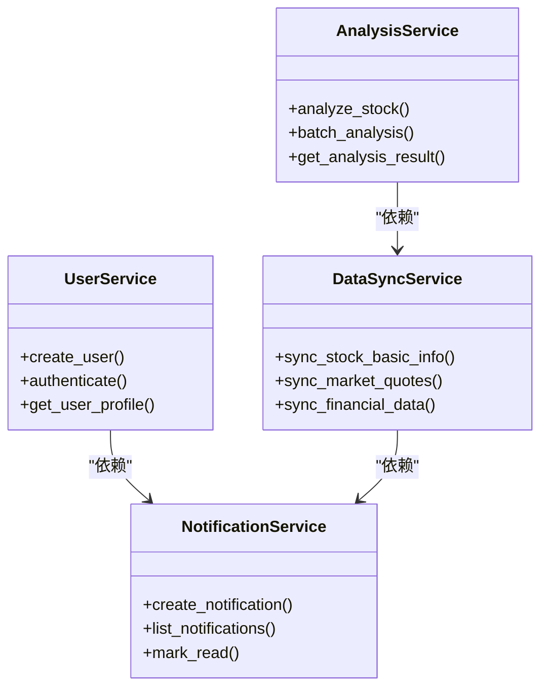
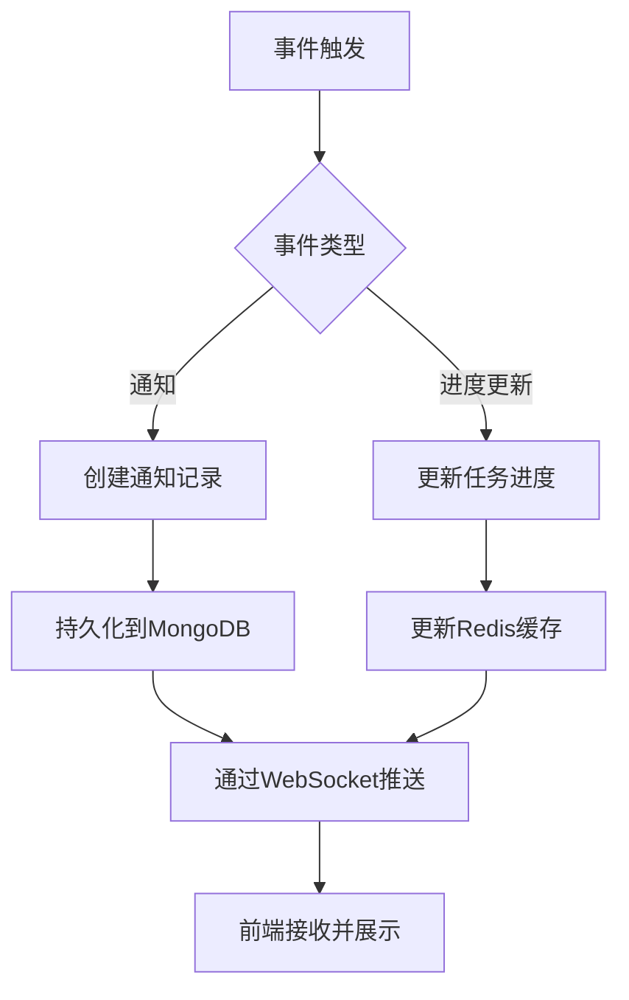
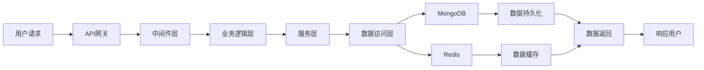
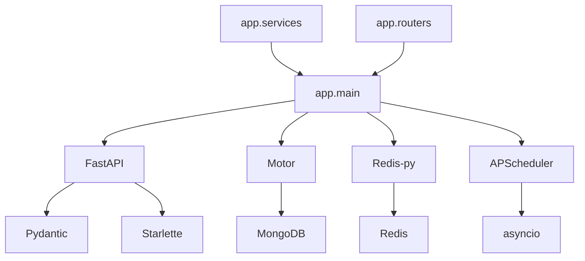

# 系统架构

<cite>
**本文档引用的文件**   
- [main.py](file://app/main.py)
- [config.py](file://app/core/config.py)
- [database.py](file://app/core/database.py)
- [redis_client.py](file://app/core/redis_client.py)
- [request_id.py](file://app/middleware/request_id.py)
- [error_handler.py](file://app/middleware/error_handler.py)
- [health.py](file://app/routers/health.py)
- [notifications.py](file://app/routers/notifications.py)
- [websocket_notifications.py](file://app/routers/websocket_notifications.py)
- [notifications_service.py](file://app/services/notifications_service.py)
- [websocket_manager.py](file://app/services/websocket_manager.py)
</cite>

## 目录
1. [简介](#简介)
2. [项目结构](#项目结构)
3. [核心组件](#核心组件)
4. [架构概览](#架构概览)
5. [详细组件分析](#详细组件分析)
6. [依赖分析](#依赖分析)
7. [性能考虑](#性能考虑)
8. [故障排除指南](#故障排除指南)
9. [结论](#结论)

## 简介
sagacity平台是一个基于FastAPI构建的股票分析与批量队列系统，采用前后端分离架构。系统通过RESTful API和WebSocket与前端交互，实现了微服务架构风格，将功能划分为独立的服务模块。平台支持事件驱动架构以实现实时通知和异步任务处理，并通过API网关管理用户请求到业务逻辑层和数据访问层的数据流。技术选型上，系统采用MongoDB作为主要数据库，利用其灵活的文档模型存储股票基础信息、市场行情和财务数据。

## 项目结构
sagacity平台的项目结构清晰地体现了分层架构设计原则，将不同职责的组件分离到独立的目录中。核心应用逻辑位于`app/`目录下，包含配置、中间件、模型、路由、服务等子模块。系统采用微服务架构风格，通过功能模块化设计实现了高内聚低耦合的系统结构。

**图源**
- [main.py](file://app/main.py#L1-L764)
- [config.py](file://app/core/config.py#L1-L301)

**本节源**
- [main.py](file://app/main.py#L1-L764)
- [project_structure](file://#L1-L100)

## 核心组件

sagacity平台的核心组件包括FastAPI应用实例、数据库连接管理、配置系统、中间件管道和微服务模块。系统通过`main.py`文件中的`lifespan`上下文管理器实现应用生命周期管理，在启动时初始化数据库连接、配置验证和定时任务调度器。核心配置通过Pydantic Settings从环境变量和配置文件加载，支持生产环境和开发环境的差异化配置。

**本节源**
- [main.py](file://app/main.py#L1-L764)
- [config.py](file://app/core/config.py#L1-L301)

## 架构概览

sagacity平台采用分层架构设计，从前端到后端形成了清晰的数据流路径。用户请求首先通过API网关进入系统，经过CORS、身份验证和请求ID中间件处理后，路由到相应的业务逻辑层。业务逻辑层调用服务层处理具体功能，最终通过数据访问层与MongoDB和Redis交互。系统采用事件驱动架构，通过WebSocket实现实时通知和任务进度推送。

**图源**
- [main.py](file://app/main.py#L1-L764)
- [database.py](file://app/core/database.py#L1-L443)

## 详细组件分析

### 前后端交互分析
sagacity平台通过RESTful API和WebSocket两种方式实现前后端交互。RESTful API提供标准的HTTP接口用于数据查询和操作，而WebSocket用于实时推送通知和任务进度更新。系统通过`/api`前缀的路由处理REST请求，通过`/api/ws`前缀的端点处理WebSocket连接。

#### API路由配置

**图源**
- [main.py](file://app/main.py#L686-L731)
- [health.py](file://app/routers/health.py#L1-L41)

#### WebSocket通知系统

**图源**
- [websocket_notifications.py](file://app/routers/websocket_notifications.py#L1-L305)
- [notifications_service.py](file://app/services/notifications_service.py#L1-L142)

### 微服务架构分析
sagacity平台将功能划分为多个独立的服务模块，包括用户服务、分析服务、数据同步服务等。每个服务都有明确的职责边界，通过定义良好的接口进行通信。服务层位于`app/services/`目录下，包含业务逻辑的具体实现。

#### 服务模块关系

**图源**
- [services/__init__.py](file://app/services/__init__.py#L1-L3)
- [user_service.py](file://app/services/user_service.py#L1-L100)

### 事件驱动架构分析
sagacity平台采用事件驱动架构支持实时通知和异步任务处理。系统通过WebSocket连接实现服务器到客户端的实时消息推送，替代了传统的SSE和Redis PubSub方案，解决了连接泄漏问题。事件驱动机制在任务完成、分析结果生成等场景中发挥关键作用。

#### 事件处理流程

**图源**
- [websocket_notifications.py](file://app/routers/websocket_notifications.py#L1-L305)
- [notifications_service.py](file://app/services/notifications_service.py#L1-L142)

### 数据流分析
sagacity平台的数据流从用户请求开始，经过API网关、中间件层、业务逻辑层，最终到达数据访问层。系统通过清晰的分层设计确保了数据流动的可追溯性和安全性。数据访问层负责与MongoDB和Redis交互，实现数据的持久化存储和缓存管理。

#### 数据流路径

**图源**
- [main.py](file://app/main.py#L1-L764)
- [database.py](file://app/core/database.py#L1-L443)

**本节源**
- [main.py](file://app/main.py#L1-L764)
- [database.py](file://app/core/database.py#L1-L443)
- [redis_client.py](file://app/core/redis_client.py#L1-L203)

## 依赖分析

sagacity平台的组件依赖关系体现了微服务架构的特点，各模块之间通过明确定义的接口进行通信，降低了耦合度。核心依赖包括FastAPI框架、Motor异步MongoDB驱动、Redis异步客户端和APScheduler定时任务调度器。

**图源**
- [requirements.txt](file://requirements.txt#L1-L20)
- [main.py](file://app/main.py#L1-L764)

**本节源**
- [main.py](file://app/main.py#L1-L764)
- [requirements.txt](file://requirements.txt#L1-L20)

## 性能考虑

sagacity平台在性能方面进行了多项优化设计。数据库连接采用连接池管理，MongoDB配置了最大100个连接和最小10个连接的连接池，避免了频繁创建和销毁连接的开销。Redis连接池配置了最大20个连接，并启用了TCP keepalive和健康检查机制。系统通过视图和索引优化查询性能，在启动时自动创建股票筛选视图和常用查询字段的索引。

**本节源**
- [database.py](file://app/core/database.py#L1-L443)
- [redis_client.py](file://app/core/redis_client.py#L1-L203)

## 故障排除指南

sagacity平台提供了多种故障排除工具和接口。系统健康检查接口`/health`可用于验证服务状态，`/healthz`和`/readyz`接口支持Kubernetes的存活和就绪探针。Redis连接池调试端点`/api/notifications/debug/redis_pool`可查看Redis连接池状态和PubSub频道信息。日志系统记录了详细的请求处理信息，包括请求ID、处理时间和状态码，便于问题追踪。

**本节源**
- [health.py](file://app/routers/health.py#L1-L41)
- [notifications.py](file://app/routers/notifications.py#L1-L97)

## 结论

sagacity平台通过采用FastAPI框架、微服务架构和事件驱动设计，构建了一个高性能、可扩展的股票分析系统。系统前后端分离的设计模式提高了开发效率和系统可维护性。RESTful API提供了标准化的数据访问接口，WebSocket实现了低延迟的实时通信。MongoDB作为主要数据库，其灵活的文档模型适应了股票数据的复杂结构。系统的架构设计充分考虑了性能、可靠性和可扩展性，为后续功能扩展奠定了坚实基础。