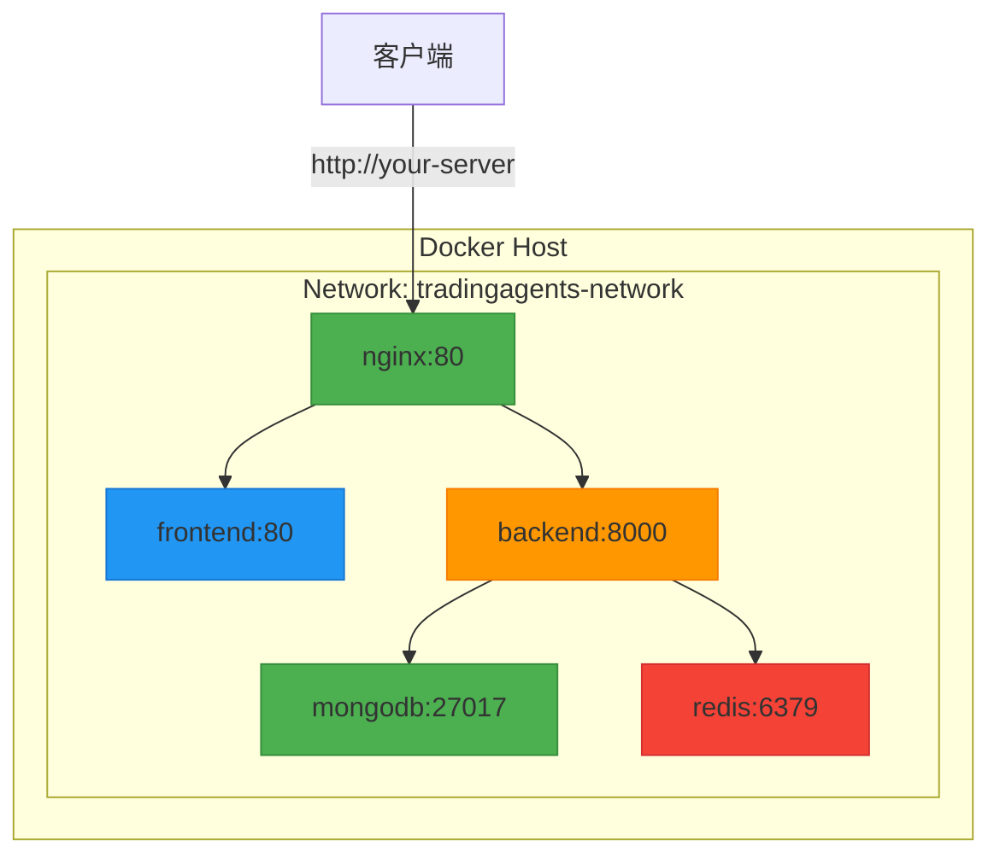
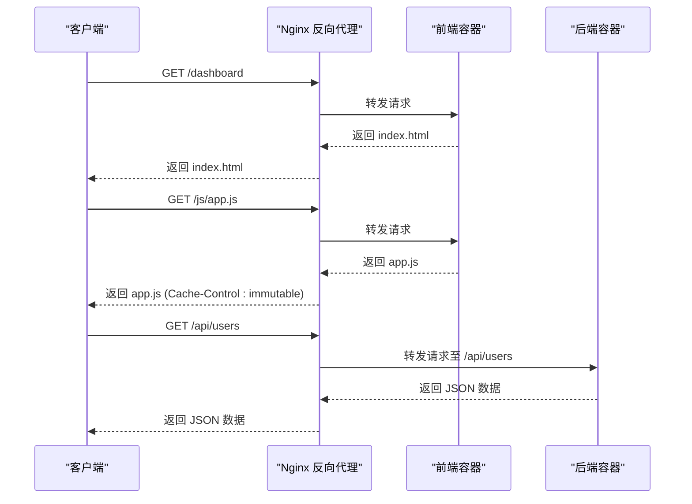

# 部署架构

<cite>
**本文档引用的文件**   
- [docker-compose.yml](file://docker-compose.yml)
- [docker-compose.hub.nginx.yml](file://docker-compose.hub.nginx.yml)
- [Dockerfile.backend](file://Dockerfile.backend)
- [Dockerfile.frontend](file://Dockerfile.frontend)
- [docker/nginx.conf](file://docker/nginx.conf)
- [nginx/nginx.conf](file://nginx/nginx.conf)
- [scripts/docker-init.sh](file://scripts/docker-init.sh)
- [scripts/build-multiarch.sh](file://scripts/build-multiarch.sh)
- [scripts/publish-docker-images.sh](file://scripts/publish-docker-images.sh)
- [scripts/deploy_demo.sh](file://scripts/deploy_demo.sh)
- [scripts/full_redeploy_linux.sh](file://scripts/full_redeploy_linux.sh)
</cite>

## 目录
1. [简介](#简介)
2. [部署拓扑与容器编排](#部署拓扑与容器编排)
3. [Nginx反向代理配置](#nginx反向代理配置)
4. [环境变量、卷挂载与网络配置](#环境变量卷挂载与网络配置)
5. [多架构镜像构建与CI/CD流水线](#多架构镜像构建与cicd流水线)
6. [高可用性与蓝绿部署策略](#高可用性与蓝绿部署策略)
7. [部署流程与最佳实践](#部署流程与最佳实践)

## 简介

本部署架构文档详细阐述了基于Docker容器化和Nginx反向代理的部署方案。系统采用前后端分离架构，通过Docker Compose进行多容器编排，协同工作包括后端服务、前端界面、MongoDB数据库和Redis缓存。文档深入解析了Nginx如何实现静态资源服务和API请求转发，并阐述了环境变量管理、卷挂载和网络配置的最佳实践。此外，还包含了部署拓扑图、容器间通信机制、高可用性设计、多架构镜像构建（AMD64/ARM64）、持续集成/持续部署（CI/CD）流水线以及蓝绿部署策略。

**本文档引用的文件**   
- [docker-compose.yml](file://docker-compose.yml)
- [docker-compose.hub.nginx.yml](file://docker-compose.hub.nginx.yml)

## 部署拓扑与容器编排

该系统采用微服务架构，通过Docker Compose进行容器编排，主要由四个核心服务组成：后端API服务、前端Web服务、MongoDB数据库和Redis缓存服务。所有服务均运行在名为`tradingagents-network`的自定义桥接网络中，确保容器间可以高效、安全地通信。

- **后端服务 (backend)**：基于FastAPI框架，运行在`tradingagents-backend`容器中。它监听8000端口，通过`depends_on`指令确保在MongoDB和Redis健康后才启动。该服务通过环境变量配置数据库连接（`TRADINGAGENTS_MONGODB_URL`, `TRADINGAGENTS_REDIS_URL`）和日志级别，并将日志、配置和数据目录通过卷（volumes）挂载到宿主机，实现数据持久化。
- **前端服务 (frontend)**：基于Vue 3 + Vite构建，运行在`tradingagents-frontend`容器中。它监听80端口，依赖于后端服务。前端通过环境变量`VITE_API_BASE_URL`配置后端API地址（如`http://localhost:8000`），在开发或独立部署时直接通信。
- **数据库服务 (mongodb)**：使用官方`mongo:4.4`镜像，通过环境变量设置管理员凭据和默认数据库。数据目录`/data/db`通过名为`mongodb_data`的命名卷持久化，确保数据在容器重启后不丢失。
- **缓存服务 (redis)**：使用`redis:7-alpine`镜像，配置了密码保护和持久化（`appendonly yes`）。其数据目录也通过名为`redis_data`的命名卷进行持久化。

在生产环境中，引入了Nginx作为反向代理，形成统一的入口。此时，前端和后端都通过Nginx暴露的80端口对外提供服务。Nginx根据请求路径将静态资源请求转发到前端容器，将`/api`前缀的请求转发到后端API容器，从而解决了跨域问题，并简化了HTTPS的配置。

**Diagram sources**
- [docker-compose.yml](file://docker-compose.yml#L6-L208)
- [docker-compose.hub.nginx.yml](file://docker-compose.hub.nginx.yml#L1-L207)

**本文档引用的文件**   
- [docker-compose.yml](file://docker-compose.yml)
- [docker-compose.hub.nginx.yml](file://docker-compose.hub.nginx.yml)

## Nginx反向代理配置

Nginx配置文件（`nginx.conf`）是实现统一入口和高效服务的关键。其核心功能包括静态资源服务、API请求转发和性能优化。

配置文件定义了一个监听80端口的server块。其主要location规则如下：
- `location /`: 这是SPA（单页应用）的fallback规则。`try_files $uri $uri/ /index.html;`指令确保所有未知路径的请求都会返回`index.html`，由前端路由处理，支持Vue Router的history模式。
- `location ~* ^/js/.*\.js$` 和 `location ~* ^/css/.*\.css$`: 这些规则匹配JavaScript和CSS文件，设置一年的过期时间（`expires 1y`）和`immutable`缓存头，极大提升静态资源的加载速度。
- `location ~* \.(?:png|jpg|jpeg|gif|svg|ico|woff|woff2|ttf|eot)$`: 匹配其他静态资源文件，同样设置长期缓存。
- `location = /index.html`: 为`index.html`文件设置`no-cache`，确保客户端每次都能获取最新的HTML文件，避免因缓存导致的更新延迟。
- `location = /health`: 定义了一个健康检查端点，返回简单的`ok`文本，供Docker健康检查或负载均衡器使用。

在`docker-compose.hub.nginx.yml`中，Nginx服务通过`volumes`将宿主机的`./nginx/nginx.conf`挂载到容器内的`/etc/nginx/nginx.conf`，从而应用此配置。同时，Nginx被配置为依赖于`frontend`和`backend`服务，确保在应用服务启动后再启动代理。

**Diagram sources**
- [nginx/nginx.conf](file://nginx/nginx.conf#L1-L51)
- [docker-compose.hub.nginx.yml](file://docker-compose.hub.nginx.yml#L175-L195)

**本文档引用的文件**   
- [nginx/nginx.conf](file://nginx/nginx.conf)
- [docker-compose.hub.nginx.yml](file://docker-compose.hub.nginx.yml)

## 环境变量、卷挂载与网络配置

本部署方案通过环境变量、卷挂载和自定义网络实现了配置分离、数据持久化和安全通信。

- **环境变量管理**: 所有服务的配置（如数据库连接字符串、API密钥、日志级别）都通过`.env`文件或`environment`指令注入。这遵循了12-Factor应用原则，使得配置与代码分离，便于在不同环境（开发、测试、生产）间切换。例如，后端服务通过`env_file: .env`加载所有环境变量，而前端通过`VITE_API_BASE_URL`指定API地址。敏感信息（如`JWT_SECRET`）在`.env.example`中提供占位符，要求用户在部署时自行配置。
- **卷挂载 (Volumes)**: 为了确保数据不因容器销毁而丢失，关键数据目录被挂载到宿主机。
  - **命名卷 (Named Volumes)**: 用于数据库和缓存数据。`mongodb_data`和`redis_data`是命名卷，由Docker管理，提供最佳性能和持久性。
  - **绑定挂载 (Bind Mounts)**: 用于应用日志、配置和用户数据。例如，`./logs:/app/logs`将宿主机的`logs`目录映射到容器内，方便日志收集和分析；`./config:/app/config`允许在宿主机上修改配置文件而无需重建镜像。
- **网络配置 (Networks)**: 使用自定义的`bridge`网络`tradingagents-network`。这为容器间通信提供了隔离的网络环境，服务可以通过服务名称（如`mongodb`, `redis`）作为主机名直接相互通信，而无需暴露端口到宿主机。外部访问仅通过Nginx的80端口，增强了安全性。

**本文档引用的文件**   
- [docker-compose.yml](file://docker-compose.yml)
- [docker-compose.hub.nginx.yml](file://docker-compose.hub.nginx.yml)

## 多架构镜像构建与CI/CD流水线

项目支持在AMD64和ARM64架构上运行，通过Docker Buildx实现多架构镜像构建。

- **多架构构建**: `scripts/build-multiarch.sh`脚本利用Docker Buildx功能，创建一个名为`tradingagents-builder`的builder，该builder支持`linux/amd64,linux/arm64`平台。脚本使用`docker buildx build`命令，配合`--platform`参数，一次性为多个架构构建镜像。构建完成后，可以使用`--push`参数将多架构镜像（manifest list）推送到Docker Hub，用户拉取时Docker会自动选择匹配的架构。
- **持续集成/持续部署 (CI/CD) 流水线**: 部署流程高度自动化。
  1. **构建与发布**: 开发者使用`scripts/build-and-publish-linux.sh`脚本，该脚本整合了环境检查、登录Docker Hub、多架构构建、推送和本地清理。这确保了每次发布都能生成高质量的镜像。
  2. **一键部署**: `scripts/deploy_demo.sh`脚本为用户提供了一键部署体验。它能自动检查系统要求、安装Docker、下载项目文件、生成安全密钥、启动服务并导入初始数据，极大地降低了部署门槛。
  3. **完整重新部署**: `scripts/full_redeploy_linux.sh`脚本用于生产环境的完整更新。它执行代码拉取、旧服务停止、新镜像构建与推送、新服务启动和系统初始化等步骤，确保部署过程的完整性和一致性。

**本文档引用的文件**   
- [scripts/build-multiarch.sh](file://scripts/build-multiarch.sh)
- [scripts/publish-docker-images.sh](file://scripts/publish-docker-images.sh)
- [scripts/deploy_demo.sh](file://scripts/deploy_demo.sh)
- [scripts/full_redeploy_linux.sh](file://scripts/full_redeploy_linux.sh)

## 高可用性与蓝绿部署策略

系统设计考虑了高可用性和平滑部署。

- **高可用性设计**:
  - **健康检查 (Healthcheck)**: 所有关键服务（backend, frontend, mongodb, redis）都配置了`healthcheck`。Docker会定期检查服务的健康状态，只有当服务健康时，才会将其加入服务网络，确保流量不会被路由到故障实例。
  - **数据持久化**: 通过命名卷（volumes）持久化数据库和缓存数据，即使容器崩溃或重启，核心数据也不会丢失。
  - **依赖管理**: 使用`depends_on`配合`condition: service_healthy`，确保服务按正确的顺序启动，避免因依赖服务未就绪而导致的启动失败。

- **蓝绿部署策略**:
  虽然当前的`docker-compose`文件未直接实现蓝绿部署，但其架构为实施该策略提供了基础。蓝绿部署的核心是维护两套完全相同的生产环境（蓝色和绿色）。部署新版本时，先将新版本部署到非生产环境（如绿色），进行全面测试。测试通过后，通过修改Nginx的upstream配置或DNS，将流量从蓝色环境瞬间切换到绿色环境。旧的蓝色环境保留一段时间，以便在新版本出现问题时可以快速回滚。`scripts/full_redeploy_linux.sh`脚本中“停止旧服务”和“启动新服务”的步骤，正是蓝绿部署中“切换流量”前的准备动作。通过结合外部负载均衡器或更高级的编排工具（如Kubernetes），可以轻松实现完整的蓝绿部署流程。

**本文档引用的文件**   
- [docker-compose.yml](file://docker-compose.yml)
- [scripts/full_redeploy_linux.sh](file://scripts/full_redeploy_linux.sh)

## 部署流程与最佳实践

推荐的部署流程和最佳实践如下：

1.  **初始化**: 运行`scripts/docker-init.sh`脚本。该脚本会检查并创建必要的目录（logs, data, config），检查必需的环境变量（如`DEEPSEEK_API_KEY`），停止旧容器，拉取最新镜像，构建自定义镜像，并等待数据库和应用服务就绪。
2.  **启动**: 使用`docker-compose up -d`启动服务。对于生产环境，建议使用`docker-compose -f docker-compose.hub.nginx.yml up -d`以启用Nginx反向代理。
3.  **验证**: 使用`docker-compose ps`检查容器状态，并通过`curl`或浏览器访问前端和API文档端点进行验证。
4.  **维护**: 定期使用`docker system prune`清理未使用的镜像、容器和缓存，释放磁盘空间。

**最佳实践**:
- **安全**: 切勿在生产环境中使用默认的`.env`值，特别是`JWT_SECRET`和数据库密码。
- **备份**: 定期备份命名卷中的数据，或使用`docker cp`命令备份绑定挂载的目录。
- **监控**: 配置日志聚合系统（如ELK Stack）来集中管理`./logs`目录下的日志文件。
- **更新**: 使用`scripts/build-multiarch.sh`和`scripts/full_redeploy_linux.sh`脚本进行安全、可靠的更新。

**本文档引用的文件**   
- [scripts/docker-init.sh](file://scripts/docker-init.sh)
- [scripts/start_docker.sh](file://scripts/start_docker.sh)