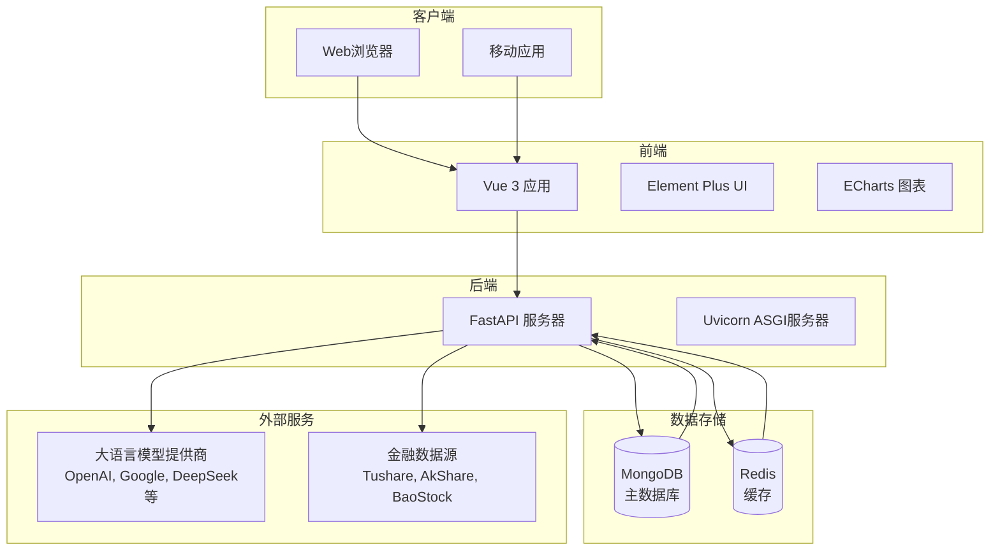

# 系统概述

<cite>
**本文档引用文件**   
- [README.md](file://README.md)
- [main.py](file://app/main.py)
- [config.py](file://app/core/config.py)
- [package.json](file://frontend/package.json)
- [pyproject.toml](file://pyproject.toml)
- [analysis.py](file://app/routers/analysis.py)
- [reports.py](file://app/routers/reports.py)
- [multi_market_stocks.py](file://app/routers/multi_market_stocks.py)
- [report_exporter.py](file://app/utils/report_exporter.py)
- [model_capabilities.py](file://app/constants/model_capabilities.py)
</cite>

## 目录
1. [项目背景与定位](#项目背景与定位)
2. [设计目标与核心价值](#设计目标与核心价值)
3. [技术架构](#技术架构)
4. [核心功能特性](#核心功能特性)
5. [系统上下文图](#系统上下文图)
6. [典型使用场景](#典型使用场景)

## 项目背景与定位

sagacity平台（原名TradingAgents-CN）是一个面向中文用户的**多智能体与大模型股票分析学习平台**。该平台基于Tauric Research团队开发的革命性多智能体交易框架TradingAgents构建，旨在帮助用户系统化地学习如何使用多智能体框架与AI大模型进行合规的股票研究与策略实验。

平台明确声明不提供实盘交易指令，其定位为纯粹的学习与研究用途。通过提供中文化学习中心、工具和完整的A股、港股、美股分析支持，sagacity致力于推动AI金融技术在中文社区的普及与正确使用。

**Section sources**
- [README.md](file://README.md#L13-L19)

## 设计目标与核心价值

sagacity平台的设计目标是为用户提供一个企业级、高性能且易于使用的股票分析学习环境。其核心价值主张体现在以下几个方面：

1.  **学习与研究导向**：平台专注于教育和研究，为用户提供从AI基础、提示词工程到多智能体分析原理的完整学习路径。
2.  **合规友好**：所有功能设计均以学习和研究为目的，避免引导用户进行实盘交易，符合金融合规要求。
3.  **中文本地化**：提供全面的中文界面、文档和学习中心，降低中文用户的使用门槛。
4.  **多市场支持**：原生支持A股、港股、美股三大市场的股票分析，满足不同用户的分析需求。
5.  **技术先进性**：采用现代化的FastAPI + Vue 3技术栈，提供企业级的性能和用户体验。

**Section sources**
- [README.md](file://README.md#L19-L24)

## 技术架构

sagacity平台采用了现代化的前后端分离架构，技术栈组合强大且高效。

### 后端技术栈
后端基于**FastAPI**框架构建，提供了强大的RESTful API能力。其核心组件包括：
- **数据库**：采用**MongoDB**作为主数据库，用于存储用户数据、分析报告和配置信息；同时使用**Redis**作为缓存数据库，显著提升系统性能。
- **任务调度**：使用`APScheduler`库实现定时任务调度，如股票基础信息同步、实时行情入库等。
- **异步处理**：利用`asyncio`和`FastAPI`的异步特性，处理耗时的股票分析任务，确保API响应的高效性。

### 前端技术栈
前端采用**Vue 3**框架，结合**Element Plus** UI组件库，打造了现代化的单页应用（SPA）。
- **构建工具**：使用**Vite**作为构建工具，提供快速的开发服务器和高效的生产构建。
- **状态管理**：使用**Pinia**进行全局状态管理。
- **图表展示**：集成**ECharts**库，用于可视化股票的K线图、技术指标等。

### 数据流与部署
- **数据源**：平台整合了多个金融数据源，包括Tushare、AkShare和BaoStock，通过统一的数据服务层进行管理。
- **部署方式**：支持Docker容器化部署，提供`docker-compose.yml`文件，可实现一键快速部署，支持跨平台（x86_64和ARM64）运行。

**Section sources**
- [README.md](file://README.md#L27-L31)
- [main.py](file://app/main.py#L16-L20)
- [package.json](file://frontend/package.json#L28-L30)
- [pyproject.toml](file://pyproject.toml#L13-L14)

## 核心功能特性

sagacity平台提供了一系列强大的功能，以支持用户的股票分析学习。

### 智能模型选择与多LLM提供商支持
平台支持集成多个大语言模型（LLM）提供商，如OpenAI、Google AI、DeepSeek、通义千问等。通过`app/constants/model_capabilities.py`文件中的模型能力分级系统，平台能够根据分析任务的深度要求，智能地为用户推荐和选择最合适的模型。例如，快速分析任务可选用响应快、成本低的模型，而深度分析任务则会匹配推理能力强的旗舰模型。

### 多市场股票分析
平台通过`app/routers/multi_market_stocks.py`路由，提供了对A股、港股、美股的统一查询接口。用户可以跨市场搜索股票、获取基础信息和行情数据。对于港股和美股，平台采用“按需获取+缓存”的模式，确保数据的实时性和访问效率。

### 专业报告导出
分析完成后，用户可以将结果导出为多种专业格式。`app/utils/report_exporter.py`模块支持将分析报告导出为**Markdown**、**Word**和**PDF**格式。该功能依赖`pypandoc`和`pdfkit`等工具，为用户生成高质量的分析文档，便于分享和存档。

### 其他关键特性
- **用户权限管理**：提供完整的用户认证、角色管理和操作日志系统。
- **实时通知**：通过SSE（Server-Sent Events）和WebSocket，实时推送分析进度和系统状态。
- **智能股票筛选**：基于多维度财务和技术指标，对股票进行筛选和排序。
- **自选股管理**：用户可以收藏、分组和跟踪自己关注的股票。

**Section sources**
- [README.md](file://README.md#L44-L49)
- [model_capabilities.py](file://app/constants/model_capabilities.py#L17-L23)
- [multi_market_stocks.py](file://app/routers/multi_market_stocks.py#L23-L24)
- [report_exporter.py](file://app/utils/report_exporter.py#L64-L65)

## 系统上下文图

**Diagram sources **
- [main.py](file://app/main.py#L16-L20)
- [package.json](file://frontend/package.json#L28-L30)
- [pyproject.toml](file://pyproject.toml#L20-L22)

**Section sources**
- [main.py](file://app/main.py#L16-L20)
- [package.json](file://frontend/package.json#L28-L30)
- [pyproject.toml](file://pyproject.toml#L20-L22)

## 典型使用场景

1.  **学习AI金融分析**：初学者可以通过平台提供的学习中心，系统地学习多智能体分析原理和提示词工程，并通过分析A股、港股、美股来实践所学知识。
2.  **研究投资策略**：经验丰富的开发者或分析师可以利用平台的智能模型选择和多LLM支持，设计复杂的分析流程，研究不同市场和股票的投资策略。
3.  **生成专业报告**：用户可以将分析结果导出为PDF或Word格式的专业报告，用于内部汇报、学术研究或知识分享。
4.  **监控市场动态**：通过实时通知和自选股管理功能，用户可以持续跟踪关注股票的动态和分析进度。

**Section sources**
- [README.md](file://README.md#L13-L19)