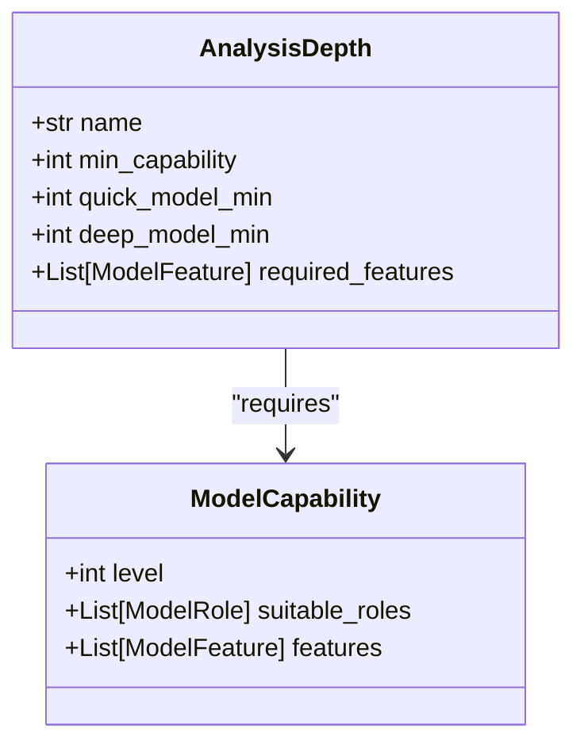
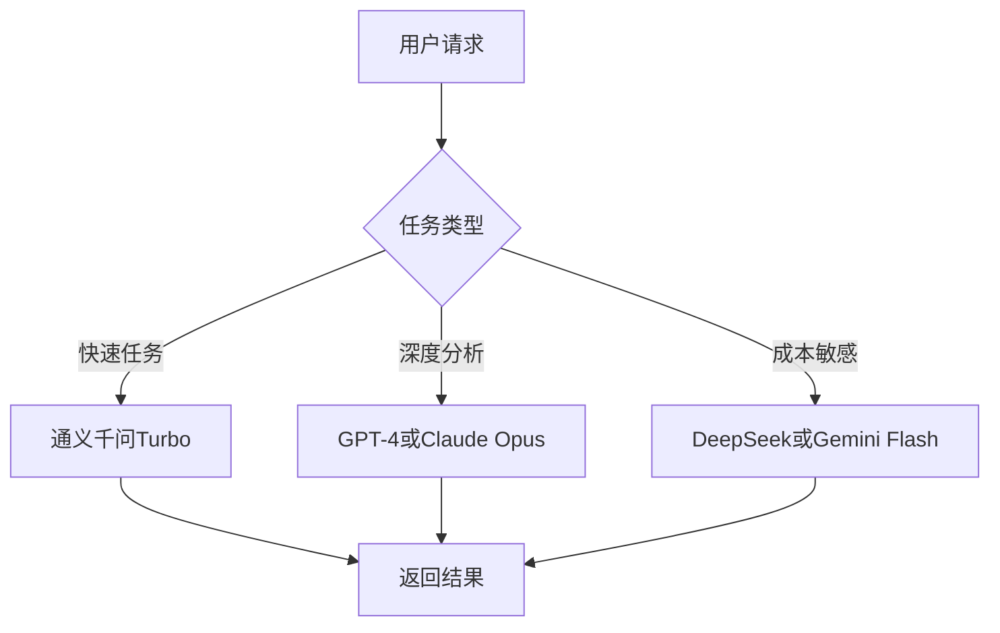
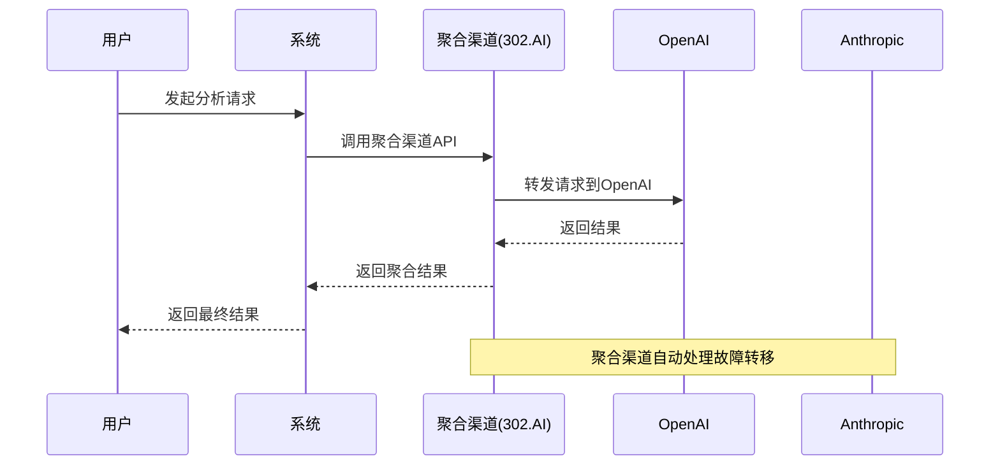
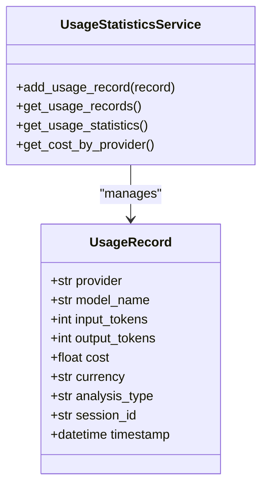

# LLM配置

<cite>
**本文档引用文件**   
- [model_capabilities.py](file://app/constants/model_capabilities.py)
- [config.py](file://app/routers/config.py)
- [config_service.py](file://app/services/config_service.py)
- [model_capability_service.py](file://app/services/model_capability_service.py)
- [usage_statistics_service.py](file://app/services/usage_statistics_service.py)
- [llm-config.md](file://docs/configuration/llm-config.md)
- [custom-openai-endpoint.md](file://docs/configuration/custom-openai-endpoint.md)
- [dashscope-config.md](file://docs/configuration/dashscope-config.md)
- [deepseek-config.md](file://docs/configuration/deepseek-config.md)
- [API_KEY_PRIORITY.md](file://docs/configuration/API_KEY_PRIORITY.md)
- [DEFAULT_BASE_URL_USAGE.md](file://docs/configuration/DEFAULT_BASE_URL_USAGE.md)
- [token-tracking-guide.md](file://docs/configuration/token-tracking-guide.md)
</cite>

## 目录
1. [LLM提供商配置](#llm提供商配置)
2. [API密钥管理机制](#api密钥管理机制)
3. [模型选择策略与优先级设置](#模型选择策略与优先级设置)
4. [自定义OpenAI端点与Google AI服务配置](#自定义openai端点与google-ai服务配置)
5. [多提供商配置最佳实践](#多提供商配置最佳实践)
6. [故障转移与降级策略](#故障转移与降级策略)
7. [模型定价信息同步与使用统计跟踪](#模型定价信息同步与使用统计跟踪)

## LLM提供商配置

系统支持多种大语言模型提供商，包括通义千问（DashScope）、DeepSeek、OpenAI、Google AI、Anthropic、百度文心（Qianfan）、智谱AI（GLM）、月之暗面（Moonshot）等。每个提供商都有其默认的API基础地址，这些地址在系统中预定义，确保用户可以快速配置和使用。

提供商配置信息存储在`llm_providers`集合中，包含以下关键字段：
- **name**: 厂家标识符（如`dashscope`、`deepseek`）
- **display_name**: 显示名称
- **default_base_url**: 默认API地址
- **api_key_env_var**: 对应的环境变量名称
- **is_active**: 是否激活

系统支持的默认API地址如下：

| 厂家名称 | 默认API地址 |
|---------|--------------|
| google | https://generativelanguage.googleapis.com/v1 |
| dashscope | https://dashscope.aliyuncs.com/api/v1 |
| openai | https://api.openai.com/v1 |
| deepseek | https://api.deepseek.com |
| anthropic | https://api.anthropic.com |
| openrouter | https://openrouter.ai/api/v1 |
| qianfan | https://qianfan.baidubce.com/v2 |
| 302ai | https://api.302.ai/v1 |

**Section sources**
- [DEFAULT_BASE_URL_USAGE.md](file://docs/configuration/DEFAULT_BASE_URL_USAGE.md)
- [config_service.py](file://app/services/config_service.py#L24-L800)

## API密钥管理机制

系统的API密钥管理遵循严格的优先级规则，确保配置的灵活性和安全性。API密钥可以从两个主要来源获取：MongoDB数据库和环境变量（`.env`文件）。

### 配置优先级规则

系统遵循以下优先级顺序来确定API密钥：
```
有效的数据库配置 > 环境变量配置 > 无配置（报错）
```

**有效的数据库配置**需满足以下条件：
- API密钥不为空
- 不以`your_`或`your-`开头（避免占位符）
- 长度大于10个字符

### 配置来源与验证逻辑

1. **数据库配置**（推荐用于生产环境）：
   - 通过Web界面在`llm_providers`集合中配置
   - 支持在线编辑和更新，无需重启服务
   - 适用于多用户共享场景

2. **环境变量配置**（推荐用于开发环境）：
   - 在`.env`文件中设置，如`DEEPSEEK_API_KEY=your_key_here`
   - 作为数据库配置的兜底方案
   - 适合快速开发和测试

### 配置选择流程

```mermaid
flowchart TD
A[开始] --> B{数据库API密钥是否有效?}
B --> |是| C[使用数据库密钥<br>来源标记为"database"]
B --> |否| D{环境变量密钥是否有效?}
D --> |是| E[使用环境变量密钥<br>来源标记为"environment"]
D --> |否| F[报错：未配置有效API密钥]
```

**Diagram sources**
- [API_KEY_PRIORITY.md](file://docs/configuration/API_KEY_PRIORITY.md)

**Section sources**
- [API_KEY_PRIORITY.md](file://docs/configuration/API_KEY_PRIORITY.md)
- [config.py](file://app/routers/config.py#L561-L622)

## 模型选择策略与优先级设置

系统采用智能模型选择策略，根据分析深度和任务需求自动推荐最合适的模型。该策略基于模型能力分级系统，确保分析质量和成本效益的平衡。

### 模型能力分级系统

模型能力分为5个等级，从1（基础）到5（旗舰），每个等级对应不同的分析深度和适用场景：

| 能力等级 | 描述 | 适用分析深度 |
|---------|------|-------------|
| 1 | 基础模型 | 快速、基础 |
| 2 | 标准模型 | 快速、基础、标准 |
| 3 | 高级模型 | 基础、标准、深度 |
| 4 | 专业模型 | 标准、深度、全面 |
| 5 | 旗舰模型 | 深度、全面 |

### 分析深度要求

不同分析深度对模型能力有最低要求：



**Diagram sources**
- [model_capabilities.py](file://app/constants/model_capabilities.py#L53-L90)

### 模型推荐流程

当用户发起分析请求时，系统执行以下流程：

1. **验证用户选择的模型**：检查快速分析模型和深度分析模型是否满足当前分析深度的要求
2. **自动推荐模型**：如果用户未选择或选择的模型不合适，系统根据分析深度自动推荐最佳模型对
3. **服务路由**：根据推荐的模型，查找对应的提供商和API URL，建立连接

```python
# 伪代码示例
def recommend_models_for_depth(research_depth: str) -> Tuple[str, str]:
    requirements = ANALYSIS_DEPTH_REQUIREMENTS[research_depth]
    
    # 筛选适合快速分析的模型
    quick_candidates = filter_models(
        suitable_roles=[ModelRole.QUICK_ANALYSIS, ModelRole.BOTH],
        min_capability=requirements["quick_model_min"],
        required_features=[ModelFeature.TOOL_CALLING]
    )
    
    # 筛选适合深度分析的模型
    deep_candidates = filter_models(
        suitable_roles=[ModelRole.DEEP_ANALYSIS, ModelRole.BOTH],
        min_capability=requirements["deep_model_min"]
    )
    
    # 按性价比排序并选择最佳模型
    quick_model = sort_by_cost_effectiveness(quick_candidates)[0]
    deep_model = sort_by_quality(deep_candidates)[0]
    
    return quick_model, deep_model
```

**Section sources**
- [model_capabilities.py](file://app/constants/model_capabilities.py#L1-L459)
- [model_capability_service.py](file://app/services/model_capability_service.py#L1-L431)

## 自定义OpenAI端点与Google AI服务配置

系统支持自定义OpenAI兼容端点，允许用户使用任何符合OpenAI API格式的服务，包括官方OpenAI、第三方代理服务、本地部署模型等。

### 自定义OpenAI端点配置

#### 支持的场景

| 场景 | API端点URL | 说明 |
|------|-----------|------|
| 官方OpenAI | `https://api.openai.com/v1` | 使用官方API服务 |
| DeepSeek | `https://api.deepseek.com/v1` | 使用DeepSeek API |
| 本地部署 | `http://localhost:8000/v1` | 使用本地Ollama或vLLM服务 |
| 硅基流动 | `https://api.siliconflow.cn/v1` | 免费的OpenAI兼容服务 |

#### 配置方法

1. **Web界面配置**：
   - 在LLM配置中选择"自定义OpenAI端点"
   - 输入API端点URL和API密钥
   - 从预置列表中选择模型或手动输入

2. **环境变量配置**：
```bash
CUSTOM_OPENAI_API_KEY=your_api_key_here
CUSTOM_OPENAI_BASE_URL=https://api.openai.com/v1
```

### Google AI服务配置

Google AI服务通过`generativelanguage.googleapis.com` API提供，支持Gemini系列模型。配置时需注意：

- **API密钥**：通过`GOOGLE_API_KEY`环境变量或数据库配置
- **默认API地址**：`https://generativelanguage.googleapis.com/v1beta`
- **模型映射**：系统内置了Gemini模型的能力配置，如`gemini-pro`、`gemini-1.5-pro`等

```json
{
    "name": "google",
    "display_name": "Google AI",
    "default_base_url": "https://generativelanguage.googleapis.com/v1beta",
    "api_key_env_var": "GOOGLE_API_KEY"
}
```

**Section sources**
- [custom-openai-endpoint.md](file://docs/configuration/custom-openai-endpoint.md)
- [google-ai-base-url-support.md](file://docs/google-ai-base-url-support.md)

## 多提供商配置最佳实践

### 推荐配置策略

| 场景 | 推荐提供商 | 说明 |
|------|-----------|------|
| 国内访问 | 通义千问、DeepSeek | 无需翻墙，网络稳定 |
| 成本敏感 | DeepSeek、Gemini Flash | 价格低廉，性价比高 |
| 高质量分析 | GPT-4、Claude Opus | 输出质量高，推理能力强 |
| 中文优化 | 通义千问、DeepSeek | 中文理解和生成优秀 |

### 混合模式配置

推荐采用混合模式，结合多个提供商的优势：



**Diagram sources**
- [llm-config.md](file://docs/configuration/llm-config.md)

### 配置管理建议

1. **生产环境**：使用Web界面在数据库中集中管理API密钥
2. **开发环境**：使用`.env`文件配置，便于快速切换
3. **安全实践**：
   - 定期轮换API密钥
   - 限制密钥权限范围
   - 监控密钥使用情况

## 故障转移与降级策略

系统实现了完善的故障转移和降级机制，确保在某个提供商服务不可用时，能够自动切换到备用方案。

### 故障检测机制

系统通过以下方式检测服务状态：
- **API测试端点**：`/llm/providers/{provider_id}/test` 可测试特定提供商的连通性
- **超时重试**：默认超时180秒，重试3次
- **健康检查**：定期检查各提供商的可用性

### 降级策略

当主要模型不可用时，系统按以下优先级降级：

1. **同提供商降级**：如`qwen-max` → `qwen-plus` → `qwen-turbo`
2. **跨提供商降级**：如OpenAI → DeepSeek → 通义千问
3. **功能降级**：关闭工具调用，仅使用基础对话能力

### 聚合渠道支持

系统支持302.AI、OpenRouter等聚合渠道，这些渠道可以作为故障转移的中间层：



**Diagram sources**
- [AGGREGATOR_IMPLEMENTATION_SUMMARY.md](file://docs/features/aggregator/AGGREGATOR_IMPLEMENTATION_SUMMARY.md)

## 模型定价信息同步与使用统计跟踪

系统集成了完整的使用统计和成本跟踪功能，帮助用户监控和优化LLM使用成本。

### 定价配置

用户可以在模型配置中设置定价信息，用于成本计算：

```python
class LLMConfigRequest(BaseModel):
    # ... 其他字段
    input_price_per_1k: Optional[float] = None  # 每1000个输入token的价格
    output_price_per_1k: Optional[float] = None  # 每1000个输出token的价格
    currency: str = "CNY"  # 货币单位
```

### 使用统计跟踪

系统通过`UsageStatisticsService`服务记录每次API调用的详细信息：



**Diagram sources**
- [usage_statistics_service.py](file://app/services/usage_statistics_service.py#L1-L238)

### 统计分析功能

系统提供多维度的使用统计分析：

- **按提供商统计**：显示各提供商的成本占比
- **按模型统计**：显示前10个模型的成本
- **每日成本趋势**：分析成本变化趋势
- **详细记录**：查看每次调用的输入/输出token、成本等

```python
# 获取最近7天的统计
stats = await usage_statistics_service.get_usage_statistics(days=7)
print(f"总请求数: {stats.total_requests}")
print(f"总成本: ¥{stats.total_cost:.4f}")

# 按提供商统计
for provider, data in stats.by_provider.items():
    print(f"{provider}: ¥{data['cost']:.4f}")
```

**Section sources**
- [token-tracking-guide.md](file://docs/configuration/token-tracking-guide.md)
- [USAGE_STATISTICS_AND_PRICING.md](file://docs/features/usage-statistics/USAGE_STATISTICS_AND_PRICING.md)