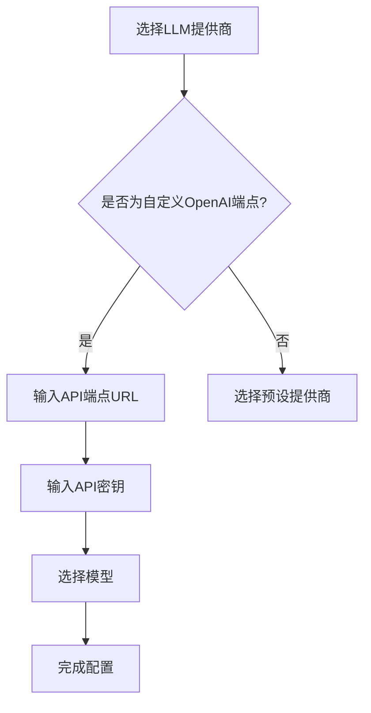
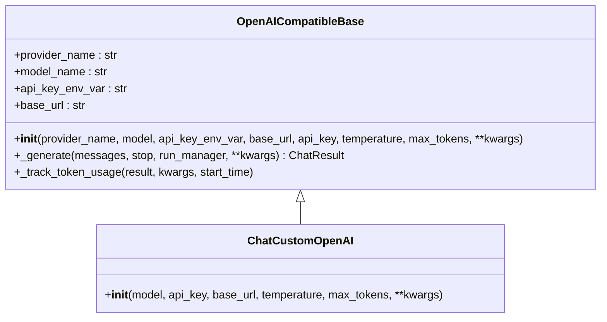
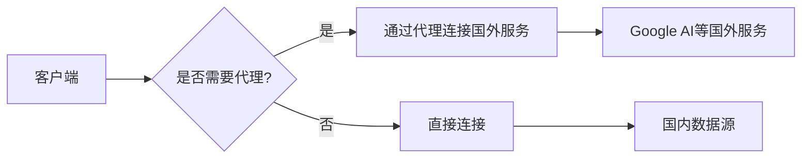
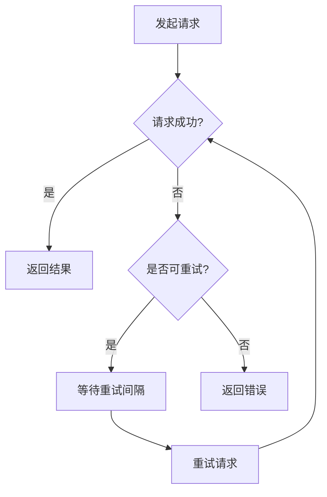

# OpenAI兼容接口配置

<cite>
**本文档引用文件**   
- [openai_compatible_base.py](file://tradingagents/llm_adapters/openai_compatible_base.py)
- [custom-openai-endpoint.md](file://docs/configuration/custom-openai-endpoint.md)
- [sidebar.py](file://web/components/sidebar.py)
- [config.py](file://app/core/config.py)
- [config_service.py](file://app/services/config_service.py)
- [config.py](file://app/models/config.py)
</cite>

## 目录
1. [简介](#简介)
2. [配置方法](#配置方法)
3. [系统集成](#系统集成)
4. [安全性考虑](#安全性考虑)
5. [错误处理与重试机制](#错误处理与重试机制)
6. [性能监控策略](#性能监控策略)
7. [使用示例](#使用示例)

## 简介
本系统支持OpenAI兼容接口配置，允许用户连接各种支持OpenAI API格式的服务，包括官方OpenAI API、第三方代理服务、本地部署模型以及其他兼容OpenAI格式的API服务。通过灵活的配置选项，用户可以自定义API端点URL、API密钥和基础URL，实现与不同提供商的无缝集成。

**Section sources**
- [custom-openai-endpoint.md](file://docs/configuration/custom-openai-endpoint.md#L1-L185)

## 配置方法
### 自定义端点配置
用户可以通过Web界面或CLI配置自定义OpenAI端点。在Web界面的"LLM配置"部分，选择"🔧 自定义OpenAI端点"后，输入API端点URL和API密钥即可完成配置。



**Diagram sources**
- [sidebar.py](file://web/components/sidebar.py#L479-L613)

### API密钥管理
API密钥可以通过两种方式配置：在Web界面直接输入，或在`.env`文件中设置环境变量。推荐使用环境变量方式，以提高安全性。

```bash
CUSTOM_OPENAI_API_KEY=your_api_key_here
CUSTOM_OPENAI_BASE_URL=https://api.openai.com/v1
```

**Section sources**
- [custom-openai-endpoint.md](file://docs/configuration/custom-openai-endpoint.md#L60-L71)

### 基础URL配置
基础URL用于指定API服务的地址。系统支持通过环境变量或数据库配置来设置默认端点，配置优先级为：模型配置 > 厂家配置 > 默认端点。

**Section sources**
- [openai_compatible_base.py](file://tradingagents/llm_adapters/openai_compatible_base.py#L409-L417)

## 系统集成
### 适配器架构
系统采用适配器模式实现OpenAI兼容接口，所有支持OpenAI接口的LLM提供商都继承自`OpenAICompatibleBase`基类。通过统一的工厂函数`create_openai_compatible_llm`创建实例。



**Diagram sources**
- [openai_compatible_base.py](file://tradingagents/llm_adapters/openai_compatible_base.py#L32-L427)

### 配置管理
系统配置通过`SystemConfig`模型管理，包含LLM配置、数据源配置和数据库配置等。配置信息存储在MongoDB数据库中，并通过`ConfigService`类提供CRUD操作。

**Section sources**
- [config_service.py](file://app/services/config_service.py#L362-L381)
- [config.py](file://app/models/config.py#L323-L351)

## 安全性考虑
### TLS配置
系统自动处理TLS连接，确保与API服务的安全通信。对于需要代理的环境，支持配置HTTP_PROXY、HTTPS_PROXY和NO_PROXY环境变量，以确保国内数据源直连。



**Diagram sources**
- [proxy_configuration.md](file://docs/configuration/proxy_configuration.md#L1-L312)

### 凭证保护
API密钥等敏感信息在存储时会进行脱敏处理，导出配置时会自动清空API密钥字段，防止敏感信息泄露。

**Section sources**
- [config_service.py](file://app/services/config_service.py#L727-L731)

## 错误处理与重试机制
### 错误处理
系统实现了完善的错误处理机制，包括API密钥验证、网络连接错误处理和速率限制处理。当API密钥无效或网络连接失败时，系统会抛出相应的异常并记录日志。

**Section sources**
- [openai_compatible_base.py](file://tradingagents/llm_adapters/openai_compatible_base.py#L94-L107)

### 重试机制
系统实现了智能重试机制，对于网络错误和超时错误会自动重试。重试次数和重试间隔可通过配置进行调整。



**Diagram sources**
- [request.ts](file://frontend/src/api/request.ts#L421-L458)

## 性能监控策略
### 日志记录
系统采用结构化日志记录，包含时间、名称、级别、跟踪ID和消息等信息。日志文件按天轮转，并支持JSON格式输出，便于日志分析和监控。

**Section sources**
- [logging_config.py](file://app/core/logging_config.py#L1-L424)

### 性能分析
系统记录每个请求的响应时间、token使用量等性能指标，并提供日志分析工具，帮助用户识别性能瓶颈。

**Section sources**
- [log_analyzer.py](file://scripts/log_analyzer.py#L132-L138)

## 使用示例
### 连接官方OpenAI API
```text
端点: https://api.openai.com/v1
密钥: 您的OpenAI API密钥
模型: gpt-4o-mini
```

### 连接本地部署模型
```text
端点: http://localhost:8000/v1
密钥: 任意值（本地服务通常不需要）
模型: llama-3.1-8b
```

### 连接第三方代理服务
```text
端点: https://your-proxy-service.com/v1
密钥: 您的代理服务密钥
模型: gpt-4o
```

**Section sources**
- [custom-openai-endpoint.md](file://docs/configuration/custom-openai-endpoint.md#L99-L111)