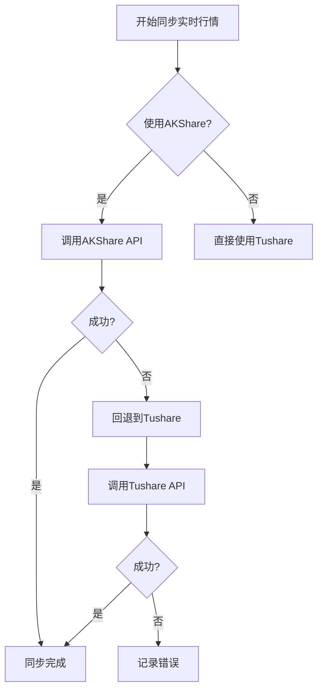

# AkShare配置

<cite>
**本文档引用文件**   
- [akshare_init_service.py](file://app/worker/akshare_init_service.py)
- [akshare_sync_service.py](file://app/worker/akshare_sync_service.py)
- [unified_config.py](file://app/core/unified_config.py)
- [providers_config.py](file://tradingagents/config/providers_config.py)
- [stock_sync.py](file://app/routers/stock_sync.py)
- [README.md](file://docs/guides/akshare_unified/README.md)
</cite>

## 目录
1. [引言](#引言)
2. [AkShare数据源配置](#akshare数据源配置)
3. [启用状态与同步频率](#启用状态与同步频率)
4. [基础URL自定义](#基础url自定义)
5. [多数据源优先级体系](#多数据源优先级体系)
6. [数据应用范围](#数据应用范围)
7. [性能优化建议](#性能优化建议)
8. [故障排除指南](#故障排除指南)
9. [结论](#结论)

## 引言

AkShare是一个开源的金融数据接口库，为系统提供免费的A股、港股等市场数据支持。本文档系统性地介绍AkShare在本项目中的集成与配置方式，涵盖数据源启用、同步策略、优先级管理、实际应用场景以及常见问题的解决方案。通过本配置文档，用户可以全面掌握如何有效利用AkShare作为核心或备用数据源，确保数据获取的稳定性与完整性。

**Section sources**
- [README.md](file://docs/guides/akshare_unified/README.md#L1-L10)

## AkShare数据源配置

AkShare数据源的配置主要通过环境变量和数据库配置两种方式实现。系统优先从数据库读取配置，若数据库中无配置，则回退到硬编码的默认配置。

### 启用与禁用

AkShare数据源默认处于启用状态。其启用状态可通过以下方式控制：
- **环境变量**：通过设置 `AKSHARE_ENABLED=true` 或 `false` 来控制。
- **数据库配置**：在 `system_configs` 集合中的 `data_source_configs` 数组里，将 `akshare` 的 `enabled` 字段设为 `true` 或 `false`。

### 核心配置参数

除了启用状态，AkShare还支持以下关键配置参数：
- **超时时间 (timeout)**：通过 `AKSHARE_TIMEOUT` 环境变量设置，默认为30秒。
- **速率限制 (rate_limit)**：通过 `AKSHARE_RATE_LIMIT` 设置每次API调用间的延迟，默认为0.2秒，以避免触发频率限制。
- **最大重试次数 (max_retries)**：通过 `AKSHARE_MAX_RETRIES` 设置，默认为3次。
- **缓存设置**：通过 `AKSHARE_CACHE_ENABLED` 和 `AKSHARE_CACHE_TTL` 控制是否启用缓存及缓存的生存时间（TTL）。

**Section sources**
- [providers_config.py](file://tradingagents/config/providers_config.py#L34-L42)
- [unified_config.py](file://app/core/unified_config.py#L300-L307)

## 启用状态与同步频率

AkShare的数据同步由一系列定时任务（Cron Job）驱动，这些任务通过环境变量进行精细化控制。

### 同步任务配置

以下是主要的同步任务及其默认的Cron表达式：

| 同步任务 | 环境变量 | 默认Cron表达式 | 说明 |
| :--- | :--- | :--- | :--- |
| 基础信息同步 | `AKSHARE_BASIC_INFO_SYNC_ENABLED` | `"0 3 * * *"` | 每日凌晨3点执行，更新股票列表和基础信息 |
| 实时行情同步 | `AKSHARE_QUOTES_SYNC_ENABLED` | `"*/30 9-15 * * 1-5"` | 工作日交易时间（9-15点）内每30分钟执行一次 |
| 历史数据同步 | `AKSHARE_HISTORICAL_SYNC_ENABLED` | `"0 17 * * 1-5"` | 工作日17点执行，增量更新历史K线数据 |
| 财务数据同步 | `AKSHARE_FINANCIAL_SYNC_ENABLED` | `"0 4 * * 0"` | 每周日凌晨4点执行，更新财务指标 |

### 手动同步

除了自动同步，系统还支持通过CLI或Web API手动触发同步。例如，使用CLI工具可以执行全量初始化：
```bash
python cli/akshare_init.py --full
```
这将依次执行基础信息、历史数据、财务数据和实时行情的同步。

**Section sources**
- [README.md](file://docs/guides/akshare_unified/README.md#L81-L95)
- [akshare_init_service.py](file://app/worker/akshare_init_service.py#L63-L171)

## 基础URL自定义

AkShare的请求基础URL（endpoint）可以自定义，以应对网络访问问题或使用镜像站点。

### 自定义Endpoint

在 `unified_config.py` 文件中，AkShare的默认endpoint被硬编码为 `https://akshare.akfamily.xyz`。用户可以通过修改数据库中的 `system_configs` 集合来覆盖此设置：
```json
{
  "data_source_configs": [
    {
      "name": "AKShare",
      "type": "AKSHARE",
      "endpoint": "https://your-custom-mirror.com", // 自定义URL
      "enabled": true,
      "priority": 1
    }
  ]
}
```
通过这种方式，可以将请求指向一个更稳定或更快的镜像服务器。

**Section sources**
- [unified_config.py](file://app/core/unified_config.py#L303)

## 多数据源优先级体系

系统采用多数据源优先级体系，以确保数据获取的高可用性。当首选数据源失败时，系统会自动降级到次选数据源。

### 优先级排序

根据代码和文档，A股数据源的默认优先级顺序为：
1.  **Tushare** (优先级2)
2.  **AKShare** (优先级1)
3.  **BaoStock** (优先级0)

此顺序意味着Tushare是首选，AKShare是重要的备选。该优先级在 `unified_config.py` 中通过 `priority` 字段定义，并按降序排序。

### 降级（Fallback）机制

当高优先级数据源（如Tushare）因API调用失败或网络问题而不可用时，系统会自动切换到AKShare。例如，在同步实时行情时，如果AKShare同步失败，系统会回退到Tushare进行全量同步。



**Diagram sources **
- [unified_config.py](file://app/core/unified_config.py#L287-L288)
- [stock_sync.py](file://app/routers/stock_sync.py#L171-L174)

**Section sources**
- [unified_config.py](file://app/core/unified_config.py#L287-L288)
- [stock_sync.py](file://app/routers/stock_sync.py#L171-L174)

## 数据应用范围

AkShare在系统中主要应用于以下三个核心场景：

### 股票列表获取

AKShare用于获取全市场的股票基础信息，包括股票代码、名称、行业、上市日期等。这是所有后续数据处理的基础。

### 实时行情

AKShare提供实时的股票行情数据，包括最新价、涨跌幅、成交量、成交额等。这些数据通过 `stock_zh_a_spot_em()` 接口获取，并用于前端的实时行情展示。

### K线数据

AKShare支持获取日线、周线和月线等不同周期的K线数据。系统通过 `get_historical_data` 方法同步历史行情，为技术分析和回测提供数据支持。

**Section sources**
- [akshare_sync_service.py](file://app/worker/akshare_sync_service.py#L87-L93)
- [akshare_sync_service.py](file://app/worker/akshare_sync_service.py#L235-L239)
- [akshare_sync_service.py](file://app/worker/akshare_sync_service.py#L532-L539)

## 性能优化建议

为了确保AkShare数据同步的高效与稳定，建议采取以下优化措施：

1.  **合理设置同步频率**：避免在非交易时间频繁调用实时行情接口，以减少不必要的网络请求和API压力。
2.  **利用增量同步**：历史数据同步应优先使用增量模式（`incremental=True`），仅同步自上次同步以来的新数据，大幅减少数据量和耗时。
3.  **配置合适的批处理大小**：在初始化或全量同步时，通过 `AKSHARE_INIT_BATCH_SIZE` 调整批处理大小，平衡内存占用和处理速度。
4.  **启用缓存**：确保 `AKSHARE_CACHE_ENABLED` 为 `true`，利用Redis等缓存层存储频繁访问的数据，显著降低对AKShare API的直接调用次数。

**Section sources**
- [akshare_sync_service.py](file://app/worker/akshare_sync_service.py#L35)
- [akshare_sync_service.py](file://app/worker/akshare_sync_service.py#L537)
- [README.md](file://docs/guides/akshare_unified/README.md#L187-L190)

## 故障排除指南

### 网络连接问题

**现象**：日志中出现 `AKShare连接失败` 或 `获取全市场快照失败` 等错误。

**解决方案**：
1.  **检查代理配置**：如果在公司网络或特殊网络环境下，确保 `.env` 文件中的 `HTTP_PROXY` 和 `HTTPS_PROXY` 配置正确。
2.  **绕过代理**：将AKShare的域名（如 `akshare.akfamily.xyz`）或其数据源（如 `eastmoney.com`）添加到 `NO_PROXY` 环境变量中，避免代理干扰。
3.  **测试连接**：运行 `scripts/test_proxy_config.ps1` 脚本来测试AKShare的连接是否正常。

### 数据格式异常

**现象**：同步成功但数据字段缺失或格式错误。

**解决方案**：
1.  **检查数据标准化**：确认 `akshare_sync_service.py` 中的 `_process_basic_info_batch` 和 `_get_and_save_quotes` 方法是否正确地将AKShare的原始数据转换为系统内部的统一数据模型。
2.  **查看日志**：检查日志中是否有 `数据库更新失败` 或 `获取基础信息失败` 的详细错误信息，定位具体是哪个字段或哪只股票出现问题。
3.  **强制更新**：对于特定股票，可以使用 `force_update=True` 参数强制重新获取其数据。

**Section sources**
- [test_proxy_config.ps1](file://scripts/test_proxy_config.ps1#L80-L97)
- [akshare_sync_service.py](file://app/worker/akshare_sync_service.py#L146-L180)
- [akshare_sync_service.py](file://app/worker/akshare_sync_service.py#L490-L530)

## 结论

AkShare作为本系统中一个关键的免费数据源，不仅提供了基础的金融数据支持，更在多数据源优先级体系中扮演着重要的“安全网”角色。通过合理的配置、同步策略和降级机制，系统能够有效保障数据获取的连续性和可靠性。用户应根据自身需求，灵活配置其启用状态、同步频率和基础URL，并遵循性能优化建议，以充分发挥AkShare的价值。同时，掌握故障排除方法，可以快速应对网络和数据异常，确保系统稳定运行。