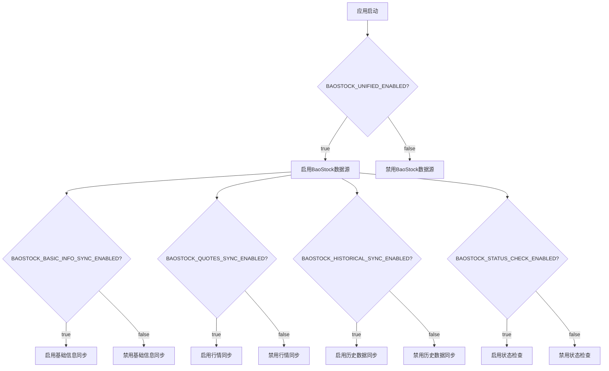
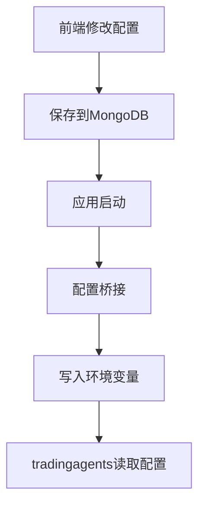
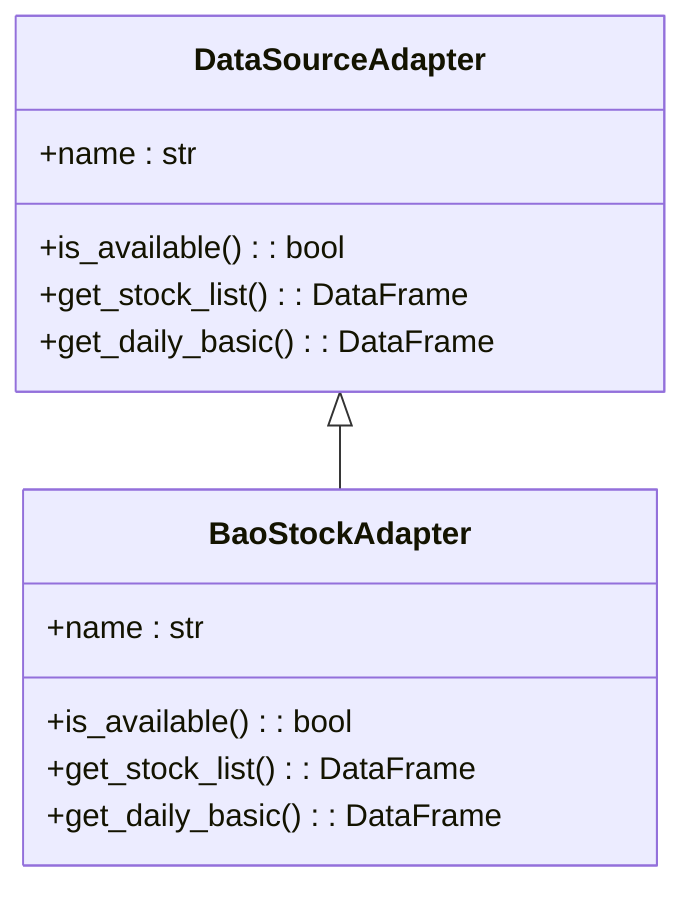

# BaoStock配置

<cite>
**本文档引用文件**   
- [baostock_init.py](file://app/routers/baostock_init.py)
- [baostock_init_service.py](file://app/worker/baostock_init_service.py)
- [baostock_sync_service.py](file://app/worker/baostock_sync_service.py)
- [baostock_adapter.py](file://app/services/data_sources/baostock_adapter.py)
- [baostock.py](file://tradingagents/dataflows/providers/china/baostock.py)
- [config.py](file://app/core/config.py)
- [rate_limiter.py](file://app/core/rate_limiter.py)
- [service_control.md](file://docs/deployment/operations/service_control.md)
- [README.md](file://docs/guides/baostock_unified/README.md)
</cite>

## 目录
1. [简介](#简介)
2. [启用/禁用控制](#启用禁用控制)
3. [连接参数设置](#连接参数设置)
4. [基础URL配置](#基础url配置)
5. [数据源优先级体系](#数据源优先级体系)
6. [历史数据获取优势](#历史数据获取优势)
7. [基本面数据获取优势](#基本面数据获取优势)
8. [配置验证流程](#配置验证流程)
9. [常见问题解决方案](#常见问题解决方案)

## 简介

BaoStock是一个免费的股票数据源，提供中国A股市场的历史数据、基本面数据和实时行情。本配置文档详细介绍了如何集成和配置BaoStock数据源，包括启用/禁用控制、连接参数设置、基础URL配置、数据源优先级体系、历史数据和基本面数据获取优势，以及配置验证流程和常见问题解决方案。

**Section sources**
- [baostock_init.py](file://app/routers/baostock_init.py#L1-L331)
- [README.md](file://docs/guides/baostock_unified/README.md#L62-L376)

## 启用/禁用控制

BaoStock数据源的启用和禁用通过环境变量进行控制。主要的控制开关包括：

- `BAOSTOCK_UNIFIED_ENABLED`: BaoStock统一数据同步总开关
- `BAOSTOCK_BASIC_INFO_SYNC_ENABLED`: 基础信息同步开关
- `BAOSTOCK_QUOTES_SYNC_ENABLED`: 行情同步开关
- `BAOSTOCK_HISTORICAL_SYNC_ENABLED`: 历史数据同步开关
- `BAOSTOCK_STATUS_CHECK_ENABLED`: 状态检查开关

这些开关可以在`.env`文件中进行配置，修改后需要重启应用才能生效。



**Diagram sources**
- [config.py](file://app/core/config.py#L235-L246)
- [service_control.md](file://docs/deployment/operations/service_control.md#L59-L63)

## 连接参数设置

BaoStock的连接参数主要通过环境变量进行配置，包括同步任务的CRON表达式和初始化参数。

### 同步任务配置

| 环境变量 | 默认值 | 说明 |
|--------|--------|------|
| `BAOSTOCK_BASIC_INFO_SYNC_CRON` | `"0 4 * * *"` | 基础信息同步时间（每日4点） |
| `BAOSTOCK_DAILY_QUOTES_SYNC_CRON` | `"0 16 * * 1-5"` | 日K线同步时间（工作日16点） |
| `BAOSTOCK_HISTORICAL_SYNC_CRON` | `"0 18 * * 1-5"` | 历史数据同步时间（工作日18点） |
| `BAOSTOCK_STATUS_CHECK_CRON` | `"45 * * * *"` | 状态检查时间（每小时45分） |

### 初始化配置

| 环境变量 | 默认值 | 说明 |
|--------|--------|------|
| `BAOSTOCK_INIT_HISTORICAL_DAYS` | `365` | 初始化历史数据天数 |
| `BAOSTOCK_INIT_BATCH_SIZE` | `50` | 初始化批处理大小 |
| `BAOSTOCK_INIT_AUTO_START` | `false` | 应用启动时自动初始化 |

**Section sources**
- [config.py](file://app/core/config.py#L240-L251)
- [README.md](file://docs/guides/baostock_unified/README.md#L164-L175)

## 基础URL配置

BaoStock数据源的基础URL配置主要通过环境变量和代码默认值进行管理。系统使用配置桥接机制将数据库中的配置同步到环境变量，确保tradingagents模块能够正确读取配置。

配置流程如下：
1. 前端修改配置
2. 配置保存到MongoDB数据库
3. 应用启动时，配置桥接机制将数据库配置同步到环境变量
4. tradingagents模块通过环境变量读取配置



**Diagram sources**
- [CONFIG_SYSTEM_VERIFICATION.md](file://docs/configuration/CONFIG_SYSTEM_VERIFICATION.md#L194-L247)
- [config_bridge.py](file://app/core/config_bridge.py#L71-L118)

## 数据源优先级体系

BaoStock在数据源优先级体系中扮演着重要的角色。系统采用多数据源架构，BaoStock与Tushare、AKShare形成三数据源架构：

- **Tushare**: 专业付费数据，高质量
- **AKShare**: 免费社区数据，覆盖面广
- **BaoStock**: 免费官方数据，历史悠久

BaoStock的优先级设置为1（数字越大优先级越高），在数据获取时作为备用数据源。当主要数据源（如Tushare）不可用时，系统会自动切换到BaoStock获取数据。



**Diagram sources**
- [baostock_adapter.py](file://app/services/data_sources/baostock_adapter.py#L14-L25)
- [README.md](file://docs/guides/baostock_unified/README.md#L362-L366)

## 历史数据获取优势

BaoStock在获取历史数据方面具有显著优势：

- **历史覆盖**: 支持1990年以来的历史数据，覆盖A股市场的完整历史
- **数据质量**: 社区维护，数据相对稳定
- **免费开源**: BaoStock完全免费，无需注册
- **API稳定**: 提供稳定的API接口，支持日线、周线、月线数据

历史数据同步支持增量模式，每只股票从自己的最后日期开始同步，确保数据的完整性和一致性。

**Section sources**
- [baostock_sync_service.py](file://app/worker/baostock_sync_service.py#L348-L412)
- [README.md](file://docs/guides/baostock_unified/README.md#L154-L155)

## 基本面数据获取优势

BaoStock在获取基本面数据方面同样具有优势：

- **财务数据**: 提供利润表、资产负债表、现金流量表等财务数据
- **估值数据**: 提供PE、PB、PS、PCF等估值指标
- **行业信息**: 提供股票的行业分类信息
- **更新频率**: 季度更新，确保数据的时效性

BaoStock通过`get_financial_data`方法获取财务数据，支持按年份和季度查询，满足不同分析需求。

**Section sources**
- [baostock.py](file://tradingagents/dataflows/providers/china/baostock.py#L638-L720)
- [README.md](file://docs/guides/baostock_unified/README.md#L148-L149)

## 配置验证流程

配置验证流程包括以下几个步骤：

1. **测试连接**: 使用CLI工具或Web API测试BaoStock连接
2. **检查数据库状态**: 检查数据库中BaoStock数据的状态
3. **启动初始化**: 启动完整或基础初始化任务
4. **查看初始化状态**: 获取初始化任务的进度和状态
5. **验证数据完整性**: 检查数据的完整性和一致性

### CLI方式验证

```bash
# 测试连接
python cli/baostock_init.py --test-connection

# 检查数据库状态
python cli/baostock_init.py --check-only

# 完整初始化
python cli/baostock_init.py --full

# 查看初始化状态
python cli/baostock_init.py --check-only
```

### Web API方式验证

```bash
# 测试连接
curl -X GET "http://localhost:8000/api/baostock-init/connection-test"

# 启动完整初始化
curl -X POST "http://localhost:8000/api/baostock-init/start-full" \
  -H "Content-Type: application/json" \
  -d '{"historical_days": 365, "force": false}'

# 查看初始化状态
curl -X GET "http://localhost:8000/api/baostock-init/initialization-status"
```

**Section sources**
- [baostock_init.py](file://app/routers/baostock_init.py#L62-L80)
- [README.md](file://docs/guides/baostock_unified/README.md#L98-L137)

## 常见问题解决方案

### 登录失败

**问题**: BaoStock登录失败，错误信息为"登录失败: {lg.error_msg}"

**解决方案**:
1. 检查网络连接，确保能够访问BaoStock服务器
2. 重试连接，可能是临时网络问题
3. 检查BaoStock服务状态

```bash
# 测试连接
python cli/baostock_init.py --test-connection
```

### 会话超时

**问题**: BaoStock会话超时，导致数据同步中断

**解决方案**:
1. 增加批处理之间的sleep间隔，避免API调用过于频繁
2. 调整批处理大小，减少单次请求的数据量
3. 实现智能重试机制，自动重试失败的请求

```python
# 在同步服务中增加sleep间隔
await asyncio.sleep(0.5)
```

### 数据同步慢

**问题**: BaoStock数据同步速度慢

**解决方案**:
1. 调整批处理大小，平衡速度和稳定性
2. 检查网络延迟，优化网络连接
3. 限制历史数据范围，减少同步数据量

```bash
# 调整批处理大小
BAOSTOCK_INIT_BATCH_SIZE=30

# 限制历史数据范围
BAOSTOCK_INIT_HISTORICAL_DAYS=180
```

### 内存占用高

**问题**: BaoStock数据同步过程中内存占用高

**解决方案**:
1. 减少批处理大小，降低内存占用
2. 限制历史数据范围，减少内存中的数据量
3. 优化数据处理逻辑，及时释放内存

```bash
# 减少批处理大小
BAOSTOCK_INIT_BATCH_SIZE=20
```

**Section sources**
- [README.md](file://docs/guides/baostock_unified/README.md#L287-L314)
- [baostock_sync_service.py](file://app/worker/baostock_sync_service.py#L403-L404)