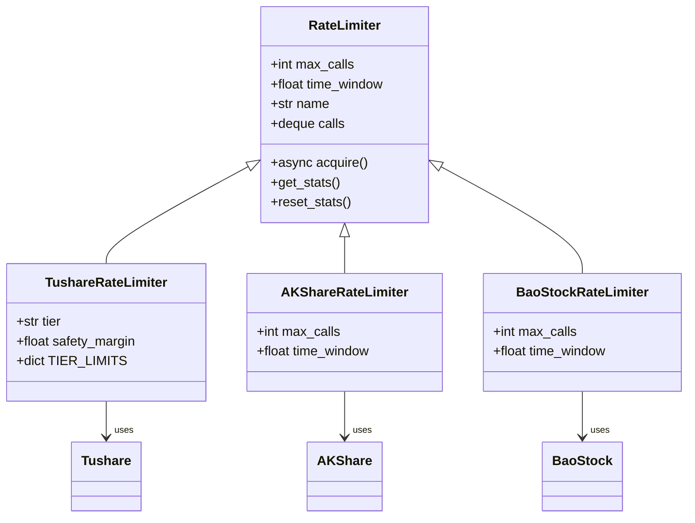
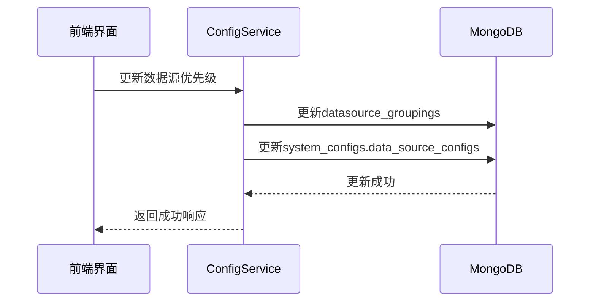
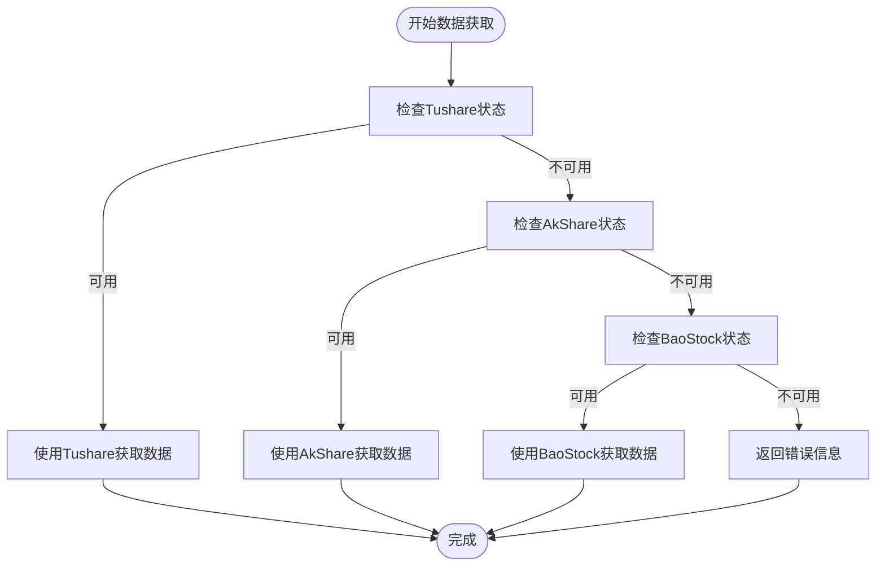
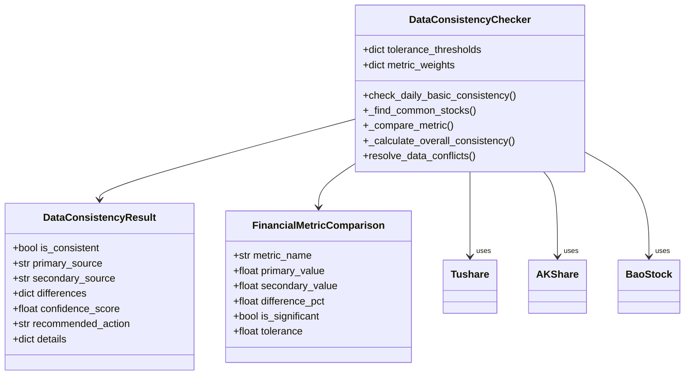

# A股数据源配置

<cite>
**本文档引用文件**   
- [config.py](file://app/core/config.py)
- [config.py](file://app/models/config.py)
- [config_service.py](file://app/services/config_service.py)
- [tushare_init.py](file://app/routers/tushare_init.py)
- [akshare_init.py](file://app/routers/akshare_init.py)
- [baostock_init.py](file://app/routers/baostock_init.py)
- [api_key_utils.py](file://app/utils/api_key_utils.py)
- [rate_limiter.py](file://app/core/rate_limiter.py)
- [data_consistency_checker.py](file://app/services/data_consistency_checker.py)
- [multi_source_basics_sync_service.py](file://app/services/multi_source_basics_sync_service.py)
- [multi_source_sync.py](file://app/routers/multi_source_sync.py)
</cite>

## 目录
1. [引言](#引言)
2. [数据源配置方法](#数据源配置方法)
3. [API密钥配置](#api密钥配置)
4. [速率限制设置](#速率限制设置)
5. [优先级管理机制](#优先级管理机制)
6. [降级策略](#降级策略)
7. [一致性检查流程](#一致性检查流程)
8. [配置示例](#配置示例)
9. [最佳实践建议](#最佳实践建议)

## 引言
本文档详细说明了A股数据源Tushare、AkShare和BaoStock的配置方法。系统通过多数据源配置机制，实现了数据获取的高可用性和容错能力。文档涵盖了API密钥配置、速率限制设置、优先级管理、降级策略和一致性检查等关键配置方面，为用户提供全面的配置指导和最佳实践建议。

## 数据源配置方法
A股数据源的配置主要通过系统配置文件和数据库配置两种方式实现。系统支持Tushare、AkShare和BaoStock三种主要数据源，每种数据源都有独立的配置参数和初始化流程。

Tushare作为专业金融数据接口，提供高质量的A股数据和财务指标。AkShare作为开源金融数据库，提供基础的股票信息。BaoStock作为免费开源的证券数据平台，提供历史数据支持。三种数据源可以同时配置，系统会根据优先级和可用性自动选择最优数据源。

数据源配置的核心是`DataSourceConfig`模型，它定义了数据源的名称、类型、API密钥、端点、超时设置、速率限制、启用状态、优先级和额外配置参数等属性。系统通过`ConfigService`服务管理这些配置，支持动态添加、更新和删除数据源配置。

**Section sources**
- [config.py](file://app/models/config.py#L237-L256)
- [config_service.py](file://app/services/config_service.py#L434-L455)

## API密钥配置
API密钥是访问数据源的关键凭证，不同数据源有不同的密钥配置方式和验证机制。

### Tushare API密钥配置
Tushare使用Token作为API密钥，配置方式如下：
- 环境变量：在`.env`文件中设置`TUSHARE_TOKEN=your_token_here`
- 数据库配置：通过系统管理界面在数据库中配置Tushare Token
- 配置文件：在`config.py`中直接设置`TUSHARE_TOKEN`参数

系统会优先从数据库读取Token，如果数据库中没有配置，则从环境变量读取。这种设计支持动态更新Token而无需重启服务。

### AkShare和BaoStock配置
AkShare和BaoStock作为开源数据源，通常不需要API密钥。但在某些情况下，可能需要配置API密钥或认证信息：
- AkShare：一般无需密钥，直接通过HTTP请求获取数据
- BaoStock：需要在初始化时登录，但不需要长期有效的API密钥

### API密钥验证
系统提供了API密钥验证工具，确保密钥的有效性：
- 长度检查：密钥长度必须大于10个字符
- 格式检查：不能是占位符（如"your_token_here"）
- 截断检查：不能包含"..."等截断符号
- 有效性检查：通过实际连接测试验证密钥是否有效

系统还提供了密钥缩略功能，显示密钥的前6位和后6位，中间用"..."代替，既保护了密钥安全，又便于识别。

**Section sources**
- [config.py](file://app/core/config.py#L186-L187)
- [api_key_utils.py](file://app/utils/api_key_utils.py#L11-L165)

## 速率限制设置
为了防止对数据源的过度请求，系统实现了精细的速率限制机制，保护数据源的稳定性和避免被封禁。

### 全局速率限制
系统在`config.py`中定义了全局速率限制：
- `DEFAULT_RATE_LIMIT`: 默认每分钟100次请求
- `RATE_LIMIT_ENABLED`: 是否启用速率限制

这些设置可以通过环境变量或数据库配置进行覆盖，实现灵活的速率控制。

### 数据源专用速率限制器
系统为每个数据源实现了专用的速率限制器，根据各数据源的特点进行优化配置：

#### Tushare速率限制
Tushare根据用户积分等级有不同的速率限制：
- 免费用户：100次/分钟
- 基础用户：200次/分钟  
- 标准用户：400次/分钟
- 高级用户：600次/分钟
- VIP用户：800次/分钟

系统通过`TushareRateLimiter`类实现，支持安全边际设置（默认0.8），实际限制为理论限制的80%，避免达到上限。



**Diagram sources**
- [rate_limiter.py](file://app/core/rate_limiter.py#L14-L229)

#### AkShare速率限制
AkShare没有明确的限流规则，系统采用保守策略：
- 默认限制：60次/分钟
- 可配置参数：支持自定义最大调用次数和时间窗口

#### BaoStock速率限制
BaoStock同样没有明确的限流规则，系统配置：
- 默认限制：100次/分钟
- 适用于历史数据批量获取场景

### 速率限制实现
系统使用滑动窗口算法实现速率限制，确保精确控制API调用频率。`RateLimiter`类通过维护一个调用时间戳队列，实时计算当前窗口内的调用次数，当达到上限时自动等待。

系统还实现了全局速率限制器实例，确保同一数据源的限制器在整个应用中是单例的，避免重复创建和资源浪费。

**Section sources**
- [rate_limiter.py](file://app/core/rate_limiter.py#L14-L229)
- [config.py](file://app/core/config.py#L96-L97)

## 优先级管理机制
系统的多数据源优先级管理机制是确保数据获取稳定性的核心。通过合理的优先级设置，系统能够在主数据源不可用时自动切换到备用数据源。

### 优先级配置
优先级通过`DataSourceConfig`模型的`priority`字段配置，数字越大优先级越高。系统默认配置：
- Tushare：优先级2（最高）
- AKShare：优先级1
- BaoStock：优先级0

优先级可以在系统管理界面动态调整，无需重启服务即可生效。当配置更新时，系统会自动同步到运行时配置，确保优先级变更立即生效。

### 优先级同步机制
系统实现了双存储机制确保优先级配置的一致性：
1. **数据库存储**：`system_configs`集合存储完整的系统配置
2. **分组关系存储**：`datasource_groupings`集合存储数据源与市场分类的关系

当在管理界面调整数据源优先级时，系统会同时更新这两个集合，确保配置的一致性。这种设计既支持灵活的前端管理，又保证了后端数据获取的正确性。



**Diagram sources**
- [config_service.py](file://app/services/config_service.py#L220-L360)
- [multi_source_sync.py](file://app/routers/multi_source_sync.py#L137-L188)

### 优先级决策流程
系统在获取数据时的优先级决策流程如下：
1. 获取所有启用的数据源
2. 按优先级从高到低排序
3. 依次尝试每个数据源
4. 使用第一个成功响应的数据源
5. 记录实际使用的数据源

这种流程确保了高优先级数据源的优先使用，同时保留了降级到备用数据源的能力。

**Section sources**
- [config_service.py](file://app/services/config_service.py#L220-L360)
- [multi_source_basics_sync_service.py](file://app/services/multi_source_basics_sync_service.py#L33-L38)

## 降级策略
系统的降级策略是多数据源架构的核心优势，确保在主数据源故障时仍能提供基本服务。

### 降级机制
系统采用"主-备"降级模式，优先级最高的数据源作为主数据源，其余为备用数据源。降级流程如下：
1. 首先尝试主数据源（Tushare）
2. 如果主数据源连接失败或返回错误，降级到次优先级数据源（AkShare）
3. 如果次数据源也失败，继续降级到最后的数据源（BaoStock）
4. 如果所有数据源都失败，返回错误信息

降级策略通过`DataSourceManager`实现，该管理器维护所有可用的数据源适配器，并按优先级排序。当获取数据时，管理器会依次尝试每个适配器，直到成功或全部失败。

### 连接测试与状态检查
系统定期对数据源进行连接测试和状态检查，提前发现潜在问题：
- Tushare：每小时检查一次状态
- AkShare：每小时30分检查一次状态
- BaoStock：每小时45分检查一次状态

这些检查通过定时任务自动执行，结果存储在数据库中，供降级决策参考。如果某个数据源连续多次检查失败，系统会临时降低其优先级或标记为不可用。

### 降级触发条件
降级在以下情况下触发：
- 连接超时
- 认证失败
- 接口返回错误码
- 响应数据格式异常
- 速率限制达到上限

系统会记录每次降级的原因和时间，便于后续分析和优化。



**Diagram sources**
- [multi_source_basics_sync_service.py](file://app/services/multi_source_basics_sync_service.py#L143-L333)
- [multi_source_sync.py](file://app/routers/multi_source_sync.py#L272-L347)

**Section sources**
- [multi_source_basics_sync_service.py](file://app/services/multi_source_basics_sync_service.py#L143-L333)
- [multi_source_sync.py](file://app/routers/multi_source_sync.py#L272-L347)

## 一致性检查流程
由于不同数据源可能存在数据差异，系统实现了数据一致性检查流程，确保数据质量。

### 一致性检查机制
系统通过`DataConsistencyChecker`服务实现一致性检查，主要检查以下指标：
- 市盈率（PE）：允许5%差异
- 市净率（PB）：允许5%差异
- 总市值：允许2%差异
- 股价：允许1%差异
- 成交量：允许10%差异
- 换手率：允许5%差异

检查流程如下：
1. 从主数据源和备用数据源获取相同股票的数据
2. 找出共同的股票代码
3. 逐指标比较关键财务数据
4. 计算差异百分比
5. 根据预设阈值判断是否显著差异
6. 生成整体一致性评分

### 置信度评分
系统使用加权算法计算数据一致性置信度评分，不同指标有不同的权重：
- PE：25%
- PB：25%
- 总市值：20%
- 股价：15%
- 成交量：10%
- 换手率：5%

置信度评分决定最终的数据使用策略：
- >0.8：数据高度一致，可以使用任一数据源
- >0.6：数据存在轻微差异，使用主数据源并发出警告
- >0.3：数据差异较大，仅使用主数据源
- ≤0.3：数据源存在严重问题，需要人工调查

### 冲突解决策略
当发现数据不一致时，系统根据一致性检查结果采取不同的解决策略：
- **使用主数据源**：当数据差异在可接受范围内
- **警告提示**：当存在轻微差异时，在结果中添加警告信息
- **数据融合**：对于某些指标，可以取多个数据源的平均值
- **人工干预**：当差异过大时，标记为需要人工核查



**Diagram sources**
- [data_consistency_checker.py](file://app/services/data_consistency_checker.py#L35-L319)

**Section sources**
- [data_consistency_checker.py](file://app/services/data_consistency_checker.py#L35-L319)

## 配置示例
以下是一些常见的数据源配置示例，展示如何在不同场景下配置系统。

### 基本配置示例
```python
# .env 配置文件
TUSHARE_TOKEN=your_tushare_token_here
AKSHARE_ENABLED=true
BAOSTOCK_ENABLED=true
```

```json
// 系统配置JSON
{
  "data_source_configs": [
    {
      "name": "Tushare",
      "type": "tushare",
      "api_key": "your_tushare_token",
      "enabled": true,
      "priority": 2
    },
    {
      "name": "AKShare",
      "type": "akshare",
      "enabled": true,
      "priority": 1
    },
    {
      "name": "BaoStock",
      "type": "baostock",
      "enabled": true,
      "priority": 0
    }
  ]
}
```

### 高可用配置示例
```python
# 生产环境配置
TUSHARE_TOKEN=your_tushare_token_here
TUSHARE_TIER=standard
TUSHARE_RATE_LIMIT_SAFETY_MARGIN=0.8
AKSHARE_UNIFIED_ENABLED=true
BAOSTOCK_UNIFIED_ENABLED=true
CONFIG_SOT=file
```

### 开发环境配置示例
```python
# 开发环境配置
TUSHARE_TOKEN=your_tushare_token_here
AKSHARE_ENABLED=true
BAOSTOCK_ENABLED=false
DEBUG=true
LOG_LEVEL=DEBUG
```

这些配置示例展示了如何根据不同的使用场景调整数据源配置，从基本使用到高可用生产环境，再到开发调试环境。

**Section sources**
- [config.py](file://app/core/config.py)
- [config.py](file://app/models/config.py)

## 最佳实践建议
为了确保系统稳定运行和数据质量，以下是一些最佳实践建议：

### 数据源配置建议
1. **主备配置**：始终配置至少两个数据源，确保主数据源故障时有备用方案
2. **优先级设置**：根据数据质量和稳定性合理设置优先级，Tushare通常作为主数据源
3. **定期检查**：定期检查数据源状态和API密钥有效性，避免突然失效
4. **监控告警**：设置数据源状态监控和告警，及时发现潜在问题

### API密钥管理建议
1. **安全存储**：不要在代码中硬编码API密钥，使用环境变量或安全的配置管理
2. **定期轮换**：定期轮换API密钥，降低泄露风险
3. **权限最小化**：使用具有最小必要权限的API密钥，避免过度授权
4. **备份方案**：准备备用API密钥，主密钥失效时可快速切换

### 性能优化建议
1. **合理限流**：根据实际需求设置合理的速率限制，避免过度请求
2. **缓存策略**：充分利用系统缓存，减少重复请求
3. **批量获取**：尽量使用批量接口获取数据，减少请求次数
4. **异步处理**：对耗时操作使用异步处理，提高系统响应速度

### 故障处理建议
1. **降级预案**：制定详细的降级预案，明确各级降级的触发条件和处理流程
2. **日志记录**：详细记录数据获取过程中的关键信息，便于问题排查
3. **自动恢复**：实现自动恢复机制，数据源恢复正常后自动切换回主数据源
4. **人工干预**：对于严重不一致的情况，设置人工干预流程，确保数据质量

通过遵循这些最佳实践，可以最大限度地提高系统的稳定性和数据质量，确保A股数据获取的可靠性和准确性。

**Section sources**
- [config.py](file://app/core/config.py)
- [config_service.py](file://app/services/config_service.py)
- [multi_source_basics_sync_service.py](file://app/services/multi_source_basics_sync_service.py)