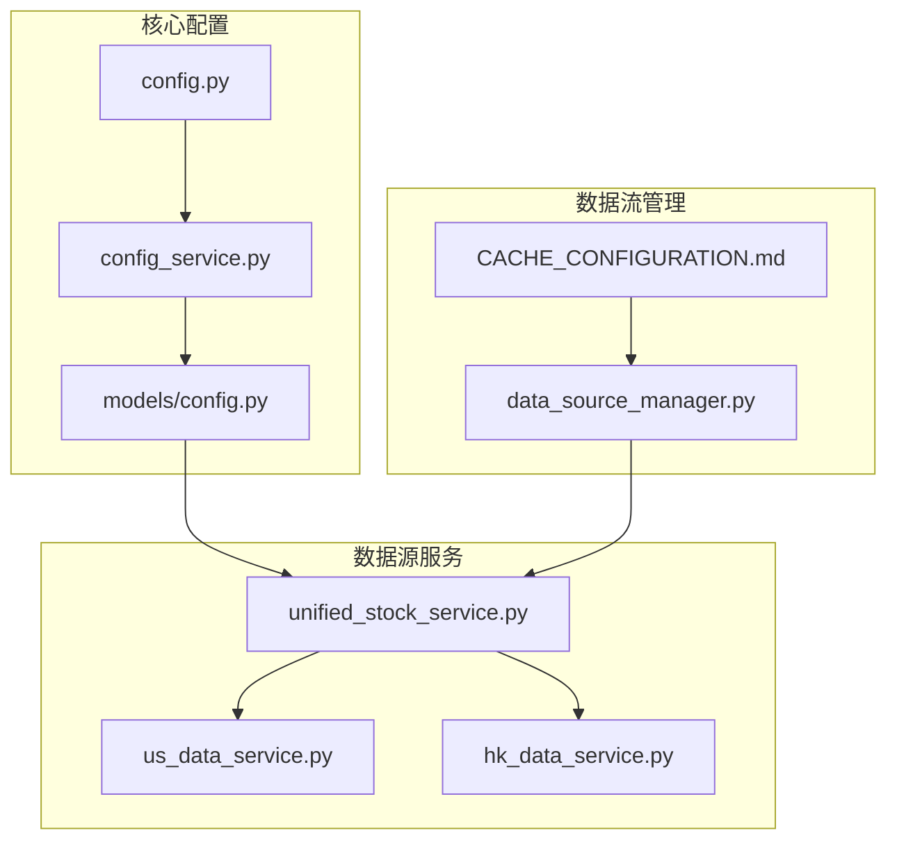
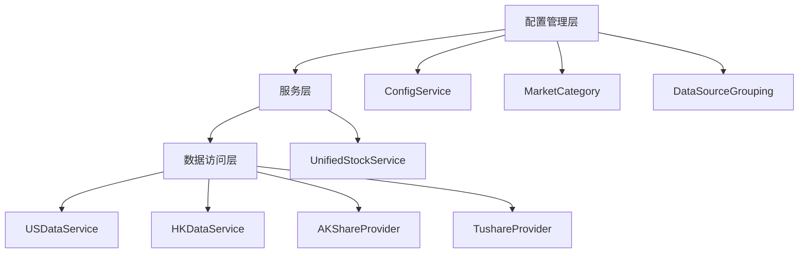
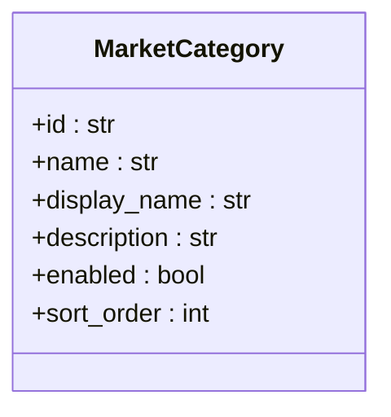
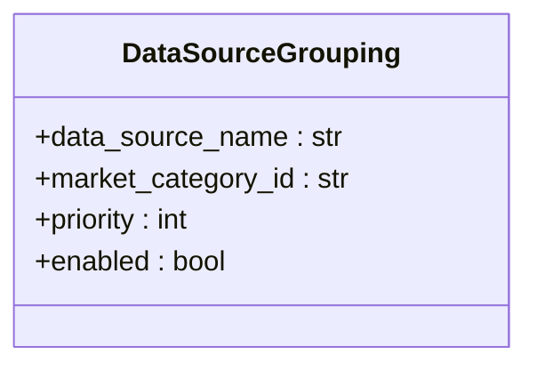
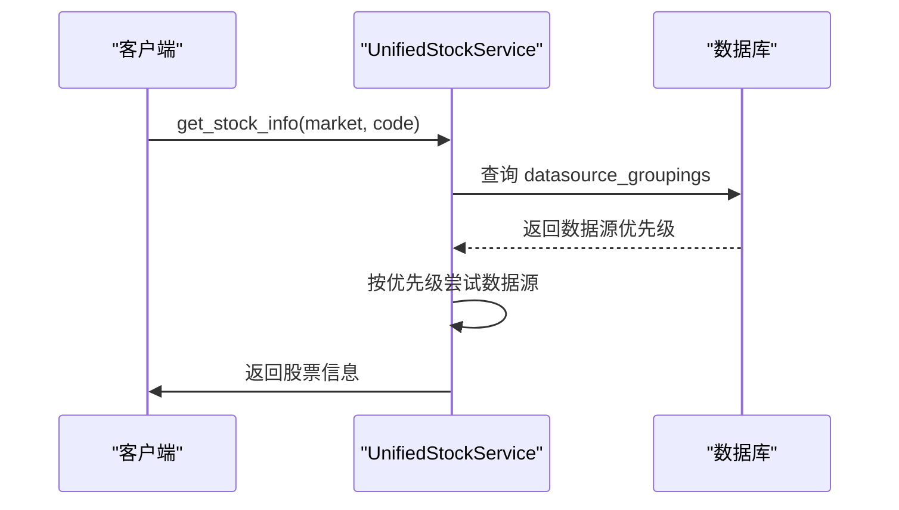
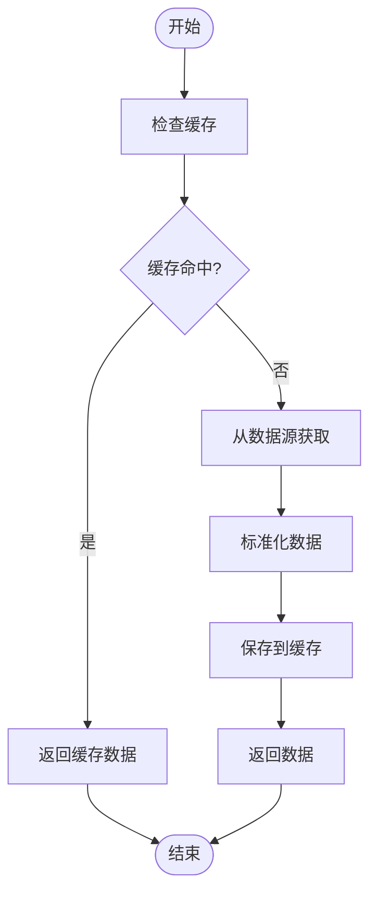
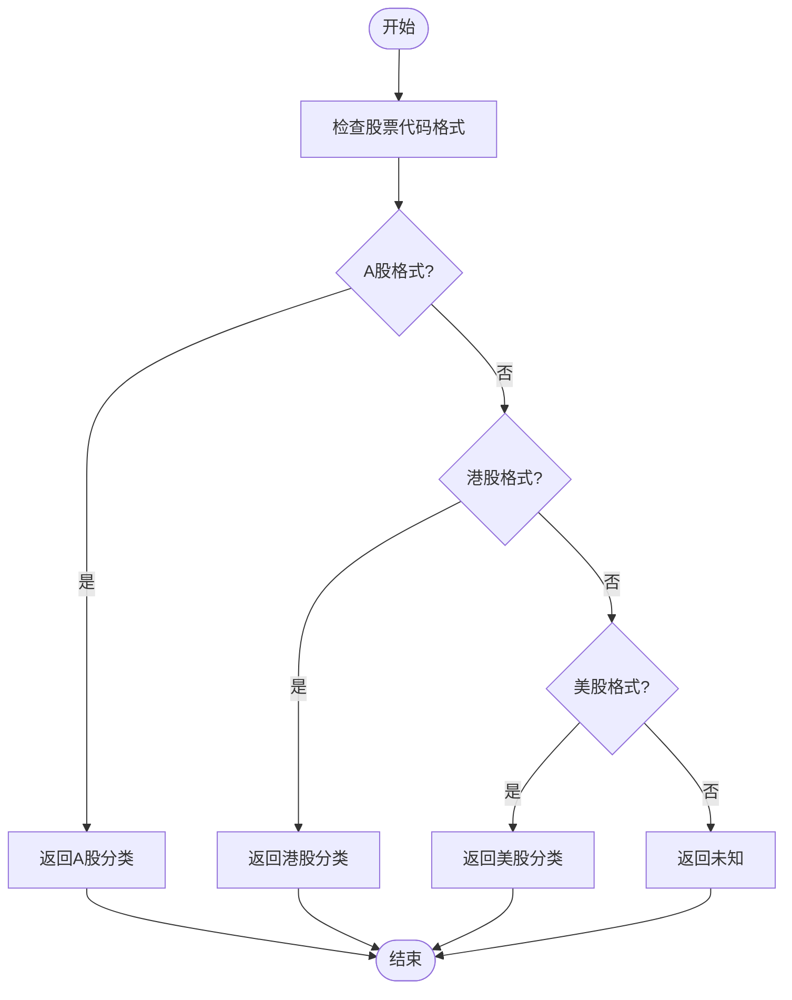
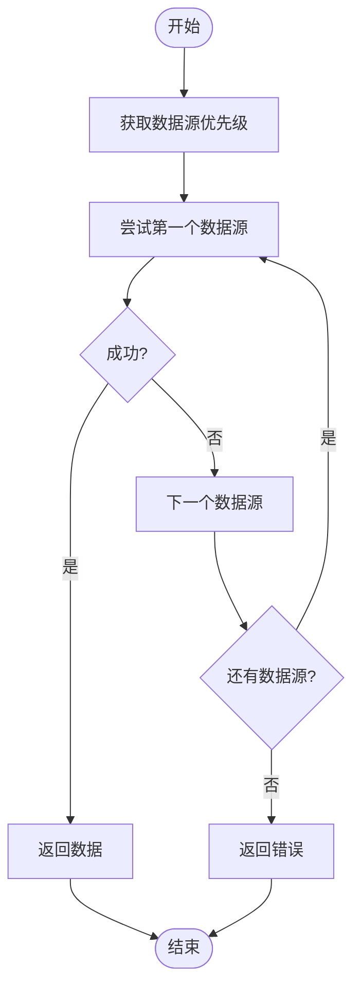
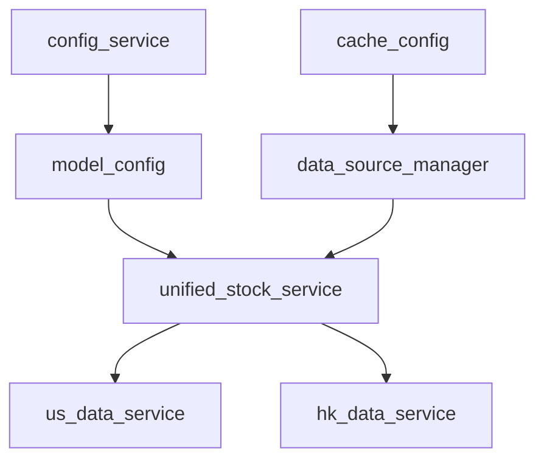
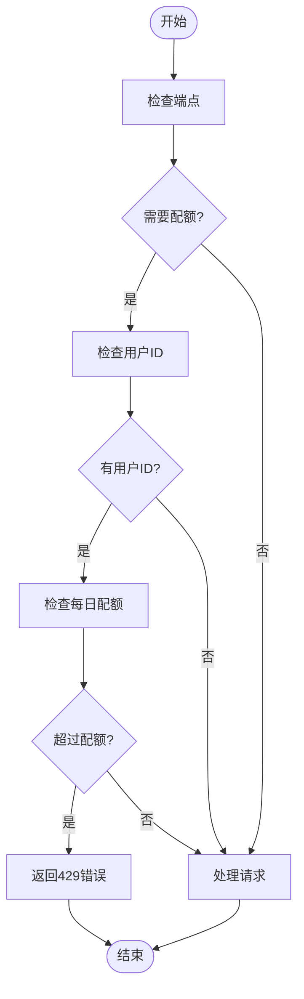

# 多市场数据源配置

<cite>
**本文档引用的文件**   
- [config.py](file://app/core/config.py)
- [config_service.py](file://app/services/config_service.py)
- [config.py](file://app/models/config.py)
- [unified_stock_service.py](file://app/services/unified_stock_service.py)
- [us_data_service.py](file://app/worker/us_data_service.py)
- [hk_data_service.py](file://app/worker/hk_data_service.py)
- [data_source_manager.py](file://tradingagents/dataflows/data_source_manager.py)
- [CACHE_CONFIGURATION.md](file://docs/configuration/CACHE_CONFIGURATION.md)
</cite>

## 目录
1. [引言](#引言)
2. [项目结构](#项目结构)
3. [核心组件](#核心组件)
4. [架构概述](#架构概述)
5. [详细组件分析](#详细组件分析)
6. [依赖分析](#依赖分析)
7. [性能考虑](#性能考虑)
8. [故障排除指南](#故障排除指南)
9. [结论](#结论)
10. [附录](#附录)（如有必要）

## 引言
本文档系统性地介绍了A股、港股、美股等不同市场的数据源配置差异。详细说明了各市场支持的数据源类型、配置方法和优先级设置。解释了市场识别机制和数据源路由策略，描述了如何为不同市场配置最优的数据源组合。提供了跨市场数据一致性处理方案和性能优化建议。

## 项目结构
本项目采用模块化设计，将不同市场的数据源配置和管理功能分离。核心配置文件位于`app/core/config.py`，数据源管理服务位于`app/services/config_service.py`，市场分类和数据源分组定义在`app/models/config.py`中。统一的股票数据服务`unified_stock_service.py`负责跨市场数据访问和路由。



**图源**
- [config.py](file://app/core/config.py)
- [config_service.py](file://app/services/config_service.py)
- [config.py](file://app/models/config.py)
- [unified_stock_service.py](file://app/services/unified_stock_service.py)
- [us_data_service.py](file://app/worker/us_data_service.py)
- [hk_data_service.py](file://app/worker/hk_data_service.py)
- [data_source_manager.py](file://tradingagents/dataflows/data_source_manager.py)
- [CACHE_CONFIGURATION.md](file://docs/configuration/CACHE_CONFIGURATION.md)

**节源**
- [config.py](file://app/core/config.py)
- [config_service.py](file://app/services/config_service.py)
- [config.py](file://app/models/config.py)

## 核心组件

本文档的核心组件包括多市场数据源配置、市场识别机制、数据源路由策略、跨市场数据一致性处理和性能优化建议。这些组件共同构成了一个完整的多市场数据源管理系统。

**节源**
- [config.py](file://app/core/config.py)
- [config_service.py](file://app/services/config_service.py)
- [config.py](file://app/models/config.py)

## 架构概述

系统采用分层架构，从上到下分为配置管理层、服务层和数据访问层。配置管理层负责管理市场分类和数据源配置；服务层提供统一的股票数据服务；数据访问层实现具体的数据源访问逻辑。



**图源**
- [config_service.py](file://app/services/config_service.py)
- [config.py](file://app/models/config.py)
- [unified_stock_service.py](file://app/services/unified_stock_service.py)
- [us_data_service.py](file://app/worker/us_data_service.py)
- [hk_data_service.py](file://app/worker/hk_data_service.py)

## 详细组件分析

### 市场分类管理
系统通过`MarketCategory`模型定义不同的市场分类，如A股、港股、美股等。每个市场分类都有唯一的ID、显示名称和描述。

#### 市场分类类图


**图源**
- [config.py](file://app/models/config.py)

### 数据源分组管理
`DataSourceGrouping`模型定义了数据源与市场分类的关系，包括优先级设置。

#### 数据源分组类图


**图源**
- [config.py](file://app/models/config.py)

### 统一股票数据服务
`UnifiedStockService`提供跨市场的统一数据访问接口，根据市场类型自动选择最优数据源。

#### 统一股票数据服务序列图


**图源**
- [unified_stock_service.py](file://app/services/unified_stock_service.py)

### 美股数据服务
`USDataService`实现美股数据的按需获取和缓存机制。

#### 美股数据服务流程图


**图源**
- [us_data_service.py](file://app/worker/us_data_service.py)

### 港股数据服务
`HKDataService`提供港股数据的获取和标准化功能。

#### 港股数据服务流程图


**图源**
- [hk_data_service.py](file://app/worker/hk_data_service.py)

**节源**
- [unified_stock_service.py](file://app/services/unified_stock_service.py)
- [us_data_service.py](file://app/worker/us_data_service.py)
- [hk_data_service.py](file://app/worker/hk_data_service.py)

### 市场识别机制
系统通过`_identify_market_category`方法识别股票代码所属的市场分类。

#### 市场识别流程图


**图源**
- [data_source_manager.py](file://tradingagents/dataflows/data_source_manager.py)

### 数据源路由策略
系统根据配置的优先级顺序自动选择最优数据源。

#### 数据源路由流程图


**图源**
- [data_source_manager.py](file://tradingagents/dataflows/data_source_manager.py)

**节源**
- [data_source_manager.py](file://tradingagents/dataflows/data_source_manager.py)

## 依赖分析

系统依赖关系复杂，主要依赖包括配置管理、数据源服务和缓存系统。通过合理的依赖管理，确保了系统的稳定性和可扩展性。



**图源**
- [config_service.py](file://app/services/config_service.py)
- [config.py](file://app/models/config.py)
- [unified_stock_service.py](file://app/services/unified_stock_service.py)
- [us_data_service.py](file://app/worker/us_data_service.py)
- [hk_data_service.py](file://app/worker/hk_data_service.py)
- [data_source_manager.py](file://tradingagents/dataflows/data_source_manager.py)
- [CACHE_CONFIGURATION.md](file://docs/configuration/CACHE_CONFIGURATION.md)

**节源**
- [config_service.py](file://app/services/config_service.py)
- [config.py](file://app/models/config.py)
- [unified_stock_service.py](file://app/services/unified_stock_service.py)
- [us_data_service.py](file://app/worker/us_data_service.py)
- [hk_data_service.py](file://app/worker/hk_data_service.py)
- [data_source_manager.py](file://tradingagents/dataflows/data_source_manager.py)

## 性能考虑

系统通过多种机制优化性能，包括缓存策略、并发控制和速率限制。

### 缓存策略
系统支持多种缓存策略，包括文件缓存和集成缓存（MongoDB + Redis）。

#### 缓存策略对比表
| 策略 | 存储方式 | 性能 | 依赖 | 适用场景 |
|------|---------|------|------|---------|
| 文件缓存 | 本地文件 | ⭐⭐⭐ | 无 | 单机部署、开发环境 |
| 集成缓存 | MongoDB + Redis + File | ⭐⭐⭐⭐⭐ | MongoDB/Redis（可选） | 生产环境、分布式部署 |

**节源**
- [CACHE_CONFIGURATION.md](file://docs/configuration/CACHE_CONFIGURATION.md)

### 并发控制
系统通过`QuotaMiddleware`中间件实现并发控制和每日配额管理。

#### 并发控制流程图


**图源**
- [rate_limit.py](file://app/middleware/rate_limit.py)

### 速率限制
系统为不同积分等级的用户提供不同的速率限制。

#### 速率限制测试结果表
| 等级 | 最大调用次数 | 时间窗口（秒） | 安全边际 | 实际速率（次/秒） |
|------|------------|-------------|---------|----------------|
| free | 2 | 3600 | 80% | 0.0006 |
| basic | 10 | 3600 | 80% | 0.0028 |
| standard | 50 | 3600 | 80% | 0.0139 |
| premium | 100 | 3600 | 80% | 0.0278 |
| vip | 200 | 3600 | 80% | 0.0556 |

**节源**
- [rate_limit.py](file://app/middleware/rate_limit.py)

## 故障排除指南

### 常见问题及解决方案
1. **问题：集成缓存不可用**
   - **现象**：`⚠️ 集成缓存不可用，使用文件缓存`
   - **原因**：缺少`database_manager`模块或MongoDB/Redis连接失败
   - **解决**：检查依赖安装、数据库运行状态和连接字符串

2. **问题：导入错误**
   - **现象**：`ImportError: cannot import name 'get_cache'`
   - **解决**：更新导入路径为`from tradingagents.dataflows.cache import get_cache`

**节源**
- [CACHE_CONFIGURATION.md](file://docs/configuration/CACHE_CONFIGURATION.md)

## 结论

本文档详细介绍了多市场数据源配置的各个方面，包括市场分类、数据源管理、路由策略和性能优化。通过合理的架构设计和配置管理，系统能够高效地支持A股、港股、美股等多个市场的数据需求。

## 附录

### 配置示例
```env
# 缓存策略
TA_CACHE_STRATEGY=integrated

# 数据库配置
MONGODB_URL=mongodb://localhost:27017
REDIS_URL=redis://localhost:6379

# 美股数据源配置
US_DATA_CACHE_HOURS=24
US_DEFAULT_DATA_SOURCE=yfinance

# 港股数据源配置
HK_DATA_CACHE_HOURS=24
HK_DEFAULT_DATA_SOURCE=yfinance
```

### API参考
- `GET /api/stock/{market}/{code}`: 获取指定市场和代码的股票信息
- `POST /api/config/datasource-groupings`: 添加数据源到分类
- `PUT /api/config/market-categories/{id}/datasource-order`: 更新分类内数据源排序