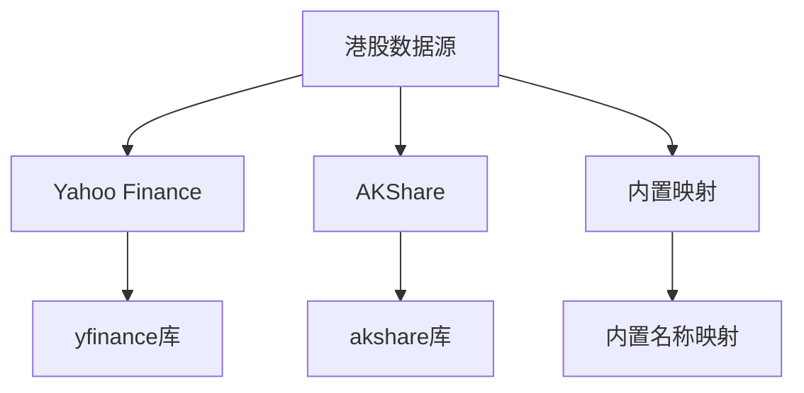
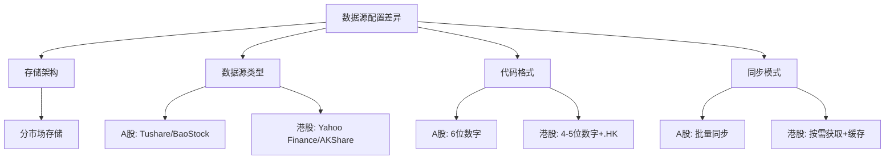
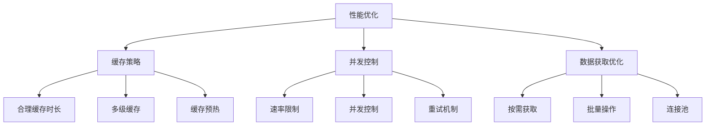

# 港股数据源配置

<cite>
**本文档引用文件**   
- [hk_data_service.py](file://app/worker/hk_data_service.py)
- [hk_sync_service.py](file://app/worker/hk_sync_service.py)
- [improved_hk.py](file://tradingagents/dataflows/providers/hk/improved_hk.py)
- [hk_stock.py](file://tradingagents/dataflows/providers/hk/hk_stock.py)
- [config.py](file://app/core/config.py)
- [config_service.py](file://app/services/config_service.py)
- [manager.py](file://app/services/data_sources/manager.py)
- [data_source_manager.py](file://tradingagents/dataflows/data_source_manager.py)
- [unified_config.py](file://app/core/unified_config.py)
- [stock_utils.py](file://tradingagents/utils/stock_utils.py)
- [fix_hk_stock_code_normalization.md](file://docs/fixes/data-source/fix_hk_stock_code_normalization.md)
- [2025-10-21-multi-market-data-architecture-guide.md](file://docs/tech_reviews/2025-10-21-multi-market-data-architecture-guide.md)
</cite>

## 目录
1. [引言](#引言)
2. [港股数据源类型](#港股数据源类型)
3. [数据源配置方法](#数据源配置方法)
4. [数据源识别机制](#数据源识别机制)
5. [数据格式标准化流程](#数据格式标准化流程)
6. [数据源优先级设置](#数据源优先级设置)
7. [与A股数据源配置的差异](#与a股数据源配置的差异)
8. [跨市场数据一致性处理方案](#跨市场数据一致性处理方案)
9. [性能优化建议](#性能优化建议)
10. [附录](#附录)

## 引言
本文档系统性地介绍港股市场支持的数据源类型和配置方法。详细说明港股数据源的识别机制、数据格式标准化流程和优先级设置。解释港股与A股数据源配置的差异，提供跨市场数据一致性处理方案和性能优化建议。

## 港股数据源类型
系统支持多种港股数据源，主要包括：

- **Yahoo Finance**：提供港股实时行情和历史数据，通过`yfinance`库访问
- **AKShare**：提供港股实时行情、历史数据和财务指标，通过`akshare`库访问
- **内置映射**：包含主要港股标的的名称映射，避免频繁API调用

这些数据源通过`HKDataService`和`HKSyncService`进行管理，支持按需获取和批量同步两种模式。



**Diagram sources**
- [hk_data_service.py](file://app/worker/hk_data_service.py)
- [improved_hk.py](file://tradingagents/dataflows/providers/hk/improved_hk.py)
- [hk_stock.py](file://tradingagents/dataflows/providers/hk/hk_stock.py)

## 数据源配置方法
港股数据源的配置主要通过以下方式实现：

### 配置文件设置
在`app/core/config.py`中定义了港股数据源的相关配置：

```python
# 港股数据源配置（按需获取+缓存模式）
HK_DATA_CACHE_HOURS: int = Field(default=24, ge=1, le=168, description="港股数据缓存时长（小时）")
HK_DEFAULT_DATA_SOURCE: str = Field(default="yfinance", description="港股默认数据源（yfinance/akshare）")
```

### 服务初始化
`HKDataService`在初始化时会根据配置设置默认数据源和缓存时长：

```python
def __init__(self):
    self.db = get_mongo_db()
    self.settings = settings
    
    # 数据提供器映射
    self.providers = {
        "yfinance": HKStockProvider(),
        "akshare": ImprovedHKStockProvider(),
    }
    
    # 缓存配置
    self.cache_hours = getattr(settings, 'HK_DATA_CACHE_HOURS', 24)
    self.default_source = getattr(settings, 'HK_DEFAULT_DATA_SOURCE', 'yfinance')
```

### 运行时配置
系统支持通过环境变量动态调整配置，配置优先级为：环境变量 > 配置文件 > 默认值。

**Section sources**
- [config.py](file://app/core/config.py#L262-L265)
- [hk_data_service.py](file://app/worker/hk_data_service.py#L39-L52)

## 数据源识别机制
系统通过多种方式识别港股数据源，确保准确性和灵活性。

### 股票代码识别
系统使用正则表达式识别港股代码，支持多种格式：

```python
# 港股判断
elif re.match(r'^\d{4,5}\.HK$', stock_code):
    return "港股"
elif re.match(r'^\d{4,5}$', stock_code) and len(stock_code) <= 5:
    return "港股"
```

### 代码标准化
系统对港股代码进行标准化处理，确保格式统一：

```python
def _normalize_hk_symbol(self, symbol: str) -> str:
    """标准化港股代码格式"""
    if not symbol:
        return symbol
        
    symbol = str(symbol).strip().upper()
    
    # 如果已经有.HK后缀，先移除
    if symbol.endswith('.HK'):
        symbol = symbol[:-3]
        
    # 如果是纯数字，标准化为4位数字
    if symbol.isdigit():
        # 移除前导0，然后补齐到4位
        clean_code = symbol.lstrip('0') or '0'  # 如果全是0，保留一个0
        normalized_code = clean_code.zfill(4)
        return f"{normalized_code}.HK"
        
    return symbol
```

### 内置名称映射
系统内置了主要港股标的的名称映射，提高查询效率：

```python
self.hk_stock_names = {
    # 腾讯系
    '0700.HK': '腾讯控股', '0700': '腾讯控股', '00700': '腾讯控股',
    
    # 电信运营商
    '0941.HK': '中国移动', '0941': '中国移动', '00941': '中国移动',
    # ... 其他映射
}
```

**Section sources**
- [unified_news_tool.py](file://tradingagents/tools/unified_news_tool.py#L78-L81)
- [improved_hk.py](file://tradingagents/dataflows/providers/hk/improved_hk.py#L48-L105)
- [hk_stock.py](file://tradingagents/dataflows/providers/hk/hk_stock.py#L208-L237)

## 数据格式标准化流程
系统对从不同数据源获取的港股数据进行标准化处理，确保数据格式统一。

### 标准化字段
系统定义了统一的港股数据字段结构：

```python
normalized = {
    "name": stock_info.get("name", ""),
    "currency": stock_info.get("currency", "HKD"),
    "exchange": stock_info.get("exchange", "HKG"),
    "market": stock_info.get("market", "香港交易所"),
    "area": stock_info.get("area", "香港"),
}
```

### 可选字段处理
系统对可选字段进行统一处理，确保数据完整性：

```python
optional_fields = [
    "industry", "sector", "list_date", "total_mv", "circ_mv",
    "pe", "pb", "ps", "pcf", "market_cap", "shares_outstanding",
    "float_shares", "employees", "website", "description"
]

for field in optional_fields:
    if field in stock_info and stock_info[field]:
        normalized[field] = stock_info[field]
```

### 数据存储
标准化后的数据存储在MongoDB的`stock_basic_info_hk`集合中，使用`(code, source)`联合查询进行upsert操作：

```python
await self.db.stock_basic_info_hk.update_one(
    {"code": stock_info["code"], "source": stock_info["source"]},
    {"$set": stock_info},
    upsert=True
)
```

**Section sources**
- [hk_data_service.py](file://app/worker/hk_data_service.py#L159-L178)
- [hk_sync_service.py](file://app/worker/hk_sync_service.py#L279-L302)

## 数据源优先级设置
系统通过优先级机制管理多个数据源，确保数据获取的可靠性和效率。

### 优先级配置
数据源优先级配置存储在`system_configs`集合的`data_source_configs`字段中，按优先级数值从大到小排序：

```python
# 按优先级排序（数字越大优先级越高）
result.sort(key=lambda x: x.priority, reverse=True)
```

### 优先级更新
系统在更新数据源排序时，会同步更新`datasource_groupings`和`system_configs`两个集合：

```python
# 1. 批量更新 datasource_groupings 集合中的优先级
for item in ordered_datasources:
    await groupings_collection.update_one(
        {
            "data_source_name": item["name"],
            "market_category_id": category_id
        },
        {
            "$set": {
                "priority": item["priority"],
                "updated_at": now_tz()
            }
        }
    )

# 2. 同步更新 system_configs 集合中的 data_source_configs
config_data = await config_collection.find_one(
    {"is_active": True},
    sort=[("version", -1)]
)
```

### 市场分类过滤
系统支持按市场分类过滤数据源，确保数据源与市场匹配：

```python
# 检查数据源是否属于当前市场分类
market_categories = ds.get('market_categories', [])
if market_categories and market_category:
    # 如果数据源配置了市场分类，只选择匹配的数据源
    if market_category not in market_categories:
        continue
```

**Section sources**
- [unified_config.py](file://app/core/unified_config.py#L356-L357)
- [config_service.py](file://app/services/config_service.py#L290-L349)
- [data_source_manager.py](file://tradingagents/dataflows/data_source_manager.py#L126-L135)

## 与A股数据源配置的差异
港股与A股数据源配置存在显著差异，主要体现在以下几个方面：

### 存储架构
系统采用分市场存储架构，不同市场的数据存储在不同的集合中：

```
│  A股数据库     │ │  港股数据库    │ │  美股数据库    │
│ *_cn 集合     │ │ *_hk 集合     │ │ *_us 集合     │
└───────────────┘ └───────────────┘ └───────────────┘
```

### 数据源类型
- **A股**：主要依赖Tushare、AKShare、BaoStock等国内数据源
- **港股**：主要依赖Yahoo Finance、AKShare等国际数据源

### 代码格式
- **A股**：6位数字代码（如000001）
- **港股**：4-5位数字代码，通常以.HK后缀（如0700.HK）

### 同步模式
- **A股**：采用批量同步模式，定期同步所有股票数据
- **港股**：采用按需获取+缓存模式，避免触发速率限制



**Diagram sources**
- [2025-10-21-multi-market-data-architecture-guide.md](file://docs/tech_reviews/2025-10-21-multi-market-data-architecture-guide.md#L76-L81)
- [config.py](file://app/core/config.py#L262-L265)

## 跨市场数据一致性处理方案
为确保跨市场数据的一致性，系统采用以下处理方案：

### 统一数据模型
系统定义了统一的数据模型，不同市场的数据在应用层保持一致：

```python
normalized = {
    "name": stock_info.get("name", ""),
    "currency": stock_info.get("currency", "HKD"),
    "exchange": stock_info.get("exchange", "HKG"),
    "market": stock_info.get("market", "香港交易所"),
    "area": stock_info.get("area", "香港"),
}
```

### 数据标准化层
系统在数据访问层提供统一的接口，屏蔽底层差异：

```python
async def get_stock_info(
    self, 
    stock_code: str, 
    source: Optional[str] = None,
    force_refresh: bool = False
) -> Optional[Dict[str, Any]]:
    """
    获取股票信息（统一接口）
    """
```

### 市场识别工具
系统提供统一的市场识别工具，准确判断股票所属市场：

```python
def identify_stock_market(ticker: str) -> StockMarket:
    """
    识别股票市场
    """
    # A股判断
    if re.match(r'^\d{6}$', ticker):
        return StockMarket.CHINA_A
    
    # 港股判断
    elif re.match(r'^\d{4,5}\.HK$', ticker):
        return StockMarket.HONG_KONG
    
    # 美股判断
    elif re.match(r'^[A-Z]{1,5}$', ticker):
        return StockMarket.US
```

**Section sources**
- [hk_data_service.py](file://app/worker/hk_data_service.py#L159-L178)
- [stock_utils.py](file://tradingagents/utils/stock_utils.py#L54-L93)

## 性能优化建议
为提高港股数据源的性能，建议采取以下优化措施：

### 缓存策略
- **合理设置缓存时长**：根据数据更新频率设置合适的缓存时长，默认24小时
- **多级缓存**：结合内存缓存和数据库缓存，提高访问速度
- **缓存预热**：在系统启动时预加载常用数据

### 并发控制
- **速率限制**：对API调用进行速率限制，避免被封禁
- **并发请求**：合理控制并发请求数量，平衡性能和稳定性
- **重试机制**：实现指数退避重试机制，提高请求成功率

### 数据获取优化
- **按需获取**：采用按需获取模式，避免不必要的批量请求
- **批量操作**：对数据库操作使用批量写入，减少IO开销
- **连接池**：使用数据库连接池，减少连接创建开销



**Diagram sources**
- [hk_data_service.py](file://app/worker/hk_data_service.py#L50-L51)
- [hk_sync_service.py](file://app/worker/hk_sync_service.py#L219-L231)

## 附录
### 港股代码标准化示例
| 输入 | 输出 | 说明 |
|------|------|------|
| `700` | `0700.HK` | 补齐4位，添加.HK后缀 |
| `0700` | `0700.HK` | 保持4位，添加.HK后缀 |
| `00700` | `0700.HK` | 移除前导0，补齐4位，添加.HK后缀 |
| `9988` | `9988.HK` | 保持4位，添加.HK后缀 |
| `09988` | `9988.HK` | 移除前导0，保持4位，添加.HK后缀 |

### 配置参数说明
| 参数 | 默认值 | 说明 |
|------|--------|------|
| HK_DATA_CACHE_HOURS | 24 | 港股数据缓存时长（小时） |
| HK_DEFAULT_DATA_SOURCE | yfinance | 港股默认数据源 |
| TA_HK_MIN_REQUEST_INTERVAL_SECONDS | 2.0 | 港股API调用最小间隔（秒） |
| TA_HK_TIMEOUT_SECONDS | 60 | 港股API调用超时时间（秒） |
| TA_HK_MAX_RETRIES | 3 | 港股API调用最大重试次数 |

**Section sources**
- [fix_hk_stock_code_normalization.md](file://docs/fixes/data-source/fix_hk_stock_code_normalization.md#L120-L137)
- [config.py](file://app/core/config.py#L264-L265)