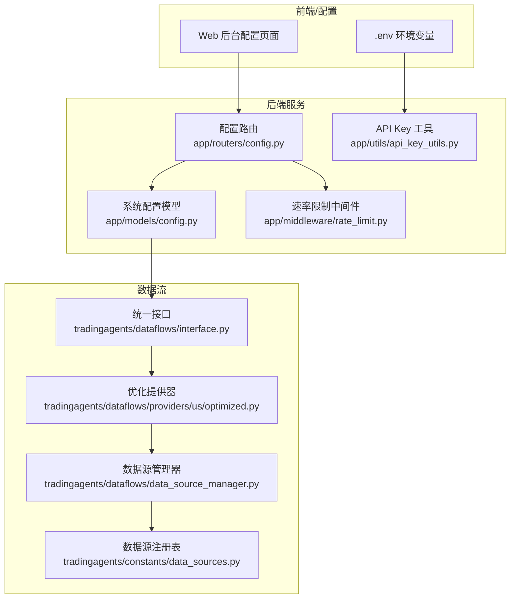
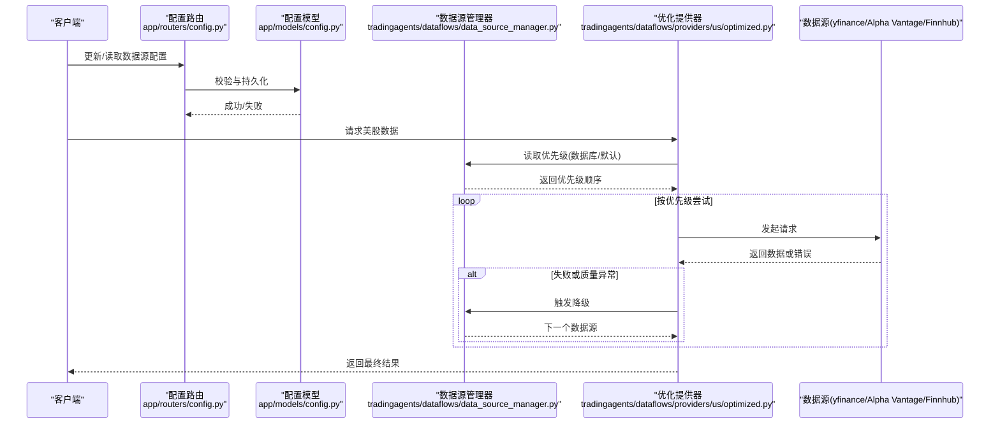
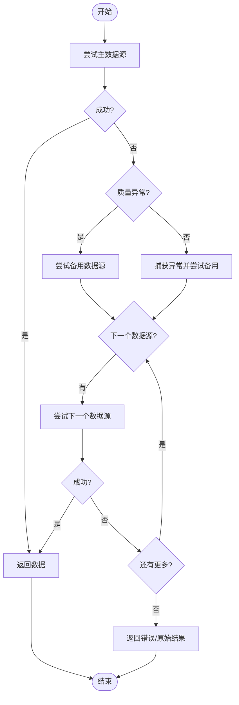
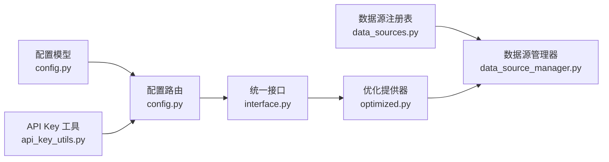

# 美股数据源配置

<cite>
**本文引用的文件**
- [US_DATA_SOURCE_CONFIG.md](file://docs/guides/US_DATA_SOURCE_CONFIG.md)
- [US_DATA_SOURCE_UPGRADE_PLAN.md](file://docs/development/US_DATA_SOURCE_UPGRADE_PLAN.md)
- [data_sources.py](file://tradingagents/constants/data_sources.py)
- [data_source_manager.py](file://tradingagents/dataflows/data_source_manager.py)
- [optimized.py](file://tradingagents/dataflows/providers/us/optimized.py)
- [interface.py](file://tradingagents/dataflows/interface.py)
- [config.py](file://app/models/config.py)
- [config.py](file://app/routers/config.py)
- [api_key_utils.py](file://app/utils/api_key_utils.py)
- [rate_limit.py](file://app/middleware/rate_limit.py)
- [architecture.md](file://docs/config/architecture.md)
- [API_KEY_MANAGEMENT_ANALYSIS.md](file://docs/API_KEY_MANAGEMENT_ANALYSIS.md)
- [test_api_key_validation.py](file://scripts/test_api_key_validation.py)
- [validate_api_keys.py](file://scripts/validate_api_keys.py)
- [test_datasource_groupings.py](file://scripts/test_datasource_groupings.py)
- [check_datasource_priority_simple.py](file://scripts/check_datasource_priority_simple.py)
- [fix_us_datasource_enabled.py](file://scripts/fix_us_datasource_enabled.py)
- [hk_stock_data_source_priority.md](file://docs/design/hk_stock_data_source_priority.md)
</cite>

## 目录
1. [简介](#简介)
2. [项目结构](#项目结构)
3. [核心组件](#核心组件)
4. [架构总览](#架构总览)
5. [详细组件分析](#详细组件分析)
6. [依赖分析](#依赖分析)
7. [性能考虑](#性能考虑)
8. [故障排查指南](#故障排查指南)
9. [结论](#结论)
10. [附录](#附录)

## 简介
本文件面向运维与开发人员，系统化说明美股数据源（yfinance、Alpha Vantage、Finnhub）的配置方法与最佳实践，涵盖认证配置、请求限制设置、优先级管理与路由策略、降级处理流程，并提供可落地的配置示例与排障建议。文档基于仓库内现有实现与指导文档整理，确保与实际代码一致。

## 项目结构
围绕美股数据源的关键文件分布如下：
- 数据源注册与信息：tradingagents/constants/data_sources.py
- 数据源管理与优先级：tradingagents/dataflows/data_source_manager.py
- 美股数据提供器与降级：tradingagents/dataflows/providers/us/optimized.py
- 统一接口与回退：tradingagents/dataflows/interface.py
- 配置模型与路由：app/models/config.py、app/routers/config.py
- API Key 校验与环境变量映射：app/utils/api_key_utils.py
- 速率限制中间件：app/middleware/rate_limit.py
- 配置优先级与安全策略：docs/config/architecture.md、docs/API_KEY_MANAGEMENT_ANALYSIS.md
- 配置示例与脚本：docs/guides/US_DATA_SOURCE_CONFIG.md、docs/development/US_DATA_SOURCE_UPGRADE_PLAN.md、scripts/*

图表来源
- [config.py](file://app/models/config.py#L237-L294)
- [config.py](file://app/routers/config.py#L1140-L1158)
- [api_key_utils.py](file://app/utils/api_key_utils.py#L97-L135)
- [rate_limit.py](file://app/middleware/rate_limit.py#L79-L95)
- [interface.py](file://tradingagents/dataflows/interface.py#L1805-L1825)
- [optimized.py](file://tradingagents/dataflows/providers/us/optimized.py#L47-L142)
- [data_source_manager.py](file://tradingagents/dataflows/data_source_manager.py#L2265-L2307)
- [data_sources.py](file://tradingagents/constants/data_sources.py#L136-L192)

章节来源
- [config.py](file://app/models/config.py#L237-L294)
- [data_sources.py](file://tradingagents/constants/data_sources.py#L136-L192)
- [data_source_manager.py](file://tradingagents/dataflows/data_source_manager.py#L2265-L2307)
- [optimized.py](file://tradingagents/dataflows/providers/us/optimized.py#L47-L142)
- [interface.py](file://tradingagents/dataflows/interface.py#L1805-L1825)

## 核心组件
- 数据源注册表：统一定义数据源编码、名称、提供商、是否免费、是否需要 API Key、支持市场等信息，便于前端展示与后端校验。
- 数据源管理器：负责从数据库读取优先级配置，生成可用数据源列表，支持默认源与降级策略。
- 美股数据提供器：在获取数据时优先使用缓存，若未命中则按优先级顺序调用数据源，并在失败时进行降级。
- 统一接口：根据数据源类型选择对应提供器，实现跨数据源的统一调用。
- 配置模型：定义数据源配置字段（类型、API Key、端点、超时、限流、优先级、启用状态、市场分类等）。
- API Key 工具：提供 API Key 校验、截断显示、环境变量映射等能力。
- 速率限制中间件：对高频请求进行限流保护，避免触发外部服务商限流。

章节来源
- [data_sources.py](file://tradingagents/constants/data_sources.py#L136-L192)
- [data_source_manager.py](file://tradingagents/dataflows/data_source_manager.py#L2265-L2307)
- [optimized.py](file://tradingagents/dataflows/providers/us/optimized.py#L47-L142)
- [interface.py](file://tradingagents/dataflows/interface.py#L1805-L1825)
- [config.py](file://app/models/config.py#L237-L294)
- [api_key_utils.py](file://app/utils/api_key_utils.py#L11-L54)
- [rate_limit.py](file://app/middleware/rate_limit.py#L79-L95)

## 架构总览
美股数据源配置采用“数据库优先 + 环境变量兜底”的分层配置体系，结合统一的优先级与降级机制，确保在多数据源环境下具备高可用与可运维性。

图表来源
- [config.py](file://app/routers/config.py#L1140-L1158)
- [config.py](file://app/models/config.py#L237-L294)
- [data_source_manager.py](file://tradingagents/dataflows/data_source_manager.py#L2265-L2307)
- [optimized.py](file://tradingagents/dataflows/providers/us/optimized.py#L116-L142)

## 详细组件分析

### 数据源注册与认证配置
- 注册表包含 yfinance、Alpha Vantage、Finnhub 等美股数据源的基本信息，包括是否需要 API Key、是否免费、支持市场等。
- API Key 校验规则：长度>10、非占位符（your_*/your-*、*_here/-here）、不含截断标记(...)。
- 环境变量映射：通过工具函数将数据源类型映射到对应的环境变量名，读取并校验 API Key。

章节来源
- [data_sources.py](file://tradingagents/constants/data_sources.py#L136-L192)
- [api_key_utils.py](file://app/utils/api_key_utils.py#L11-L54)
- [api_key_utils.py](file://app/utils/api_key_utils.py#L97-L135)
- [API_KEY_MANAGEMENT_ANALYSIS.md](file://docs/API_KEY_MANAGEMENT_ANALYSIS.md#L1-L70)

### 优先级管理与路由策略
- 优先级来源：数据库 datasource_groupings（按 market_category_id=us_stocks 排序，数值越大优先级越高），若无配置则回退到默认顺序（yfinance > Alpha Vantage > Finnhub）。
- 路由策略：统一接口根据数据源类型选择提供器；优化提供器在缓存未命中时按优先级顺序发起请求，并在失败时降级。
- 市场分类：系统支持多市场（us_stocks、a_shares、hk_stocks 等），优先级按市场分类独立管理。

章节来源
- [data_source_manager.py](file://tradingagents/dataflows/data_source_manager.py#L2265-L2307)
- [data_source_manager.py](file://tradingagents/dataflows/data_source_manager.py#L2295-L2307)
- [interface.py](file://tradingagents/dataflows/interface.py#L1805-L1825)
- [optimized.py](file://tradingagents/dataflows/providers/us/optimized.py#L116-L142)
- [config.py](file://app/models/config.py#L286-L294)

### 降级处理流程
- 失败降级：当主数据源返回错误或质量异常时，尝试下一个可用数据源。
- 异常降级：捕获异常后尝试降级；若仍失败，返回原始结果（包含错误信息）。
- 默认降级：若数据库读取失败或无配置，使用默认顺序回退。

图表来源
- [data_source_manager.py](file://tradingagents/dataflows/data_source_manager.py#L1113-L1141)
- [data_source_manager.py](file://tradingagents/dataflows/data_source_manager.py#L2295-L2307)

### 请求限制与速率控制
- 速率限制中间件：对高频请求返回 429 并提示重试时间，避免触发外部服务商限流。
- 数据源侧限流：配置模型包含 rate_limit 字段，用于表达每分钟请求限制；具体实现需结合外部数据源的限流策略。

章节来源
- [rate_limit.py](file://app/middleware/rate_limit.py#L79-L95)
- [config.py](file://app/models/config.py#L237-L294)

### 配置示例与最佳实践
- Web 后台配置：在后台页面添加数据源配置（type、api_key、enabled、description），并在 datasource_groupings 中设置优先级与启用状态。
- 环境变量配置：在 .env 中设置 ALPHA_VANTAGE_API_KEY、FINNHUB_API_KEY、DEFAULT_US_DATA_SOURCE 等。
- 数据库配置：通过 system_configs 或 datasource_groupings 直接写入配置，推荐使用数据库配置以便在线调整与立即生效。
- 最佳实践：
  - 优先使用数据库配置，便于统一管理与回滚。
  - 为 Alpha Vantage 配置 API Key，确保免费额度与限流策略清晰。
  - 为 yfinance 配置默认优先级，保证免费与稳定的主数据源。
  - 为 Finnhub 配置较低优先级作为备用，降低主数据源压力。

章节来源
- [US_DATA_SOURCE_CONFIG.md](file://docs/guides/US_DATA_SOURCE_CONFIG.md#L1-L120)
- [US_DATA_SOURCE_CONFIG.md](file://docs/guides/US_DATA_SOURCE_CONFIG.md#L123-L206)
- [US_DATA_SOURCE_UPGRADE_PLAN.md](file://docs/development/US_DATA_SOURCE_UPGRADE_PLAN.md#L342-L356)
- [architecture.md](file://docs/config/architecture.md#L1-L39)

## 依赖分析
- 数据源注册表与管理器：数据源注册表提供统一编码与属性，管理器据此构建可用数据源列表与默认源。
- 配置模型与路由：配置模型定义数据源字段，路由层负责校验与持久化；环境变量映射与 API Key 校验贯穿配置生命周期。
- 统一接口与提供器：统一接口根据类型选择提供器，提供器在缓存未命中时按优先级顺序调用数据源，并在失败时降级。

图表来源
- [data_sources.py](file://tradingagents/constants/data_sources.py#L136-L192)
- [data_source_manager.py](file://tradingagents/dataflows/data_source_manager.py#L2265-L2307)
- [config.py](file://app/models/config.py#L237-L294)
- [config.py](file://app/routers/config.py#L1140-L1158)
- [api_key_utils.py](file://app/utils/api_key_utils.py#L97-L135)
- [interface.py](file://tradingagents/dataflows/interface.py#L1805-L1825)
- [optimized.py](file://tradingagents/dataflows/providers/us/optimized.py#L116-L142)

章节来源
- [data_sources.py](file://tradingagents/constants/data_sources.py#L136-L192)
- [data_source_manager.py](file://tradingagents/dataflows/data_source_manager.py#L2265-L2307)
- [config.py](file://app/models/config.py#L237-L294)
- [config.py](file://app/routers/config.py#L1140-L1158)
- [api_key_utils.py](file://app/utils/api_key_utils.py#L97-L135)
- [interface.py](file://tradingagents/dataflows/interface.py#L1805-L1825)
- [optimized.py](file://tradingagents/dataflows/providers/us/optimized.py#L116-L142)

## 性能考虑
- 缓存优先：优化提供器优先从缓存加载数据，减少对外部数据源的请求压力。
- 限流策略：结合外部数据源的限流策略与内部速率限制中间件，避免触发限流。
- 降级策略：在主数据源失败或质量异常时快速切换到备用数据源，提升整体可用性。
- 配置优先级：合理设置优先级，避免将高成本或不稳定的数据源置于高位。

[本节为通用建议，不直接分析具体文件]

## 故障排查指南
- API Key 校验失败：检查占位符、长度与格式；使用脚本进行批量验证。
- 配置未生效：确认配置优先级顺序（数据库 > 环境变量 > 文件），并检查 datasource_groupings 的 enabled 与 priority。
- 降级未触发：检查数据库读取是否异常、可用数据源列表是否包含备用数据源、以及异常捕获与质量判断逻辑。
- 速率限制：查看中间件返回的 429 错误与重试时间，适当降低请求频率或调整限流策略。

章节来源
- [API_KEY_MANAGEMENT_ANALYSIS.md](file://docs/API_KEY_MANAGEMENT_ANALYSIS.md#L1-L70)
- [test_api_key_validation.py](file://scripts/test_api_key_validation.py#L40-L75)
- [validate_api_keys.py](file://scripts/validate_api_keys.py#L98-L222)
- [data_source_manager.py](file://tradingagents/dataflows/data_source_manager.py#L2295-L2307)
- [rate_limit.py](file://app/middleware/rate_limit.py#L79-L95)

## 结论
通过数据库优先的配置体系、统一的数据源注册与管理、明确的优先级与降级策略，以及完善的 API Key 校验与速率限制机制，系统能够稳定地支持 yfinance、Alpha Vantage、Finnhub 等美股数据源。建议在生产环境中优先使用数据库配置，合理设置优先级与限流策略，并建立定期验证与监控机制，确保数据源的可用性与稳定性。

[本节为总结性内容，不直接分析具体文件]

## 附录

### 配置示例与参考路径
- Web 后台配置示例与优先级设置：参见 [US_DATA_SOURCE_CONFIG.md](file://docs/guides/US_DATA_SOURCE_CONFIG.md#L56-L114)
- 环境变量配置示例：参见 [US_DATA_SOURCE_CONFIG.md](file://docs/guides/US_DATA_SOURCE_CONFIG.md#L123-L136)
- 数据库配置示例（system_configs 与 datasource_groupings）：参见 [US_DATA_SOURCE_CONFIG.md](file://docs/guides/US_DATA_SOURCE_CONFIG.md#L148-L205)
- 美股数据源升级计划与环境变量示例：参见 [US_DATA_SOURCE_UPGRADE_PLAN.md](file://docs/development/US_DATA_SOURCE_UPGRADE_PLAN.md#L342-L356)

### 关键流程与实现路径
- 数据源优先级读取与默认回退：参见 [data_source_manager.py](file://tradingagents/dataflows/data_source_manager.py#L2265-L2307)
- 默认数据源选择（环境变量映射）：参见 [data_source_manager.py](file://tradingagents/dataflows/data_source_manager.py#L2315-L2325)
- 美股数据提供器的优先级与降级：参见 [optimized.py](file://tradingagents/dataflows/providers/us/optimized.py#L116-L142)
- 统一接口的回退逻辑：参见 [interface.py](file://tradingagents/dataflows/interface.py#L1805-L1825)
- API Key 校验与环境变量映射：参见 [api_key_utils.py](file://app/utils/api_key_utils.py#L11-L54)、[api_key_utils.py](file://app/utils/api_key_utils.py#L97-L135)
- 配置优先级与安全策略：参见 [architecture.md](file://docs/config/architecture.md#L1-L39)
- 配置脚本与验证：参见 [test_datasource_groupings.py](file://scripts/test_datasource_groupings.py#L102-L158)、[check_datasource_priority_simple.py](file://scripts/check_datasource_priority_simple.py#L47-L76)、[fix_us_datasource_enabled.py](file://scripts/fix_us_datasource_enabled.py#L67-L105)