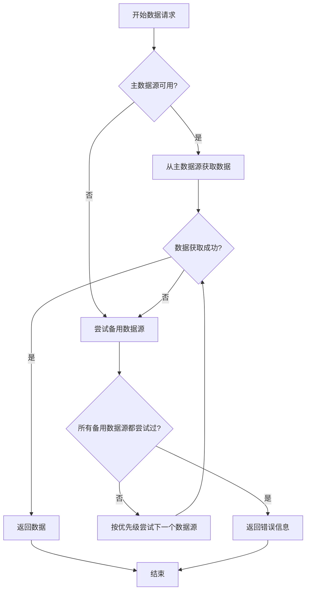
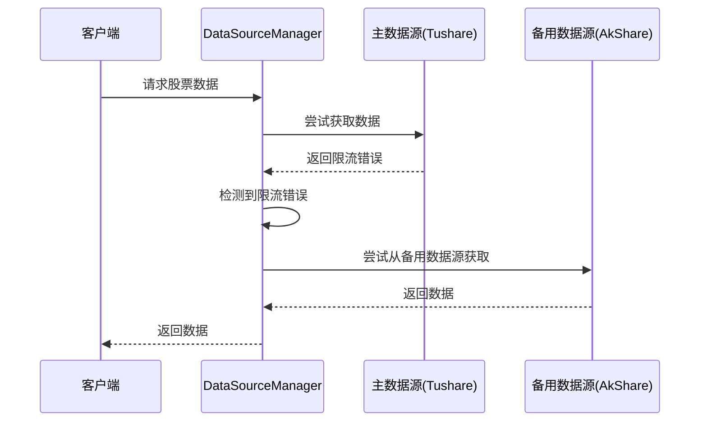
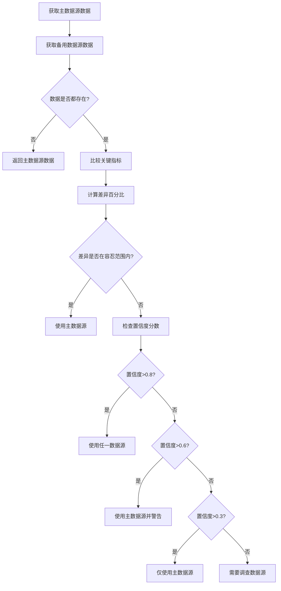

# Fallback机制

<cite>
**本文档引用的文件**
- [data_source_manager.py](file://tradingagents/dataflows/data_source_manager.py)
- [data_consistency_checker.py](file://app/services/data_consistency_checker.py)
- [tushare.py](file://tradingagents/dataflows/providers/china/tushare.py)
- [config_bridge.py](file://app/core/config_bridge.py)
</cite>

## 目录
1. [引言](#引言)
2. [Fallback机制概述](#fallback机制概述)
3. [错误检测与重试策略](#错误检测与重试策略)
4. [数据源优先级与降级顺序](#数据源优先级与降级顺序)
5. [数据一致性检查服务](#数据一致性检查服务)
6. [实际场景示例](#实际场景示例)
7. [配置与超时设置](#配置与超时设置)
8. [总结](#总结)

## 引言
本文档旨在深入解释当主数据源不可用时的故障转移（Fallback）策略。系统通过多层机制确保在数据获取失败时能够自动切换到备用数据源，包括错误检测、重试策略和延迟切换机制。同时，通过`data_consistency_checker`服务确保不同数据源返回数据的一致性。文档将详细说明在Tushare接口限流时自动切换到AkShare的处理流程，并提供配置Fallback超时时间和重试次数的方法。

## Fallback机制概述
系统的Fallback机制是一种容错策略，用于在主数据源不可用或返回错误时，自动切换到备用数据源以确保服务的连续性和数据的可用性。该机制主要由`DataSourceManager`类实现，它负责管理多个数据源（如Tushare、AkShare、BaoStock等）的优先级和切换逻辑。

当请求数据时，系统首先尝试从最高优先级的数据源获取数据。如果失败，则按照预定义的顺序依次尝试其他数据源。这一过程不仅限于历史数据的获取，还包括股票基本信息、财务数据和新闻数据等多种类型的数据请求。



**Diagram sources**
- [data_source_manager.py](file://tradingagents/dataflows/data_source_manager.py#L1382-L1423)

**Section sources**
- [data_source_manager.py](file://tradingagents/dataflows/data_source_manager.py#L1382-L1423)

## 错误检测与重试策略
系统通过多种方式检测数据源的错误，并实施相应的重试策略。对于Tushare API，系统会检测特定的限流错误信息，如“每分钟最多访问”、“rate limit”等关键词。一旦检测到这些错误，系统会立即抛出异常，触发Fallback机制。

```python
def _is_rate_limit_error(self, error_msg: str) -> bool:
    """检测是否为 API 限流错误"""
    rate_limit_keywords = [
        "每分钟最多访问",
        "每分钟最多",
        "rate limit",
        "too many requests",
        "访问频率",
        "请求过于频繁"
    ]
    error_msg_lower = error_msg.lower()
    return any(keyword in error_msg_lower for keyword in rate_limit_keywords)
```

在获取数据的过程中，如果发生异常，系统会记录错误日志并尝试从备用数据源获取数据。这种机制避免了在主数据源出现问题时长时间等待或直接返回错误。



**Diagram sources**
- [tushare.py](file://tradingagents/dataflows/providers/china/tushare.py#L498-L509)

**Section sources**
- [tushare.py](file://tradingagents/dataflows/providers/china/tushare.py#L498-L509)

## 数据源优先级与降级顺序
数据源的优先级顺序可以从数据库中读取，也可以使用默认顺序。默认的降级顺序为：AKShare > Tushare > BaoStock。系统会根据当前股票代码的市场类型（A股、美股、港股）来确定适用的数据源列表。

```python
def _get_data_source_priority_order(self, symbol: Optional[str] = None) -> List[ChinaDataSource]:
    """
    从数据库获取数据源优先级顺序（用于降级）
    """
    # 识别市场类型
    market_category = self._identify_market_category(symbol)
    
    try:
        # 从数据库读取数据源配置
        from app.core.database import get_mongo_db_sync
        db = get_mongo_db_sync()
        config_collection = db.system_configs
        
        config_data = config_collection.find_one(
            {"is_active": True},
            sort=[("version", -1)]
        )
        
        if config_data and config_data.get('data_source_configs'):
            data_source_configs = config_data.get('data_source_configs', [])
            
            # 过滤出启用的数据源，并按市场分类过滤
            enabled_sources = []
            for ds in data_source_configs:
                if not ds.get('enabled', True):
                    continue
                
                market_categories = ds.get('market_categories', [])
                if market_categories and market_category:
                    if market_category not in market_categories:
                        continue
                
                enabled_sources.append(ds)
            
            # 按优先级排序（数字越大优先级越高）
            enabled_sources.sort(key=lambda x: x.get('priority', 0), reverse=True)
            
            # 转换为 ChinaDataSource 枚举
            source_mapping = {
                DataSourceCode.TUSHARE: ChinaDataSource.TUSHARE,
                DataSourceCode.AKSHARE: ChinaDataSource.AKSHARE,
                DataSourceCode.BAOSTOCK: ChinaDataSource.BAOSTOCK,
            }
            
            result = []
            for ds in enabled_sources:
                ds_type = ds.get('type', '').lower()
                if ds_type in source_mapping:
                    source = source_mapping[ds_type]
                    # 排除 MongoDB（MongoDB 是最高优先级，不参与降级）
                    if source != ChinaDataSource.MONGODB and source in self.available_sources:
                        result.append(source)
            
            if result:
                logger.info(f"✅ [数据源优先级] 市场={market_category or '全部'}, 从数据库读取: {[s.value for s in result]}")
                return result
            else:
                logger.warning(f"⚠️ [数据源优先级] 市场={market_category or '全部'}, 数据库配置中没有可用的数据源，使用默认顺序")
        else:
            logger.warning("⚠️ [数据源优先级] 数据库中没有数据源配置，使用默认顺序")
    except Exception as e:
        logger.warning(f"⚠️ [数据源优先级] 从数据库读取失败: {e}，使用默认顺序")
    
    # 回退到默认顺序（兼容性）
    default_order = [
        ChinaDataSource.AKSHARE,
        ChinaDataSource.TUSHARE,
        ChinaDataSource.BAOSTOCK,
    ]
    # 只返回可用的数据源
    return [s for s in default_order if s in self.available_sources]
```

**Section sources**
- [data_source_manager.py](file://tradingagents/dataflows/data_source_manager.py#L91-L171)

## 数据一致性检查服务
`data_consistency_checker`服务负责确保从不同数据源获取的数据在关键指标上保持一致。该服务通过比较多个数据源返回的数据，计算差异百分比，并根据预设的容忍度阈值判断数据是否一致。

```python
class DataConsistencyChecker:
    """数据一致性检查器"""
    
    def __init__(self):
        # 设置各种指标的容忍度阈值
        self.tolerance_thresholds = {
            'pe': 0.05,      # PE允许5%差异
            'pb': 0.05,      # PB允许5%差异
            'total_mv': 0.02, # 市值允许2%差异
            'price': 0.01,   # 股价允许1%差异
            'volume': 0.10,  # 成交量允许10%差异
            'turnover_rate': 0.05  # 换手率允许5%差异
        }
        
        # 关键指标权重（用于计算置信度分数）
        self.metric_weights = {
            'pe': 0.25,
            'pb': 0.25,
            'total_mv': 0.20,
            'price': 0.15,
            'volume': 0.10,
            'turnover_rate': 0.05
        }
```

当系统从多个数据源获取数据后，`DataConsistencyChecker`会进行详细的比较，并给出推荐的行动方案，如使用任一数据源、使用主数据源但发出警告、仅使用主数据源或需要调查数据源问题。



**Diagram sources**
- [data_consistency_checker.py](file://app/services/data_consistency_checker.py#L38-L57)

**Section sources**
- [data_consistency_checker.py](file://app/services/data_consistency_checker.py#L38-L57)

## 实际场景示例
### Tushare接口限流时自动切换到AkShare
当Tushare接口因调用频率过高而被限流时，系统会自动检测到错误并切换到AkShare作为备用数据源。以下是具体的处理流程：

1. **请求发起**：用户请求获取某只股票的历史数据。
2. **主数据源尝试**：`DataSourceManager`首先尝试通过Tushare API获取数据。
3. **错误检测**：Tushare提供器检测到“每分钟最多访问800次”的限流错误。
4. **触发Fallback**：系统记录错误日志，并调用`_try_fallback_sources`方法尝试备用数据源。
5. **备用数据源获取**：系统按照优先级顺序尝试AkShare，成功获取数据。
6. **返回结果**：将从AkShare获取的数据返回给用户。

```python
def _try_fallback_sources(self, symbol: str, start_date: str, end_date: str, period: str = "daily") -> tuple[str, str | None]:
    """
    尝试备用数据源 - 避免递归调用
    """
    logger.info(f"🔄 [{self.current_source.value}] 失败，尝试备用数据源获取{period}数据: {symbol}")
    
    # 从数据库获取数据源优先级顺序（根据股票代码识别市场）
    fallback_order = self._get_data_source_priority_order(symbol)
    
    for source in fallback_order:
        if source != self.current_source and source in self.available_sources:
            try:
                logger.info(f"🔄 [备用数据源] 尝试 {source.value} 获取{period}数据: {symbol}")
                
                # 直接调用具体的数据源方法，避免递归
                if source == ChinaDataSource.TUSHARE:
                    result = self._get_tushare_data(symbol, start_date, end_date, period)
                elif source == ChinaDataSource.AKSHARE:
                    result = self._get_akshare_data(symbol, start_date, end_date, period)
                elif source == ChinaDataSource.BAOSTOCK:
                    result = self._get_baostock_data(symbol, start_date, end_date, period)
                else:
                    logger.warning(f"⚠️ 未知数据源: {source.value}")
                    continue
                
                if "❌" not in result:
                    logger.info(f"✅ [备用数据源-{source.value}] 成功获取{period}数据: {symbol}")
                    return result, source.value  # 返回结果和实际使用的数据源
                else:
                    logger.warning(f"⚠️ [备用数据源-{source.value}] 返回错误结果: {symbol}")
                    
            except Exception as e:
                logger.error(f"❌ [备用数据源-{source.value}] 获取失败: {symbol}, 错误: {e}")
                continue
    
    logger.error(f"❌ [所有数据源失败] 无法获取{period}数据: {symbol}")
    return f"❌ 所有数据源都无法获取{symbol}的{period}数据", None
```

**Section sources**
- [data_source_manager.py](file://tradingagents/dataflows/data_source_manager.py#L1382-L1423)

## 配置与超时设置
系统的Fallback机制可以通过配置文件进行调整，包括超时时间和重试次数。这些配置通过`config_bridge.py`模块桥接到环境变量，供核心库使用。

```python
def _bridge_datasource_details(data_source_configs) -> int:
    """
    桥接数据源细节配置到环境变量
    """
    bridged_count = 0
    
    for ds_config in data_source_configs:
        if not ds_config.enabled:
            continue
        
        # 注意：字段名是 type 而不是 source_type
        source_type = ds_config.type.value.upper()
        
        # 超时时间
        if ds_config.timeout:
            env_key = f"{source_type}_TIMEOUT"
            os.environ[env_key] = str(ds_config.timeout)
            logger.debug(f"  ✓ 桥接 {env_key}: {ds_config.timeout}")
            bridged_count += 1
        
        # 速率限制
        if ds_config.rate_limit:
            env_key = f"{source_type}_RATE_LIMIT"
            os.environ[env_key] = str(ds_config.rate_limit / 60.0)  # 转换为每秒请求数
            logger.debug(f"  ✓ 桥接 {env_key}: {ds_config.rate_limit / 60.0}")
            bridged_count += 1
        
        # 最大重试次数（从 config_params 中获取）
        if ds_config.config_params and 'max_retries' in ds_config.config_params:
            env_key = f"{source_type}_MAX_RETRIES"
            os.environ[env_key] = str(ds_config.config_params['max_retries'])
            logger.debug(f"  ✓ 桥接 {env_key}: {ds_config.config_params['max_retries']}")
            bridged_count += 1
    
    if bridged_count > 0:
        logger.info(f"  ✓ 桥接数据源细节配置: {bridged_count} 项")
    
    return bridged_count
```

用户可以在Web后台配置这些参数，配置会立即生效，无需重启服务。例如，可以设置Tushare的超时时间为30秒，最大重试次数为3次。

**Section sources**
- [config_bridge.py](file://app/core/config_bridge.py#L307-L333)

## 总结
本文档详细介绍了系统的Fallback机制，包括错误检测、重试策略、数据源优先级管理、数据一致性检查以及实际应用场景。通过这一系列机制，系统能够在主数据源不可用时无缝切换到备用数据源，确保服务的稳定性和数据的可靠性。用户可以通过配置文件灵活调整超时时间和重试次数，以适应不同的网络环境和业务需求。