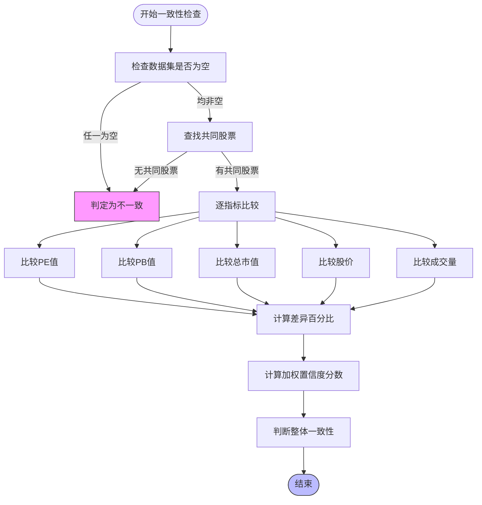
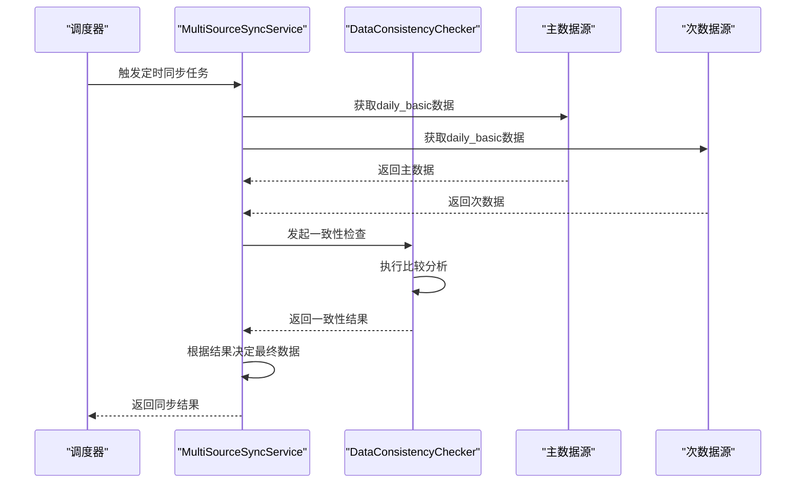
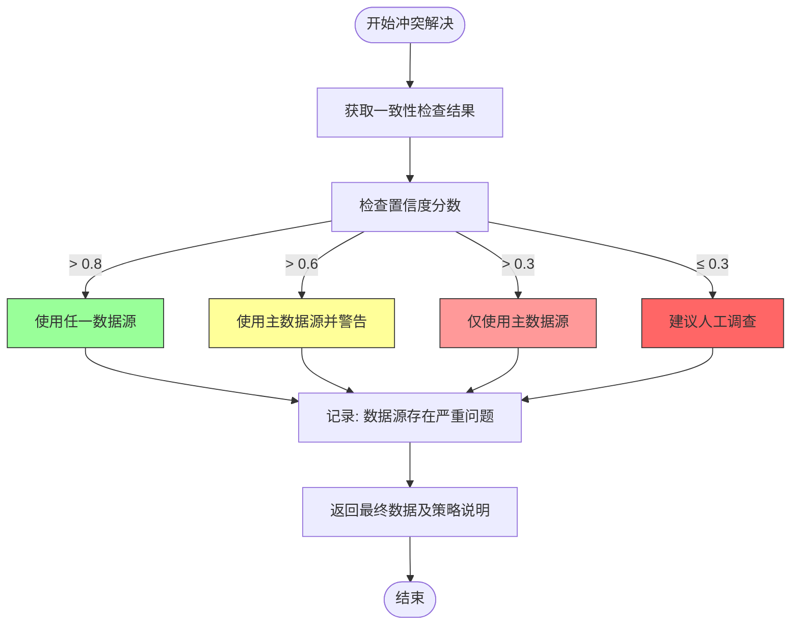
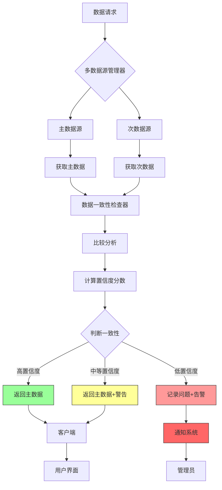

# 一致性检查

<cite>
**本文档引用文件**   
- [data_consistency_checker.py](file://app/services/data_consistency_checker.py)
- [manager.py](file://app/services/data_sources/manager.py)
- [multi_source_sync.py](file://app/routers/multi_source_sync.py)
- [config.py](file://app/core/config.py)
- [notification.py](file://app/models/notification.py)
</cite>

## 目录
1. [引言](#引言)
2. [数据一致性检查机制](#数据一致性检查机制)
3. [一致性检查触发时机](#一致性检查触发时机)
4. [数据差异处理策略](#数据差异处理策略)
5. [配置选项说明](#配置选项说明)
6. [通知与告警系统](#通知与告警系统)
7. [架构与流程图](#架构与流程图)
8. [结论](#结论)

## 引言

在多数据源环境下，确保数据质量的一致性是系统稳定运行的关键。本系统通过`data_consistency_checker`服务实现对不同数据源返回的相同股票数据（如股价、成交量、市盈率等）进行对比分析，识别并处理数据差异。该服务在数据获取过程中自动执行一致性检查，确保最终提供给用户的数据具有高质量和可靠性。

系统支持多种数据源（如Tushare、AKShare、Baostock等），通过优先级机制选择主数据源，并利用次数据源进行数据验证。当检测到数据不一致时，系统会根据预设的阈值和策略进行处理，包括自动修复、降级使用或发出告警通知。

**Section sources**
- [data_consistency_checker.py](file://app/services/data_consistency_checker.py)
- [manager.py](file://app/services/data_sources/manager.py)

## 数据一致性检查机制

数据一致性检查服务通过比较主数据源和次数据源返回的股票数据来评估数据质量。检查过程包括以下几个关键步骤：

1. **基础检查**：首先验证两个数据集是否为空，若任一数据集为空则直接判定为不一致。
2. **股票代码匹配**：尝试从不同列名（如`ts_code`、`symbol`、`code`）中提取股票代码，找到两个数据源的共同股票集合。
3. **逐指标比较**：对共同股票的各个财务指标（如PE、PB、总市值等）进行比较，计算差异百分比。
4. **整体一致性评估**：基于各指标的差异情况，计算加权置信度分数，判断整体数据一致性。

系统为不同指标设置了不同的容忍度阈值，以反映其重要性和允许的差异范围：



**Diagram sources **
- [data_consistency_checker.py](file://app/services/data_consistency_checker.py#L74-L135)

**Section sources**
- [data_consistency_checker.py](file://app/services/data_consistency_checker.py#L35-L319)

## 一致性检查触发时机

数据一致性检查在两个主要场景下被触发：实时检查和定时任务。

### 实时检查

实时检查在每次获取股票基础数据时自动执行。当系统需要获取`daily_basic`数据时，会同时从主数据源和次数据源获取数据，并立即进行一致性对比。这种检查方式确保了数据在使用前已经过验证。

```python
def get_daily_basic_with_consistency_check(self, trade_date: str):
    # 获取主数据源数据
    primary_data = primary_adapter.get_daily_basic(trade_date)
    # 获取次数据源数据
    secondary_data = secondary_adapter.get_daily_basic(trade_date)
    # 执行一致性检查
    consistency_result = self.consistency_checker.check_daily_basic_consistency(
        primary_data, secondary_data, primary_adapter.name, secondary_adapter.name
    )
```

### 定时任务

系统还配置了定时任务来定期执行数据一致性检查。这些任务通过调度器在预设时间自动运行，用于全面评估数据源的长期稳定性和数据质量趋势。



**Diagram sources **
- [multi_source_sync.py](file://app/routers/multi_source_sync.py#L154-L187)
- [manager.py](file://app/services/data_sources/manager.py#L240-L278)

**Section sources**
- [multi_source_sync.py](file://app/routers/multi_source_sync.py#L1-L488)
- [config.py](file://app/core/config.py#L152-L159)

## 数据差异处理策略

根据一致性检查的结果，系统采用分级处理策略来应对不同程度的数据差异。处理策略主要依据置信度分数和推荐行动来决定。

### 处理策略分级

| 置信度分数 | 推荐行动 | 处理策略 |
|----------|---------|--------|
| > 0.8 | use_either | 数据高度一致，可使用任一数据源 |
| > 0.6 | use_primary_with_warning | 使用主数据源但发出警告 |
| > 0.3 | use_primary_only | 仅使用主数据源 |
| ≤ 0.3 | investigate_sources | 需要人工调查数据源问题 |

### 冲突解决流程

当检测到数据冲突时，系统通过`resolve_data_conflicts`方法解决数据冲突，具体流程如下：



**Diagram sources **
- [data_consistency_checker.py](file://app/services/data_consistency_checker.py#L290-L318)

**Section sources**
- [data_consistency_checker.py](file://app/services/data_consistency_checker.py#L290-L318)
- [manager.py](file://app/services/data_sources/manager.py#L256-L271)

## 配置选项说明

系统提供了一系列配置选项来控制数据一致性检查的行为，包括差异阈值设置、检查频率调整和异常数据处理规则。

### 差异阈值设置

系统为不同财务指标设置了默认的容忍度阈值，用户可根据需要进行调整：

```python
self.tolerance_thresholds = {
    'pe': 0.05,      # PE允许5%差异
    'pb': 0.05,      # PB允许5%差异
    'total_mv': 0.02, # 市值允许2%差异
    'price': 0.01,   # 股价允许1%差异
    'volume': 0.10,  # 成交量允许10%差异
    'turnover_rate': 0.05  # 换手率允许5%差异
}
```

### 检查频率调整

通过配置文件中的CRON表达式，可以灵活调整一致性检查的执行频率：

```python
# 基础信息同步任务配置
SYNC_STOCK_BASICS_ENABLED: bool = True
SYNC_STOCK_BASICS_CRON: str = ""
SYNC_STOCK_BASICS_TIME: str = "06:30"
TIMEZONE: str = "Asia/Shanghai"

# Tushare统一数据同步配置
TUSHARE_BASIC_INFO_SYNC_ENABLED: bool = True
TUSHARE_BASIC_INFO_SYNC_CRON: str = "0 2 * * *"  # 每日凌晨2点
TUSHARE_QUOTES_SYNC_CRON: str = "*/5 9-15 * * 1-5"  # 交易时间每5分钟
```

### 异常数据处理规则

系统还提供了对异常数据的处理规则配置，包括缓存策略、重试机制等：

```python
# 缓存配置
CACHE_TTL: int = 3600  # 1小时
SCREENING_CACHE_TTL: int = 1800  # 30分钟

# 队列配置
QUEUE_MAX_SIZE: int = 10000
QUEUE_VISIBILITY_TIMEOUT: int = 300  # 5分钟
QUEUE_MAX_RETRIES: int = 3
```

**Section sources**
- [config.py](file://app/core/config.py#L1-L301)
- [data_consistency_checker.py](file://app/services/data_consistency_checker.py#L38-L57)

## 通知与告警系统

当数据一致性检查发现严重问题时，系统会通过通知与告警系统向管理员或相关人员发出通知。通知系统基于MongoDB存储通知记录，并支持不同类型和严重级别的通知。

### 通知类型与严重级别

系统定义了多种通知类型和严重级别：

```python
NotificationType = Literal['analysis', 'alert', 'system']
NotificationStatus = Literal['unread', 'read']
severity: Optional[Literal['info','success','warning','error']] = None
```

### 告警触发条件

当数据一致性检查的置信度分数低于阈值时，系统会触发告警：

```python
if internal_stats.avg_confidence < 0.6:  # 平均置信度过低
    alerts.append("内部消息置信度异常偏低")
```

告警信息包含详细的差异分析，帮助用户快速定位问题：

```python
quality_report = {
    "timestamp": datetime.utcnow().isoformat(),
    "social_media": {
        "total_messages": social_stats.total_count,
        "avg_engagement_rate": social_stats.avg_engagement_rate
    },
    "internal_messages": {
        "total_messages": internal_stats.total_count,
        "avg_confidence": internal_stats.avg_confidence
    },
    "alerts": alerts
}
```

**Section sources**
- [notification.py](file://app/models/notification.py#L1-L75)
- [data_consistency_checker.py](file://app/services/data_consistency_checker.py#L267-L274)

## 架构与流程图

以下是数据一致性检查的整体架构和工作流程：



**Diagram sources **
- [manager.py](file://app/services/data_sources/manager.py#L240-L278)
- [data_consistency_checker.py](file://app/services/data_consistency_checker.py#L59-L318)

## 结论

数据一致性检查服务是确保多数据源环境下数据质量的核心组件。通过自动化的一致性检查机制，系统能够有效识别和处理不同数据源之间的数据差异，保障了数据的准确性和可靠性。

该服务采用分级处理策略，根据数据差异的程度采取相应的处理措施，从简单使用主数据源到发出严重告警，形成了完整的数据质量保障体系。同时，系统提供了灵活的配置选项，允许用户根据实际需求调整检查阈值、频率和处理规则。

未来可进一步优化的方向包括：引入机器学习算法预测数据异常、增强跨数据源的数据融合能力、提供更细粒度的指标权重配置等，以持续提升数据质量管理水平。