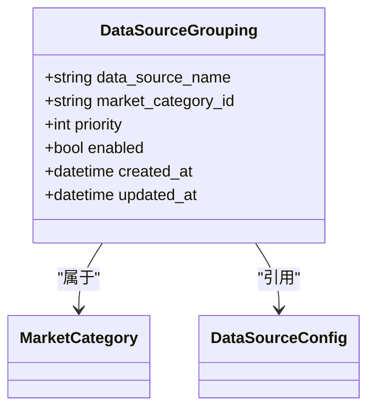
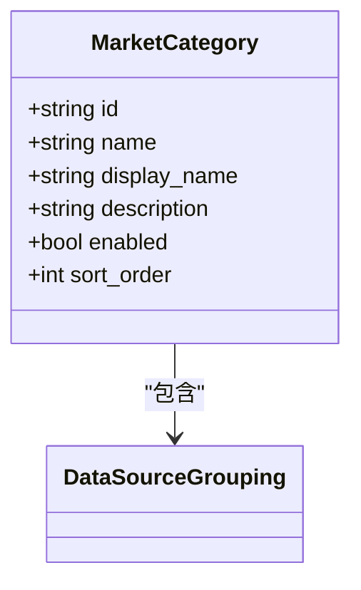
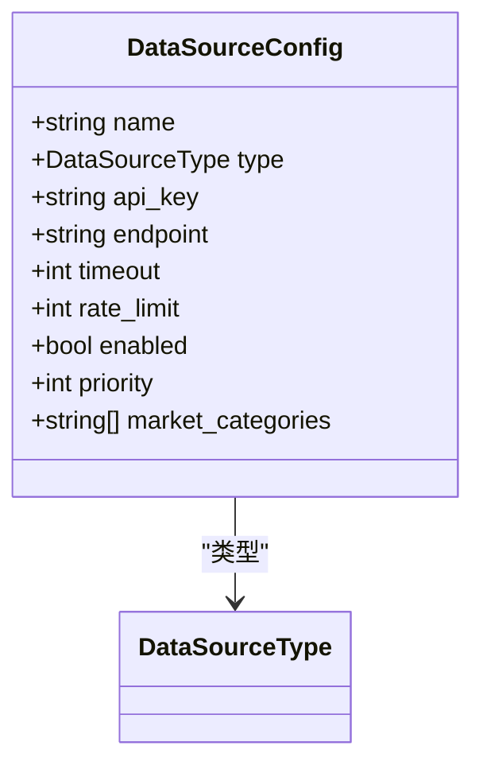
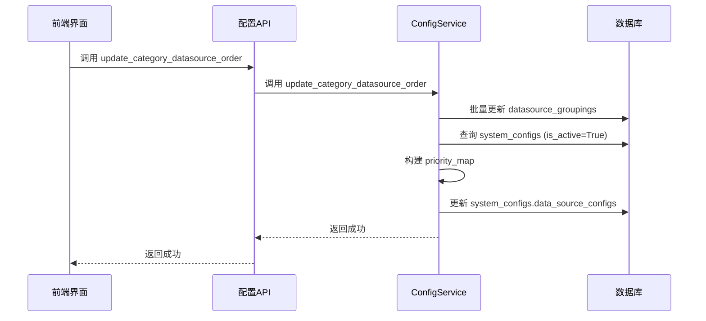

# 优先级配置

<cite>
**本文档引用的文件**   
- [config.py](file://app/routers/config.py)
- [config_service.py](file://app/services/config_service.py)
- [data_source_manager.py](file://tradingagents/dataflows/data_source_manager.py)
- [config.ts](file://frontend/src/api/config.ts)
- [config.py](file://app/models/config.py)
- [test_datasource_groupings.py](file://scripts/test_datasource_groupings.py)
- [data_source_manager.py](file://tradingagents/dataflows/data_source_manager.py)
- [mongodb_cache_adapter.py](file://tradingagents/dataflows/cache/mongodb_cache_adapter.py)
- [providers_config.py](file://tradingagents/config/providers_config.py)
</cite>

## 目录
1. [简介](#简介)
2. [核心配置结构](#核心配置结构)
3. [数据源优先级配置](#数据源优先级配置)
4. [市场分类管理](#市场分类管理)
5. [配置加载与热更新机制](#配置加载与热更新机制)
6. [API动态修改优先级](#api动态修改优先级)
7. [实际配置示例](#实际配置示例)
8. [最佳实践与注意事项](#最佳实践与注意事项)

## 简介

本文档详细说明了如何通过数据库中的 `datasource_groupings` 集合来配置不同市场的数据源优先级。系统采用灵活的优先级管理机制，允许为A股、港股、美股等不同市场独立设置Tushare、AkShare、BaoStock等数据源的优先级顺序。配置支持动态加载和热更新，确保系统在运行时能够实时响应配置变更。

**Section sources**
- [config.py](file://app/routers/config.py#L1-L2295)
- [config_service.py](file://app/services/config_service.py#L1-L4352)

## 核心配置结构

系统通过多个集合和模型协同工作来管理数据源优先级配置，主要涉及以下核心组件：

### 数据源分组关系 (DataSourceGrouping)

`datasource_groupings` 集合是优先级配置的核心，它定义了数据源与市场分类之间的多对多关系，并通过 `priority` 字段确定优先级。



**Diagram sources **
- [config.py](file://app/models/config.py#L286-L294)
- [config_service.py](file://app/services/config_service.py#L173-L183)

### 市场分类 (MarketCategory)

`market_categories` 集合定义了不同的市场分类，如A股、港股、美股等。每个市场分类可以关联多个数据源。



**Diagram sources **
- [config.py](file://app/models/config.py#L274-L284)
- [config_service.py](file://app/services/config_service.py#L44-L63)

### 数据源配置 (DataSourceConfig)

`system_configs` 集合中的 `data_source_configs` 字段存储了数据源的详细配置信息，包括API密钥、超时时间等。



**Diagram sources **
- [config.py](file://app/models/config.py#L237-L256)
- [config_service.py](file://app/services/config_service.py#L362-L395)

**Section sources**
- [config.py](file://app/models/config.py#L146-L256)
- [config_service.py](file://app/services/config_service.py#L44-L170)

## 数据源优先级配置

数据源优先级的配置和管理遵循以下核心原则和流程。

### 优先级规则

系统采用 **数字越大，优先级越高** 的规则。当系统需要获取数据时，会按照优先级从高到低的顺序尝试各个数据源，直到成功获取数据。

```python
# 示例：正确的优先级逻辑（降序）
source_priority = ["tushare", "akshare", "baostock"]  # 实际使用 tushare
```

### 配置流程

1.  **创建市场分类**：首先需要定义市场分类（如 `a_shares`, `us_stocks`）。
2.  **添加数据源**：在 `system_configs` 中添加数据源的详细配置。
3.  **建立分组关系**：在 `datasource_groupings` 集合中，将数据源与市场分类关联，并设置 `priority` 和 `enabled` 字段。

### 配置同步机制

当通过API修改 `datasource_groupings` 集合中的优先级时，系统会自动同步更新 `system_configs` 集合中的 `data_source_configs`，确保两个数据源的优先级信息保持一致。



**Diagram sources **
- [config_service.py](file://app/services/config_service.py#L288-L356)
- [config.py](file://app/routers/config.py#L1600-L1607)

**Section sources**
- [config_service.py](file://app/services/config_service.py#L288-L356)
- [config.py](file://app/routers/config.py#L1600-L1607)

## 市场分类管理

市场分类是组织和管理数据源优先级的基础。系统提供了完整的API来管理市场分类。

### 默认市场分类

系统内置了以下默认市场分类：

| ID | 名称 | 显示名称 |
| :--- | :--- | :--- |
| `a_shares` | a_shares | A股 |
| `us_stocks` | us_stocks | 美股 |
| `hk_stocks` | hk_stocks | 港股 |
| `crypto` | crypto | 数字货币 |
| `futures` | futures | 期货 |

### API接口

- **获取所有市场分类**: `GET /api/config/market-categories`
- **添加市场分类**: `POST /api/config/market-categories`
- **更新市场分类**: `PUT /api/config/market-categories/{category_id}`
- **删除市场分类**: `DELETE /api/config/market-categories/{category_id}`

**Section sources**
- [config_service.py](file://app/services/config_service.py#L44-L170)
- [config.py](file://app/routers/config.py#L1339-L1399)

## 配置加载与热更新机制

系统采用高效的配置加载和热更新机制，确保配置变更能够立即生效。

### 配置加载流程

1.  **数据源适配器初始化**：当数据源适配器（如 `BaseDataSourceAdapter`）初始化时，会调用 `load_priority_from_db` 方法。
2.  **查询数据库**：从 `datasource_groupings` 集合中查询当前市场分类下所有启用的数据源。
3.  **按优先级排序**：根据 `priority` 字段对结果进行降序排序。
4.  **返回优先级列表**：将排序后的数据源列表返回给调用方。

```python
# 从数据库读取美股数据源优先级
groupings = list(groupings_collection.find({
    "market_category_id": "us_stocks",
    "enabled": True
}).sort("priority", -1))  # 降序排序，优先级高的在前
```

### 热更新能力

系统支持配置的热更新，无需重启服务即可使配置生效。这主要通过以下方式实现：

1.  **API触发**：用户通过Web界面或API修改优先级配置。
2.  **数据库更新**：`ConfigService` 同时更新 `datasource_groupings` 和 `system_configs` 两个集合。
3.  **配置重载**：调用 `/api/config/reload` 端点，强制系统重新加载最新的配置。

**Section sources**
- [data_source_manager.py](file://tradingagents/dataflows/data_source_manager.py#L2265-L2293)
- [config_service.py](file://app/services/config_service.py#L288-L356)
- [config.py](file://app/routers/config.py#L37-L67)

## API动态修改优先级

系统提供了丰富的API接口，允许通过编程方式动态修改数据源优先级。

### 关键API端点

| 端点 | 方法 | 描述 |
| :--- | :--- | :--- |
| `/api/config/market-categories/{category_id}/datasource-order` | PUT | 更新指定市场分类中数据源的排序 |
| `/api/config/datasource-groupings` | POST | 将数据源添加到分类 |
| `/api/config/datasource-groupings/{dataSourceName}/{categoryId}` | PUT | 更新数据源分组关系（如优先级、启用状态） |
| `/api/config/datasource-groupings/{dataSourceName}/{categoryId}` | DELETE | 从分类中移除数据源 |

### 使用示例

以下是一个使用 `configApi` 更新A股市场数据源优先级的前端代码示例：

```javascript
// 更新A股市场的数据源优先级顺序
await configApi.updateCategoryDataSourceOrder('a_shares', [
  { name: 'tushare', priority: 3 },
  { name: 'akshare', priority: 2 },
  { name: 'baostock', priority: 1 }
])
```

**Section sources**
- [config.py](file://app/routers/config.py#L1599-L1607)
- [config.ts](file://frontend/src/api/config.ts#L381-L385)

## 实际配置示例

以下是为A股、港股、美股分别设置数据源优先级的实际配置示例。

### A股市场配置

```json
{
  "market_category_id": "a_shares",
  "data_source_name": "tushare",
  "priority": 3,
  "enabled": true
},
{
  "market_category_id": "a_shares",
  "data_source_name": "akshare",
  "priority": 2,
  "enabled": true
},
{
  "market_category_id": "a_shares",
  "data_source_name": "baostock",
  "priority": 1,
  "enabled": true
}
```

### 港股市场配置

```json
{
  "market_category_id": "hk_stocks",
  "data_source_name": "akshare",
  "priority": 2,
  "enabled": true
},
{
  "market_category_id": "hk_stocks",
  "data_source_name": "tushare",
  "priority": 1,
  "enabled": true
}
```

### 美股市场配置

```json
{
  "market_category_id": "us_stocks",
  "data_source_name": "finnhub",
  "priority": 3,
  "enabled": true
},
{
  "market_category_id": "us_stocks",
  "data_source_name": "yfinance",
  "priority": 2,
  "enabled": true
},
{
  "market_category_id": "us_stocks",
  "data_source_name": "alpha_vantage",
  "priority": 1,
  "enabled": true
}
```

**Section sources**
- [test_datasource_groupings.py](file://scripts/test_datasource_groupings.py#L102-L138)
- [data_source_manager.py](file://tradingagents/dataflows/data_source_manager.py#L2265-L2293)

## 最佳实践与注意事项

为了确保优先级配置的正确性和系统的稳定性，请遵循以下最佳实践。

### 最佳实践

1.  **明确优先级规则**：始终记住“数字越大，优先级越高”。
2.  **启用/禁用控制**：通过 `enabled` 字段精确控制哪些数据源参与优先级排序。
3.  **利用默认配置**：如果数据库中未找到配置，系统会使用默认优先级（Tushare > AkShare > BaoStock）。
4.  **测试配置**：在应用新配置后，使用 `/api/config/reload` 重载配置，并通过日志验证其生效。

### 注意事项

- **配置同步**：修改 `datasource_groupings` 集合时，系统会自动同步 `system_configs`，无需手动操作。
- **市场分类约束**：一个数据源可以属于多个市场分类，但每个市场分类内的优先级是独立的。
- **错误处理**：如果从数据库加载优先级失败，系统会回退到默认优先级，确保服务不中断。

**Section sources**
- [data_source_manager.py](file://tradingagents/dataflows/data_source_manager.py#L110-L135)
- [mongodb_cache_adapter.py](file://tradingagents/dataflows/cache/mongodb_cache_adapter.py#L116-L141)
- [bugfix/2025-10-26-async-sync-conflict-fix.md](file://docs/bugfix/2025-10-26-async-sync-conflict-fix.md#L133-L146)