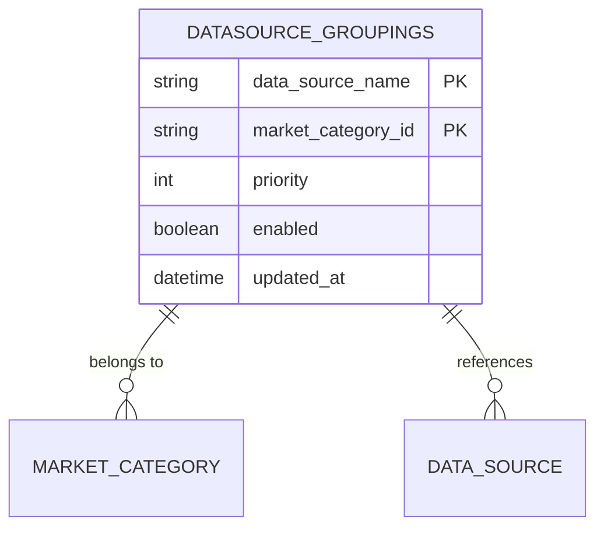
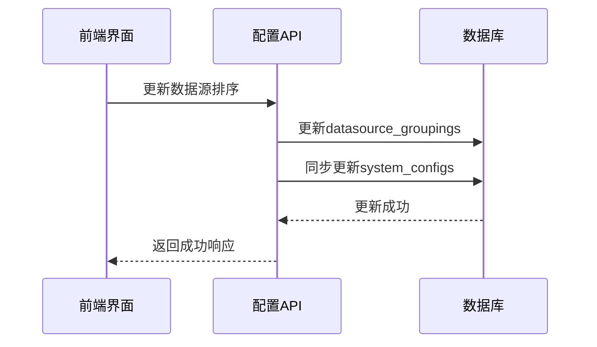
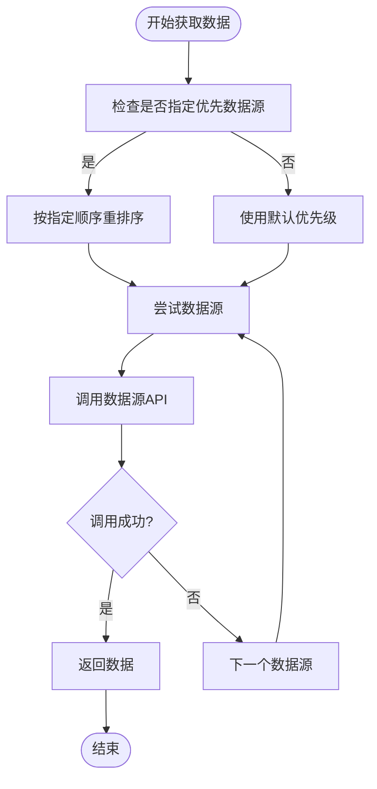

# 数据源优先级管理

<cite>
**本文档引用的文件**   
- [manager.py](file://app/services/data_sources/manager.py)
- [unified_stock_service.py](file://app/services/unified_stock_service.py)
- [foreign_stock_service.py](file://app/services/foreign_stock_service.py)
- [config_service.py](file://app/services/config_service.py)
- [multi_source_sync.py](file://app/routers/multi_source_sync.py)
- [config.py](file://app/routers/config.py)
</cite>

## 目录
1. [引言](#引言)
2. [数据源优先级配置机制](#数据源优先级配置机制)
3. [优先级加载与同步过程](#优先级加载与同步过程)
4. [Fallback策略与动态排序](#fallback策略与动态排序)
5. [API调用中的优先级指定](#api调用中的优先级指定)
6. [最佳实践](#最佳实践)
7. [结论](#结论)

## 引言
本文档深入解释了多数据源优先级管理机制，重点描述如何通过数据库配置（`datasource_groupings`集合）管理A股、港股、美股等不同市场的数据源优先级。系统采用灵活的优先级配置、Fallback故障转移和动态排序机制，确保在主数据源不可用时能够无缝切换到备用数据源，从而提高系统的可用性和稳定性。

**Section sources**
- [manager.py](file://app/services/data_sources/manager.py#L1-L309)

## 数据源优先级配置机制
数据源优先级配置通过`datasource_groupings`集合进行管理，该集合存储了不同市场分类（如A股、港股、美股）与数据源之间的映射关系。每个市场分类（`market_category_id`）对应一组数据源，每个数据源都有一个优先级值（`priority`），数值越大表示优先级越高。

系统支持多个市场类型，包括：
- A股（`a_shares`）
- 港股（`hk_stocks`）
- 美股（`us_stocks`）

每个市场类型可以配置多个数据源，例如A股市场可以配置Tushare、AKShare和Baostock等数据源，并通过优先级字段确定其调用顺序。



**Diagram sources **
- [manager.py](file://app/services/data_sources/manager.py#L53-L56)
- [unified_stock_service.py](file://app/services/unified_stock_service.py#L112-L116)

**Section sources**
- [manager.py](file://app/services/data_sources/manager.py#L45-L88)
- [unified_stock_service.py](file://app/services/unified_stock_service.py#L102-L142)

## 优先级加载与同步过程
系统在启动时会从数据库加载数据源优先级配置，并将其同步到运行时配置中。优先级加载过程分为以下几个步骤：

1. **从数据库读取配置**：系统通过查询`datasource_groupings`集合获取指定市场分类的数据源分组配置。
2. **构建优先级映射**：将查询结果转换为数据源名称到优先级的映射表。
3. **更新适配器优先级**：将优先级映射应用到各个数据源适配器实例上。
4. **同步到系统配置**：同时更新`system_configs`集合中的`data_source_configs`字段，确保前端展示和后端逻辑的一致性。

当用户通过API更新数据源排序时，系统会同时更新`datasource_groupings`和`system_configs`两个集合，保证配置的实时性和一致性。



**Diagram sources **
- [config_service.py](file://app/services/config_service.py#L290-L353)
- [config.py](file://app/routers/config.py#L1600-L1627)

**Section sources**
- [config_service.py](file://app/services/config_service.py#L288-L353)
- [manager.py](file://app/services/data_sources/manager.py#L45-L88)

## Fallback策略与动态排序
系统实现了完善的Fallback策略和动态排序机制，确保在主数据源不可用时能够自动切换到备用数据源。

### Fallback策略
当主数据源调用失败时，系统会按照优先级顺序尝试下一个数据源，直到成功获取数据或所有数据源都尝试失败。这种机制提高了系统的容错能力，避免因单个数据源故障导致整个功能不可用。

### 动态排序
系统支持在API调用时动态指定优先数据源列表。通过`preferred_sources`参数，用户可以在运行时指定优先使用的数据源，覆盖默认的优先级配置。这对于测试新数据源或临时调整数据获取策略非常有用。



**Diagram sources **
- [manager.py](file://app/services/data_sources/manager.py#L102-L139)
- [foreign_stock_service.py](file://app/services/foreign_stock_service.py#L179-L225)

**Section sources**
- [manager.py](file://app/services/data_sources/manager.py#L102-L139)
- [foreign_stock_service.py](file://app/services/foreign_stock_service.py#L179-L225)

## API调用中的优先级指定
在API调用中，可以通过`preferred_sources`参数指定优先使用的数据源列表。该参数接受一个用逗号分隔的数据源名称字符串，系统会按照指定的顺序尝试获取数据。

例如，在调用多数据源同步接口时，可以通过以下方式指定优先使用AKShare和Baostock：
```
POST /api/sync/multi-source/stock_basics/run?preferred_sources=akshare,baostock
```

在代码层面，`DataSourceManager`类的`get_stock_list_with_fallback`等方法支持`preferred_sources`参数，允许在运行时动态调整数据源优先级。

**Section sources**
- [multi_source_sync.py](file://app/routers/multi_source_sync.py#L156-L168)
- [manager.py](file://app/services/data_sources/manager.py#L102-L139)

## 最佳实践
### 设置主备数据源
建议为每个市场配置至少两个数据源，一个作为主数据源（高优先级），另一个作为备用数据源（低优先级）。例如：
- A股：主数据源为Tushare，备用数据源为AKShare
- 港股：主数据源为yfinance，备用数据源为akshare
- 美股：主数据源为yfinance，备用数据源为alpha_vantage

### 处理数据源故障转移
定期测试数据源的连通性，确保备用数据源在主数据源故障时能够正常工作。可以通过`/api/sync/multi-source/test-sources`接口测试数据源的连通性。

### 在API调用中指定优先数据源
在特殊情况下，如测试新数据源或临时调整数据获取策略，可以通过`preferred_sources`参数动态指定优先数据源，而无需修改数据库配置。

**Section sources**
- [manager.py](file://app/services/data_sources/manager.py#L102-L139)
- [multi_source_sync.py](file://app/routers/multi_source_sync.py#L156-L168)
- [foreign_stock_service.py](file://app/services/foreign_stock_service.py#L179-L225)

## 结论
数据源优先级管理机制通过`datasource_groupings`集合实现了灵活的多市场数据源配置。系统采用优先级加载、Fallback故障转移和动态排序机制，确保了数据获取的高可用性和稳定性。通过API支持动态指定优先数据源，提供了灵活的配置选项。建议为每个市场配置主备数据源，并定期测试数据源连通性，以确保系统的可靠运行。