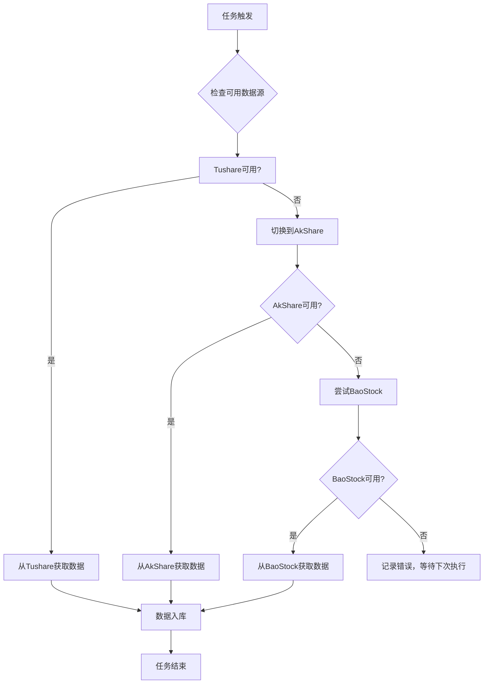
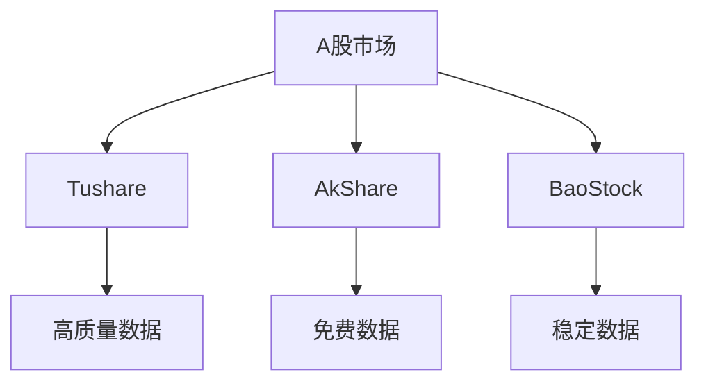

# 数据源配置

<cite>
**本文档引用的文件**   
- [data_sources.py](file://tradingagents/constants/data_sources.py)
- [config.py](file://app/core/config.py)
- [config.py](file://app/models/config.py)
- [data_directory_manager.py](file://scripts/unified_data_manager.py)
- [data-source-configuration.md](file://docs/configuration/data-directory-configuration.md)
- [realtime_quotes_data_source.md](file://docs/integration/data-sources/realtime_quotes_data_source.md)
- [system_config.py](file://app/routers/system_config.py)
</cite>

## 目录
1. [引言](#引言)
2. [主要数据源配置](#主要数据源配置)
3. [数据源优先级与故障转移机制](#数据源优先级与故障转移机制)
4. [多市场数据源配置](#多市场数据源配置)
5. [数据目录配置](#数据目录配置)
6. [数据源健康检查与状态监控](#数据源健康检查与状态监控)
7. [数据同步频率设置](#数据同步频率设置)
8. [结论](#结论)

## 引言

本系统采用多数据源架构，支持Tushare、AkShare、BaoStock等多个数据提供商，确保数据获取的稳定性和可靠性。系统通过灵活的配置体系，允许用户根据需求启用或禁用特定数据源，并设置其优先级。数据源配置不仅包括API密钥等认证信息，还涵盖了数据同步的调度策略、缓存机制和故障转移策略。此外，系统支持A股、港股、美股等多个市场的数据源配置，满足跨市场分析的需求。通过统一的数据目录管理，系统能够高效地组织和存储从不同数据源获取的数据，便于后续的分析和处理。

**Section sources**
- [data_sources.py](file://tradingagents/constants/data_sources.py#L1-L346)
- [config.py](file://app/core/config.py#L1-L301)

## 主要数据源配置

### Tushare 配置

Tushare作为专业的A股数据接口，提供高质量的历史数据和实时行情。要启用Tushare数据源，必须在`.env`文件中配置API Token。

**配置方法**：
```env
# Tushare API Token（必需）
TUSHARE_TOKEN=your_tushare_token_here

# 是否启用 Tushare
TUSHARE_ENABLED=true
```

**获取Token**：
1. 访问 https://tushare.pro/ 注册账号
2. 在"个人中心"获取Token
3. 将Token填入`.env`文件

Tushare数据源支持基础信息、实时行情、历史数据和财务数据的同步，可通过CRON表达式配置不同的同步任务。

**Section sources**
- [config.py](file://app/core/config.py#L185-L208)
- [realtime_quotes_data_source.md](file://docs/integration/data-sources/realtime_quotes_data_source.md#L226-L236)

### AkShare 配置

AkShare是一个开源的金融数据接口，支持A股和港股，完全免费。与Tushare不同，AkShare无需API密钥，只需确保库已安装。

**安装方法**：
```bash
pip install akshare
```

AkShare作为Tushare的备用数据源，当Tushare不可用时，系统会自动切换到AkShare获取数据。AkShare同样支持基础信息、实时行情、历史数据和财务数据的同步。

**Section sources**
- [config.py](file://app/core/config.py#L209-L226)
- [realtime_quotes_data_source.md](file://docs/integration/data-sources/realtime_quotes_data_source.md#L243-L249)

### BaoStock 配置

BaoStock提供免费的A股数据接口，数据稳定可靠。与AkShare类似，BaoStock也无需API密钥。

**安装方法**：
```bash
pip install baostock
```

BaoStock主要用于历史数据和基础信息的同步，不支持实时行情。系统会优先使用Tushare和AkShare获取实时数据，当它们都不可用时，才会尝试使用BaoStock。

**Section sources**
- [config.py](file://app/core/config.py#L233-L252)
- [realtime_quotes_data_source.md](file://docs/integration/data-sources/realtime_quotes_data_source.md#L251-L257)

## 数据源优先级与故障转移机制

系统采用多级数据源优先级机制，确保在主数据源不可用时能够无缝切换到备用数据源。优先级顺序为：Tushare > AkShare > BaoStock。



**Diagram sources**
- [realtime_quotes_data_source.md](file://docs/integration/data-sources/realtime_quotes_data_source.md#L163-L220)

**Section sources**
- [realtime_quotes_data_source.md](file://docs/integration/data-sources/realtime_quotes_data_source.md#L7-L403)
- [data_sources.py](file://tradingagents/constants/data_sources.py#L75-L133)

## 多市场数据源配置

系统支持A股、港股、美股等多个市场的数据源配置，每个市场都有其特定的数据源和配置参数。

### A股市场

A股市场主要依赖Tushare、AkShare和BaoStock三个数据源。这些数据源都支持A股的基础信息、历史数据和财务数据同步。



**Diagram sources**
- [data_sources.py](file://tradingagents/constants/data_sources.py#L91-L133)

### 港股市场

港股市场主要使用yfinance和AkShare作为数据源。yfinance是主要数据源，提供全面的实时行情和历史数据；AkShare作为备用数据源，确保数据获取的稳定性。

**配置参数**：
- `HK_DATA_CACHE_HOURS`: 港股数据缓存时长（小时）
- `HK_DEFAULT_DATA_SOURCE`: 港股默认数据源（yfinance/akshare）

### 美股市场

美股市场使用yfinance、Finnhub、Alpha Vantage等多个数据源。yfinance是主要数据源，提供免费的实时行情和历史数据；Finnhub和Alpha Vantage作为备用数据源，提供更专业的数据服务。

**配置参数**：
- `US_DATA_CACHE_HOURS`: 美股数据缓存时长（小时）
- `US_DEFAULT_DATA_SOURCE`: 美股默认数据源（yfinance/finnhub）

**Section sources**
- [config.py](file://app/core/config.py#L261-L272)
- [data_sources.py](file://tradingagents/constants/data_sources.py#L135-L192)

## 数据目录配置

系统通过统一的数据目录管理器来管理所有数据的存储路径，确保数据组织的规范性和可维护性。

### 目录结构

配置数据目录后，系统会自动创建以下目录结构：
```
data/
├── cache/                          # 缓存目录
├── finnhub_data/                   # Finnhub数据目录
│   ├── news_data/                  # 新闻数据
│   ├── insider_sentiment/          # 内部人情绪数据
│   └── insider_transactions/       # 内部人交易数据
└── results/                        # 分析结果
```

### 配置方法

#### 1. CLI命令配置
```bash
# 查看当前配置
python -m cli.main data-config

# 设置自定义数据目录
python -m cli.main data-config --set "/path/to/custom/data"
```

#### 2. 环境变量配置
```bash
# 设置数据目录
export TRADINGAGENTS_DATA_DIR="/path/to/your/data"

# 设置缓存目录
export TRADINGAGENTS_CACHE_DIR="/path/to/your/cache"
```

#### 3. .env文件配置
```env
TRADINGAGENTS_DATA_DIR=/path/to/your/data
TRADINGAGENTS_CACHE_DIR=/path/to/your/cache
```

**Section sources**
- [unified_data_manager.py](file://scripts/unified_data_manager.py#L50-L252)
- [data-directory-configuration.md](file://docs/configuration/data-directory-configuration.md#L97-L102)

## 数据源健康检查与状态监控

系统提供了全面的数据源健康检查和状态监控功能，确保数据获取的稳定性和可靠性。

### 健康检查

系统会定期检查各数据源的可用性，并记录检查结果。健康检查包括：
- API密钥有效性
- 数据源连接状态
- 数据获取成功率

```python
class ConfigHealthChecker:
    def check_health(self) -> Dict[str, Any]:
        """检查配置健康状态"""
        health_status = {
            "overall": "healthy",
            "checks": {}
        }
        
        # 检查API密钥有效性
        api_checks = self._check_api_keys()
        health_status["checks"]["api_keys"] = api_checks
        
        # 检查数据库连接
        db_checks = self._check_database_connections()
        health_status["checks"]["databases"] = db_checks
        
        # 检查缓存系统
        cache_checks = self._check_cache_system()
        health_status["checks"]["cache"] = cache_checks
        
        return health_status
```

### 状态监控

通过Web界面可以实时监控各数据源的状态，包括：
- 数据源是否启用
- 数据源优先级
- 最后同步时间
- 同步成功率

**Section sources**
- [system_config.py](file://app/routers/system_config.py#L52-L285)
- [data-directory-configuration.md](file://docs/configuration/data-directory-configuration.md#L164-L179)

## 数据同步频率设置

系统允许用户通过CRON表达式或简单时间字符串来配置数据同步的频率。

### Tushare同步配置

| 任务类型 | CRON表达式 | 说明 |
|--------|----------|------|
| 基础信息同步 | 0 2 * * * | 每日凌晨2点 |
| 行情同步 | */5 9-15 * * 1-5 | 交易时间每5分钟 |
| 历史数据同步 | 0 16 * * 1-5 | 工作日16点 |
| 财务数据同步 | 0 3 * * 0 | 周日凌晨3点 |

### AkShare同步配置

| 任务类型 | CRON表达式 | 说明 |
|--------|----------|------|
| 基础信息同步 | 0 3 * * * | 每日凌晨3点 |
| 行情同步 | */30 9-15 * * 1-5 | 交易时间每30分钟 |
| 历史数据同步 | 0 17 * * 1-5 | 工作日17点 |
| 财务数据同步 | 0 4 * * 0 | 周日凌晨4点 |

**Section sources**
- [config.py](file://app/core/config.py#L191-L221)

## 结论

本系统的数据源配置体系设计完善，支持多种数据源的灵活配置和管理。通过优先级机制和故障转移策略，确保了数据获取的高可用性。多市场支持使得系统能够满足跨市场分析的需求。统一的数据目录管理和详细的健康检查功能，进一步提升了系统的稳定性和可维护性。用户可以根据实际需求，通过简单的配置即可实现复杂的数据同步任务。