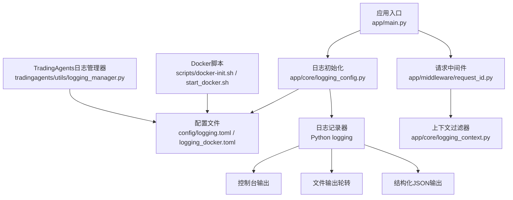
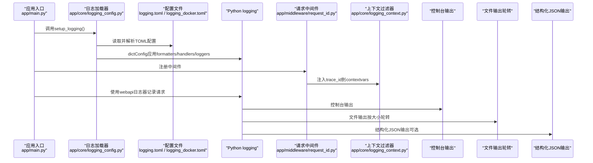
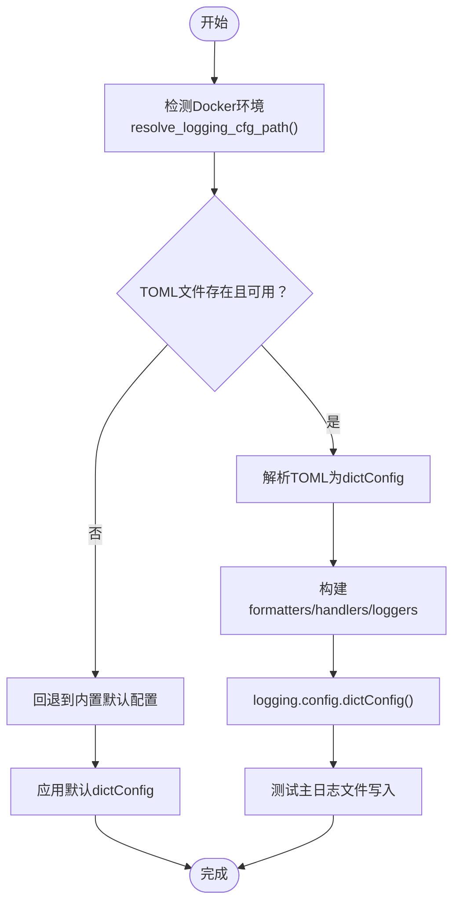
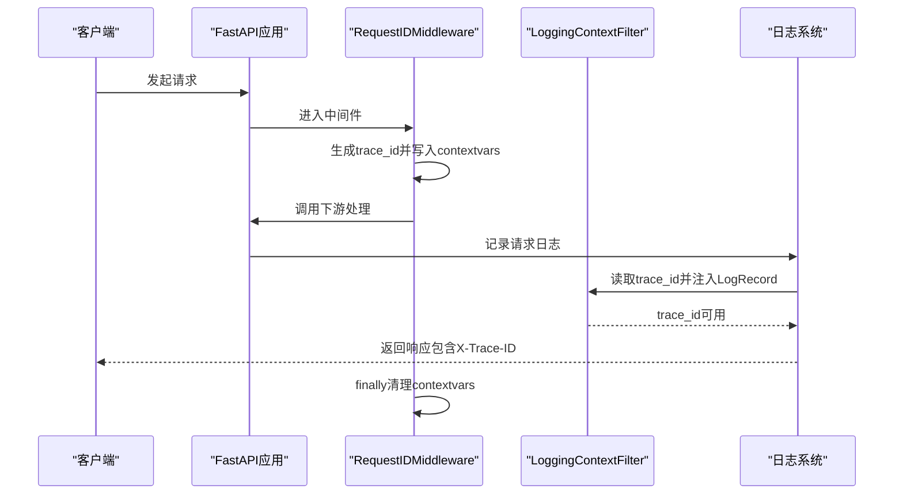
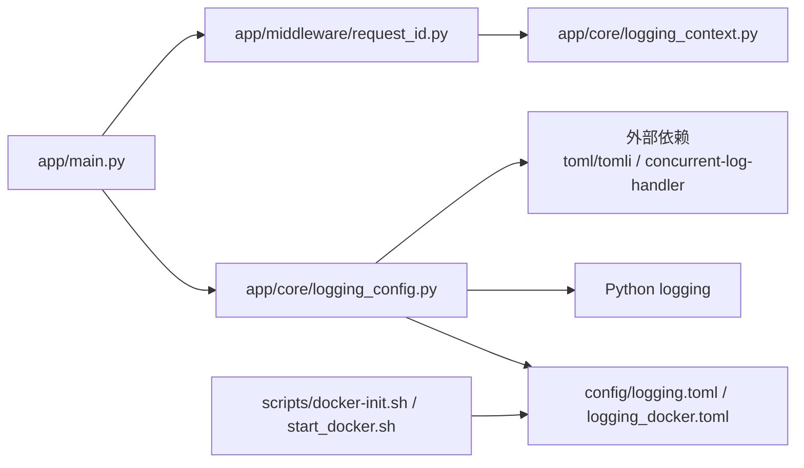

# 日志配置

<cite>
**本文引用的文件**
- [config/logging.toml](file://config/logging.toml)
- [config/logging_docker.toml](file://config/logging_docker.toml)
- [app/core/logging_config.py](file://app/core/logging_config.py)
- [app/core/logging_context.py](file://app/core/logging_context.py)
- [app/middleware/request_id.py](file://app/middleware/request_id.py)
- [app/main.py](file://app/main.py)
- [scripts/docker-init.sh](file://scripts/docker-init.sh)
- [scripts/start_docker.sh](file://scripts/start_docker.sh)
- [tests/test_logging_fix.py](file://tests/test_logging_fix.py)
- [scripts/test_docker_logging.py](file://scripts/test_docker_logging.py)
- [tradingagents/utils/logging_manager.py](file://tradingagents/utils/logging_manager.py)
</cite>

## 目录
1. [简介](#简介)
2. [项目结构](#项目结构)
3. [核心组件](#核心组件)
4. [架构总览](#架构总览)
5. [详细组件分析](#详细组件分析)
6. [依赖关系分析](#依赖关系分析)
7. [性能考量](#性能考量)
8. [故障排查指南](#故障排查指南)
9. [结论](#结论)
10. [附录](#附录)

## 简介
本文件面向运维与开发人员，系统性说明本项目的日志配置体系与最佳实践。内容覆盖：
- logging.toml 配置文件结构与字段含义（处理器、格式化器、日志记录器）
- 不同环境（本地、Docker）下的差异化配置与落地方式
- 日志级别（DEBUG、INFO、WARNING、ERROR）对系统性能与可观测性的权衡
- 日志轮转策略、文件大小限制与输出目标（控制台、文件、结构化JSON）
- 日志上下文管理与跨请求追踪（trace_id）

## 项目结构
日志系统由“配置文件 + 动态加载 + 中间件注入 + 多目标输出”构成，核心位置如下：
- 配置文件：config/logging.toml（通用）、config/logging_docker.toml（Docker专用）
- 启动加载：app/core/logging_config.py 负责解析TOML并应用到Python logging
- 上下文注入：app/core/logging_context.py 提供过滤器，app/middleware/request_id.py 注入trace_id
- 应用入口：app/main.py 在生命周期内调用setup_logging，并在请求中间件中使用webapi日志器
- Docker支持：scripts/docker-init.sh、scripts/start_docker.sh 确保日志目录与容器环境变量
- 统一日志管理器（TradingAgents库）：tradingagents/utils/logging_manager.py 提供独立的TOML驱动日志配置

图表来源
- [app/main.py](file://app/main.py#L215-L260)
- [app/core/logging_config.py](file://app/core/logging_config.py#L66-L120)
- [config/logging.toml](file://config/logging.toml#L1-L122)
- [config/logging_docker.toml](file://config/logging_docker.toml#L1-L132)
- [app/middleware/request_id.py](file://app/middleware/request_id.py#L19-L76)
- [app/core/logging_context.py](file://app/core/logging_context.py#L1-L20)
- [scripts/docker-init.sh](file://scripts/docker-init.sh#L50-L72)
- [scripts/start_docker.sh](file://scripts/start_docker.sh#L20-L24)
- [tradingagents/utils/logging_manager.py](file://tradingagents/utils/logging_manager.py#L139-L184)

章节来源
- [app/main.py](file://app/main.py#L215-L260)
- [app/core/logging_config.py](file://app/core/logging_config.py#L66-L120)
- [config/logging.toml](file://config/logging.toml#L1-L122)
- [config/logging_docker.toml](file://config/logging_docker.toml#L1-L132)
- [app/middleware/request_id.py](file://app/middleware/request_id.py#L19-L76)
- [app/core/logging_context.py](file://app/core/logging_context.py#L1-L20)
- [scripts/docker-init.sh](file://scripts/docker-init.sh#L50-L72)
- [scripts/start_docker.sh](file://scripts/start_docker.sh#L20-L24)
- [tradingagents/utils/logging_manager.py](file://tradingagents/utils/logging_manager.py#L139-L184)

## 核心组件
- 配置文件（TOML）
  - logging：全局级别、格式化器、处理器、日志记录器、环境开关（development/production/docker）、性能/安全/业务特性
  - logging.format：控制台、文件、结构化JSON格式模板；支持file_json/file_mode/json_file/json等兼容字段
  - logging.handlers：console、file、error、structured、main、webapi、worker等处理器
  - logging.loggers：针对特定命名空间的日志级别
  - logging.docker/development/production/performance/security/business：环境与功能开关
- 动态加载与应用（app/core/logging_config.py）
  - 自动识别Docker环境（环境变量或容器标识），选择logging_docker.toml或logging.toml
  - 解析TOML为dictConfig，构建formatters、handlers、loggers
  - Windows平台自动使用并发安全的RotatingFileHandler（concurrent-log-handler）
  - 为控制台与文件处理器注入请求上下文过滤器，自动携带trace_id
- 上下文与追踪（app/core/logging_context.py、app/middleware/request_id.py）
  - LoggingContextFilter将trace_id注入到每个日志记录对象
  - RequestIDMiddleware为每个请求生成trace_id，写入request.state与响应头，注入到contextvars
- 应用入口集成（app/main.py）
  - 生命周期内调用setup_logging，动态应用系统设置中的log_level
  - 使用webapi日志器记录请求处理流程
- Docker支持（scripts/docker-init.sh、scripts/start_docker.sh）
  - 确保logs目录存在与权限
  - Docker专用配置文件中明确文件路径与轮转参数
- 统一日志管理器（tradingagents/utils/logging_manager.py）
  - 为TradingAgents库提供独立的TOML驱动日志配置，支持Docker环境检测与多目标输出

章节来源
- [config/logging.toml](file://config/logging.toml#L1-L122)
- [config/logging_docker.toml](file://config/logging_docker.toml#L1-L132)
- [app/core/logging_config.py](file://app/core/logging_config.py#L31-L120)
- [app/core/logging_context.py](file://app/core/logging_context.py#L1-L20)
- [app/middleware/request_id.py](file://app/middleware/request_id.py#L19-L76)
- [app/main.py](file://app/main.py#L215-L260)
- [scripts/docker-init.sh](file://scripts/docker-init.sh#L50-L72)
- [scripts/start_docker.sh](file://scripts/start_docker.sh#L20-L24)
- [tradingagents/utils/logging_manager.py](file://tradingagents/utils/logging_manager.py#L139-L184)

## 架构总览
下图展示从应用启动到日志输出的关键流程，包括配置加载、上下文注入与多目标输出。

图表来源
- [app/main.py](file://app/main.py#L215-L260)
- [app/core/logging_config.py](file://app/core/logging_config.py#L66-L120)
- [config/logging.toml](file://config/logging.toml#L1-L122)
- [config/logging_docker.toml](file://config/logging_docker.toml#L1-L132)
- [app/middleware/request_id.py](file://app/middleware/request_id.py#L19-L76)
- [app/core/logging_context.py](file://app/core/logging_context.py#L1-L20)

## 详细组件分析

### 配置文件结构与字段说明
- 全局与格式化器
  - logging.level：全局日志级别（DEBUG/INFO/WARNING/ERROR/CRITICAL）
  - logging.format.console/file/structured：控制台、文件、结构化JSON格式模板
  - file_json/file_mode/json_file/json：兼容字段，用于控制文件侧JSON输出
- 处理器
  - console：控制台输出，支持彩色输出与级别
  - file：主文件处理器，含最大大小、备份数、目录
  - error：错误文件处理器，仅记录WARNING及以上级别
  - structured：结构化JSON处理器（默认关闭）
  - main/webapi/worker：Docker专用多目标文件处理器，分别对应主应用、WebAPI、Worker
- 日志记录器
  - tradingagents/web/dataflows/llm_adapters等：针对子系统命名空间设置级别
  - 第三方库（streamlit/urllib3/requests/matplotlib/pandas）：建议设为WARNING降低噪声
- 环境与功能开关
  - logging.docker：自动检测Docker环境，stdout_only/disable_file_logging
  - logging.development：开发模式，可开启调试模块与保存调试文件
  - logging.production：生产模式，可强制结构化日志、错误通知、更大日志文件
  - logging.performance/security/business：慢操作、安全与业务事件日志开关

章节来源
- [config/logging.toml](file://config/logging.toml#L1-L122)
- [config/logging_docker.toml](file://config/logging_docker.toml#L1-L132)

### 动态加载与应用（app/core/logging_config.py）
- 配置路径解析
  - 优先Docker配置：当环境变量或容器标识检测到Docker时，使用logging_docker.toml
  - 回退至通用配置：否则使用logging.toml
- TOML解析与dictConfig
  - 读取基础字段（level、format、handlers、loggers）
  - 解析大小字符串（如“10MB”）为字节数
  - 构建formatters（console/file/json），handlers（console、main/webapi/worker/error、file_json开关）
  - 注入过滤器LoggingContextFilter，确保trace_id进入日志
- Windows并发安全
  - 若安装concurrent-log-handler，使用ConcurrentRotatingFileHandler避免文件占用
- 回退机制
  - TOML不可用或解析失败时，回退到内置默认配置（与旧版一致）

图表来源
- [app/core/logging_config.py](file://app/core/logging_config.py#L31-L120)
- [app/core/logging_config.py](file://app/core/logging_config.py#L160-L350)
- [app/core/logging_config.py](file://app/core/logging_config.py#L354-L424)

章节来源
- [app/core/logging_config.py](file://app/core/logging_config.py#L31-L120)
- [app/core/logging_config.py](file://app/core/logging_config.py#L160-L350)
- [app/core/logging_config.py](file://app/core/logging_config.py#L354-L424)

### 日志上下文与跨请求追踪
- 上下文过滤器
  - LoggingContextFilter从contextvars读取trace_id并注入到LogRecord，保证格式化时可用
- 请求中间件
  - RequestIDMiddleware为每个请求生成UUID作为trace_id，写入request.state与响应头
  - 将trace_id写入contextvars，过滤器在日志格式化时读取
  - 在finally中清理，避免泄漏
- 应用入口使用
  - app/main.py在请求中间件之后注册，使用webapi日志器记录请求开始/完成/异常

图表来源
- [app/middleware/request_id.py](file://app/middleware/request_id.py#L19-L76)
- [app/core/logging_context.py](file://app/core/logging_context.py#L1-L20)
- [app/main.py](file://app/main.py#L630-L662)

章节来源
- [app/middleware/request_id.py](file://app/middleware/request_id.py#L19-L76)
- [app/core/logging_context.py](file://app/core/logging_context.py#L1-L20)
- [app/main.py](file://app/main.py#L630-L662)

### Docker环境特殊配置
- 配置文件差异
  - Docker专用配置文件明确文件路径（/app/logs）与更大的轮转阈值
  - Docker段落允许stdout_only/disable_file_logging等开关
- 启动脚本
  - docker-init.sh与start_docker.sh确保logs目录存在与权限，便于文件输出
- 诊断与测试
  - scripts/test_docker_logging.py用于验证Docker环境日志输出
  - tests/test_logging_fix.py用于验证日志修复与文件存在性

章节来源
- [config/logging_docker.toml](file://config/logging_docker.toml#L1-L132)
- [scripts/docker-init.sh](file://scripts/docker-init.sh#L50-L72)
- [scripts/start_docker.sh](file://scripts/start_docker.sh#L20-L24)
- [scripts/test_docker_logging.py](file://scripts/test_docker_logging.py#L1-L64)
- [tests/test_logging_fix.py](file://tests/test_logging_fix.py#L1-L86)

### 日志级别与性能影响
- 级别选择建议
  - DEBUG：开发调试，打印详细堆栈与中间结果，开销较大
  - INFO：常规运行信息，推荐生产环境默认级别
  - WARNING：潜在问题但不影响流程，适度记录
  - ERROR：异常与错误，必须记录
- 性能考量
  - 更细粒度的日志（如DEBUG）会增加I/O与序列化开销
  - 结构化JSON输出便于采集与检索，但序列化成本略高
  - 大量第三方库噪声可通过降低其日志级别（如WARNING）缓解

章节来源
- [config/logging.toml](file://config/logging.toml#L1-L122)
- [config/logging_docker.toml](file://config/logging_docker.toml#L1-L132)

### 日志轮转策略与文件大小限制
- 通用配置
  - file：max_size、backup_count、directory
  - error：独立的错误文件，级别为WARNING以上
- Docker配置
  - main/webapi/worker：分别配置轮转大小与备份数，路径指向/app/logs
- Windows并发安全
  - 自动使用并发安全的RotatingFileHandler，避免文件占用导致轮转失败

章节来源
- [config/logging.toml](file://config/logging.toml#L1-L122)
- [config/logging_docker.toml](file://config/logging_docker.toml#L1-L132)
- [app/core/logging_config.py](file://app/core/logging_config.py#L189-L207)

### 输出目标与格式化器
- 控制台输出
  - console处理器，支持彩色输出（非Docker环境）
  - 格式模板包含时间、名称、级别、消息
- 文件输出
  - file/main/webapi/worker处理器，支持轮转
  - file_json/file_mode/json_file控制文件侧JSON输出
- 结构化JSON输出
  - structured处理器（默认关闭），适合集中式日志收集
- 统一日志管理器
  - tradingagents/utils/logging_manager.py提供独立的TOML驱动配置，支持Docker环境检测与多目标输出

章节来源
- [config/logging.toml](file://config/logging.toml#L1-L122)
- [config/logging_docker.toml](file://config/logging_docker.toml#L1-L132)
- [app/core/logging_config.py](file://app/core/logging_config.py#L160-L350)
- [tradingagents/utils/logging_manager.py](file://tradingagents/utils/logging_manager.py#L139-L184)

## 依赖关系分析
- 组件耦合
  - app/main.py依赖app/core/logging_config.py进行日志初始化
  - app/middleware/request_id.py与app/core/logging_context.py共同实现trace_id注入
  - app/core/logging_config.py依赖TOML解析库（toml/tomli）与可选concurrent-log-handler
- 外部依赖
  - Docker环境变量与容器标识用于自动选择配置文件
  - 日志目录权限与存在性由启动脚本保障

图表来源
- [app/main.py](file://app/main.py#L215-L260)
- [app/core/logging_config.py](file://app/core/logging_config.py#L31-L120)
- [config/logging.toml](file://config/logging.toml#L1-L122)
- [config/logging_docker.toml](file://config/logging_docker.toml#L1-L132)
- [app/middleware/request_id.py](file://app/middleware/request_id.py#L19-L76)
- [app/core/logging_context.py](file://app/core/logging_context.py#L1-L20)
- [scripts/docker-init.sh](file://scripts/docker-init.sh#L50-L72)
- [scripts/start_docker.sh](file://scripts/start_docker.sh#L20-L24)

章节来源
- [app/main.py](file://app/main.py#L215-L260)
- [app/core/logging_config.py](file://app/core/logging_config.py#L31-L120)
- [app/middleware/request_id.py](file://app/middleware/request_id.py#L19-L76)
- [app/core/logging_context.py](file://app/core/logging_context.py#L1-L20)
- [scripts/docker-init.sh](file://scripts/docker-init.sh#L50-L72)
- [scripts/start_docker.sh](file://scripts/start_docker.sh#L20-L24)

## 性能考量
- 日志级别
  - 生产环境建议INFO或WARNING，避免DEBUG带来的I/O与CPU开销
- 结构化输出
  - JSON输出利于日志聚合，但序列化成本略高；可按需启用
- 轮转策略
  - 合理设置max_size与backup_count，平衡磁盘占用与查询效率
- 并发安全
  - Windows平台使用并发安全的RotatingFileHandler，避免轮转冲突
- 第三方库噪声
  - 将streamlit/urllib3/requests/matplotlib/pandas等日志级别提升至WARNING，减少噪声

章节来源
- [config/logging.toml](file://config/logging.toml#L1-L122)
- [config/logging_docker.toml](file://config/logging_docker.toml#L1-L132)
- [app/core/logging_config.py](file://app/core/logging_config.py#L189-L207)

## 故障排查指南
- 配置文件加载失败
  - 确认TOML解析库可用（toml或tomli），检查配置路径与权限
  - 若TOML不可用，系统会回退到内置默认配置
- Docker环境日志异常
  - 确认容器内/app/logs目录存在且可写
  - 检查Docker配置文件中的路径与轮转参数
- trace_id缺失
  - 确认RequestIDMiddleware已注册且在函数式中间件之前
  - 检查LoggingContextFilter是否被正确注入到handlers
- 日志轮转失败（Windows）
  - 确认已安装concurrent-log-handler，否则将使用普通RotatingFileHandler
- 常用验证
  - 使用scripts/test_docker_logging.py在容器内验证日志输出
  - 使用tests/test_logging_fix.py验证日志文件存在与写入

章节来源
- [app/core/logging_config.py](file://app/core/logging_config.py#L354-L424)
- [config/logging_docker.toml](file://config/logging_docker.toml#L1-L132)
- [app/middleware/request_id.py](file://app/middleware/request_id.py#L19-L76)
- [app/core/logging_context.py](file://app/core/logging_context.py#L1-L20)
- [scripts/test_docker_logging.py](file://scripts/test_docker_logging.py#L1-L64)
- [tests/test_logging_fix.py](file://tests/test_logging_fix.py#L1-L86)

## 结论
本项目的日志体系以TOML配置为核心，结合动态加载、上下文追踪与多目标输出，既满足本地开发的灵活性，又兼顾Docker环境的稳定性与可观测性。通过合理的级别划分、轮转策略与结构化输出，可在保证性能的同时提供高质量的运行时洞察。

## 附录
- 关键配置项速览
  - 全局级别：logging.level
  - 格式化器：logging.format.console/file/structured，file_json/file_mode/json_file/json
  - 处理器：console/file/error/structured/main/webapi/worker
  - 日志记录器：tradingagents/web/dataflows/llm_adapters等
  - 环境开关：logging.docker/development/production/performance/security/business
- Docker环境要点
  - 使用logging_docker.toml，路径指向/app/logs
  - stdout_only/disable_file_logging可按需调整
  - 启动脚本确保logs目录存在与权限