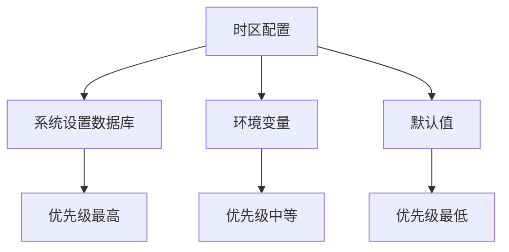
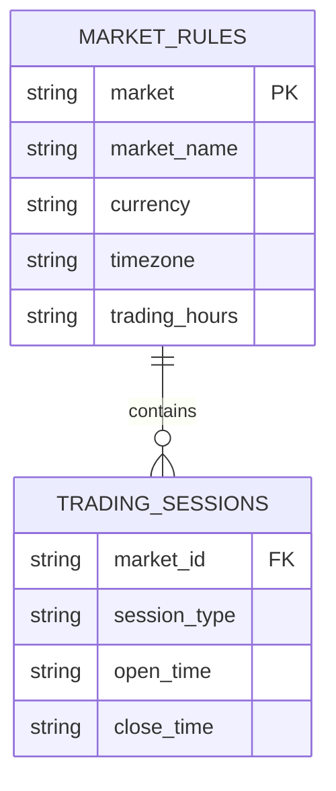
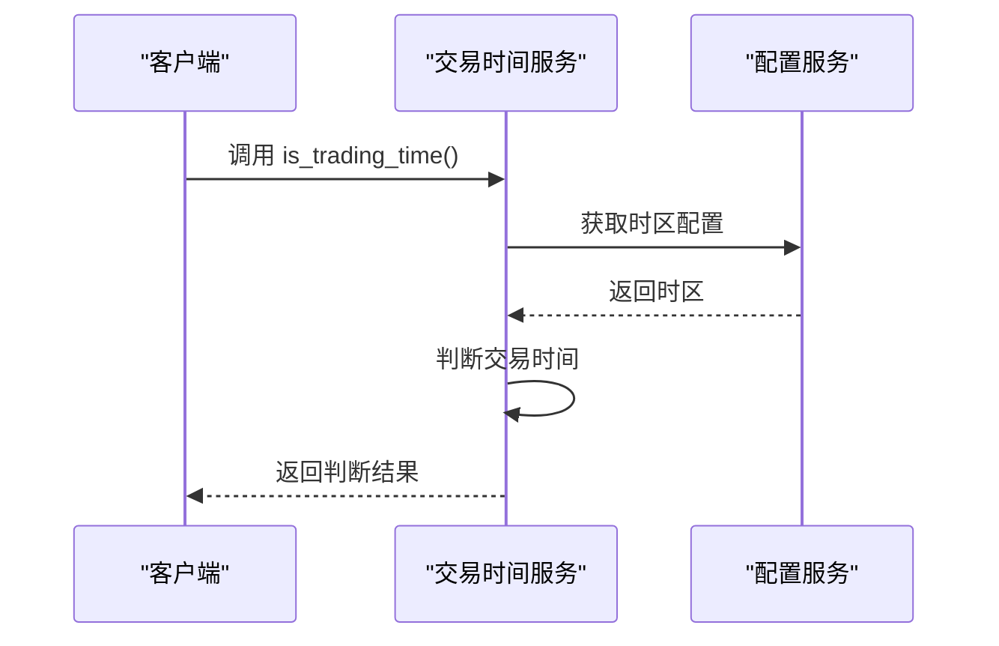
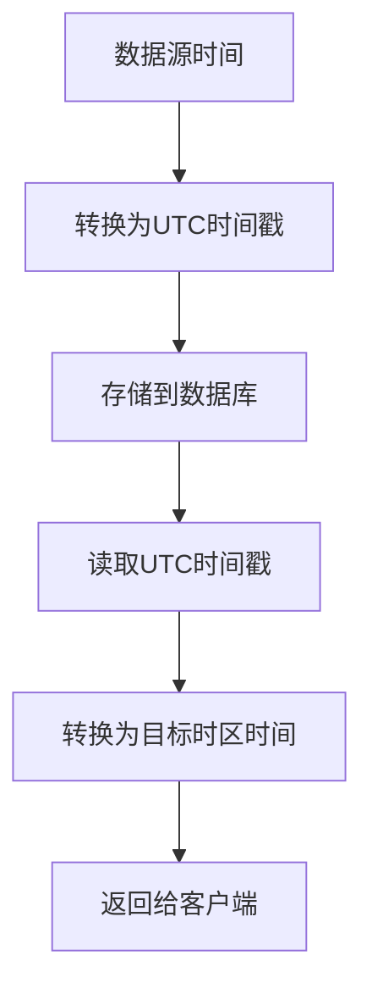
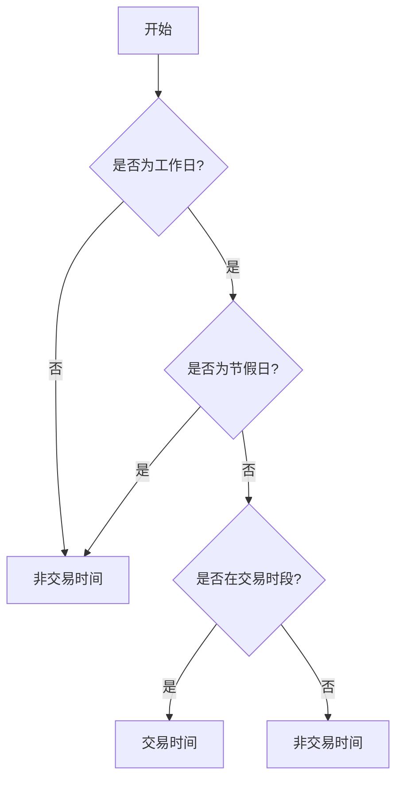
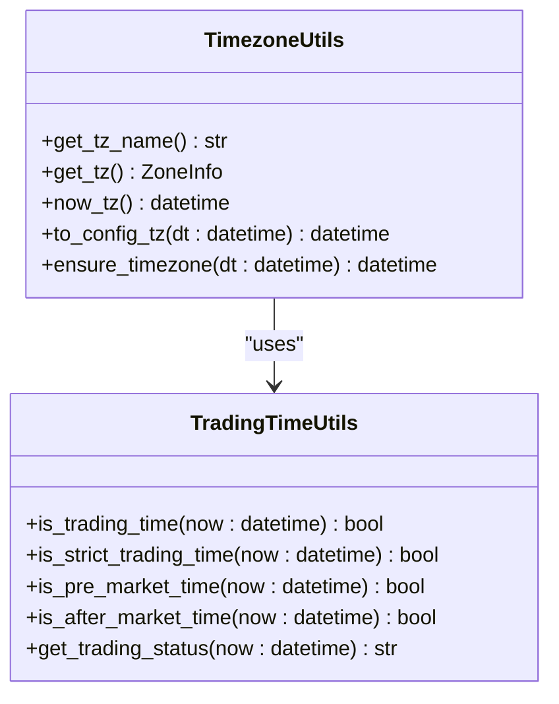

# 时区与交易时间配置

<cite>
**本文档引用文件**   
- [trading_time.py](file://app/utils/trading_time.py)
- [timezone.py](file://app/utils/timezone.py)
- [config.py](file://app/core/config.py)
- [config_service.py](file://app/services/config_service.py)
- [quotes_ingestion_service.py](file://app/services/quotes_ingestion_service.py)
- [system_config.py](file://app/routers/system_config.py)
- [init_paper_trading_market_rules.py](file://scripts/init_paper_trading_market_rules.py)
- [timezone-strategy.md](file://docs/design/timezone-strategy.md)
- [stock_data_model_design.md](file://docs/design/stock_data_model_design.md)
- [paper_trading_multi_market_design.md](file://docs/design/paper_trading_multi_market_design.md)
</cite>

## 目录
1. [简介](#简介)
2. [时区配置机制](#时区配置机制)
3. [主要市场交易时间配置](#主要市场交易时间配置)
4. [交易时间验证与API使用](#交易时间验证与api使用)
5. [夏令时处理与跨时区同步](#夏令时处理与跨时区同步)
6. [节假日处理逻辑](#节假日处理逻辑)
7. [分析任务中的时区应用](#分析任务中的时区应用)
8. [结论](#结论)

## 简介
本文档详细说明系统如何处理不同时区的交易时间，涵盖时区配置的实现机制、主要市场的交易时间配置、节假日处理逻辑、交易时间验证API使用示例，以及在分析任务中正确应用时区设置的方法。文档还包含夏令时处理策略和跨时区数据同步的时间戳转换方法。

**Section sources**
- [trading_time.py](file://app/utils/trading_time.py#L1-L180)
- [timezone.py](file://app/utils/timezone.py#L1-L58)

## 时区配置机制
系统采用多层级的时区配置策略，确保时区设置的灵活性和可靠性。时区配置来源与优先级如下：

1. **系统设置（数据库）**
   - 键：`system_settings.app_timezone`（例如 `"Asia/Shanghai"`）
   - 可在Web前端“系统设置”页面可视化编辑；保存后即时生效（缓存失效后立刻应用）。

2. **环境变量（.env / 进程环境）**
   - 键：`TIMEZONE`（例如 `TIMEZONE=Asia/Shanghai`）
   - 当数据库未配置或缓存尚未命中时作为回退；若设置了环境变量，某些元数据会将该项标记为来自环境变量（只读）。

3. **默认值**
   - 默认：`Asia/Shanghai`

实现参考：`app/utils/timezone.py` 使用数据库（provider cache）> 环境变量(settings.TIMEZONE) > 默认值的策略获取有效时区。

后端行为说明：
- 时间生成：统一使用 `now_tz()` 返回“配置时区”的时区感知datetime
  - 模型默认时间（例如 created_at, updated_at）通过 `default_factory=now_tz` 赋值。
  - 服务层导出时间（例如 `exported_at`）使用 `now_tz().isoformat()`。
- 时间输出：API对外序列化为ISO 8601字符串，包含偏移量（例如 `+08:00` 或 `Z`）。
- JWT过期：内部使用时区感知datetime生成过期时间；JWT编码为数值时间戳，验证与当前epoch秒比较保持一致。
- 缓存与生效：更新系统设置后，后端会调用 `config_provider.invalidate()` 失效缓存；provider层默认TTL约60s（若未手动失效）。



**Diagram sources **
- [timezone.py](file://app/utils/timezone.py#L10-L25)
- [config.py](file://app/core/config.py#L159-L159)

**Section sources**
- [timezone.py](file://app/utils/timezone.py#L1-L58)
- [config.py](file://app/core/config.py#L159-L159)
- [timezone-strategy.md](file://docs/design/timezone-strategy.md#L11-L46)

## 主要市场交易时间配置
系统支持中国A股、港股、美股等主要市场的交易时间配置。各市场的交易时间配置如下：

### 中国A股市场
- **时区**: Asia/Shanghai
- **交易时段**:
  - 上午：9:30-11:30
  - 下午：13:00-15:00
- **盘前时间**: 9:00-9:30
- **午间休市**: 11:30-13:00
- **收盘后缓冲期**: 15:00-15:30（确保获取到收盘价）

### 港股市场
- **时区**: Asia/Hong_Kong
- **交易时段**:
  - 上午：9:30-12:00
  - 下午：13:00-16:00
- **开市前时段**: 9:00-9:30
- **收市竞价时段**: 16:00-16:10

### 美股市场
- **时区**: America/New_York
- **交易时段**:
  - 常规交易时间：9:30-16:00
- **盘前交易时间**: 4:00-9:30
- **盘后交易时间**: 16:00-20:00



**Diagram sources **
- [init_paper_trading_market_rules.py](file://scripts/init_paper_trading_market_rules.py#L20-L128)
- [paper_trading_multi_market_design.md](file://docs/design/paper_trading_multi_market_design.md#L121-L188)

**Section sources**
- [init_paper_trading_market_rules.py](file://scripts/init_paper_trading_market_rules.py#L20-L128)
- [stock_data_model_design.md](file://docs/design/stock_data_model_design.md#L751-L759)

## 交易时间验证与API使用
系统提供了多种交易时间验证函数，用于判断当前是否在交易时间内。以下是主要的交易时间验证函数及其使用示例：

### 交易时间验证函数
- `is_trading_time(now: Optional[datetime] = None) -> bool`: 判断是否在A股交易时间或收盘后缓冲期
- `is_strict_trading_time(now: Optional[datetime] = None) -> bool`: 判断是否在严格的A股交易时间内（不包含缓冲期）
- `is_pre_market_time(now: Optional[datetime] = None) -> bool`: 判断是否在盘前时间（9:00-9:30）
- `is_after_market_time(now: Optional[datetime] = None) -> bool`: 判断是否在盘后时间（15:00-15:30）
- `get_trading_status(now: Optional[datetime] = None) -> str`: 获取当前交易状态

### API使用示例
```python
from app.utils.trading_time import is_trading_time, get_trading_status
from datetime import datetime

# 判断当前是否在交易时间
if is_trading_time():
    print("当前在交易时间内")
else:
    print("当前不在交易时间内")

# 获取当前交易状态
status = get_trading_status()
print(f"当前交易状态: {status}")
```



**Diagram sources **
- [trading_time.py](file://app/utils/trading_time.py#L14-L178)
- [test_trading_time_logic.py](file://tests/test_trading_time_logic.py#L20-L89)

**Section sources**
- [trading_time.py](file://app/utils/trading_time.py#L14-L178)
- [test_trading_time_logic.py](file://tests/test_trading_time_logic.py#L20-L89)

## 夏令时处理与跨时区同步
系统通过使用`zoneinfo.ZoneInfo`来处理夏令时转换，确保在夏令时期间时间计算的准确性。对于跨时区数据同步，系统采用UTC时间戳作为中间格式进行转换。

### 时间戳转换方法
1. **本地时间转UTC时间戳**:
   ```python
   from datetime import datetime
   from zoneinfo import ZoneInfo
   
   # 假设当前时区为Asia/Shanghai
   local_time = datetime.now(ZoneInfo("Asia/Shanghai"))
   utc_time = local_time.astimezone(ZoneInfo("UTC"))
   timestamp = utc_time.timestamp()
   ```

2. **UTC时间戳转本地时间**:
   ```python
   from datetime import datetime
   from zoneinfo import ZoneInfo
   
   # 从UTC时间戳转换为本地时间
   timestamp = 1633024800  # 示例时间戳
   utc_time = datetime.fromtimestamp(timestamp, ZoneInfo("UTC"))
   local_time = utc_time.astimezone(ZoneInfo("Asia/Shanghai"))
   ```

### 跨时区数据同步流程


**Diagram sources **
- [timezone.py](file://app/utils/timezone.py#L28-L34)
- [trading_time.py](file://app/utils/trading_time.py#L34-L35)

**Section sources**
- [timezone.py](file://app/utils/timezone.py#L28-L34)
- [trading_time.py](file://app/utils/trading_time.py#L34-L35)

## 节假日处理逻辑
系统通过外部数据源获取各市场的节假日信息，并在交易时间判断中排除节假日。节假日处理逻辑如下：

1. **节假日数据获取**: 通过数据源适配层从外部API获取各市场的节假日列表。
2. **节假日缓存**: 将获取的节假日信息缓存到本地，减少对外部API的调用频率。
3. **交易时间判断**: 在判断交易时间时，首先检查当前日期是否为节假日，如果是则返回非交易时间。



**Diagram sources **
- [trading_time.py](file://app/utils/trading_time.py#L37-L39)
- [quotes_ingestion_service.py](file://app/services/quotes_ingestion_service.py#L33-L33)

**Section sources**
- [trading_time.py](file://app/utils/trading_time.py#L37-L39)
- [quotes_ingestion_service.py](file://app/services/quotes_ingestion_service.py#L33-L33)

## 分析任务中的时区应用
在分析任务中，正确应用时区设置至关重要。系统提供了以下方法确保时区设置的正确应用：

1. **统一时间基准**: 所有时间相关的计算和存储都使用配置的时区作为基准。
2. **时间转换函数**: 提供`to_config_tz`函数，将任意时间转换为配置时区的时间。
3. **时区感知时间**: 所有时间对象都包含时区信息，避免时区混淆。

### 时区应用示例
```python
from app.utils.timezone import to_config_tz, now_tz
from datetime import datetime

# 获取当前配置时区的时间
current_time = now_tz()
print(f"当前时间: {current_time}")

# 将UTC时间转换为配置时区时间
utc_time = datetime.fromisoformat("2023-10-01T00:00:00+00:00")
local_time = to_config_tz(utc_time)
print(f"转换后时间: {local_time}")
```



**Diagram sources **
- [timezone.py](file://app/utils/timezone.py#L10-L58)
- [trading_time.py](file://app/utils/trading_time.py#L14-L178)

**Section sources**
- [timezone.py](file://app/utils/timezone.py#L10-L58)
- [trading_time.py](file://app/utils/trading_time.py#L14-L178)

## 结论
本文档详细介绍了系统中时区与交易时间的配置机制，包括时区配置的多层级策略、主要市场的交易时间配置、交易时间验证API的使用方法、夏令时处理与跨时区同步的时间戳转换方法，以及节假日处理逻辑。通过这些机制，系统能够准确处理不同时区的交易时间，确保数据分析和交易决策的准确性。