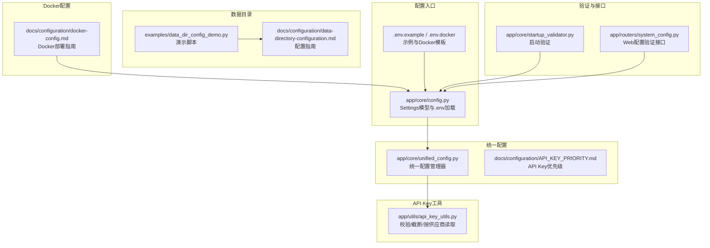
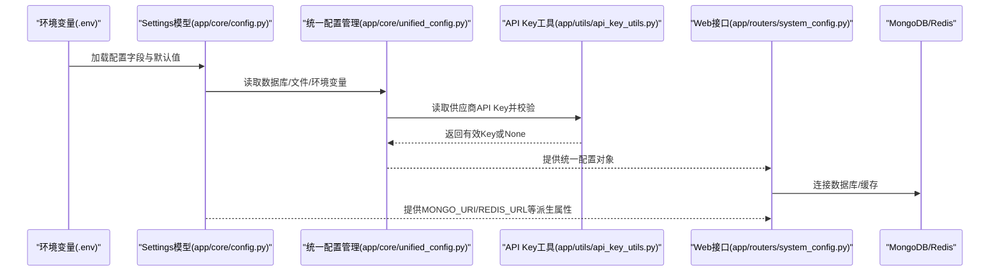
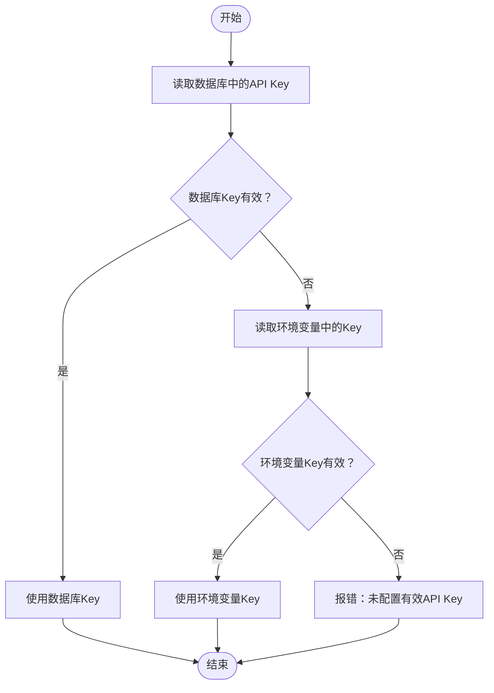
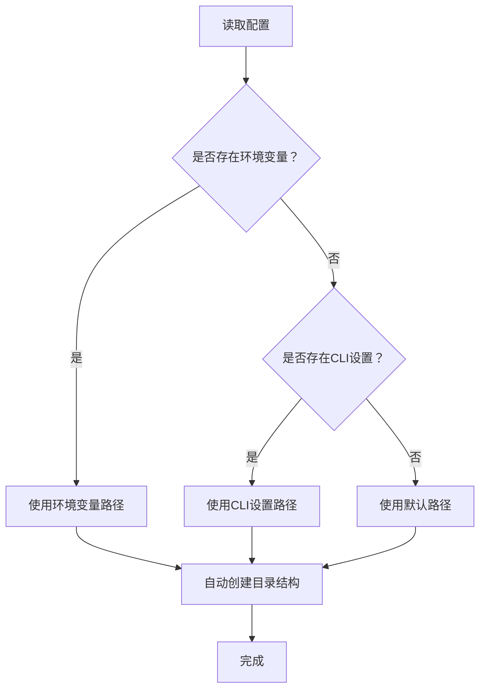
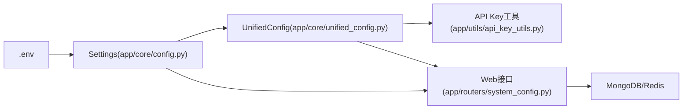

# 环境配置

<cite>
**本文引用的文件**
- [app/core/config.py](file://app/core/config.py)
- [app/core/unified_config.py](file://app/core/unified_config.py)
- [app/utils/api_key_utils.py](file://app/utils/api_key_utils.py)
- [examples/data_dir_config_demo.py](file://examples/data_dir_config_demo.py)
- [.env.example](file://.env.example)
- [.env.docker](file://.env.docker)
- [docs/configuration/API_KEY_PRIORITY.md](file://docs/configuration/API_KEY_PRIORITY.md)
- [docs/configuration/docker-config.md](file://docs/configuration/docker-config.md)
- [docs/configuration/data-directory-configuration.md](file://docs/configuration/data-directory-configuration.md)
- [docs/configuration/llm-config.md](file://docs/configuration/llm-config.md)
- [app/core/startup_validator.py](file://app/core/startup_validator.py)
- [app/routers/system_config.py](file://app/routers/system_config.py)
</cite>

## 目录
1. [简介](#简介)
2. [项目结构](#项目结构)
3. [核心组件](#核心组件)
4. [架构总览](#架构总览)
5. [详细组件分析](#详细组件分析)
6. [依赖关系分析](#依赖关系分析)
7. [性能考量](#性能考量)
8. [故障排查指南](#故障排查指南)
9. [结论](#结论)
10. [附录](#附录)

## 简介
本文件面向运维与开发人员，系统性梳理本项目的环境配置体系，重点覆盖以下方面：
- 数据库连接配置（MONGODB_URI、MONGO_URI、MONGODB_HOST/PORT/USERNAME/PASSWORD/DATABASE/AUTH_SOURCE）
- Redis配置（REDIS_URL、REDIS_HOST/PORT/PASSWORD/DB）
- 运行模式与调试（ENVIRONMENT、DEBUG、HOST、PORT、ALLOWED_ORIGINS/ALLOWED_HOSTS）
- API密钥管理（优先级与校验规则，涵盖OpenAI、Google AI、DeepSeek、DashScope、Anthropic、QianFan等）
- 数据目录与文件存储（TRADINGAGENTS_DATA_DIR、TRADINGAGENTS_CACHE_DIR、TRADINGAGENTS_RESULTS_DIR等）
- 生产与开发环境配置示例及安全注意事项

## 项目结构
围绕环境配置的关键文件与职责如下：
- app/core/config.py：定义Pydantic Settings模型，集中声明所有环境变量字段、默认值与派生属性（如MONGO_URI、REDIS_URL），并支持从.env加载。
- app/core/unified_config.py：统一配置管理器，负责从文件、数据库与环境变量读取配置，支持LLM配置、数据源配置、数据库配置等。
- app/utils/api_key_utils.py：API Key工具函数，提供校验、截断、按供应商读取等能力。
- examples/data_dir_config_demo.py：数据目录配置演示脚本，展示环境变量覆盖、目录自动创建与一致性验证。
- .env.example 与 .env.docker：官方示例与Docker专用环境变量模板，包含必需/推荐/可选配置项与注释说明。
- docs/configuration/API_KEY_PRIORITY.md：API Key优先级与验证逻辑的权威说明。
- docs/configuration/docker-config.md：Docker部署环境变量与服务发现、网络、持久化、安全等配置指南。
- docs/configuration/data-directory-configuration.md：数据目录配置指南，覆盖CLI、环境变量、默认路径与优先级。
- docs/configuration/llm-config.md：LLM提供商配置与模型选择策略，便于结合环境变量进行优化。
- app/core/startup_validator.py 与 app/routers/system_config.py：启动配置验证与Web端配置验证接口，用于检查必需/推荐配置与数据库连通性。

图示来源
- [app/core/config.py](file://app/core/config.py#L1-L301)
- [app/core/unified_config.py](file://app/core/unified_config.py#L1-L501)
- [app/utils/api_key_utils.py](file://app/utils/api_key_utils.py#L1-L166)
- [examples/data_dir_config_demo.py](file://examples/data_dir_config_demo.py#L1-L246)
- [.env.example](file://.env.example#L1-L555)
- [.env.docker](file://.env.docker#L1-L361)
- [docs/configuration/API_KEY_PRIORITY.md](file://docs/configuration/API_KEY_PRIORITY.md#L1-L332)
- [docs/configuration/docker-config.md](file://docs/configuration/docker-config.md#L1-L395)
- [docs/configuration/data-directory-configuration.md](file://docs/configuration/data-directory-configuration.md#L1-L250)
- [app/core/startup_validator.py](file://app/core/startup_validator.py#L158-L312)
- [app/routers/system_config.py](file://app/routers/system_config.py#L251-L284)

章节来源
- [app/core/config.py](file://app/core/config.py#L1-L301)
- [.env.example](file://.env.example#L1-L555)
- [.env.docker](file://.env.docker#L1-L361)

## 核心组件
- 配置模型与默认值
  - Settings类集中定义了数据库、Redis、JWT、队列、并发、速率限制、日志、代理、上传、缓存、安全、外部服务、SSE、监控、数据源同步、分析师数据范围、数据目录等配置项。
  - 关键字段包括：MONGODB_HOST/PORT/USERNAME/PASSWORD/DATABASE/AUTH_SOURCE、REDIS_HOST/PORT/PASSWORD/DB、JWT_SECRET/ALGORITHM/ACCESS_TOKEN_EXPIRE_MINUTES/REFRESH_TOKEN_EXPIRE_DAYS、DEBUG/HOST/PORT/ALLOWED_ORIGINS/ALLOWED_HOSTS、LOG_LEVEL/LOG_FILE、HTTP_PROXY/HTTPS_PROXY/NO_PROXY、MAX_UPLOAD_SIZE/UPLOAD_DIR、CACHE_TTL/SCREENING_CACHE_TTL、BCRYPT_ROUNDS/SESSION_EXPIRE_HOURS/CSRF_SECRET、STOCK_DATA_API_URL/API_KEY、SSE_*、METRICS_ENABLED/HEALTH_CHECK_INTERVAL、CONFIG_SOT、TUSHARE_*、AKSHARE_*、BAOSTOCK_*、TRADINGAGENTS_DATA_DIR、MARKET_ANALYST_LOOKBACK_DAYS、NEWS_*、TIMEZONE等。
  - 派生属性：MONGO_URI（基于用户名/密码拼接）、REDIS_URL（基于密码拼接）。
- 统一配置管理
  - UnifiedConfigManager负责从文件、数据库与环境变量读取配置，支持LLM配置、数据源配置、数据库配置等，并提供缓存与合并逻辑。
- API Key工具
  - 提供API Key有效性校验、截断显示、按供应商读取环境变量等能力，确保密钥安全与可读性。
- 数据目录配置
  - 提供CLI、环境变量与默认路径三种配置方式，支持自动创建目录结构与优先级覆盖。
- Docker配置
  - 提供Docker环境变量模板、服务发现、网络与持久化配置，以及生产安全与监控建议。

章节来源
- [app/core/config.py](file://app/core/config.py#L22-L301)
- [app/core/unified_config.py](file://app/core/unified_config.py#L1-L501)
- [app/utils/api_key_utils.py](file://app/utils/api_key_utils.py#L1-L166)
- [examples/data_dir_config_demo.py](file://examples/data_dir_config_demo.py#L1-L246)
- [docs/configuration/docker-config.md](file://docs/configuration/docker-config.md#L1-L395)

## 架构总览
下图展示了环境变量在系统中的流向与作用域，以及API Key优先级与验证流程。

图示来源
- [app/core/config.py](file://app/core/config.py#L22-L301)
- [app/core/unified_config.py](file://app/core/unified_config.py#L1-L501)
- [app/utils/api_key_utils.py](file://app/utils/api_key_utils.py#L1-L166)
- [app/routers/system_config.py](file://app/routers/system_config.py#L251-L284)

## 详细组件分析

### 数据库连接配置（MONGODB_URI/MONGO_URI、MONGODB_HOST/PORT/USERNAME/PASSWORD/DATABASE/AUTH_SOURCE）
- 字段与默认值
  - MONGODB_HOST/PORT/USERNAME/PASSWORD/DATABASE/AUTH_SOURCE：用于构建MongoDB连接。
  - MONGO_URI：派生属性，根据是否提供用户名/密码动态拼接URI。
  - MONGO_MAX_CONNECTIONS/MONGO_MIN_CONNECTIONS、MONGO_CONNECT_TIMEOUT_MS/MONGO_SOCKET_TIMEOUT_MS/MONGO_SERVER_SELECTION_TIMEOUT_MS：连接池与超时参数，适用于大量历史数据场景。
- 配置要点
  - 生产环境建议开启认证与独立认证源（authSource），并合理设置连接池大小与超时。
  - Docker环境建议使用服务名作为主机名，并在示例中提供完整的认证与连接字符串。
- 优先级与覆盖
  - 通过Settings模型从.env加载，也可在Docker环境中使用MONGO_URI/MONGODB_CONNECTION_STRING等替代字段。
- 安全注意事项
  - 密钥与密码不得硬编码在代码中，使用环境变量或容器机密。
  - 严格最小权限原则，区分不同业务库与用户角色。

章节来源
- [app/core/config.py](file://app/core/config.py#L30-L51)
- [app/core/config.py](file://app/core/config.py#L40-L43)
- [app/core/config.py](file://app/core/config.py#L528-L555)
- [.env.docker](file://.env.docker#L108-L120)
- [.env.example](file://.env.example#L14-L22)

### Redis配置（REDIS_URL、REDIS_HOST/PORT/PASSWORD/DB）
- 字段与默认值
  - REDIS_HOST/PORT/PASSWORD/DB：用于构建Redis连接。
  - REDIS_URL：派生属性，根据是否提供密码动态拼接URL。
  - REDIS_MAX_CONNECTIONS/REDIS_RETRY_ON_TIMEOUT：连接池与超时重试策略。
- 配置要点
  - 生产环境建议开启密码认证与合理连接池上限。
  - Docker环境建议使用服务名作为主机名，并在示例中提供完整的REDIS_URL。
- 优先级与覆盖
  - 通过Settings模型从.env加载，也可在Docker环境中使用REDIS_URL等替代字段。
- 安全注意事项
  - Redis应置于受控网络中，必要时启用TLS与防火墙策略。

章节来源
- [app/core/config.py](file://app/core/config.py#L57-L72)
- [app/core/config.py](file://app/core/config.py#L543-L544)
- [.env.docker](file://.env.docker#L122-L130)
- [.env.example](file://.env.example#L23-L29)

### 运行模式与调试（ENVIRONMENT、DEBUG、HOST、PORT、ALLOWED_ORIGINS/ALLOWED_HOSTS）
- 字段与默认值
  - DEBUG：默认开启，用于开发调试。
  - HOST/PORT：默认绑定0.0.0.0:8000。
  - ALLOWED_ORIGINS/ALLOWED_HOSTS：默认允许所有来源与主机，生产环境建议收紧。
  - LOG_LEVEL/LOG_FILE：日志级别与文件路径。
- 配置要点
  - 生产环境应关闭DEBUG，设置严格的CORS与Host白名单。
  - 可通过环境变量覆盖默认值，便于容器化部署。
- 优先级与覆盖
  - Settings模型从.env加载，兼容历史API_HOST/API_PORT/API_DEBUG键（已标注废弃但仍兼容）。
- 安全注意事项
  - 生产环境禁止暴露调试信息，严格限制Origin与Host，避免跨域风险。

章节来源
- [app/core/config.py](file://app/core/config.py#L22-L29)
- [app/core/config.py](file://app/core/config.py#L280-L283)
- [app/core/config.py](file://app/core/config.py#L284-L286)
- [.env.example](file://.env.example#L292-L306)
- [.env.example](file://.env.example#L522-L528)

### API密钥配置与优先级（OpenAI、Google AI、DeepSeek、DashScope、Anthropic、QianFan等）
- 优先级规则
  - 数据库中的有效配置 > 环境变量中的有效配置 > 无配置（报错）。
  - 有效性的判断标准：非空、长度>10、不以“your_”或“your-”开头、不包含“...”。
- 供应商密钥读取
  - 按供应商名称构造环境变量名（如DEEPSEEK_API_KEY、DASHSCOPE_API_KEY、OPENAI_API_KEY、GOOGLE_API_KEY、ANTHROPIC_API_KEY、QIANFAN_API_KEY等），通过工具函数读取并校验。
- 配置来源
  - Web界面配置（数据库llm_providers集合）与.env环境变量均可，系统自动选择有效配置。
- 安全建议
  - 生产环境使用Web界面集中管理密钥，避免直接暴露在代码或版本库中。
  - 定期轮换密钥，监控使用情况，限制权限范围。

图示来源
- [docs/configuration/API_KEY_PRIORITY.md](file://docs/configuration/API_KEY_PRIORITY.md#L1-L332)
- [app/utils/api_key_utils.py](file://app/utils/api_key_utils.py#L1-L166)

章节来源
- [docs/configuration/API_KEY_PRIORITY.md](file://docs/configuration/API_KEY_PRIORITY.md#L1-L332)
- [app/utils/api_key_utils.py](file://app/utils/api_key_utils.py#L1-L166)
- [.env.example](file://.env.example#L56-L171)
- [.env.docker](file://.env.docker#L9-L65)

### 数据目录与文件存储路径（TRADINGAGENTS_DATA_DIR、TRADINGAGENTS_CACHE_DIR、TRADINGAGENTS_RESULTS_DIR等）
- 配置方式
  - CLI命令：查看/设置/重置数据目录。
  - 环境变量：TRADINGAGENTS_DATA_DIR、TRADINGAGENTS_CACHE_DIR、TRADINGAGENTS_RESULTS_DIR等。
  - 默认路径：Windows与Linux/macOS分别提供默认路径。
- 优先级
  - 环境变量 > CLI设置 > 默认配置。
- 自动创建
  - 配置后自动创建cache、finnhub_data、results等子目录。
- Docker环境
  - Docker示例提供TRADINGAGENTS_DATA_DIR、TRADINGAGENTS_CACHE_DIR、TRADINGAGENTS_RESULTS_DIR等路径，并建议使用容器内路径与数据卷持久化。

图示来源
- [examples/data_dir_config_demo.py](file://examples/data_dir_config_demo.py#L1-L246)
- [docs/configuration/data-directory-configuration.md](file://docs/configuration/data-directory-configuration.md#L1-L250)
- [.env.docker](file://.env.docker#L204-L212)

章节来源
- [examples/data_dir_config_demo.py](file://examples/data_dir_config_demo.py#L1-L246)
- [docs/configuration/data-directory-configuration.md](file://docs/configuration/data-directory-configuration.md#L1-L250)
- [.env.docker](file://.env.docker#L204-L212)

### 生产与开发环境配置示例
- 开发环境
  - DEBUG=true，ALLOWED_ORIGINS/ALLOWED_HOSTS宽松，日志级别较低，便于调试。
  - 可通过.env.example快速搭建本地开发环境。
- 生产环境
  - DEBUG=false，严格CORS与Host白名单，启用数据库与Redis认证，设置强JWT与CSRF密钥。
  - Docker示例提供完整的服务发现、网络、持久化与安全配置。
- Docker部署
  - 使用服务名作为主机名，提供MONGO_URI/REDIS_URL等完整连接字符串。
  - 建议使用数据卷持久化MongoDB与Redis数据，配置备份与健康检查。

章节来源
- [.env.example](file://.env.example#L292-L332)
- [.env.docker](file://.env.docker#L155-L170)
- [.env.docker](file://.env.docker#L108-L130)
- [docs/configuration/docker-config.md](file://docs/configuration/docker-config.md#L1-L395)

## 依赖关系分析
- 配置加载链路
  - .env文件通过Settings模型加载，Settings再被统一配置管理器使用。
  - 统一配置管理器从文件、数据库与环境变量读取配置，API Key工具参与供应商密钥读取与校验。
  - Web接口在启动时进行配置验证，检查必需/推荐配置与数据库连通性。
- 外部依赖
  - MongoDB/Redis客户端库通过Settings派生的URL连接。
  - LLM提供商SDK通过API Key与Base URL进行调用。

图示来源
- [app/core/config.py](file://app/core/config.py#L22-L301)
- [app/core/unified_config.py](file://app/core/unified_config.py#L1-L501)
- [app/utils/api_key_utils.py](file://app/utils/api_key_utils.py#L1-L166)
- [app/routers/system_config.py](file://app/routers/system_config.py#L251-L284)

章节来源
- [app/core/config.py](file://app/core/config.py#L22-L301)
- [app/core/unified_config.py](file://app/core/unified_config.py#L1-L501)
- [app/routers/system_config.py](file://app/routers/system_config.py#L251-L284)

## 性能考量
- 连接池与超时
  - 合理设置MONGO_MAX_CONNECTIONS/MONGO_MIN_CONNECTIONS与MONGO_*超时参数，避免大量历史数据场景下的连接阻塞。
  - REDIS_MAX_CONNECTIONS与REDIS_RETRY_ON_TIMEOUT有助于提升缓存稳定性。
- 并发与速率限制
  - 通过DEFAULT_USER_CONCURRENT_LIMIT/GLOBAL_CONCURRENT_LIMIT与DEFAULT_RATE_LIMIT控制请求并发与频率，避免上游限流。
- 缓存策略
  - CACHE_TTL/SCREENING_CACHE_TTL影响查询性能与资源占用，建议结合业务场景调优。
- 日志与监控
  - METRICS_ENABLED与HEALTH_CHECK_INTERVAL用于系统可观测性，生产环境建议开启并配置健康检查。

章节来源
- [app/core/config.py](file://app/core/config.py#L80-L122)
- [app/core/config.py](file://app/core/config.py#L533-L555)

## 故障排查指南
- 启动配置验证
  - 启动验证器会检查必需配置与推荐配置，并输出缺失与格式错误项。
  - Web端配置验证接口返回环境变量验证、MongoDB验证与总体成功状态。
- 常见问题
  - 缺少必需配置：检查.env文件中对应键是否设置且格式正确。
  - API Key无效：确认长度>10、不以“your_”或“your-”开头、不包含“...”，并在数据库或环境变量中正确配置。
  - 数据库连接失败：核对MONGO_URI/REDIS_URL、主机名、端口、认证信息与网络连通性。
  - 数据目录不可用：确认环境变量或CLI设置的路径存在且具备写权限，必要时使用演示脚本验证。
- Docker部署
  - 确认服务发现（容器名）、网络与数据卷挂载正确，必要时查看日志与健康检查状态。

章节来源
- [app/core/startup_validator.py](file://app/core/startup_validator.py#L158-L312)
- [app/routers/system_config.py](file://app/routers/system_config.py#L251-L284)
- [docs/configuration/docker-config.md](file://docs/configuration/docker-config.md#L1-L395)

## 结论
本项目的环境配置体系以Settings模型为核心，结合统一配置管理器与API Key工具，实现了从文件、数据库到环境变量的多源配置与优先级判定。通过明确的数据库/Redis连接参数、严格的API Key校验与覆盖策略、灵活的数据目录配置与Docker部署指南，系统能够在开发与生产环境中稳定运行。建议在生产环境遵循最小权限、强密钥与严格CORS的原则，并利用监控与验证工具持续保障配置质量。

## 附录
- 关键环境变量清单（部分）
  - 数据库：MONGODB_HOST/PORT/USERNAME/PASSWORD/DATABASE/AUTH_SOURCE、MONGO_URI、MONGODB_CONNECTION_STRING、MONGODB_ENABLED、MONGO_MAX_CONNECTIONS/MONGO_MIN_CONNECTIONS、MONGO_*超时。
  - 缓存：REDIS_HOST/PORT/PASSWORD/DB、REDIS_URL、REDIS_ENABLED、REDIS_MAX_CONNECTIONS、REDIS_RETRY_ON_TIMEOUT。
  - 应用：DEBUG/HOST/PORT、ALLOWED_ORIGINS/ALLOWED_HOSTS、LOG_LEVEL/LOG_FILE、LOG_DIR。
  - 安全：JWT_SECRET/JWT_ALGORITHM/ACCESS_TOKEN_EXPIRE_MINUTES/REFRESH_TOKEN_EXPIRE_DAYS、CSRF_SECRET、BCRYPT_ROUNDS。
  - 代理：HTTP_PROXY/HTTPS_PROXY/NO_PROXY。
  - 上传与缓存：MAX_UPLOAD_SIZE/UPLOAD_DIR、CACHE_TTL/SCREENING_CACHE_TTL。
  - 数据目录：TRADINGAGENTS_DATA_DIR/TRADINGAGENTS_CACHE_DIR/TRADINGAGENTS_RESULTS_DIR等。
  - LLM提供商：OPENAI_API_KEY、GOOGLE_API_KEY、DEEPSEEK_API_KEY/DEEPSEEK_BASE_URL、DASHSCOPE_API_KEY、ANTHROPIC_API_KEY、QIANFAN_API_KEY、ONEAPI_*、OPENROUTER_API_KEY等。
  - Docker：MONGO_URI/REDIS_URL、服务端口、数据卷路径、TZ/TIMEZONE等。

章节来源
- [app/core/config.py](file://app/core/config.py#L22-L301)
- [.env.example](file://.env.example#L1-L555)
- [.env.docker](file://.env.docker#L1-L361)
- [docs/configuration/llm-config.md](file://docs/configuration/llm-config.md#L1-L545)