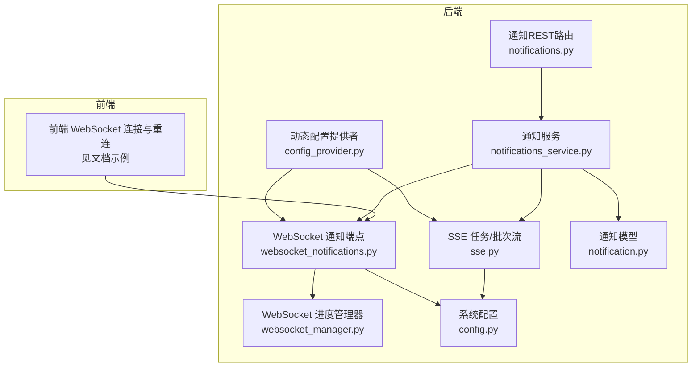
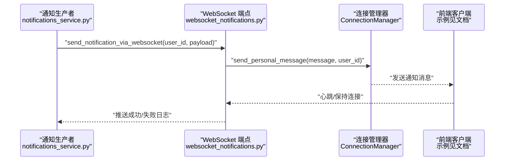
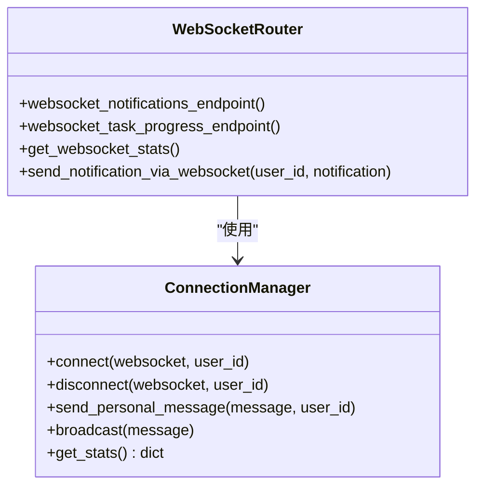
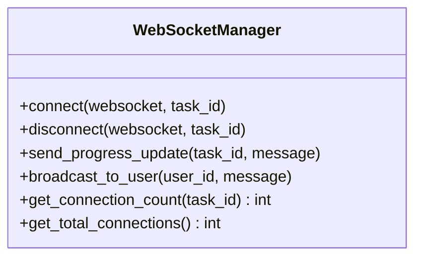
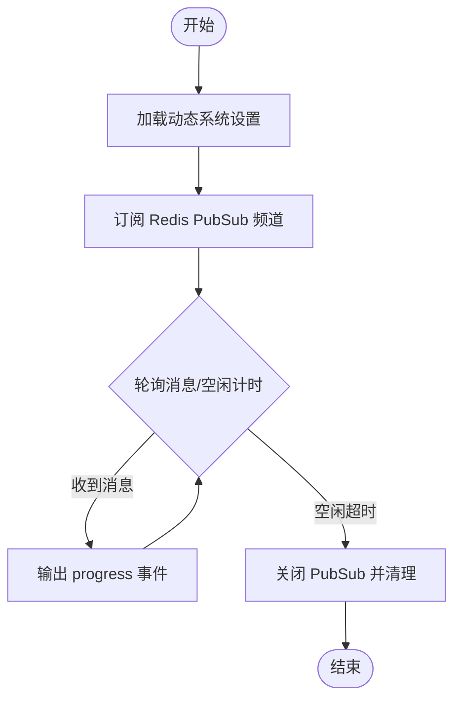
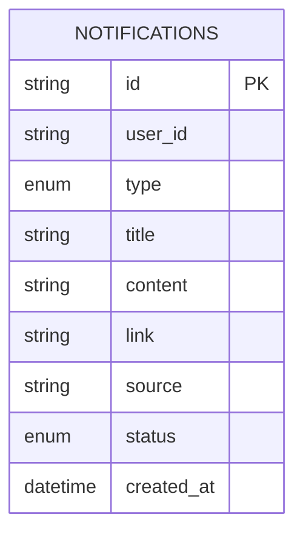
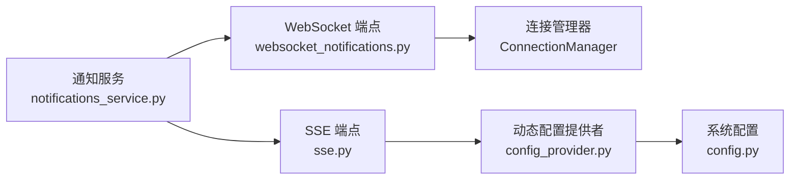

# 通知与WebSocket配置

<cite>
**本文引用的文件**
- [websocket_notifications.py](file://app/routers/websocket_notifications.py)
- [websocket_manager.py](file://app/services/websocket_manager.py)
- [sse.py](file://app/routers/sse.py)
- [notifications_service.py](file://app/services/notifications_service.py)
- [notification.py](file://app/models/notification.py)
- [notifications.py](file://app/routers/notifications.py)
- [config.py](file://app/core/config.py)
- [config_provider.py](file://app/services/config_provider.py)
- [2025-10-23-websocket-notifications-and-data-fixes.md](file://docs/blog/2025-10-23-websocket-notifications-and-data-fixes.md)
- [websocket_notifications.md](file://docs/guides/websocket_notifications.md)
</cite>

## 目录
1. [简介](#简介)
2. [项目结构](#项目结构)
3. [核心组件](#核心组件)
4. [架构总览](#架构总览)
5. [详细组件分析](#详细组件分析)
6. [依赖关系分析](#依赖关系分析)
7. [性能考虑](#性能考虑)
8. [故障排查指南](#故障排查指南)
9. [结论](#结论)
10. [附录](#附录)

## 简介
本文件面向后端与前端开发者，系统化说明实时通知系统的配置与使用，重点对比并讲解 SSE（Server-Sent Events）与 WebSocket 两种实时通信机制的差异、适用场景与最佳实践。文档涵盖连接管理、消息格式、心跳机制、触发条件与消息模板、连接中断与重连策略，并提供后端消息推送实现细节与前端集成示例路径，最后给出性能调优建议（如连接数限制、消息队列配置）。

## 项目结构
实时通知相关的核心代码分布在以下模块：
- WebSocket 通知端点与连接管理：app/routers/websocket_notifications.py
- WebSocket 进度推送管理器：app/services/websocket_manager.py
- SSE 任务/批次进度流：app/routers/sse.py
- 通知服务（持久化、列表、标记已读、发布）：app/services/notifications_service.py
- 通知数据模型：app/models/notification.py
- 通知 REST API：app/routers/notifications.py
- 系统配置与动态配置提供者：app/core/config.py、app/services/config_provider.py
- 文档与迁移指南：docs/blog/2025-10-23-websocket-notifications-and-data-fixes.md、docs/guides/websocket_notifications.md

图表来源
- [websocket_notifications.py](file://app/routers/websocket_notifications.py#L1-L305)
- [websocket_manager.py](file://app/services/websocket_manager.py#L1-L89)
- [sse.py](file://app/routers/sse.py#L1-L259)
- [notifications_service.py](file://app/services/notifications_service.py#L1-L142)
- [notification.py](file://app/models/notification.py#L1-L75)
- [notifications.py](file://app/routers/notifications.py#L1-L97)
- [config.py](file://app/core/config.py#L1-L301)
- [config_provider.py](file://app/services/config_provider.py#L1-L120)

章节来源
- [websocket_notifications.py](file://app/routers/websocket_notifications.py#L1-L305)
- [sse.py](file://app/routers/sse.py#L1-L259)
- [notifications_service.py](file://app/services/notifications_service.py#L1-L142)
- [notification.py](file://app/models/notification.py#L1-L75)
- [notifications.py](file://app/routers/notifications.py#L1-L97)
- [config.py](file://app/core/config.py#L1-L301)
- [config_provider.py](file://app/services/config_provider.py#L1-L120)

## 核心组件
- WebSocket 通知端点与连接管理器：提供 /ws/notifications 与 /ws/tasks/{task_id} 两个端点，负责鉴权、连接生命周期、心跳、消息发送与清理死连接。
- WebSocket 进度管理器：按任务维度管理连接，支持进度更新广播与连接数统计。
- SSE 任务/批次进度流：提供 /tasks/{task_id} 与 /batches/{batch_id} 两个 SSE 端点，基于 Redis PubSub 或队列服务生成事件流。
- 通知服务：负责通知持久化、列表查询、标记已读、清理策略，并优先通过 WebSocket 推送，失败时降级到 Redis PubSub（兼容 SSE）。
- 通知数据模型：定义通知字段、类型与序列化。
- 通知 REST API：提供通知列表、未读计数、标记已读、批量标记已读等接口。
- 系统配置与动态配置：提供 SSE 参数、心跳间隔、连接池上限、速率限制等配置项；动态配置提供者支持 ENV 与 DB 合并与缓存。

章节来源
- [websocket_notifications.py](file://app/routers/websocket_notifications.py#L1-L305)
- [websocket_manager.py](file://app/services/websocket_manager.py#L1-L89)
- [sse.py](file://app/routers/sse.py#L1-L259)
- [notifications_service.py](file://app/services/notifications_service.py#L1-L142)
- [notification.py](file://app/models/notification.py#L1-L75)
- [notifications.py](file://app/routers/notifications.py#L1-L97)
- [config.py](file://app/core/config.py#L1-L301)
- [config_provider.py](file://app/services/config_provider.py#L1-L120)

## 架构总览
WebSocket 通知系统替代了旧的 SSE + Redis PubSub 方案，解决 Redis 连接泄漏问题，提供更好的实时性与连接管理能力。通知服务在创建通知后，优先尝试通过 WebSocket 推送；若失败则降级到 Redis PubSub（兼容旧 SSE 客户端）。SSE 仍保留用于任务/批次进度流，支持动态配置与心跳。

图表来源
- [notifications_service.py](file://app/services/notifications_service.py#L34-L88)
- [websocket_notifications.py](file://app/routers/websocket_notifications.py#L272-L305)

章节来源
- [websocket_notifications.py](file://app/routers/websocket_notifications.py#L1-L305)
- [notifications_service.py](file://app/services/notifications_service.py#L34-L88)

## 详细组件分析

### WebSocket 通知端点与连接管理
- 端点
  - /ws/notifications：用户通知推送，支持鉴权、连接确认、心跳、断开清理。
  - /ws/tasks/{task_id}：任务进度推送，支持鉴权与连接确认。
- 连接管理
  - ConnectionManager：按用户聚合连接，支持发送个人消息、广播、统计与清理死连接。
  - 心跳：后端每 30 秒发送一次心跳，前端接收心跳无需响应。
- 消息格式
  - 通知消息：type 为 notification，data 包含 id、type、title、content、link、source、status、created_at 等。
  - 连接确认：type 为 connected，包含 user_id、timestamp、message。
  - 心跳：type 为 heartbeat，包含 timestamp。
- 降级策略
  - 通知服务优先使用 WebSocket；失败时降级到 Redis PubSub（兼容 SSE）。

图表来源
- [websocket_notifications.py](file://app/routers/websocket_notifications.py#L1-L305)

章节来源
- [websocket_notifications.py](file://app/routers/websocket_notifications.py#L1-L305)

### WebSocket 进度推送管理器
- 功能
  - 按任务维度管理连接，支持发送进度更新、清理无效连接、统计连接数。
- 适用场景
  - 任务进度流（/ws/tasks/{task_id}）与业务自定义进度通道。

图表来源
- [websocket_manager.py](file://app/services/websocket_manager.py#L1-L89)

章节来源
- [websocket_manager.py](file://app/services/websocket_manager.py#L1-L89)

### SSE 任务/批次进度流
- 端点
  - /tasks/{task_id}：基于 Redis PubSub 的任务进度流，支持动态配置心跳与空闲超时。
  - /batches/{batch_id}：基于队列服务的批次进度流，周期轮询计算进度并输出事件。
- 动态配置
  - 通过动态配置提供者加载系统设置，支持 SSE_POLL_TIMEOUT_SECONDS、SSE_HEARTBEAT_INTERVAL_SECONDS、SSE_TASK_MAX_IDLE_SECONDS、SSE_BATCH_POLL_INTERVAL_SECONDS、SSE_BATCH_MAX_IDLE_SECONDS 等键。
- 心跳与空闲
  - SSE 通过定时发送 heartbeat 事件维持连接，超过空闲阈值自动关闭。
- 连接泄漏修复
  - 明确创建/订阅/取消订阅/关闭/重置流程，确保 PubSub 连接得到正确释放。

图表来源
- [sse.py](file://app/routers/sse.py#L1-L259)
- [config_provider.py](file://app/services/config_provider.py#L1-L120)

章节来源
- [sse.py](file://app/routers/sse.py#L1-L259)
- [config_provider.py](file://app/services/config_provider.py#L1-L120)

### 通知服务与数据模型
- 通知服务
  - 持久化通知至 MongoDB，建立复合索引；清理策略：按天数与数量上限清理。
  - 优先通过 WebSocket 推送；失败时降级到 Redis PubSub（兼容 SSE）。
- 数据模型
  - 字段：user_id、type、title、content、link、source、severity、status、created_at、metadata。
  - 类型：NotificationCreate、NotificationDB、NotificationOut、NotificationList。
- REST API
  - 列表、未读计数、标记已读、批量标记已读；提供 Redis 连接池与 PubSub 频道调试端点。

图表来源
- [notification.py](file://app/models/notification.py#L1-L75)
- [notifications_service.py](file://app/services/notifications_service.py#L1-L142)

章节来源
- [notifications_service.py](file://app/services/notifications_service.py#L1-L142)
- [notification.py](file://app/models/notification.py#L1-L75)
- [notifications.py](file://app/routers/notifications.py#L1-L97)

### 前端集成与重连策略
- WebSocket 连接
  - 前端优先尝试 WebSocket；连接成功后监听消息；收到 heartbeat 无需响应。
- 自动重连
  - 指数退避重连，达到最大次数后自动降级到 SSE。
- 消息处理
  - 根据 message.type 分发处理：connected、notification、heartbeat。

章节来源
- [2025-10-23-websocket-notifications-and-data-fixes.md](file://docs/blog/2025-10-23-websocket-notifications-and-data-fixes.md#L128-L192)
- [websocket_notifications.md](file://docs/guides/websocket_notifications.md#L1-L394)

## 依赖关系分析
- 通知服务依赖 WebSocket 端点与连接管理器进行推送；当 WebSocket 失败时，通知服务会尝试 Redis PubSub（兼容 SSE）。
- SSE 依赖 Redis PubSub 或队列服务；动态配置提供者为 SSE 提供运行时参数。
- WebSocket 端点依赖认证服务进行鉴权；连接管理器负责连接生命周期与清理。

图表来源
- [notifications_service.py](file://app/services/notifications_service.py#L34-L88)
- [websocket_notifications.py](file://app/routers/websocket_notifications.py#L1-L305)
- [sse.py](file://app/routers/sse.py#L1-L259)
- [config_provider.py](file://app/services/config_provider.py#L1-L120)
- [config.py](file://app/core/config.py#L1-L301)

章节来源
- [notifications_service.py](file://app/services/notifications_service.py#L34-L88)
- [websocket_notifications.py](file://app/routers/websocket_notifications.py#L1-L305)
- [sse.py](file://app/routers/sse.py#L1-L259)
- [config_provider.py](file://app/services/config_provider.py#L1-L120)
- [config.py](file://app/core/config.py#L1-L301)

## 性能考虑
- 连接数限制
  - WebSocket：按用户聚合连接，后端通过连接管理器维护；前端可限制每个用户多连接数（建议在前端实现，后端默认不限制，但可通过业务策略约束）。
  - SSE：每个客户端创建独立 PubSub 连接，存在连接泄漏风险；WebSocket 方案已解决该问题。
- 心跳与空闲
  - WebSocket：后端每 30 秒发送心跳；Nginx 超时需足够长（建议 1 小时以上）以避免被代理关闭。
  - SSE：通过心跳事件维持连接，超过空闲阈值自动关闭；动态配置可调整轮询与空闲参数。
- 消息队列与并发
  - 通知服务在创建通知后立即推送；若推送失败，仍会持久化并执行清理策略。
  - 队列系统具备并发限制与可见性超时配置，可用于任务进度推送的限流与稳定性保障。
- Redis 连接池
  - SSE 依赖 Redis PubSub；动态配置提供者支持 ENV 与 DB 合并，便于在运行时调整连接池与参数。

章节来源
- [websocket_notifications.py](file://app/routers/websocket_notifications.py#L155-L198)
- [sse.py](file://app/routers/sse.py#L18-L111)
- [config.py](file://app/core/config.py#L57-L72)
- [config_provider.py](file://app/services/config_provider.py#L1-L120)
- [websocket_notifications.md](file://docs/guides/websocket_notifications.md#L276-L320)

## 故障排查指南
- WebSocket 连接频繁断开
  - 检查 Nginx 超时配置是否过短；确保 proxy_http_version 1.1、Upgrade/Connection 头、proxy_send_timeout 与 proxy_read_timeout 设置合理。
  - 确认后端心跳间隔与代理超时匹配（建议后端 30 秒心跳，代理 1 小时以上）。
- WebSocket 推送失败
  - 通知服务会记录警告日志；可在前端自动重连并降级到 SSE。
- SSE 连接泄漏
  - 旧方案存在 PubSub 连接未正确释放的问题；新方案采用 WebSocket 替代；SSE 侧已修复订阅/取消订阅/关闭/重置流程。
- Redis 连接池状态
  - 可使用通知 REST 调试端点查看 Redis 连接池与 PubSub 频道状态，辅助定位连接泄漏或拥塞。

章节来源
- [websocket_notifications.md](file://docs/guides/websocket_notifications.md#L286-L320)
- [2025-10-23-websocket-notifications-and-data-fixes.md](file://docs/blog/2025-10-23-websocket-notifications-and-data-fixes.md#L566-L583)
- [notifications.py](file://app/routers/notifications.py#L55-L97)

## 结论
WebSocket 通知系统替代了 SSE + Redis PubSub 的旧方案，解决了 Redis 连接泄漏问题，提供更好的实时性与连接管理能力。通知服务在创建通知后优先通过 WebSocket 推送，失败时降级到 Redis PubSub（兼容 SSE）。SSE 仍用于任务/批次进度流，支持动态配置与心跳。结合合理的 Nginx 超时、心跳与清理策略，系统在高并发场景下具备良好的稳定性与可维护性。

## 附录

### SSE 与 WebSocket 的配置差异与适用场景
- 协议与方向
  - SSE：基于 HTTP 的单向事件流，适合服务器→客户端推送。
  - WebSocket：双向协议，适合需要客户端→服务器交互或更低延迟的场景。
- 连接管理
  - SSE：每个客户端创建独立 PubSub 连接，存在连接泄漏风险。
  - WebSocket：集中管理连接，支持心跳与断线清理。
- 实时性与双向通信
  - WebSocket 更适合需要双向通信与更低延迟的场景。
- 代理与浏览器支持
  - WebSocket 需要正确的代理配置（Upgrade/Connection）；SSE 在代理支持方面较友好，但仍需避免缓冲与超时问题。

章节来源
- [websocket_notifications.md](file://docs/guides/websocket_notifications.md#L1-L70)
- [2025-10-23-websocket-notifications-and-data-fixes.md](file://docs/blog/2025-10-23-websocket-notifications-and-data-fixes.md#L510-L566)

### 连接管理、消息格式与心跳机制
- 连接管理
  - WebSocket：按用户聚合连接，支持清理死连接与统计。
  - SSE：订阅/取消订阅/关闭/重置流程，避免连接泄漏。
- 消息格式
  - 通知消息：type 为 notification，data 包含 id、type、title、content、link、source、status、created_at。
  - 连接确认：type 为 connected。
  - 心跳：type 为 heartbeat。
- 心跳机制
  - 后端每 30 秒发送一次心跳；前端接收心跳无需响应。

章节来源
- [websocket_notifications.py](file://app/routers/websocket_notifications.py#L140-L198)
- [sse.py](file://app/routers/sse.py#L18-L111)
- [websocket_notifications.md](file://docs/guides/websocket_notifications.md#L20-L69)

### 通知触发条件与消息内容模板
- 触发条件
  - 业务逻辑完成后创建通知；通知服务会持久化并尝试推送。
- 模板与内容
  - 通知模型包含 title、content、link、source、type、severity 等字段，可按业务需求填充。
  - REST API 支持列表、未读计数、标记已读、批量标记已读。

章节来源
- [notifications_service.py](file://app/services/notifications_service.py#L34-L88)
- [notification.py](file://app/models/notification.py#L1-L75)
- [notifications.py](file://app/routers/notifications.py#L1-L97)

### 连接中断与重连
- 后端
  - WebSocket：捕获断开异常并清理连接；心跳维持连接活性。
- 前端
  - 指数退避重连，达到最大次数后自动降级到 SSE。

章节来源
- [websocket_notifications.py](file://app/routers/websocket_notifications.py#L180-L198)
- [2025-10-23-websocket-notifications-and-data-fixes.md](file://docs/blog/2025-10-23-websocket-notifications-and-data-fixes.md#L128-L192)

### 前端集成 WebSocket 示例路径
- 连接与重连：参见文档中的前端实现片段路径。
- 消息处理：根据 message.type 分发处理 connected、notification、heartbeat。

章节来源
- [2025-10-23-websocket-notifications-and-data-fixes.md](file://docs/blog/2025-10-23-websocket-notifications-and-data-fixes.md#L128-L192)
- [websocket_notifications.md](file://docs/guides/websocket_notifications.md#L1-L120)

### 后端消息推送实现细节
- 通知服务创建通知并持久化，随后尝试通过 WebSocket 推送；失败时降级到 Redis PubSub。
- WebSocket 端点负责鉴权、连接确认、心跳与断开清理。
- SSE 端点负责任务/批次进度流，支持动态配置与心跳。

章节来源
- [notifications_service.py](file://app/services/notifications_service.py#L34-L88)
- [websocket_notifications.py](file://app/routers/websocket_notifications.py#L110-L198)
- [sse.py](file://app/routers/sse.py#L224-L259)

### 性能调优建议
- Nginx 超时
  - proxy_http_version 1.1、Upgrade/Connection 头、proxy_send_timeout 与 proxy_read_timeout 设置为 1 小时或更长。
- 心跳与空闲
  - WebSocket 心跳 30 秒；SSE 心跳间隔与空闲阈值通过动态配置调整。
- 连接池与并发
  - Redis 连接池上限与队列并发限制按业务负载评估配置。
- 清理策略
  - 通知服务按天数与数量上限清理历史数据，避免存储膨胀。

章节来源
- [websocket_notifications.md](file://docs/guides/websocket_notifications.md#L286-L320)
- [config.py](file://app/core/config.py#L57-L72)
- [config_provider.py](file://app/services/config_provider.py#L1-L120)
- [notifications_service.py](file://app/services/notifications_service.py#L71-L88)