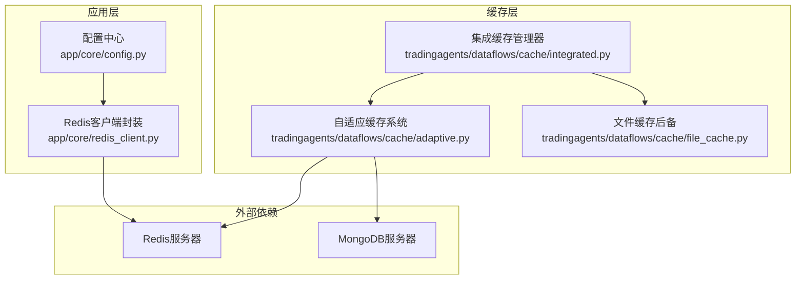
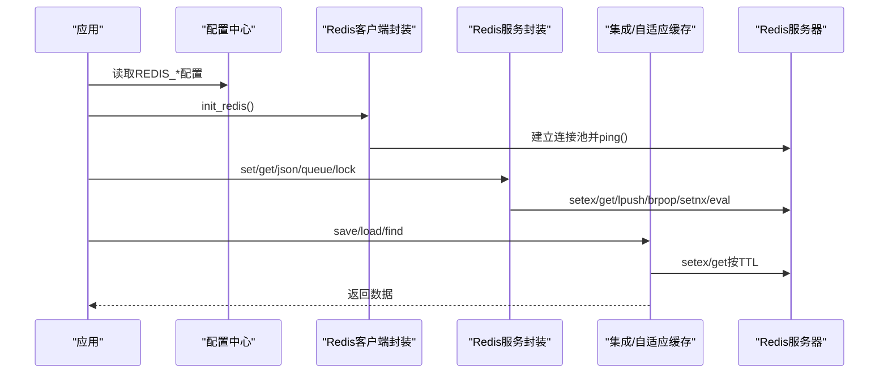
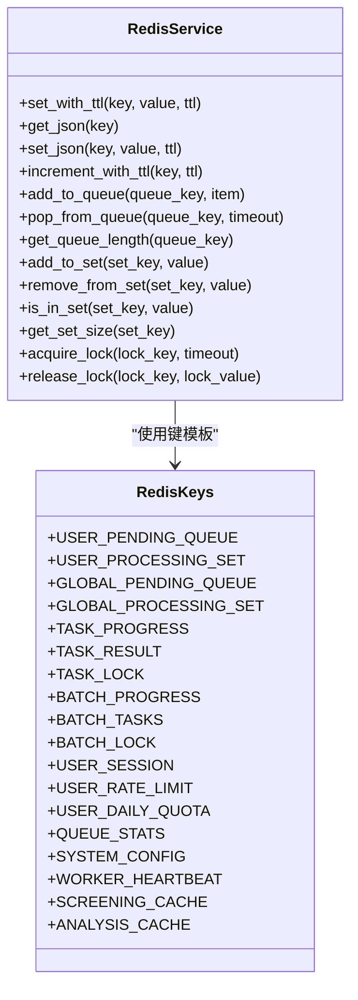
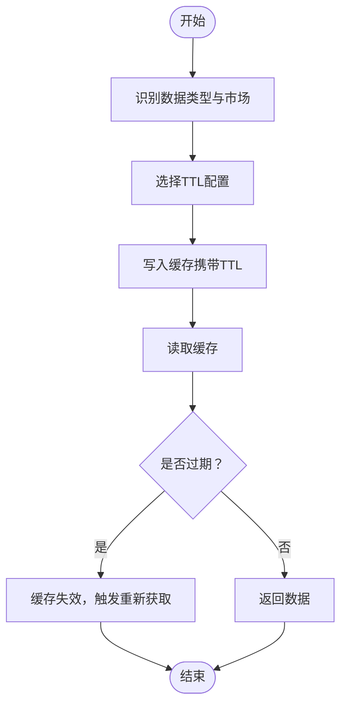
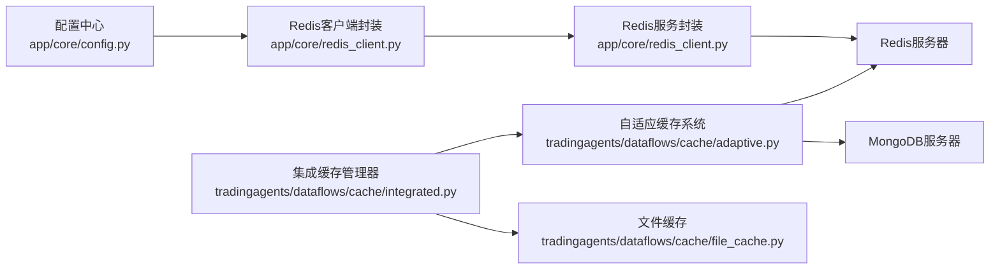

# Redis缓存配置

<cite>
**本文引用的文件**
- [app/core/redis_client.py](file://app/core/redis_client.py)
- [app/core/config.py](file://app/core/config.py)
- [docs/configuration/CACHE_CONFIGURATION.md](file://docs/configuration/CACHE_CONFIGURATION.md)
- [tradingagents/dataflows/cache/integrated.py](file://tradingagents/dataflows/cache/integrated.py)
- [tradingagents/dataflows/cache/adaptive.py](file://tradingagents/dataflows/cache/adaptive.py)
- [tradingagents/dataflows/cache/file_cache.py](file://tradingagents/dataflows/cache/file_cache.py)
- [tests/test_redis_performance.py](file://tests/test_redis_performance.py)
- [tests/quick_redis_test.py](file://tests/quick_redis_test.py)
- [scripts/setup/init_database.py](file://scripts/setup/init_database.py)
</cite>

## 目录
1. [简介](#简介)
2. [项目结构与定位](#项目结构与定位)
3. [核心组件](#核心组件)
4. [架构总览](#架构总览)
5. [详细组件分析](#详细组件分析)
6. [依赖关系分析](#依赖关系分析)
7. [性能与调优建议](#性能与调优建议)
8. [故障排查指南](#故障排查指南)
9. [结论](#结论)
10. [附录](#附录)

## 简介
本文件面向Redis作为系统主要缓存后端的配置与使用，围绕以下目标展开：
- 在配置文件中设置Redis连接参数（主机、端口、密码、数据库索引）
- 连接池配置与超时设置的最佳实践
- 缓存序列化机制（JSON与pickle的使用现状；MessagePack的依赖与现状）
- 缓存键命名规范与过期策略（TTL）配置
- 针对不同数据类型（股票行情、财务数据、分析结果）的差异化过期时间
- 高并发场景下的性能调优建议（内存优化、持久化策略选择、集群模式）

## 项目结构与定位
Redis在本项目中承担两类角色：
- 作为应用侧的Redis客户端与工具封装（连接池、TTL、序列化、分布式锁等）
- 作为自适应缓存系统的“主要后端”之一（与MongoDB、文件缓存协同）

图表来源
- [app/core/redis_client.py](file://app/core/redis_client.py#L1-L203)
- [app/core/config.py](file://app/core/config.py#L52-L72)
- [tradingagents/dataflows/cache/integrated.py](file://tradingagents/dataflows/cache/integrated.py#L1-L120)
- [tradingagents/dataflows/cache/adaptive.py](file://tradingagents/dataflows/cache/adaptive.py#L1-L120)

章节来源
- [app/core/redis_client.py](file://app/core/redis_client.py#L1-L203)
- [app/core/config.py](file://app/core/config.py#L52-L72)
- [docs/configuration/CACHE_CONFIGURATION.md](file://docs/configuration/CACHE_CONFIGURATION.md#L1-L120)

## 核心组件
- Redis客户端与连接池：负责连接建立、健康检查、TTL设置、序列化与分布式锁等
- 配置中心：提供REDIS_HOST、REDIS_PORT、REDIS_PASSWORD、REDIS_DB、REDIS_MAX_CONNECTIONS、REDIS_RETRY_ON_TIMEOUT等参数
- 集成缓存管理器：在Redis/MongoDB/文件之间做策略选择与自动降级
- 自适应缓存系统：按数据类型与市场区分TTL，支持Redis/MongoDB/文件三后端
- 文件缓存：作为后备存储，提供统一的缓存接口

章节来源
- [app/core/redis_client.py](file://app/core/redis_client.py#L1-L203)
- [app/core/config.py](file://app/core/config.py#L52-L72)
- [tradingagents/dataflows/cache/integrated.py](file://tradingagents/dataflows/cache/integrated.py#L1-L120)
- [tradingagents/dataflows/cache/adaptive.py](file://tradingagents/dataflows/cache/adaptive.py#L1-L120)
- [tradingagents/dataflows/cache/file_cache.py](file://tradingagents/dataflows/cache/file_cache.py#L54-L120)

## 架构总览
Redis在系统中的关键路径如下：
- 应用启动时，从配置中心读取Redis连接参数，初始化连接池并进行连通性测试
- 业务侧通过Redis服务封装进行SET/GET、JSON序列化、队列、分布式锁等操作
- 缓存层根据策略选择Redis作为主要后端，并在异常时自动降级到文件缓存
- 自适应缓存系统按数据类型与市场计算TTL，写入Redis时携带TTL，读取时校验有效性

图表来源
- [app/core/redis_client.py](file://app/core/redis_client.py#L17-L68)
- [app/core/config.py](file://app/core/config.py#L52-L72)
- [tradingagents/dataflows/cache/integrated.py](file://tradingagents/dataflows/cache/integrated.py#L265-L337)
- [tradingagents/dataflows/cache/adaptive.py](file://tradingagents/dataflows/cache/adaptive.py#L110-L157)

## 详细组件分析

### Redis客户端与连接池
- 连接参数来源：REDIS_URL由配置中心拼装（含密码、主机、端口、数据库索引）
- 连接池参数：最大连接数、超时重试、socket keepalive、健康检查间隔
- 健康检查：初始化时执行ping
- 关闭流程：优雅关闭客户端与连接池

图表来源
- [app/core/redis_client.py](file://app/core/redis_client.py#L70-L191)

章节来源
- [app/core/redis_client.py](file://app/core/redis_client.py#L17-L68)
- [app/core/redis_client.py](file://app/core/redis_client.py#L70-L191)
- [app/core/config.py](file://app/core/config.py#L52-L72)

### 缓存序列化机制
- JSON序列化：Redis服务封装提供get_json/set_json，适用于文本结构数据
- Pickle序列化：自适应缓存系统在Redis/MongoDB中采用pickle进行二进制序列化，便于保存复杂对象
- MessagePack依赖：项目依赖文件显示ormsgpack存在，但当前Redis服务封装与自适应缓存系统未直接使用MessagePack进行序列化

章节来源
- [app/core/redis_client.py](file://app/core/redis_client.py#L114-L130)
- [tradingagents/dataflows/cache/adaptive.py](file://tradingagents/dataflows/cache/adaptive.py#L110-L157)
- [uv.lock](file://uv.lock#L3309-L3347)

### 缓存键命名规范
- Redis服务封装定义了统一的键模板，涵盖队列、任务、批次、用户、系统、缓存等类别
- 自适应缓存系统通过MD5对符号、日期、数据源、数据类型组合生成缓存键，保证唯一性与可复现性

章节来源
- [app/core/redis_client.py](file://app/core/redis_client.py#L70-L103)
- [tradingagents/dataflows/cache/adaptive.py](file://tradingagents/dataflows/cache/adaptive.py#L45-L59)

### 过期策略（TTL）与差异化配置
- 应用级默认TTL：配置中心提供通用CACHE_TTL与SCREENING_CACHE_TTL
- 自适应缓存系统按数据类型与市场区分TTL（如us_stock_data/china_stock_data/us_news/china_news/us_fundamentals/china_fundamentals）
- 文件缓存按类型配置TTL小时数，并在加载时校验有效期
- 集成缓存管理器在清理过期缓存时，Redis/MongoDB依赖各自TTL机制，文件缓存按规则清理

图表来源
- [app/core/config.py](file://app/core/config.py#L119-L122)
- [tradingagents/dataflows/cache/adaptive.py](file://tradingagents/dataflows/cache/adaptive.py#L51-L62)
- [tradingagents/dataflows/cache/file_cache.py](file://tradingagents/dataflows/cache/file_cache.py#L54-L86)
- [tradingagents/dataflows/cache/file_cache.py](file://tradingagents/dataflows/cache/file_cache.py#L360-L388)
- [tradingagents/dataflows/cache/integrated.py](file://tradingagents/dataflows/cache/integrated.py#L265-L337)

章节来源
- [app/core/config.py](file://app/core/config.py#L119-L122)
- [tradingagents/dataflows/cache/adaptive.py](file://tradingagents/dataflows/cache/adaptive.py#L51-L62)
- [tradingagents/dataflows/cache/file_cache.py](file://tradingagents/dataflows/cache/file_cache.py#L54-L86)
- [tradingagents/dataflows/cache/file_cache.py](file://tradingagents/dataflows/cache/file_cache.py#L360-L388)
- [tradingagents/dataflows/cache/integrated.py](file://tradingagents/dataflows/cache/integrated.py#L265-L337)

### 集成缓存与自动降级
- 集成缓存管理器在Redis/MongoDB/文件之间选择主要后端，并在不可用时自动降级
- 清理过期缓存时，Redis/MongoDB依赖TTL机制，文件缓存按规则清理

章节来源
- [docs/configuration/CACHE_CONFIGURATION.md](file://docs/configuration/CACHE_CONFIGURATION.md#L116-L145)
- [tradingagents/dataflows/cache/integrated.py](file://tradingagents/dataflows/cache/integrated.py#L1-L120)
- [tradingagents/dataflows/cache/integrated.py](file://tradingagents/dataflows/cache/integrated.py#L265-L337)

## 依赖关系分析
- 配置中心提供REDIS_URL与连接池参数，Redis客户端封装基于此建立连接池
- 缓存层通过数据库管理器获取Redis客户端，实现统一的缓存操作
- 自适应缓存系统在Redis/MongoDB/文件之间选择策略，并支持自动降级

图表来源
- [app/core/config.py](file://app/core/config.py#L52-L72)
- [app/core/redis_client.py](file://app/core/redis_client.py#L17-L68)
- [tradingagents/dataflows/cache/integrated.py](file://tradingagents/dataflows/cache/integrated.py#L1-L120)
- [tradingagents/dataflows/cache/adaptive.py](file://tradingagents/dataflows/cache/adaptive.py#L1-L120)

章节来源
- [app/core/config.py](file://app/core/config.py#L52-L72)
- [app/core/redis_client.py](file://app/core/redis_client.py#L17-L68)
- [tradingagents/dataflows/cache/integrated.py](file://tradingagents/dataflows/cache/integrated.py#L1-L120)
- [tradingagents/dataflows/cache/adaptive.py](file://tradingagents/dataflows/cache/adaptive.py#L1-L120)

## 性能与调优建议
- 连接池与超时
  - 最大连接数：根据并发请求量与Redis资源合理设置
  - 超时重试：开启超时重试以提升稳定性
  - KeepAlive：启用TCP KeepAlive减少连接抖动
  - 健康检查：定期健康检查有助于及时发现连接问题
- 序列化选择
  - 文本结构数据优先使用JSON序列化（Redis服务封装已提供）
  - 复杂对象可使用pickle（自适应缓存系统已实现），注意跨语言/跨平台兼容性
  - MessagePack依赖存在，若需更高效二进制序列化，可在自定义序列化逻辑中引入
- TTL策略
  - 针对不同数据类型与市场设置差异化TTL，降低无效数据占用
  - 对热点数据可适当缩短TTL，提高新鲜度
- 清理与监控
  - Redis/MongoDB依赖TTL自动过期；文件缓存按规则清理
  - 定期检查缓存命中率与后端容量，必要时调整TTL与清理策略
- 高并发与集群
  - 使用连接池与合理的超时参数
  - 在分布式部署中，确保Redis/MongoDB可达性与一致性
  - 集群模式下关注键分布与热点问题

章节来源
- [app/core/redis_client.py](file://app/core/redis_client.py#L23-L47)
- [app/core/redis_client.py](file://app/core/redis_client.py#L114-L130)
- [tradingagents/dataflows/cache/adaptive.py](file://tradingagents/dataflows/cache/adaptive.py#L110-L157)
- [uv.lock](file://uv.lock#L3309-L3347)
- [tests/test_redis_performance.py](file://tests/test_redis_performance.py#L161-L297)

## 故障排查指南
- 连接失败
  - 检查REDIS_HOST/REDIS_PORT/REDIS_PASSWORD/REDIS_DB配置是否正确
  - 在Docker环境下确认主机名映射（localhost -> redis）
  - 使用快速连接测试脚本验证连通性与延迟
- 连接池耗尽
  - 检查REDIS_MAX_CONNECTIONS设置是否过小
  - 确认连接未泄露，及时关闭连接
- TTL不生效
  - 确认写入时携带TTL
  - 检查Redis/MongoDB后端是否启用TTL机制
- 缓存清理
  - Redis/MongoDB依赖TTL自动清理；文件缓存按规则清理
  - 使用维护脚本初始化缓存配置与统计

章节来源
- [app/core/config.py](file://app/core/config.py#L52-L72)
- [tests/quick_redis_test.py](file://tests/quick_redis_test.py#L1-L55)
- [tests/test_redis_performance.py](file://tests/test_redis_performance.py#L161-L297)
- [scripts/setup/init_database.py](file://scripts/setup/init_database.py#L153-L192)

## 结论
- Redis作为主要缓存后端时，应结合配置中心参数与连接池策略，确保高可用与高性能
- 序列化方面，JSON适合文本结构，pickle适合复杂对象；MessagePack依赖存在但未在Redis服务封装中直接使用
- TTL策略应按数据类型与市场差异化配置，配合自动降级与清理机制，保障系统稳定性
- 高并发场景下，建议完善连接池、超时与健康检查配置，并结合监控持续优化

## 附录

### 配置项清单（Redis相关）
- REDIS_HOST：Redis主机
- REDIS_PORT：Redis端口
- REDIS_PASSWORD：Redis密码
- REDIS_DB：Redis数据库索引
- REDIS_MAX_CONNECTIONS：Redis连接池最大连接数
- REDIS_RETRY_ON_TIMEOUT：Redis超时重试开关
- REDIS_URL：Redis连接URL（由配置中心拼装）

章节来源
- [app/core/config.py](file://app/core/config.py#L52-L72)

### 缓存键模板（Redis服务封装）
- 队列与任务：user:{user_id}:pending、user:{user_id}:processing、global:pending、global:processing、task:{task_id}:progress、task:{task_id}:result、task:{task_id}:lock、batch:{batch_id}:progress、batch:{batch_id}:tasks、batch:{batch_id}:lock
- 用户与系统：session:{session_id}、rate_limit:{user_id}:{endpoint}、quota:{user_id}:{date}、queue:stats、system:config、worker:{worker_id}:heartbeat
- 缓存：screening:{cache_key}、analysis:{cache_key}

章节来源
- [app/core/redis_client.py](file://app/core/redis_client.py#L70-L103)

### TTL配置（应用级与自适应缓存）
- 应用级：CACHE_TTL、SCREENING_CACHE_TTL
- 自适应缓存：按us/china与stock_data/news/fundamentals区分TTL
- 文件缓存：按类型配置ttl_hours并在加载时校验

章节来源
- [app/core/config.py](file://app/core/config.py#L119-L122)
- [tradingagents/dataflows/cache/adaptive.py](file://tradingagents/dataflows/cache/adaptive.py#L51-L62)
- [tradingagents/dataflows/cache/file_cache.py](file://tradingagents/dataflows/cache/file_cache.py#L54-L86)
- [tradingagents/dataflows/cache/file_cache.py](file://tradingagents/dataflows/cache/file_cache.py#L360-L388)