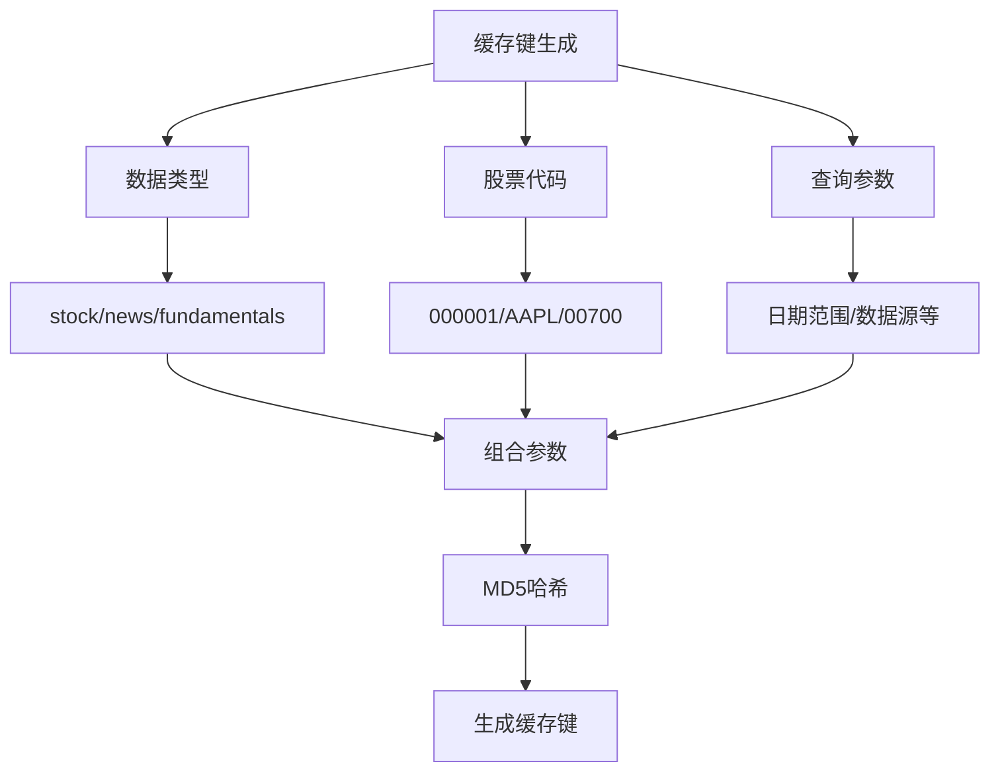
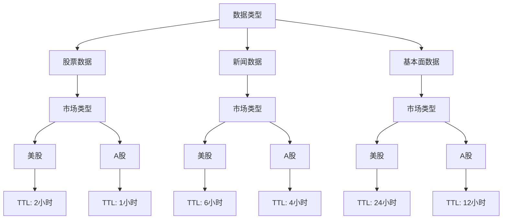
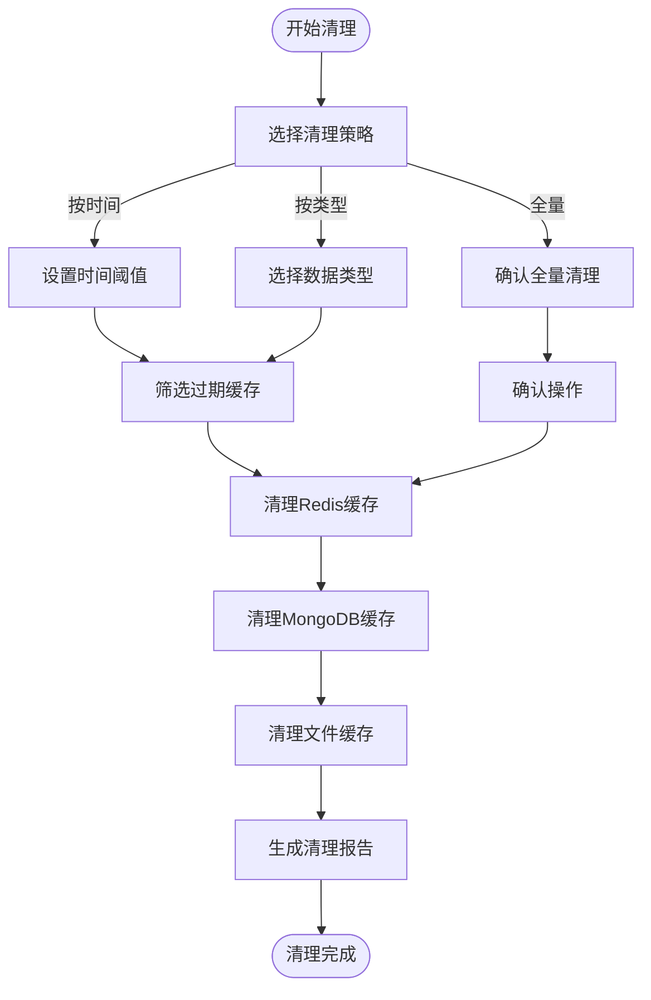
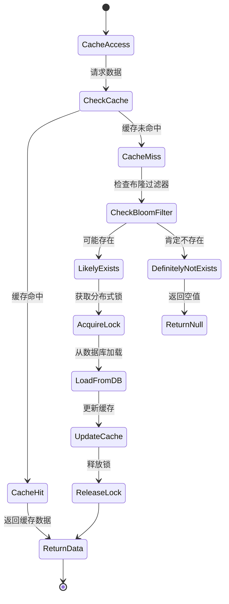

# 缓存管理

<cite>
**本文档引用的文件**   
- [redis_client.py](file://app/core/redis_client.py)
- [cache.py](file://app/routers/cache.py)
- [db_cache.py](file://tradingagents/dataflows/cache/db_cache.py)
- [file_cache.py](file://tradingagents/dataflows/cache/file_cache.py)
- [mongodb_cache_adapter.py](file://tradingagents/dataflows/cache/mongodb_cache_adapter.py)
- [integrated.py](file://tradingagents/dataflows/cache/integrated.py)
- [config.py](file://app/core/config.py)
</cite>

## 目录
1. [引言](#引言)
2. [缓存键命名规范](#缓存键命名规范)
3. [过期策略配置](#过期策略配置)
4. [缓存清理机制](#缓存清理机制)
5. [缓存防护策略](#缓存防护策略)
6. [结论](#结论)

## 引言
本系统采用多层缓存架构，结合文件缓存、Redis和MongoDB，实现高性能的数据访问和持久化存储。缓存系统支持智能TTL管理、市场分类存储和多级降级机制，确保数据的实时性、可靠性和系统稳定性。通过分层命名空间结构和差异化TTL设置，系统能够有效管理不同类型的数据，同时提供完善的缓存清理和监控工具。

**Section sources**
- [integrated.py](file://tradingagents/dataflows/cache/integrated.py#L1-L400)
- [file_cache.py](file://tradingagents/dataflows/cache/file_cache.py#L1-L686)

## 缓存键命名规范
系统采用分层命名空间结构来组织缓存键，确保缓存的可读性和可管理性。缓存键的命名遵循以下模式：

- **股票数据缓存键**: `stock:{symbol}:{cache_key}`，其中`symbol`为股票代码，`cache_key`为基于参数生成的MD5哈希值
- **新闻数据缓存键**: `news:{symbol}:{cache_key}`，按股票代码分类存储新闻数据
- **基本面数据缓存键**: `fundamentals:{symbol}:{cache_key}`，用于存储公司的财务和基本面信息
- **分析结果缓存键**: `analysis:{cache_key}`，用于缓存分析报告和计算结果
- **筛选结果缓存键**: `screening:{cache_key}`，用于缓存股票筛选结果

缓存键的生成基于数据类型、股票代码和查询参数的组合，通过MD5哈希算法生成12-16位的唯一标识符，确保缓存键的唯一性和可预测性。系统还支持按市场类型（美股/港股/A股）对缓存文件进行分类存储，提高缓存管理的效率。

**Diagram sources**
- [file_cache.py](file://tradingagents/dataflows/cache/file_cache.py#L176-L185)
- [db_cache.py](file://tradingagents/dataflows/cache/db_cache.py#L175-L182)

**Section sources**
- [file_cache.py](file://tradingagents/dataflows/cache/file_cache.py#L176-L185)
- [db_cache.py](file://tradingagents/dataflows/cache/db_cache.py#L175-L182)

## 过期策略配置
系统采用差异化TTL（Time To Live）策略，根据不同数据类型和市场特性设置不同的缓存过期时间。TTL配置分为两个层面：全局配置和智能配置。

### 全局TTL配置
在系统配置文件中定义了全局TTL参数：
- **基础缓存TTL**: 3600秒（1小时）
- **筛选缓存TTL**: 1800秒（30分钟）
- **港股数据缓存时长**: 24小时
- **美股数据缓存时长**: 24小时

### 智能TTL配置
系统根据数据类型和市场类型自动选择最优的TTL设置：

具体配置如下：
- **美股股票数据**: 缓存2小时，考虑到API调用限制
- **A股股票数据**: 缓存1小时，满足较高的实时性要求
- **美股新闻数据**: 缓存6小时
- **A股新闻数据**: 缓存4小时
- **美股基本面数据**: 缓存24小时
- **A股基本面数据**: 缓存12小时

系统还支持随机过期时间设置，通过在基础TTL上增加随机偏移量，避免缓存雪崩问题。当缓存命中时，系统会自动更新缓存的过期时间，实现"滑动窗口"效果。

**Diagram sources**
- [file_cache.py](file://tradingagents/dataflows/cache/file_cache.py#L55-L85)
- [config.py](file://app/core/config.py#L119-L120)

**Section sources**
- [file_cache.py](file://tradingagents/dataflows/cache/file_cache.py#L55-L85)
- [config.py](file://app/core/config.py#L119-L120)

## 缓存清理机制
系统提供多层次的缓存清理机制，包括自动清理、手动清理和批量清理，确保缓存系统的健康运行。

### 主动缓存失效机制
系统实现了主动缓存失效机制，当数据源更新时自动清理相关缓存：
- **实时行情更新**: 每次获取新的实时行情数据后，自动更新或失效相关缓存
- **数据同步任务**: 定期同步任务完成后，清理过期缓存
- **用户操作触发**: 用户手动刷新数据时，强制清理相关缓存

### 批量清理方法
系统提供多种批量清理方法：
- **按时间清理**: 清理指定天数前的过期缓存
- **按类型清理**: 清理特定类型的数据缓存
- **全量清理**: 清空所有缓存数据

### 内存监控工具
系统提供完善的缓存监控工具，通过API接口获取缓存状态：
- **缓存统计**: 获取缓存总量、大小、各类数据数量
- **缓存详情**: 查看缓存详情列表，支持分页查询
- **后端信息**: 获取缓存后端配置信息

缓存清理接口支持以下操作：
- `GET /api/cache/stats`: 获取缓存统计信息
- `DELETE /api/cache/cleanup`: 清理指定天数前的缓存
- `DELETE /api/cache/clear`: 清空所有缓存
- `GET /api/cache/details`: 获取缓存详情列表
- `GET /api/cache/backend-info`: 获取缓存后端信息

**Diagram sources**
- [integrated.py](file://tradingagents/dataflows/cache/integrated.py#L273-L337)
- [cache.py](file://app/routers/cache.py#L56-L123)

**Section sources**
- [integrated.py](file://tradingagents/dataflows/cache/integrated.py#L273-L337)
- [cache.py](file://app/routers/cache.py#L56-L123)

## 缓存防护策略
为应对缓存系统常见的三大问题（缓存穿透、缓存雪崩、缓存击穿），系统实现了全面的防护策略。

### 缓存穿透防护
缓存穿透指查询不存在的数据，导致请求直接打到数据库。系统采用以下防护措施：
- **布隆过滤器**: 在缓存层前添加布隆过滤器，快速判断数据是否存在
- **空值缓存**: 对查询结果为空的请求也进行缓存，设置较短的TTL
- **参数校验**: 严格校验请求参数，过滤非法请求

### 缓存雪崩防护
缓存雪崩指大量缓存同时失效，导致数据库压力骤增。系统采用以下防护措施：
- **随机过期时间**: 在基础TTL上增加随机偏移量，避免缓存同时失效
- **多级缓存**: 结合Redis、MongoDB和文件缓存，实现多级降级
- **限流保护**: 对数据库访问进行限流，防止系统崩溃

### 缓存击穿防护
缓存击穿指热点数据过期时，大量请求同时访问数据库。系统采用以下防护措施：
- **互斥锁**: 使用Redis分布式锁，确保同一时间只有一个请求访问数据库
- **永不过期**: 对热点数据设置永不过期，通过后台任务定期更新
- **预加载**: 在缓存即将过期时，提前异步加载新数据

**Diagram sources**
- [redis_client.py](file://app/core/redis_client.py#L172-L190)
- [db_cache.py](file://tradingagents/dataflows/cache/db_cache.py#L267-L321)

**Section sources**
- [redis_client.py](file://app/core/redis_client.py#L172-L190)
- [db_cache.py](file://tradingagents/dataflows/cache/db_cache.py#L267-L321)

## 结论
本系统的缓存管理机制采用多层架构设计，结合文件缓存、Redis和MongoDB，实现了高性能、高可靠的数据访问。通过分层命名空间结构和智能TTL配置，系统能够有效管理不同类型的数据，满足不同场景的实时性要求。完善的缓存清理机制和防护策略确保了系统的稳定运行，避免了缓存穿透、雪崩和击穿等问题。未来可进一步优化布隆过滤器的实现，提高缓存命中率和系统性能。