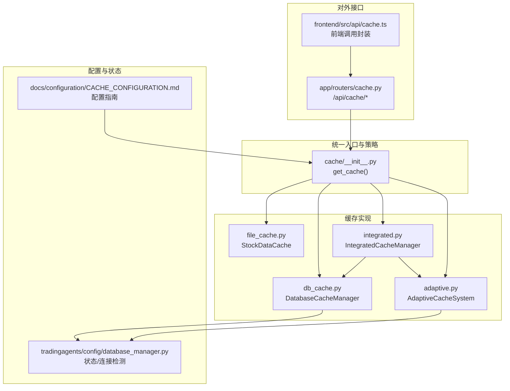
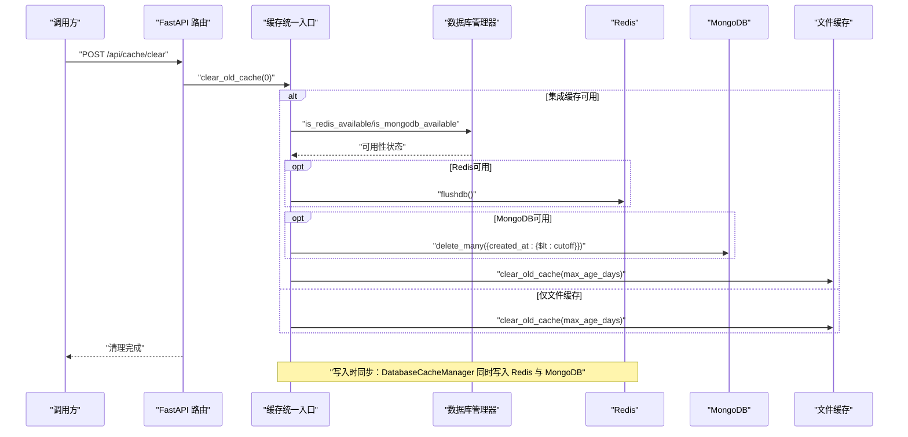
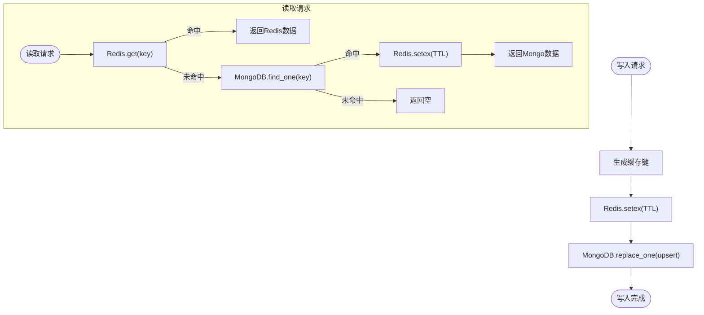
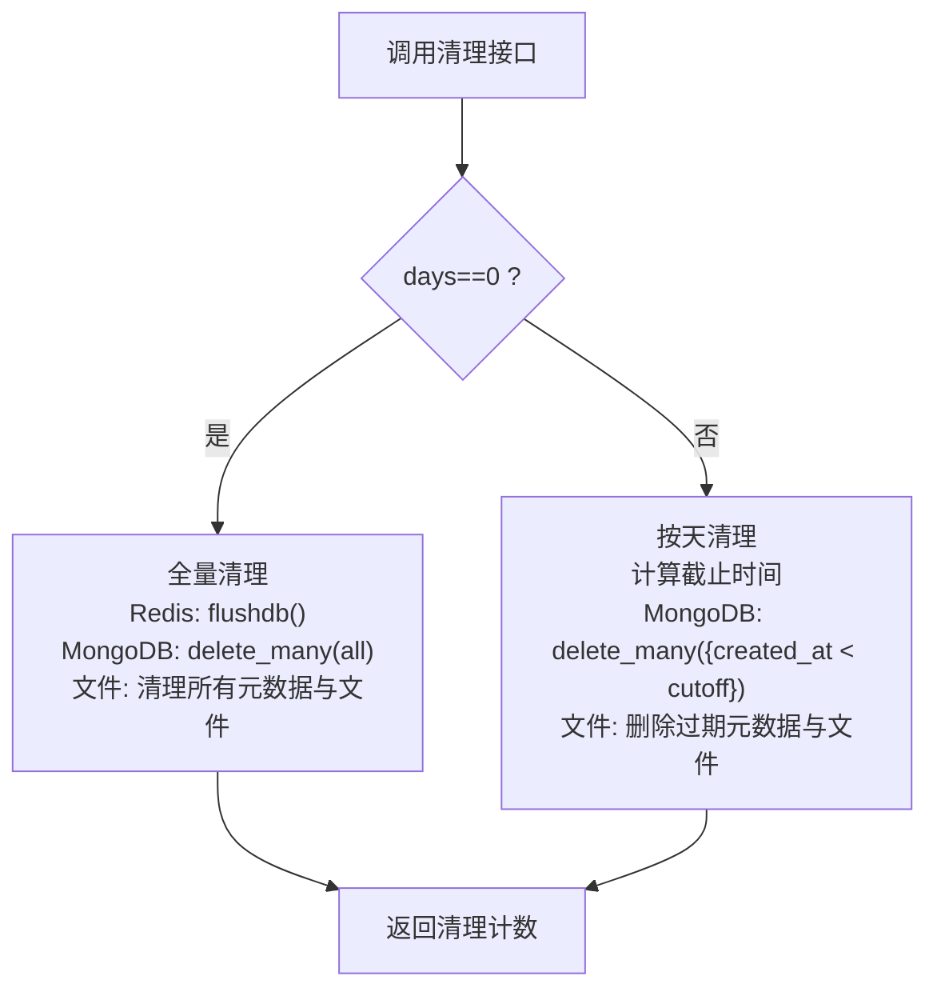
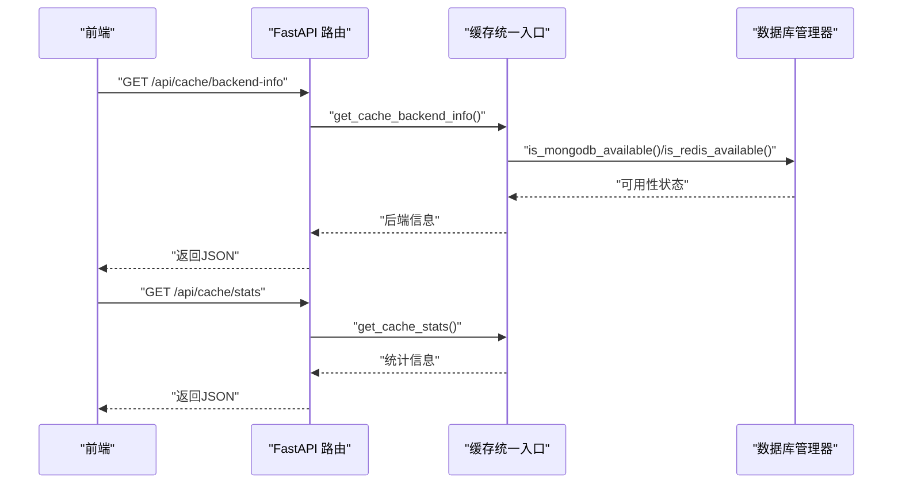
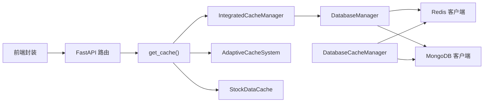

# 数据库缓存一致性策略

<cite>
**本文引用的文件**
- [cache/__init__.py](file://tradingagents/dataflows/cache/__init__.py)
- [integrated.py](file://tradingagents/dataflows/cache/integrated.py)
- [adaptive.py](file://tradingagents/dataflows/cache/adaptive.py)
- [db_cache.py](file://tradingagents/dataflows/cache/db_cache.py)
- [file_cache.py](file://tradingagents/dataflows/cache/file_cache.py)
- [cache.py](file://app/routers/cache.py)
- [database_manager.py](file://tradingagents/config/database_manager.py)
- [CACHE_CONFIGURATION.md](file://docs/configuration/CACHE_CONFIGURATION.md)
- [cache.ts](file://frontend/src/api/cache.ts)
</cite>

## 目录
1. [简介](#简介)
2. [项目结构](#项目结构)
3. [核心组件](#核心组件)
4. [架构总览](#架构总览)
5. [详细组件分析](#详细组件分析)
6. [依赖关系分析](#依赖关系分析)
7. [性能考量](#性能考量)
8. [故障排查指南](#故障排查指南)
9. [结论](#结论)
10. [附录](#附录)

## 简介
本文件聚焦于数据库缓存一致性策略，围绕“写入时同步”、“缓存失效与过期”、“监控接口”以及“数据同步服务中的刷新协调”四个方面，系统阐述缓存与原始数据源（MongoDB、Redis、文件缓存）之间的维护机制，并给出面向开发者的最佳实践与排障建议。目标读者既包括一线开发者，也包括需要理解系统行为的非技术用户。

## 项目结构
缓存体系由三层组成：
- 统一入口与策略选择：通过统一入口按环境变量选择文件缓存、集成缓存或自适应缓存。
- 缓存实现层：文件缓存（本地）、数据库缓存（MongoDB + Redis）、集成缓存（自动选择主后端并支持降级）。
- 对外接口层：FastAPI 路由提供缓存统计、清理、后端信息等监控能力；前端提供调用封装。

图表来源
- [cache/__init__.py](file://tradingagents/dataflows/cache/__init__.py#L77-L115)
- [integrated.py](file://tradingagents/dataflows/cache/integrated.py#L30-L72)
- [adaptive.py](file://tradingagents/dataflows/cache/adaptive.py#L19-L44)
- [db_cache.py](file://tradingagents/dataflows/cache/db_cache.py#L41-L80)
- [file_cache.py](file://tradingagents/dataflows/cache/file_cache.py#L21-L47)
- [cache.py](file://app/routers/cache.py#L18-L212)
- [database_manager.py](file://tradingagents/config/database_manager.py#L308-L344)
- [CACHE_CONFIGURATION.md](file://docs/configuration/CACHE_CONFIGURATION.md#L18-L47)

章节来源
- [cache/__init__.py](file://tradingagents/dataflows/cache/__init__.py#L77-L115)
- [CACHE_CONFIGURATION.md](file://docs/configuration/CACHE_CONFIGURATION.md#L18-L47)

## 核心组件
- 统一入口与策略选择：依据环境变量选择文件缓存、集成缓存或自适应缓存，优先采用集成/自适应策略以获得更好的性能与可靠性。
- 文件缓存：本地文件持久化，具备按市场类型与数据类型的TTL控制，适合单机与开发环境。
- 数据库缓存：同时写入Redis与MongoDB，Redis用于高频读取与自动过期，MongoDB用于持久化与跨实例共享。
- 集成缓存：在可用时优先使用数据库缓存，不可用时自动降级到文件缓存，保证系统稳定运行。
- 自适应缓存：根据配置自动选择主后端（Redis/MongoDB/文件），并支持降级回退。
- 对外接口：提供缓存统计、清理、后端信息等监控能力，便于运维与开发定位问题。

章节来源
- [cache/__init__.py](file://tradingagents/dataflows/cache/__init__.py#L77-L115)
- [file_cache.py](file://tradingagents/dataflows/cache/file_cache.py#L54-L86)
- [db_cache.py](file://tradingagents/dataflows/cache/db_cache.py#L184-L266)
- [integrated.py](file://tradingagents/dataflows/cache/integrated.py#L30-L72)
- [adaptive.py](file://tradingagents/dataflows/cache/adaptive.py#L19-L44)
- [cache.py](file://app/routers/cache.py#L18-L212)

## 架构总览
下图展示了写入时的同步策略与读取路径，以及缓存失效与监控接口的交互。

图表来源
- [cache.py](file://app/routers/cache.py#L93-L116)
- [integrated.py](file://tradingagents/dataflows/cache/integrated.py#L285-L337)
- [db_cache.py](file://tradingagents/dataflows/cache/db_cache.py#L238-L266)
- [database_manager.py](file://tradingagents/config/database_manager.py#L308-L344)

## 详细组件分析

### 写入时同步策略：Redis + MongoDB
- 写入路径：当使用数据库缓存时，写入操作会同时写入Redis与MongoDB，确保高频读取与持久化并存。
- Redis TTL：Redis侧设置固定TTL，到期自动过期，降低管理成本。
- MongoDB TTL：MongoDB侧通过文档字段与索引配合实现过期清理，定期清理过期文档。
- 读取路径：优先从Redis命中，未命中再回源到MongoDB，并将数据同步回Redis以提升后续命中率。

图表来源
- [db_cache.py](file://tradingagents/dataflows/cache/db_cache.py#L184-L266)
- [db_cache.py](file://tradingagents/dataflows/cache/db_cache.py#L267-L322)

章节来源
- [db_cache.py](file://tradingagents/dataflows/cache/db_cache.py#L184-L266)
- [db_cache.py](file://tradingagents/dataflows/cache/db_cache.py#L267-L322)

### 缓存失效机制：TTL与手动清理
- 基于TTL的自动过期
  - Redis：写入时设置TTL，到期自动过期，无需手动清理。
  - MongoDB：通过文档字段与索引实现过期，定期清理过期文档。
  - 文件缓存：按市场类型与数据类型配置TTL，定期清理过期文件。
- 手动清理接口
  - 清理指定天数前的缓存：支持按天数清理，兼容Redis/MongoDB/文件缓存。
  - 清空所有缓存：传入0触发全量清理，适用于重置或迁移场景。
  - 清理过期缓存：集成缓存提供统一入口，内部分别处理各后端。

图表来源
- [integrated.py](file://tradingagents/dataflows/cache/integrated.py#L285-L337)
- [db_cache.py](file://tradingagents/dataflows/cache/db_cache.py#L538-L556)
- [file_cache.py](file://tradingagents/dataflows/cache/file_cache.py#L554-L579)

章节来源
- [integrated.py](file://tradingagents/dataflows/cache/integrated.py#L265-L337)
- [db_cache.py](file://tradingagents/dataflows/cache/db_cache.py#L538-L556)
- [file_cache.py](file://tradingagents/dataflows/cache/file_cache.py#L554-L579)

### 监控接口：get_performance_mode 与 get_cache_backend_info
- get_performance_mode：返回当前性能模式描述，帮助判断是否启用Redis/MongoDB/文件缓存组合。
- get_cache_backend_info：返回当前主后端、是否启用降级、以及数据库可用性等关键信息。
- FastAPI 路由提供 /api/cache/stats、/api/cache/cleanup、/api/cache/clear、/api/cache/details、/api/cache/backend-info 等接口，前端通过封装进行调用。

图表来源
- [cache.py](file://app/routers/cache.py#L18-L212)
- [integrated.py](file://tradingagents/dataflows/cache/integrated.py#L339-L379)
- [database_manager.py](file://tradingagents/config/database_manager.py#L308-L344)
- [cache.ts](file://frontend/src/api/cache.ts#L1-L104)

章节来源
- [integrated.py](file://tradingagents/dataflows/cache/integrated.py#L339-L379)
- [cache.py](file://app/routers/cache.py#L18-L212)
- [database_manager.py](file://tradingagents/config/database_manager.py#L308-L344)
- [cache.ts](file://frontend/src/api/cache.ts#L1-L104)

### 数据同步服务中的刷新协调最佳实践
- 写入一致性
  - 在数据写入后，立即触发数据库缓存写入（Redis + MongoDB），确保读取路径的即时一致性。
  - 若Redis/MongoDB任一不可用，应记录告警并降级到文件缓存，避免阻塞业务。
- 读取一致性
  - 读取时优先命中Redis，未命中再回源MongoDB，并将数据同步回Redis，维持热点数据的高命中率。
- 刷新策略
  - 对于高频更新的数据，缩短Redis TTL，提高缓存更新频率。
  - 对于批量同步任务，建议在任务完成后主动清理相关缓存键或按天清理，避免脏数据滞留。
- 监控与告警
  - 定期调用后端信息接口，关注数据库可用性变化。
  - 当出现缓存命中率下降或延迟上升时，检查Redis/MongoDB连接与容量，必要时扩容或调整TTL。

章节来源
- [db_cache.py](file://tradingagents/dataflows/cache/db_cache.py#L238-L322)
- [integrated.py](file://tradingagents/dataflows/cache/integrated.py#L339-L379)
- [cache.py](file://app/routers/cache.py#L18-L212)

## 依赖关系分析
- 统一入口依赖环境变量决定具体实现，优先选择集成/自适应缓存。
- 集成缓存依赖数据库管理器获取Redis/MongoDB客户端与可用性状态。
- 数据库缓存直接管理Redis/MongoDB连接与索引，提供写入同步与读取回源逻辑。
- 文件缓存独立于数据库，提供TTL与清理能力。
- 对外接口依赖统一入口，向上提供监控与运维能力。

图表来源
- [cache/__init__.py](file://tradingagents/dataflows/cache/__init__.py#L77-L115)
- [integrated.py](file://tradingagents/dataflows/cache/integrated.py#L30-L72)
- [adaptive.py](file://tradingagents/dataflows/cache/adaptive.py#L19-L44)
- [db_cache.py](file://tradingagents/dataflows/cache/db_cache.py#L41-L80)
- [database_manager.py](file://tradingagents/config/database_manager.py#L308-L344)
- [cache.py](file://app/routers/cache.py#L18-L212)
- [cache.ts](file://frontend/src/api/cache.ts#L1-L104)

章节来源
- [cache/__init__.py](file://tradingagents/dataflows/cache/__init__.py#L77-L115)
- [integrated.py](file://tradingagents/dataflows/cache/integrated.py#L30-L72)
- [adaptive.py](file://tradingagents/dataflows/cache/adaptive.py#L19-L44)
- [db_cache.py](file://tradingagents/dataflows/cache/db_cache.py#L41-L80)
- [database_manager.py](file://tradingagents/config/database_manager.py#L308-L344)
- [cache.py](file://app/routers/cache.py#L18-L212)
- [cache.ts](file://frontend/src/api/cache.ts#L1-L104)

## 性能考量
- 读取路径优化：优先Redis命中，未命中回源MongoDB并同步回Redis，热点数据命中率高。
- TTL策略：针对不同数据类型与市场设定合理TTL，平衡新鲜度与资源占用。
- 自动降级：数据库不可用时自动回退到文件缓存，保障系统可用性。
- 清理策略：定期清理过期文档与文件，避免存储膨胀影响性能。

[本节为通用指导，无需列出具体文件来源]

## 故障排查指南
- 环境变量与配置
  - 确认缓存策略已通过环境变量启用集成/自适应缓存。
  - 检查数据库连接字符串与端口是否正确。
- 连接与可用性
  - 使用后端信息接口确认Redis/MongoDB可用性。
  - 若连接失败，检查网络、防火墙与容器编排配置。
- 清理与恢复
  - 使用清理接口按天清理或全量清理，观察缓存命中率与延迟变化。
  - 若清理后仍异常，检查索引与集合状态，必要时重建索引。
- 前端调用
  - 通过前端封装接口调用后端信息与统计，辅助定位问题。

章节来源
- [CACHE_CONFIGURATION.md](file://docs/configuration/CACHE_CONFIGURATION.md#L18-L47)
- [database_manager.py](file://tradingagents/config/database_manager.py#L308-L344)
- [cache.py](file://app/routers/cache.py#L18-L212)
- [cache.ts](file://frontend/src/api/cache.ts#L1-L104)

## 结论
该缓存体系通过“写入时同步（Redis + MongoDB）+ 基于TTL的自动过期 + 手动清理 + 统一监控”的组合，实现了与原始数据源的一致性维护。集成/自适应缓存优先利用数据库能力提升性能与可靠性，同时提供自动降级保障系统稳定。在数据同步服务中，建议遵循“写入即同步、读取即回源、定期清理”的原则，并结合监控接口持续优化TTL与清理策略，确保分析结果的准确性与稳定性。

[本节为总结性内容，无需列出具体文件来源]

## 附录
- 快速切换缓存策略：通过环境变量启用集成/自适应缓存，无需修改代码。
- 常用接口
  - 获取缓存统计：/api/cache/stats
  - 清理过期缓存：/api/cache/cleanup?days=N
  - 清空所有缓存：/api/cache/clear
  - 获取缓存详情：/api/cache/details?page=&page_size=
  - 获取后端信息：/api/cache/backend-info

章节来源
- [CACHE_CONFIGURATION.md](file://docs/configuration/CACHE_CONFIGURATION.md#L18-L47)
- [cache.py](file://app/routers/cache.py#L18-L212)
- [cache.ts](file://frontend/src/api/cache.ts#L1-L104)