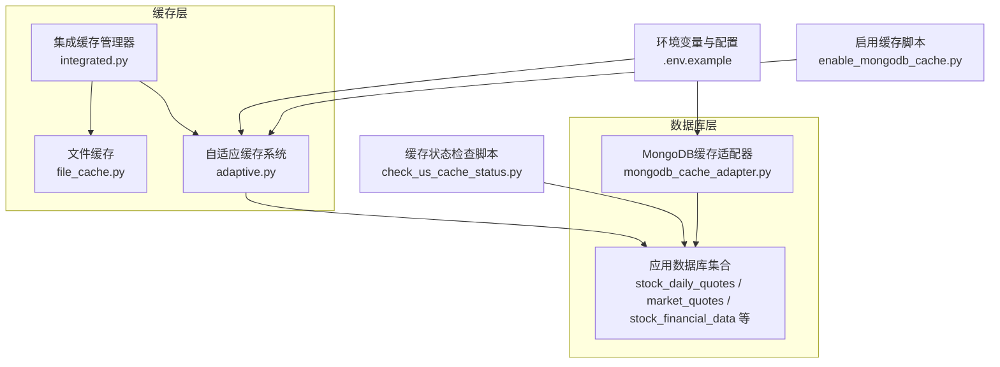
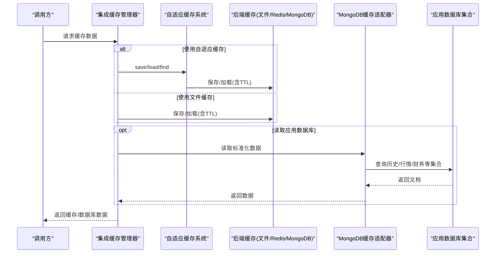
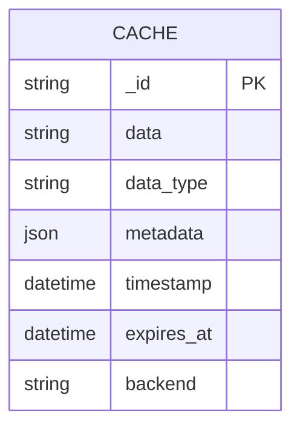
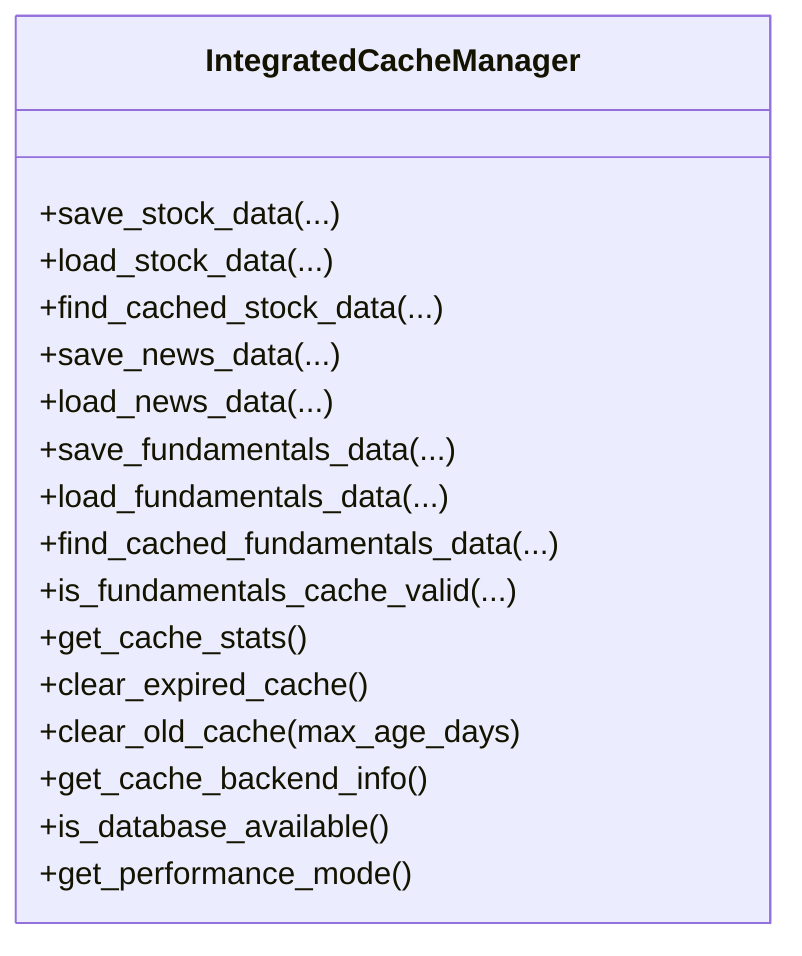
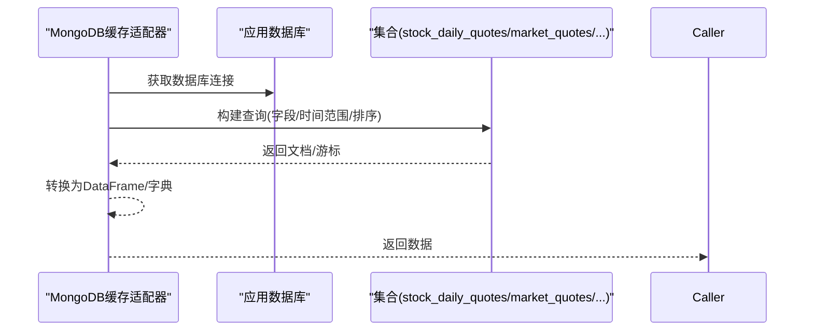
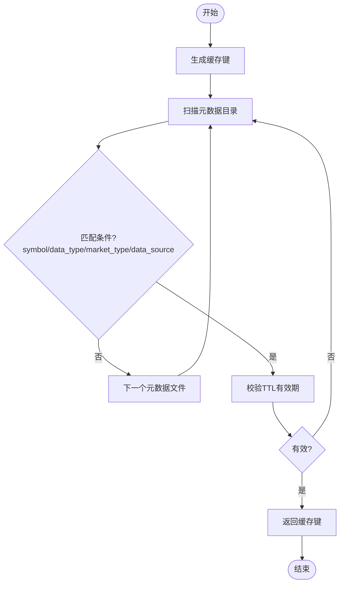
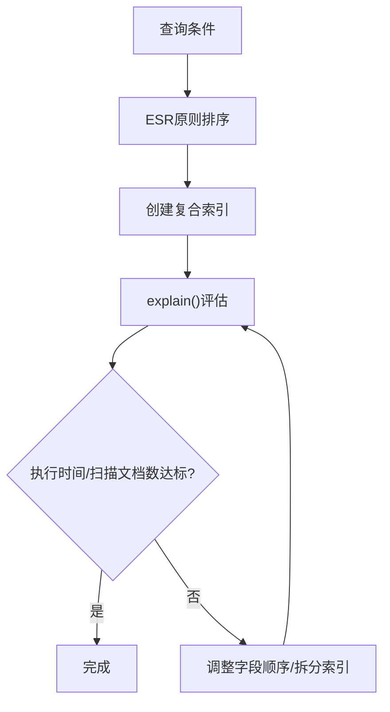
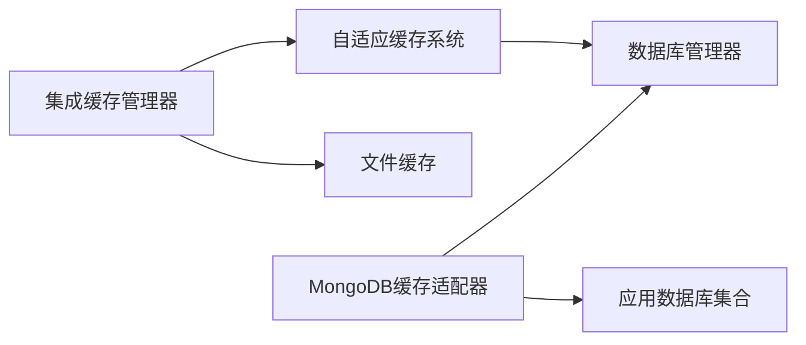

# 数据库缓存数据模型

<cite>
**本文引用的文件**
- [tradingagents/dataflows/cache/adaptive.py](file://tradingagents/dataflows/cache/adaptive.py)
- [tradingagents/dataflows/cache/integrated.py](file://tradingagents/dataflows/cache/integrated.py)
- [tradingagents/dataflows/cache/mongodb_cache_adapter.py](file://tradingagents/dataflows/cache/mongodb_cache_adapter.py)
- [tradingagents/dataflows/cache/file_cache.py](file://tradingagents/dataflows/cache/file_cache.py)
- [docs/design/stock_data_model_design.md](file://docs/design/stock_data_model_design.md)
- [docs/architecture/database/MONGODB_COLLECTIONS_COMPARISON.md](file://docs/architecture/database/MONGODB_COLLECTIONS_COMPARISON.md)
- [docs/maintenance/mongodb_index_optimization.md](file://docs/maintenance/mongodb_index_optimization.md)
- [.env.example](file://.env.example)
- [scripts/check_us_cache_status.py](file://scripts/check_us_cache_status.py)
- [scripts/enable_mongodb_cache.py](file://scripts/enable_mongodb_cache.py)
- [tests/test_fundamentals_cache.py](file://tests/test_fundamentals_cache.py)
</cite>

## 目录
1. [简介](#简介)
2. [项目结构](#项目结构)
3. [核心组件](#核心组件)
4. [架构总览](#架构总览)
5. [详细组件分析](#详细组件分析)
6. [依赖关系分析](#依赖关系分析)
7. [性能考量](#性能考量)
8. [故障排查指南](#故障排查指南)
9. [结论](#结论)
10. [附录](#附录)

## 简介
本文件聚焦于数据库缓存数据模型，系统性阐述MongoDB中缓存数据的集合结构设计、字段组成、元数据与TTL策略、索引优化方法，以及如何通过复合索引优化针对股票代码、市场类型与时间范围的查询。同时给出缓存的股票基本面与行情数据的实际存储格式示例，说明序列化与反序列化的处理方式，并提供面向开发与运维的实践建议与可视化图示。

## 项目结构
围绕缓存与数据库访问的关键模块如下：
- 自适应缓存系统：负责在文件、Redis、MongoDB之间按策略选择与降级，统一保存/加载与TTL管理。
- 集成缓存管理器：对外暴露统一接口，兼容传统文件缓存与自适应缓存。
- MongoDB缓存适配器：从应用数据库读取标准化后的同步数据（如历史K线、实时行情、财务数据等）。
- 文件缓存：提供本地文件缓存能力，支持按市场类型与TTL进行查找与清理。
- 文档与脚本：提供集合结构设计、索引优化指南、缓存状态检查与启用脚本。

图表来源
- [tradingagents/dataflows/cache/adaptive.py](file://tradingagents/dataflows/cache/adaptive.py#L1-L200)
- [tradingagents/dataflows/cache/integrated.py](file://tradingagents/dataflows/cache/integrated.py#L1-L120)
- [tradingagents/dataflows/cache/mongodb_cache_adapter.py](file://tradingagents/dataflows/cache/mongodb_cache_adapter.py#L1-L120)
- [.env.example](file://.env.example#L529-L554)

章节来源
- [tradingagents/dataflows/cache/adaptive.py](file://tradingagents/dataflows/cache/adaptive.py#L1-L200)
- [tradingagents/dataflows/cache/integrated.py](file://tradingagents/dataflows/cache/integrated.py#L1-L120)
- [tradingagents/dataflows/cache/mongodb_cache_adapter.py](file://tradingagents/dataflows/cache/mongodb_cache_adapter.py#L1-L120)
- [.env.example](file://.env.example#L529-L554)

## 核心组件
- 自适应缓存系统
  - 提供统一的保存/加载接口，支持文件、Redis、MongoDB三种后端。
  - 自动生成缓存键，按市场类型与数据类型计算TTL秒数。
  - 保存时序列化DataFrame或二进制数据，加载时反序列化并校验有效性。
- 集成缓存管理器
  - 对外暴露统一接口，兼容传统文件缓存与自适应缓存。
  - 支持缓存统计、清理过期缓存、后端可用性检测与性能模式提示。
- MongoDB缓存适配器
  - 从应用数据库读取标准化数据（历史K线、实时行情、财务数据、新闻、社媒等）。
  - 支持按数据源优先级查询，构建时间范围与排序条件。
- 文件缓存
  - 本地文件缓存，按市场类型分目录组织，支持TTL与内容长度检查。
  - 提供基于键的查找与有效期校验。

章节来源
- [tradingagents/dataflows/cache/adaptive.py](file://tradingagents/dataflows/cache/adaptive.py#L1-L200)
- [tradingagents/dataflows/cache/integrated.py](file://tradingagents/dataflows/cache/integrated.py#L1-L120)
- [tradingagents/dataflows/cache/mongodb_cache_adapter.py](file://tradingagents/dataflows/cache/mongodb_cache_adapter.py#L1-L120)
- [tradingagents/dataflows/cache/file_cache.py](file://tradingagents/dataflows/cache/file_cache.py#L1-L120)

## 架构总览
下图展示了缓存系统的整体交互：上层通过集成缓存管理器统一调用，底层根据配置选择文件、Redis或MongoDB；MongoDB适配器则从应用数据库集合读取标准化数据。

图表来源
- [tradingagents/dataflows/cache/integrated.py](file://tradingagents/dataflows/cache/integrated.py#L1-L120)
- [tradingagents/dataflows/cache/adaptive.py](file://tradingagents/dataflows/cache/adaptive.py#L234-L305)
- [tradingagents/dataflows/cache/mongodb_cache_adapter.py](file://tradingagents/dataflows/cache/mongodb_cache_adapter.py#L160-L216)

## 详细组件分析

### 自适应缓存系统（MongoDB缓存集合与序列化）
- 缓存集合
  - 自适应缓存系统在MongoDB中使用统一的缓存集合（示例：cache），文档以缓存键为_id，包含序列化后的数据、元数据、创建时间与过期时间。
- 字段组成
  - _id：缓存键
  - data：序列化后的数据（DataFrame以JSON形式存储，其他数据以十六进制字符串存储）
  - data_type：数据类型（dataframe/pickle）
  - metadata：元数据（包含symbol、start_date、end_date、data_source、data_type等）
  - timestamp：创建时间
  - expires_at：过期时间
  - backend：后端标识（mongodb）
- TTL与有效期
  - TTL由市场类型与数据类型决定，保存时计算并写入expires_at；加载时检查过期并删除过期文档。
- 序列化与反序列化
  - DataFrame：使用JSON序列化；加载时使用DataFrame读取JSON。
  - 其他对象：使用pickle序列化为十六进制字符串；加载时反序列化。
- 示例（概念性）
  - 保存：将DataFrame或对象序列化后写入cache集合，设置expires_at。
  - 加载：根据_id查询，检查expires_at，反序列化返回。

图表来源
- [tradingagents/dataflows/cache/adaptive.py](file://tradingagents/dataflows/cache/adaptive.py#L158-L189)
- [tradingagents/dataflows/cache/adaptive.py](file://tradingagents/dataflows/cache/adaptive.py#L195-L233)

章节来源
- [tradingagents/dataflows/cache/adaptive.py](file://tradingagents/dataflows/cache/adaptive.py#L158-L233)
- [tradingagents/dataflows/cache/adaptive.py](file://tradingagents/dataflows/cache/adaptive.py#L234-L305)

### 集成缓存管理器（统一接口与后端信息）
- 统一接口
  - 保存/加载/查找缓存数据，兼容文件缓存与自适应缓存。
- 后端信息
  - 提供当前主后端、是否启用降级、数据库可用性、Redis/MongoDB可用性等信息。
- 性能模式
  - 根据Redis与MongoDB可用性输出高性能/快速/持久化/标准模式提示。
- 清理策略
  - 支持清理Redis/MongoDB/文件缓存，按时间阈值删除过期记录。

图表来源
- [tradingagents/dataflows/cache/integrated.py](file://tradingagents/dataflows/cache/integrated.py#L73-L175)
- [tradingagents/dataflows/cache/integrated.py](file://tradingagents/dataflows/cache/integrated.py#L265-L371)

章节来源
- [tradingagents/dataflows/cache/integrated.py](file://tradingagents/dataflows/cache/integrated.py#L1-L120)
- [tradingagents/dataflows/cache/integrated.py](file://tradingagents/dataflows/cache/integrated.py#L265-L371)

### MongoDB缓存适配器（标准化数据读取）
- 适用场景
  - 从应用数据库集合读取标准化后的同步数据，如历史K线、实时行情、财务数据、新闻、社媒等。
- 查询策略
  - 按数据源优先级查询，支持时间范围过滤与排序。
  - 通过集合名称与字段组合实现高效检索。
- 示例（概念性）
  - 历史K线：按symbol、period、data_source、trade_date等字段查询。
  - 实时行情：按code查询最新记录。
  - 财务数据：按code与report_period查询最新记录。

图表来源
- [tradingagents/dataflows/cache/mongodb_cache_adapter.py](file://tradingagents/dataflows/cache/mongodb_cache_adapter.py#L160-L216)
- [tradingagents/dataflows/cache/mongodb_cache_adapter.py](file://tradingagents/dataflows/cache/mongodb_cache_adapter.py#L221-L258)
- [tradingagents/dataflows/cache/mongodb_cache_adapter.py](file://tradingagents/dataflows/cache/mongodb_cache_adapter.py#L327-L349)

章节来源
- [tradingagents/dataflows/cache/mongodb_cache_adapter.py](file://tradingagents/dataflows/cache/mongodb_cache_adapter.py#L160-L216)
- [tradingagents/dataflows/cache/mongodb_cache_adapter.py](file://tradingagents/dataflows/cache/mongodb_cache_adapter.py#L221-L258)
- [tradingagents/dataflows/cache/mongodb_cache_adapter.py](file://tradingagents/dataflows/cache/mongodb_cache_adapter.py#L327-L349)

### 文件缓存（TTL与查找）
- 目录组织
  - 按市场类型（A股/美股）与数据类型（股票数据/新闻/基本面）分目录存放。
- TTL与有效期
  - 不同市场与数据类型配置不同TTL小时数；支持按最大文件数量清理。
- 查找逻辑
  - 生成缓存键，遍历元数据文件匹配symbol、data_type、market_type、data_source等条件，再校验有效期。

图表来源
- [tradingagents/dataflows/cache/file_cache.py](file://tradingagents/dataflows/cache/file_cache.py#L529-L554)

章节来源
- [tradingagents/dataflows/cache/file_cache.py](file://tradingagents/dataflows/cache/file_cache.py#L529-L554)

### 缓存数据模型与字段说明
- 自适应缓存集合（cache）
  - 字段：_id、data、data_type、metadata、timestamp、expires_at、backend
  - 元数据：symbol、start_date、end_date、data_source、data_type
  - TTL：保存时计算并写入expires_at，加载时检查过期
- 应用数据库集合（示例）
  - 历史K线：stock_daily_quotes（字段包含symbol、trade_date、period、data_source、OHLCV与指标等）
  - 实时行情：market_quotes（字段包含code、close/open/high/low等）
  - 财务数据：stock_financial_data（字段包含report_period、财务报表与指标等）
  - 新闻数据：stock_news（字段包含symbol/symbols、title/content、publish_time、category、sentiment等）
  - 社媒消息：social_media_messages（字段包含symbol、publish_time、content等）

章节来源
- [docs/design/stock_data_model_design.md](file://docs/design/stock_data_model_design.md#L70-L102)
- [docs/architecture/database/MONGODB_COLLECTIONS_COMPARISON.md](file://docs/architecture/database/MONGODB_COLLECTIONS_COMPARISON.md#L1-L155)

### 索引策略与复合索引优化
- 复合索引设计原则
  - ESR原则：等值查询字段优先，排序字段居中，范围查询字段靠后。
- 针对历史K线查询的索引
  - 查询条件常包含symbol、trade_date、data_source、period等字段，建议创建复合索引以避免COLLSCAN。
- 性能对比
  - 优化前可能出现COLLSCAN，优化后使用IXSCAN，显著降低执行时间与扫描文档数。

图表来源
- [docs/maintenance/mongodb_index_optimization.md](file://docs/maintenance/mongodb_index_optimization.md#L49-L120)
- [docs/maintenance/mongodb_index_optimization.md](file://docs/maintenance/mongodb_index_optimization.md#L213-L258)

章节来源
- [docs/maintenance/mongodb_index_optimization.md](file://docs/maintenance/mongodb_index_optimization.md#L49-L120)
- [docs/maintenance/mongodb_index_optimization.md](file://docs/maintenance/mongodb_index_optimization.md#L213-L258)

### 实际文档示例（概念性）
- 自适应缓存集合（cache）
  - _id：缓存键
  - data：序列化后的数据（DataFrame JSON或对象十六进制）
  - data_type：dataframe/pickle
  - metadata：包含symbol、start_date、end_date、data_source、data_type
  - timestamp：创建时间
  - expires_at：过期时间
  - backend：mongodb
- 应用数据库集合（stock_daily_quotes）
  - 字段示例：symbol、full_symbol、market、trade_date、period、data_source、open、high、low、close、volume、amount、pct_chg、turnover_rate、created_at、updated_at、version
- 实时行情（market_quotes）
  - 字段示例：code、close、open、high、low、pre_close、pct_chg、amount、volume、trade_date、updated_at
- 财务数据（stock_financial_data）
  - 字段示例：symbol、full_symbol、market、report_period、report_type、ann_date、balance_sheet、income_statement、cashflow_statement、financial_indicators、created_at、updated_at、data_source、version
- 新闻数据（stock_news）
  - 字段示例：symbol、symbols、title、content、summary、url、source、author、publish_time、category、sentiment、sentiment_score、keywords、importance、language、created_at、data_source、version
- 社媒消息（social_media_messages）
  - 字段示例：symbol、publish_time、content、platform、created_at、updated_at

章节来源
- [tradingagents/dataflows/cache/adaptive.py](file://tradingagents/dataflows/cache/adaptive.py#L158-L189)
- [docs/design/stock_data_model_design.md](file://docs/design/stock_data_model_design.md#L70-L102)
- [docs/architecture/database/MONGODB_COLLECTIONS_COMPARISON.md](file://docs/architecture/database/MONGODB_COLLECTIONS_COMPARISON.md#L1-L155)

## 依赖关系分析
- 组件耦合
  - 集成缓存管理器依赖自适应缓存系统与文件缓存，提供统一接口。
  - 自适应缓存系统依赖数据库管理器获取Redis/MongoDB客户端。
  - MongoDB缓存适配器依赖数据库管理器获取MongoDB客户端，并直接访问应用数据库集合。
- 外部依赖
  - 环境变量控制缓存策略与超时参数。
  - 脚本用于检查缓存状态与启用缓存。

图表来源
- [tradingagents/dataflows/cache/integrated.py](file://tradingagents/dataflows/cache/integrated.py#L1-L120)
- [tradingagents/dataflows/cache/adaptive.py](file://tradingagents/dataflows/cache/adaptive.py#L1-L60)
- [tradingagents/dataflows/cache/mongodb_cache_adapter.py](file://tradingagents/dataflows/cache/mongodb_cache_adapter.py#L1-L46)

章节来源
- [tradingagents/dataflows/cache/integrated.py](file://tradingagents/dataflows/cache/integrated.py#L1-L120)
- [tradingagents/dataflows/cache/adaptive.py](file://tradingagents/dataflows/cache/adaptive.py#L1-L60)
- [tradingagents/dataflows/cache/mongodb_cache_adapter.py](file://tradingagents/dataflows/cache/mongodb_cache_adapter.py#L1-L46)

## 性能考量
- 缓存后端选择
  - 高性能模式：Redis + MongoDB + 文件缓存；快速模式：Redis + 文件缓存；持久化模式：MongoDB + 文件缓存；标准模式：智能文件缓存。
- TTL与清理
  - 自适应缓存系统按市场与数据类型计算TTL；集成缓存管理器支持清理过期缓存。
  - 文件缓存按TTL与最大文件数清理；MongoDB/Redis按时间阈值或TTL机制清理。
- 查询优化
  - 为高频查询字段建立复合索引，避免COLLSCAN；使用explain()评估执行计划。
- 环境参数
  - 连接池与超时参数影响数据库性能，应结合业务负载合理配置。

章节来源
- [tradingagents/dataflows/cache/integrated.py](file://tradingagents/dataflows/cache/integrated.py#L364-L380)
- [docs/maintenance/mongodb_index_optimization.md](file://docs/maintenance/mongodb_index_optimization.md#L213-L258)
- [.env.example](file://.env.example#L529-L554)

## 故障排查指南
- 缓存状态检查
  - 使用脚本检查集合数据量与美股缓存情况，定位缓存是否正常。
- 缓存启用
  - 通过脚本确认缓存策略是否启用，确保环境变量正确。
- 基本功能验证
  - 使用测试用例验证缓存保存、加载、查找与统计功能。
- 常见问题
  - 缓存键生成冲突：检查参数组合与哈希算法。
  - TTL失效：检查系统时间与时区配置，确保expires_at正确。
  - 查询慢：检查索引是否命中，必要时重建复合索引。

章节来源
- [scripts/check_us_cache_status.py](file://scripts/check_us_cache_status.py#L41-L106)
- [scripts/enable_mongodb_cache.py](file://scripts/enable_mongodb_cache.py#L63-L82)
- [tests/test_fundamentals_cache.py](file://tests/test_fundamentals_cache.py#L47-L84)

## 结论
本文件系统梳理了数据库缓存数据模型的设计要点：自适应缓存集合的字段与TTL机制、序列化/反序列化流程、MongoDB标准化集合的结构与查询策略，以及通过复合索引优化查询性能的方法。结合集成缓存管理器与文件缓存，形成灵活可靠的多后端缓存体系，既满足高性能需求，又具备良好的可维护性与可扩展性。

## 附录
- 环境变量与配置
  - 缓存策略、TTL、连接池与超时参数等可通过环境变量配置。
- 相关文档与脚本
  - 集合结构设计、索引优化指南、缓存状态检查与启用脚本等。

章节来源
- [.env.example](file://.env.example#L529-L554)
- [docs/design/stock_data_model_design.md](file://docs/design/stock_data_model_design.md#L1-L200)
- [docs/maintenance/mongodb_index_optimization.md](file://docs/maintenance/mongodb_index_optimization.md#L1-L120)