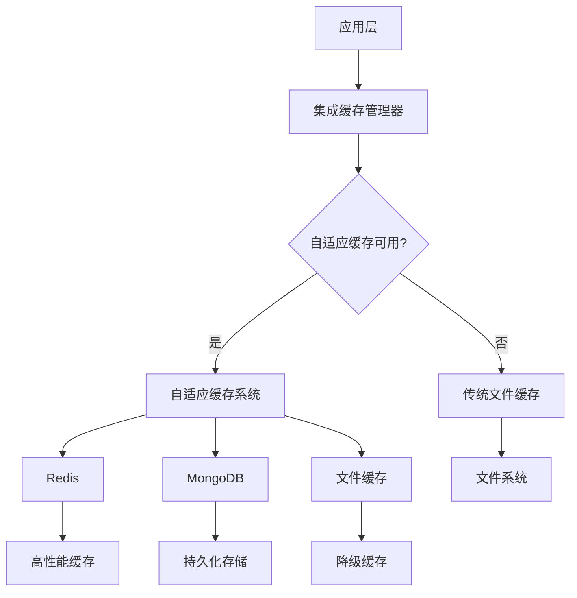
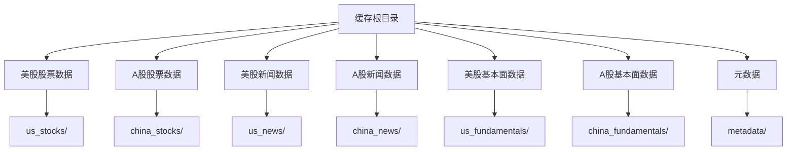
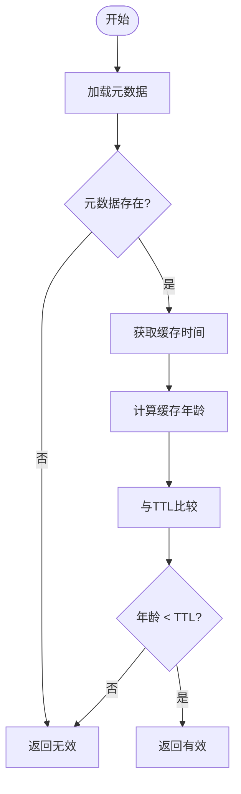
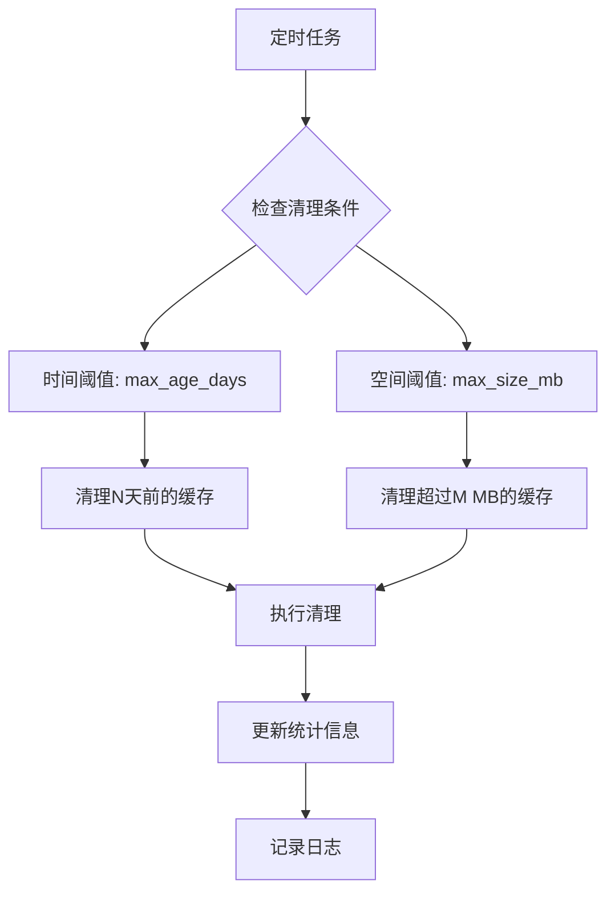
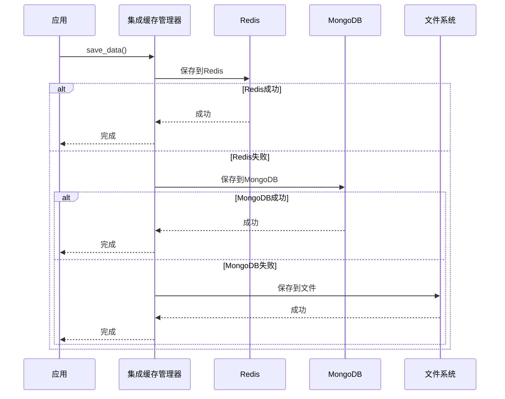

# 文件系统缓存配置

<cite>
**本文档引用的文件**   
- [file_cache.py](file://tradingagents/dataflows/cache/file_cache.py)
- [adaptive.py](file://tradingagents/dataflows/cache/adaptive.py)
- [integrated.py](file://tradingagents/dataflows/cache/integrated.py)
- [database_manager.py](file://tradingagents/config/database_manager.py)
- [CACHE_CONFIGURATION.md](file://docs/configuration/CACHE_CONFIGURATION.md)
- [web/utils/async_progress_tracker.py](file://web/utils/async_progress_tracker.py)
- [app/routers/database.py](file://app/routers/database.py)
</cite>

## 目录
1. [简介](#简介)
2. [文件系统缓存架构](#文件系统缓存架构)
3. [缓存根目录与子目录配置](#缓存根目录与子目录配置)
4. [文件命名约定与目录结构](#文件命名约定与目录结构)
5. [缓存过期与清理策略](#缓存过期与清理策略)
6. [磁盘空间监控与自动清理](#磁盘空间监控与自动清理)
7. [文件缓存与Redis缓存协同机制](#文件缓存与redis缓存协同机制)
8. [分布式部署注意事项](#分布式部署注意事项)
9. [配置示例与最佳实践](#配置示例与最佳实践)

## 简介
本文档详细说明了如何启用和配置基于本地文件系统的缓存机制。系统采用分层缓存架构，支持文件缓存、MongoDB和Redis等多种后端，并能根据环境自动选择最优策略。文档将重点介绍文件系统缓存的配置方法，包括缓存根目录设置、子目录组织、文件命名规则、过期清理策略以及与Redis缓存的协同工作机制。

**Section sources**
- [file_cache.py](file://tradingagents/dataflows/cache/file_cache.py#L1-L686)
- [CACHE_CONFIGURATION.md](file://docs/configuration/CACHE_CONFIGURATION.md#L1-L81)

## 文件系统缓存架构
系统采用集成缓存管理器（IntegratedCacheManager）作为统一入口，能够智能选择缓存策略。当MongoDB和Redis不可用时，系统会自动降级到文件缓存，确保功能的稳定性。



**Diagram sources **
- [integrated.py](file://tradingagents/dataflows/cache/integrated.py#L30-L400)
- [adaptive.py](file://tradingagents/dataflows/cache/adaptive.py#L19-L441)

**Section sources**
- [integrated.py](file://tradingagents/dataflows/cache/integrated.py#L1-L400)
- [adaptive.py](file://tradingagents/dataflows/cache/adaptive.py#L1-L441)

## 缓存根目录与子目录配置
文件系统缓存的根目录默认设置为 `tradingagents/dataflows/data_cache`，并根据数据类型和市场类型创建了专门的子目录。

### 根目录配置
缓存根目录可以在初始化时通过参数指定，若未指定则使用默认路径。系统会自动创建根目录及其所有子目录。

### 子目录组织
系统为不同类型的缓存数据创建了专门的子目录，实现数据的分类存储：



**Diagram sources **
- [file_cache.py](file://tradingagents/dataflows/cache/file_cache.py#L39-L52)

**Section sources**
- [file_cache.py](file://tradingagents/dataflows/cache/file_cache.py#L24-L53)

## 文件命名约定与目录结构
系统采用统一的文件命名和目录结构策略，确保缓存数据的可管理性和可追溯性。

### 文件命名规则
缓存文件采用以下命名格式：
- **缓存键生成**：基于数据类型、股票代码、参数等信息生成MD5哈希值作为唯一标识
- **文件名格式**：`{symbol}_{data_type}_{hash}.{format}`
- **元数据文件**：`{cache_key}_meta.json`

### 目录结构示例
```
data_cache/
├── us_stocks/              # 美股股票数据
├── china_stocks/           # A股股票数据
├── us_news/                # 美股新闻数据
├── china_news/             # A股新闻数据
├── us_fundamentals/        # 美股基本面数据
├── china_fundamentals/     # A股基本面数据
└── metadata/               # 元数据存储
```

### 数据类型与TTL配置
系统为不同市场和数据类型配置了不同的缓存有效期（TTL）：

| 数据类型 | 市场 | TTL（小时） | 描述 |
|---------|------|------------|------|
| 股票数据 | 美股 | 2 | 美股历史数据 |
| 股票数据 | A股 | 1 | A股历史数据 |
| 新闻数据 | 美股 | 6 | 美股新闻数据 |
| 新闻数据 | A股 | 4 | A股新闻数据 |
| 基本面数据 | 美股 | 24 | 美股基本面数据 |
| 基本面数据 | A股 | 12 | A股基本面数据 |

**Section sources**
- [file_cache.py](file://tradingagents/dataflows/cache/file_cache.py#L55-L85)
- [database_manager.py](file://tradingagents/config/database_manager.py#L295-L304)

## 缓存过期与清理策略
系统实现了智能的缓存过期检测和清理机制，确保缓存数据的时效性和存储空间的有效利用。

### 过期检测机制
系统在加载缓存数据时会自动检查其有效性：
1. 从元数据文件中读取缓存时间
2. 计算缓存年龄并与配置的TTL比较
3. 若缓存已过期，则返回无效状态



**Diagram sources **
- [file_cache.py](file://tradingagents/dataflows/cache/file_cache.py#L233-L264)

### 清理策略
系统提供了两种清理方式：
- **自动清理**：定期检查并删除过期缓存文件
- **手动清理**：通过API或命令行工具执行清理操作

清理操作会同时删除数据文件和对应的元数据文件，确保数据一致性。

**Section sources**
- [file_cache.py](file://tradingagents/dataflows/cache/file_cache.py#L554-L578)
- [integrated.py](file://tradingagents/dataflows/cache/integrated.py#L273-L337)

## 磁盘空间监控与自动清理
系统提供了完善的磁盘空间监控和自动清理机制，防止缓存数据无限增长。

### 磁盘空间监控
系统通过`get_cache_stats()`方法提供详细的缓存统计信息：
- 总文件数量
- 各类型数据数量
- 总存储大小（字节）
- 各子目录文件数量

### 自动清理机制
系统支持基于时间和空间阈值的自动清理规则：



**Diagram sources **
- [integrated.py](file://tradingagents/dataflows/cache/integrated.py#L273-L337)

**Section sources**
- [file_cache.py](file://tradingagents/dataflows/cache/file_cache.py#L580-L657)
- [integrated.py](file://tradingagents/dataflows/cache/integrated.py#L273-L337)

## 文件缓存与Redis缓存协同机制
系统采用分层缓存策略，文件缓存与Redis缓存可以协同工作，提供高性能和高可用性的缓存解决方案。

### 协同工作机制
当启用集成缓存时，系统会按照以下优先级使用缓存后端：
1. **主要后端**：Redis（最快）
2. **次要后端**：MongoDB（持久化）
3. **降级后端**：文件系统（最稳定）



**Diagram sources **
- [integrated.py](file://tradingagents/dataflows/cache/integrated.py#L34-L54)
- [adaptive.py](file://tradingagents/dataflows/cache/adaptive.py#L22-L27)

### 降级策略
当主要缓存后端（Redis/MongoDB）不可用时，系统会自动降级到文件缓存：
- **写操作**：先尝试主要后端，失败后使用文件缓存
- **读操作**：先尝试主要后端，失败后从文件缓存读取
- **配置检测**：启动时自动检测数据库可用性并调整策略

**Section sources**
- [integrated.py](file://tradingagents/dataflows/cache/integrated.py#L33-L54)
- [adaptive.py](file://tradingagents/dataflows/cache/adaptive.py#L22-L27)

## 分布式部署注意事项
在分布式部署环境下使用文件缓存时，需要注意以下事项：

### 共享存储要求
- **单节点部署**：文件缓存可正常工作
- **多节点部署**：需要共享存储（如NFS）来同步缓存文件
- **无共享存储**：建议使用Redis或MongoDB作为主要缓存后端

### 数据一致性
- **文件锁机制**：系统未实现文件级锁，避免并发写入
- **缓存失效**：分布式环境下缓存失效通知机制有限
- **数据同步**：文件缓存无法自动同步到其他节点

### 性能考虑
- **I/O性能**：文件系统I/O可能成为性能瓶颈
- **网络延迟**：共享存储会增加网络延迟
- **扩展性**：文件缓存的扩展性有限，建议使用分布式缓存

**Section sources**
- [integrated.py](file://tradingagents/dataflows/cache/integrated.py#L43-L54)
- [database_manager.py](file://tradingagents/config/database_manager.py#L159-L182)

## 配置示例与最佳实践
本节提供文件系统缓存的配置示例和最佳实践建议。

### 启用文件缓存
默认情况下，系统会自动使用文件缓存。可以通过环境变量明确指定：

```bash
# Linux/Mac
export TA_CACHE_STRATEGY=legacy

# Windows
$env:TA_CACHE_STRATEGY='legacy'
```

### 配置文件示例
在`.env`文件中配置缓存策略：

```env
# 缓存策略
TA_CACHE_STRATEGY=legacy

# 文件缓存目录（可选）
CACHE_DIR=./data/cache

# 内容长度检查（可选）
ENABLE_CACHE_LENGTH_CHECK=false
MAX_CACHE_CONTENT_LENGTH=50000
```

### 最佳实践
1. **开发环境**：使用文件缓存，简单稳定
2. **生产环境**：建议使用Redis+MongoDB集成缓存
3. **磁盘监控**：定期监控缓存目录大小，设置自动清理
4. **备份策略**：重要缓存数据应定期备份
5. **性能测试**：根据实际负载调整TTL和缓存大小

**Section sources**
- [CACHE_CONFIGURATION.md](file://docs/configuration/CACHE_CONFIGURATION.md#L1-L81)
- [database.py](file://app/routers/database.py#L279-L319)