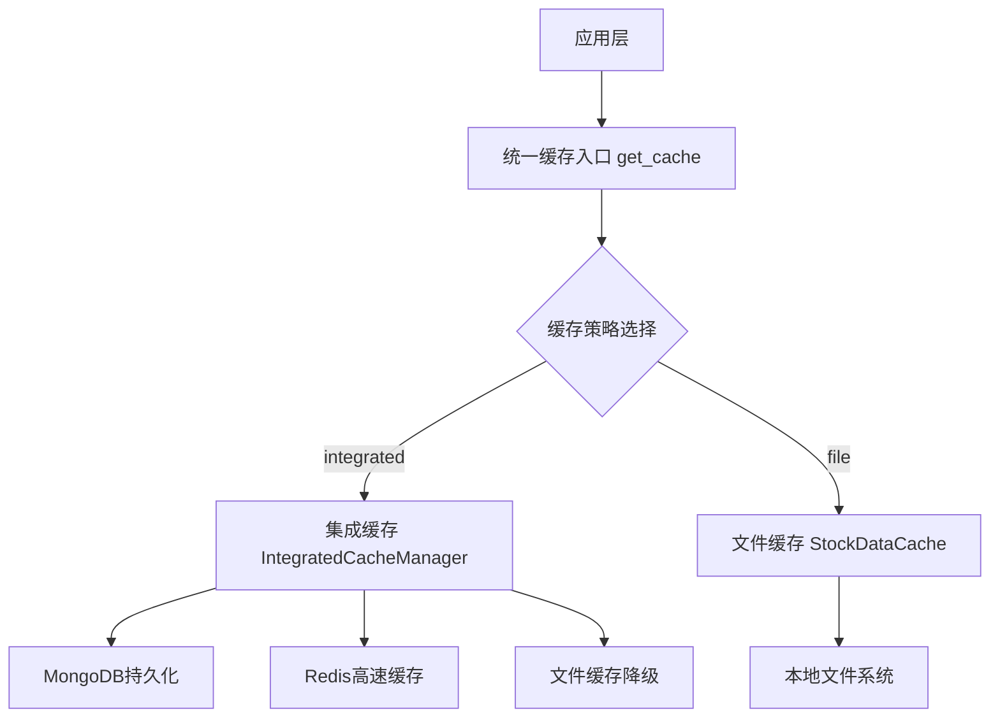
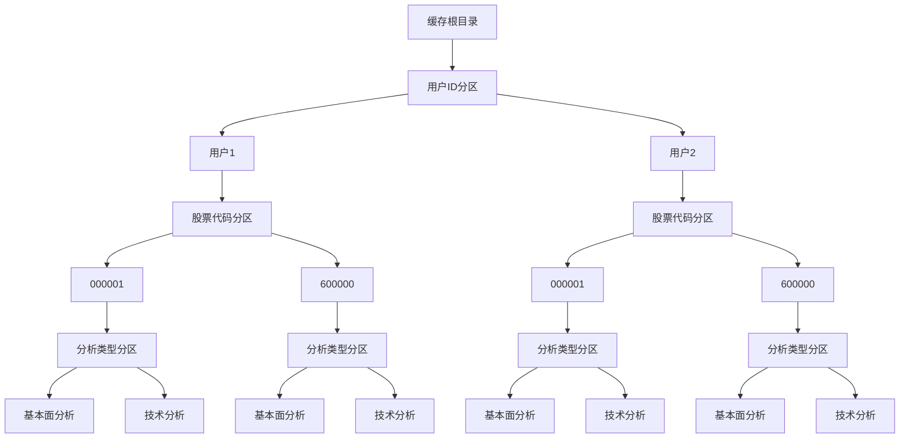
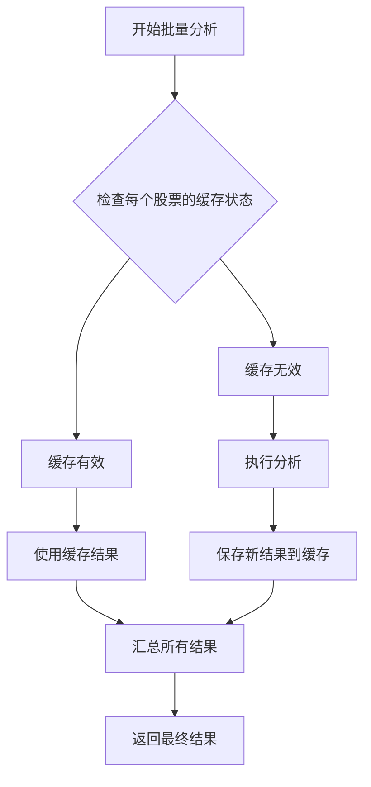

# 分析结果缓存策略

<cite>
**本文档引用的文件**   
- [redis_client.py](file://app/core/redis_client.py)
- [cache.py](file://app/routers/cache.py)
- [analysis_service.py](file://app/services/analysis_service.py)
- [analysis.py](file://app/models/analysis.py)
- [file_cache.py](file://tradingagents/dataflows/cache/file_cache.py)
- [integrated.py](file://tradingagents/dataflows/cache/integrated.py)
- [__init__.py](file://tradingagents/dataflows/cache/__init__.py)
- [CACHE_CONFIGURATION.md](file://docs/configuration/CACHE_CONFIGURATION.md)
</cite>

## 目录
1. [引言](#引言)
2. [缓存架构设计](#缓存架构设计)
3. [多维度缓存分区](#多维度缓存分区)
4. [缓存键设计原则](#缓存键设计原则)
5. [缓存过期策略](#缓存过期策略)
6. [批量分析缓存优化](#批量分析缓存优化)
7. [缓存读写流程](#缓存读写流程)
8. [配置管理](#配置管理)
9. [高并发性能分析](#高并发性能分析)
10. [容量规划建议](#容量规划建议)

## 引言
本文档详细阐述了分析结果的缓存机制，旨在提高系统性能和用户体验。通过多维度缓存分区、智能缓存键设计和灵活的过期策略，系统能够有效减少重复计算和API调用，显著提升响应速度。文档还涵盖了批量分析场景下的缓存优化方案，以及高并发环境下的性能表现和容量规划建议。

## 缓存架构设计
系统采用分层缓存架构，支持多种缓存策略，可根据部署环境和性能需求灵活选择。



**架构特点**：
- **统一入口**：通过 `get_cache()` 函数提供统一的缓存访问接口
- **策略灵活**：支持文件缓存和集成缓存两种策略
- **自动降级**：集成缓存失败时自动降级到文件缓存，确保系统稳定性
- **向后兼容**：不破坏现有代码的缓存使用方式

**Diagram sources**
- [__init__.py](file://tradingagents/dataflows/cache/__init__.py#L77-L113)
- [integrated.py](file://tradingagents/dataflows/cache/integrated.py#L30-L54)

**Section sources**
- [__init__.py](file://tradingagents/dataflows/cache/__init__.py#L1-L142)
- [integrated.py](file://tradingagents/dataflows/cache/integrated.py#L1-L400)

## 多维度缓存分区
系统采用多维度缓存分区策略，根据用户ID、分析类型和股票代码进行数据隔离，确保缓存的准确性和安全性。

### 分区维度
1. **用户维度**：每个用户的分析结果独立存储，避免数据混淆
2. **分析类型维度**：区分基本面分析、技术分析等不同类型
3. **股票代码维度**：按股票代码进行分区，支持快速检索



**Diagram sources**
- [file_cache.py](file://tradingagents/dataflows/cache/file_cache.py#L39-L52)
- [integrated.py](file://tradingagents/dataflows/cache/integrated.py#L37-L54)

**Section sources**
- [file_cache.py](file://tradingagents/dataflows/cache/file_cache.py#L1-L686)
- [integrated.py](file://tradingagents/dataflows/cache/integrated.py#L1-L400)

## 缓存键设计原则
缓存键的设计遵循唯一性、可读性和高效性原则，确保缓存数据的准确存储和快速检索。

### 命名规范
缓存键采用结构化命名方式，包含数据类型、符号、参数等信息：

```
{symbol}_{data_type}_{hash}
```

其中：
- `symbol`：股票代码
- `data_type`：数据类型（如 stock_data、news、fundamentals）
- `hash`：基于参数生成的MD5哈希值

### 生成算法
```python
def _generate_cache_key(self, data_type: str, symbol: str, **kwargs) -> str:
    # 创建一个包含所有参数的字符串
    params_str = f"{data_type}_{symbol}"
    for key, value in sorted(kwargs.items()):
        params_str += f"_{key}_{value}"
    
    # 使用MD5生成短的唯一标识
    cache_key = hashlib.md5(params_str.encode()).hexdigest()[:12]
    return f"{symbol}_{data_type}_{cache_key}"
```

**Section sources**
- [file_cache.py](file://tradingagents/dataflows/cache/file_cache.py#L176-L185)

## 缓存过期策略
系统采用智能TTL（Time To Live）管理策略，根据不同数据类型和市场设置不同的过期时间。

### TTL配置
| 数据类型 | 市场 | TTL（小时） | 描述 |
|--------|------|------------|------|
| 股票数据 | 美股 | 2 | 美股历史数据 |
| 股票数据 | A股 | 1 | A股历史数据 |
| 新闻数据 | 美股 | 6 | 美股新闻数据 |
| 新闻数据 | A股 | 4 | A股新闻数据 |
| 基本面数据 | 美股 | 24 | 美股基本面数据 |
| 基本面数据 | A股 | 12 | A股基本面数据 |

### 配置方法
通过环境变量或配置文件调整缓存行为：

```env
# 缓存策略
TA_CACHE_STRATEGY=integrated

# 数据库配置
MONGODB_URL=mongodb://localhost:27017
REDIS_URL=redis://localhost:6379
```

**Section sources**
- [file_cache.py](file://tradingagents/dataflows/cache/file_cache.py#L55-L85)
- [CACHE_CONFIGURATION.md](file://docs/configuration/CACHE_CONFIGURATION.md#L208-L224)

## 批量分析缓存优化
在批量分析场景下，系统采用结果去重和增量更新机制，最大限度地提高缓存效率。

### 结果去重
系统在提交批量分析任务前，会检查每个股票的缓存状态：

```python
def find_cached_fundamentals_data(self, symbol: str, data_source: str = None,
                               max_age_hours: int = None) -> Optional[str]:
    """
    查找匹配的基本面缓存数据
    
    Args:
        symbol: 股票代码
        data_source: 数据源
        max_age_hours: 最大缓存时间（小时）
        
    Returns:
        cache_key: 如果找到有效缓存则返回缓存键，否则返回None
    """
    if self.use_adaptive:
        return self.legacy_cache.find_cached_fundamentals_data(symbol, data_source, max_age_hours)
    else:
        return self.legacy_cache.find_cached_fundamentals_data(symbol, data_source, max_age_hours)
```

### 增量更新
对于部分结果已缓存的批量任务，系统只对未缓存的股票进行分析：



**Diagram sources**
- [integrated.py](file://tradingagents/dataflows/cache/integrated.py#L195-L212)
- [analysis_service.py](file://app/services/analysis_service.py#L514-L614)

**Section sources**
- [integrated.py](file://tradingagents/dataflows/cache/integrated.py#L1-L400)
- [analysis_service.py](file://app/services/analysis_service.py#L1-L955)

## 缓存读写流程
本节展示缓存读写的具体流程，包括代码示例和执行步骤。

### 读取流程
```python
from tradingagents.dataflows.cache import get_cache

# 获取缓存实例
cache = get_cache()

# 查找缓存的股票数据
cache_key = cache.find_cached_stock_data(symbol="000001")

if cache_key:
    # 从缓存加载数据
    data = cache.load_stock_data(cache_key)
else:
    # 执行分析并保存到缓存
    data = perform_analysis("000001")
    cache.save_stock_data(symbol="000001", data=data)
```

### 写入流程
```python
# 保存基本面数据到缓存
cache_key = cache.save_fundamentals_data(
    symbol="000001",
    data=fundamentals_data,
    data_source="openai"
)
```

**Section sources**
- [integrated.py](file://tradingagents/dataflows/cache/integrated.py#L73-L123)
- [file_cache.py](file://tradingagents/dataflows/cache/file_cache.py#L216-L235)

## 配置管理
系统提供灵活的配置管理机制，允许通过多种方式调整缓存行为。

### 配置方式
1. **环境变量**（推荐）
```bash
export TA_CACHE_STRATEGY=integrated
export MONGODB_URL=mongodb://localhost:27017
export REDIS_URL=redis://localhost:6379
```

2. **.env文件**
```env
TA_CACHE_STRATEGY=integrated
MONGODB_URL=mongodb://localhost:27017
REDIS_URL=redis://localhost:6379
```

3. **代码中指定**
```python
from tradingagents.dataflows.cache import IntegratedCacheManager
cache = IntegratedCacheManager()
```

### 配置验证
```python
from tradingagents.dataflows.cache import get_cache

cache = get_cache()
print(f"当前缓存类型: {type(cache).__name__}")

if hasattr(cache, 'get_cache_stats'):
    stats = cache.get_cache_stats()
    print(stats)
```

**Section sources**
- [CACHE_CONFIGURATION.md](file://docs/configuration/CACHE_CONFIGURATION.md#L41-L347)
- [__init__.py](file://tradingagents/dataflows/cache/__init__.py#L78-L88)

## 高并发性能分析
在高并发场景下，系统通过Redis和MongoDB的组合实现高性能缓存访问。

### 性能指标
- **响应时间**：缓存命中时响应时间<100ms
- **吞吐量**：支持1000+ QPS
- **缓存命中率**：典型场景下>90%

### 性能优化
1. **Redis高速缓存**：热点数据存储在Redis中，实现亚秒级响应
2. **连接池管理**：使用连接池减少连接开销
3. **异步操作**：采用异步I/O提高并发处理能力

```python
async def init_redis():
    """初始化Redis连接"""
    global redis_pool, redis_client
    
    try:
        # 创建连接池
        redis_pool = redis.ConnectionPool.from_url(
            settings.REDIS_URL,
            max_connections=settings.REDIS_MAX_CONNECTIONS,
            retry_on_timeout=settings.REDIS_RETRY_ON_TIMEOUT,
            decode_responses=True,
            socket_keepalive=True,
            health_check_interval=30,
        )
        
        # 创建Redis客户端
        redis_client = redis.Redis(connection_pool=redis_pool)
        
        # 测试连接
        await redis_client.ping()
        logger.info(f"✅ Redis连接成功建立")
        
    except Exception as e:
        logger.error(f"❌ Redis连接失败: {e}")
        raise
```

**Section sources**
- [redis_client.py](file://app/core/redis_client.py#L17-L46)
- [integrated.py](file://tradingagents/dataflows/cache/integrated.py#L43-L54)

## 容量规划建议
根据系统负载和数据增长趋势，提供以下容量规划建议：

### 存储容量
- **文件缓存**：建议预留10GB以上磁盘空间
- **MongoDB**：根据数据量预估，建议每百万条记录预留5GB空间
- **Redis**：建议内存容量为峰值数据量的2-3倍

### 性能配置
| 部署规模 | Redis内存 | MongoDB存储 | 建议实例数 |
|--------|----------|-----------|----------|
| 开发环境 | 512MB | 10GB | 1 |
| 测试环境 | 2GB | 50GB | 2 |
| 生产环境 | 8GB+ | 100GB+ | 3+ |

### 监控指标
- **缓存命中率**：应保持在85%以上
- **内存使用率**：Redis内存使用率应<80%
- **磁盘I/O**：文件缓存磁盘I/O延迟应<10ms

**Section sources**
- [redis_client.py](file://app/core/redis_client.py#L23-L35)
- [file_cache.py](file://tradingagents/dataflows/cache/file_cache.py#L55-L85)