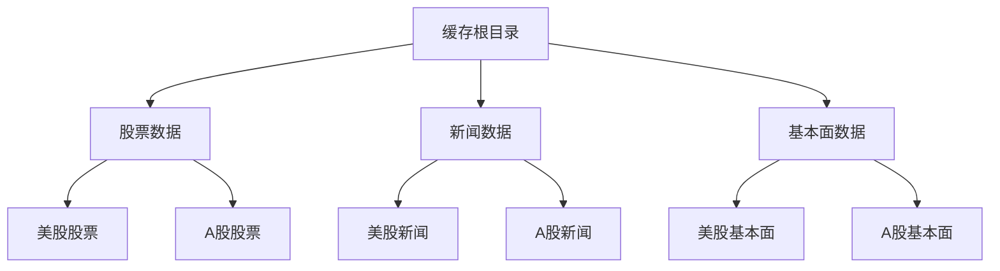
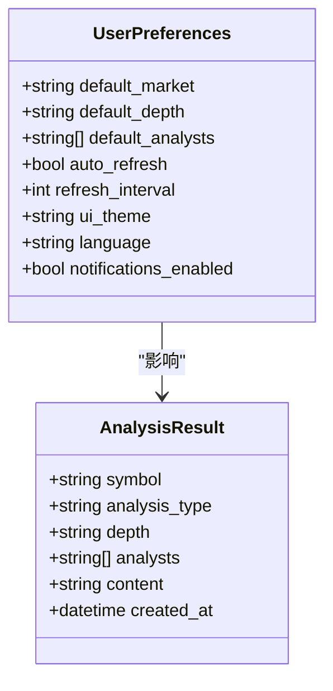
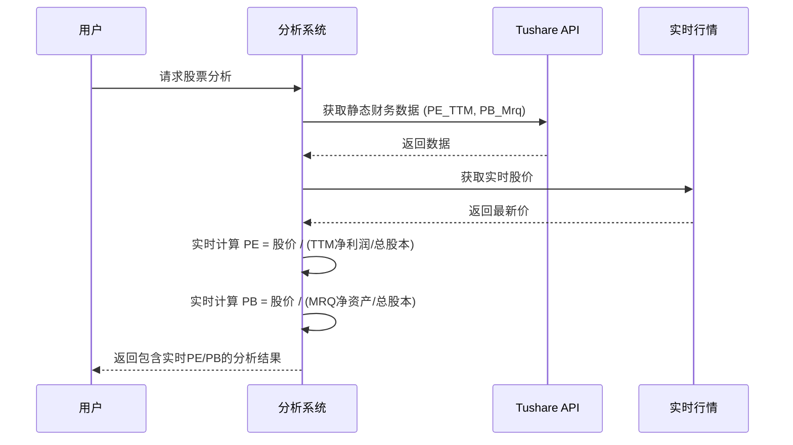
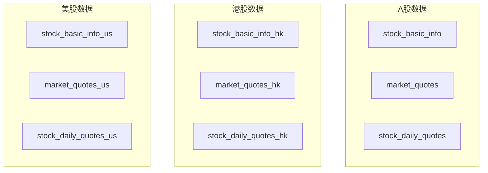
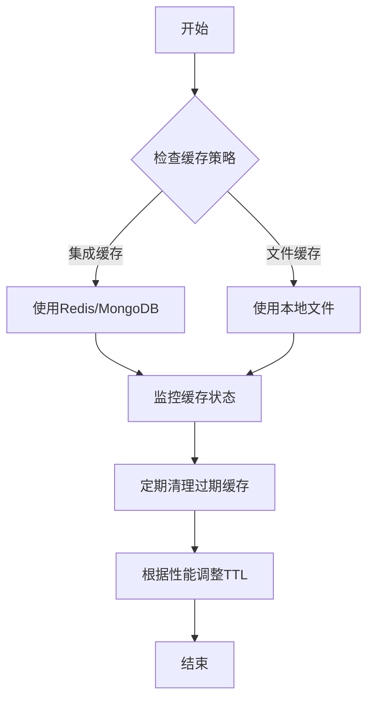

# 缓存分区策略

<cite>
**本文档引用的文件**   
- [file_cache.py](file://tradingagents/dataflows/cache/file_cache.py)
- [integrated.py](file://tradingagents/dataflows/cache/integrated.py)
- [adaptive.py](file://tradingagents/dataflows/cache/adaptive.py)
- [CACHE_SYSTEM_SOLUTION.md](file://docs/architecture/cache/CACHE_SYSTEM_SOLUTION.md)
- [CACHE_CONFIGURATION.md](file://docs/configuration/CACHE_CONFIGURATION.md)
- [2025-11-08-multi-market-implementation-plan.md](file://docs/tech_reviews/2025-11-08-multi-market-implementation-plan.md)
- [2025-10-21-multi-market-data-architecture-guide.md](file://docs/tech_reviews/2025-10-21-multi-market-data-architecture-guide.md)
- [pe-pb-data-update-analysis.md](file://docs/analysis/pe-pb-data-update-analysis.md)
- [realtime_metrics.py](file://tradingagents/dataflows/realtime_metrics.py)
- [cache.py](file://app/routers/cache.py)
</cite>

## 目录
1. [引言](#引言)
2. [缓存分区策略](#缓存分区策略)
3. [分析结果缓存配置](#分析结果缓存配置)
4. [股票基础数据与实时行情缓存](#股票基础数据与实时行情缓存)
5. [财务数据特殊缓存处理](#财务数据特殊缓存处理)
6. [多市场数据隔离存储与优先级](#多市场数据隔离存储与优先级)
7. [缓存分区性能影响与最佳实践](#缓存分区性能影响与最佳实践)
8. [结论](#结论)

## 引言

本缓存分区策略文档旨在系统阐述针对不同类型数据的缓存分区方法。随着系统支持多市场（A股、港股、美股）和多数据源，缓存系统需要更精细的分区策略来提高性能、确保数据隔离和优化资源利用。本文档详细说明了分析结果缓存的配置，包括按用户、分析类型和股票代码进行分区的策略；描述了股票基础数据和实时行情数据的缓存配置，以及财务数据（如PE/PB）的特殊缓存处理；解释了多市场数据的隔离存储机制和优先级配置；并提供了缓存分区的性能影响分析和最佳实践建议，帮助用户根据实际使用场景优化缓存配置。

**Section sources**
- [CACHE_SYSTEM_SOLUTION.md](file://docs/architecture/cache/CACHE_SYSTEM_SOLUTION.md#L1-L310)
- [CACHE_CONFIGURATION.md](file://docs/configuration/CACHE_CONFIGURATION.md#L1-L347)

## 缓存分区策略

系统的缓存分区策略基于数据类型、市场类型和数据源进行多维度划分，确保数据的高效存储和快速检索。

### 基于数据类型的分区

缓存系统根据数据类型将数据存储在不同的子目录中，实现逻辑上的分区。主要数据类型包括：
- **股票数据**：存储历史K线、日线等数据。
- **新闻数据**：存储与股票相关的新闻资讯。
- **基本面数据**：存储财务指标、公司信息等分析结果。



**Diagram sources**
- [file_cache.py](file://tradingagents/dataflows/cache/file_cache.py#L39-L52)

### 基于市场类型的分区

系统通过 `_determine_market_type` 方法自动识别股票代码的市场类型，并据此进行分区存储。该方法通过正则表达式判断股票代码是否为6位数字来区分A股和美股。

```python
def _determine_market_type(self, symbol: str) -> str:
    """根据股票代码确定市场类型"""
    import re
    # 判断是否为中国A股（6位数字）
    if re.match(r'^\d{6}$', str(symbol)):
        return 'china'
    else:
        return 'us'
```

这种分区策略确保了不同市场的数据在物理上隔离，避免了数据混淆，并为不同市场的数据设置了不同的缓存策略（TTL）。

**Section sources**
- [file_cache.py](file://tradingagents/dataflows/cache/file_cache.py#L100-L108)

### 基于数据源的分区

系统支持多数据源（如Tushare、AKShare、yfinance等），并允许同一股票从不同数据源获取数据。缓存系统通过在缓存键中包含 `data_source` 参数来实现数据源的分区。

```python
def _generate_cache_key(self, data_type: str, symbol: str, **kwargs) -> str:
    """生成缓存键"""
    params_str = f"{data_type}_{symbol}"
    for key, value in sorted(kwargs.items()):
        params_str += f"_{key}_{value}"
    cache_key = hashlib.md5(params_str.encode()).hexdigest()[:12]
    return f"{symbol}_{data_type}_{cache_key}"
```

**Section sources**
- [file_cache.py](file://tradingagents/dataflows/cache/file_cache.py#L176-L185)

## 分析结果缓存配置

分析结果缓存是系统性能优化的关键，通过缓存复杂的分析结果，避免重复计算，显著提升响应速度。

### 按用户分区

虽然当前缓存系统未直接按用户分区，但用户可以通过其分析偏好和设置间接影响缓存内容。用户的分析深度、默认分析师等偏好设置会影响生成的分析结果，从而影响缓存内容。



**Diagram sources**
- [user.py](file://app/models/user.py#L177-L192)
- [analysis.py](file://app/models/analysis.py)

### 按分析类型分区

分析结果根据分析类型（如市场分析、基本面分析、新闻分析）进行分区存储。缓存系统通过 `data_type` 参数来区分不同类型的分析结果。

```python
def save_fundamentals_data(self, symbol: str, fundamentals_data: str, data_source: str = "unknown") -> str:
    """保存基本面数据到缓存"""
    cache_key = self._generate_cache_key("fundamentals", symbol, source=data_source, market=market_type)
    # ... 保存逻辑
```

**Section sources**
- [file_cache.py](file://tradingagents/dataflows/cache/file_cache.py#L453-L492)

### 按股票代码分区

所有缓存数据都以股票代码作为核心分区键。无论是股票数据、新闻数据还是分析结果，股票代码都是生成缓存键的必要参数，确保了数据的唯一性和可检索性。

**Section sources**
- [file_cache.py](file://tradingagents/dataflows/cache/file_cache.py#L176-L185)

## 股票基础数据与实时行情缓存

股票基础数据和实时行情数据是系统的核心数据，其缓存配置直接影响用户体验。

### 基础数据缓存

基础数据（如公司名称、行业、上市日期等）存储在MongoDB的特定集合中，如 `stock_basic_info`（A股）、`stock_basic_info_hk`（港股）、`stock_basic_info_us`（美股）。这些数据的更新频率较低，通常为每日一次。

```javascript
// A股基础信息集合
db.stock_basic_info.createIndex({ "code": 1, "source": 1 }, { unique: true })
```

**Section sources**
- [2025-11-08-multi-market-implementation-plan.md](file://docs/tech_reviews/2025-11-08-multi-market-implementation-plan.md#L1166-L1168)

### 实时行情缓存

实时行情数据（如最新价、涨跌幅、成交量）存储在 `market_quotes` 系列集合中。为了保证实时性，这些数据的同步频率较高，通常为30秒一次。

```javascript
// A股实时行情
db.market_quotes.createIndex({ "code": 1 })
// 港股实时行情
db.market_quotes_hk.createIndex({ "code": 1 })
// 美股实时行情
db.market_quotes_us.createIndex({ "code": 1 })
```

**Section sources**
- [2025-11-08-multi-market-implementation-plan.md](file://docs/tech_reviews/2025-11-08-multi-market-implementation-plan.md#L484-L514)

## 财务数据特殊缓存处理

财务数据（如PE、PB）的缓存处理具有特殊性，需要结合实时股价进行计算，以提供更准确的估值指标。

### PE/PB实时计算

系统不再直接使用静态的PE/PB数据，而是采用实时计算策略。当用户请求分析时，系统会获取最新的股价，并结合Tushare提供的静态财务数据（如TTM净利润、MRQ净资产）来动态计算实时的PE/PB值。



**Diagram sources**
- [realtime_metrics.py](file://tradingagents/dataflows/realtime_metrics.py#L410-L438)
- [pe-pb-data-update-analysis.md](file://docs/analysis/pe-pb-data-update-analysis.md#L125-L136)

### 缓存策略

计算出的实时PE/PB结果会被缓存，但其TTL（生存时间）较短，以确保数据的时效性。同时，系统会保留静态财务数据的缓存，作为计算的基础。

**Section sources**
- [pe-pb-data-update-analysis.md](file://docs/analysis/pe-pb-data-update-analysis.md#L140-L144)

## 多市场数据隔离存储与优先级

系统通过严格的隔离存储和优先级配置来管理多市场数据。

### 隔离存储机制

不同市场的数据存储在独立的MongoDB集合中，实现了物理隔离。



**Diagram sources**
- [2025-10-21-multi-market-data-architecture-guide.md](file://docs/tech_reviews/2025-10-21-multi-market-data-architecture-guide.md#L120-L137)

### 优先级配置

系统在数据库中配置了数据源的优先级，查询时会自动选择最优数据源。

```javascript
// 港股数据源优先级
{
  "data_source_name": "yfinance_hk",
  "market_category_id": "hk_stocks",
  "priority": 100,
  "enabled": true
},
{
  "data_source_name": "akshare_hk",
  "market_category_id": "hk_stocks",
  "priority": 80,
  "enabled": true
}
```

**Section sources**
- [2025-11-08-multi-market-implementation-plan.md](file://docs/tech_reviews/2025-11-08-multi-market-implementation-plan.md#L740-L756)

## 缓存分区性能影响与最佳实践

合理的缓存分区策略对系统性能有显著影响。

### 性能影响分析

- **正面影响**：
  - **提高查询速度**：分区后，查询范围缩小，检索速度更快。
  - **降低数据库压力**：热点数据被缓存，减少了对后端数据库的直接访问。
  - **优化资源利用**：可以根据不同数据类型的访问频率和重要性，配置不同的TTL和存储策略。

- **潜在影响**：
  - **增加管理复杂度**：需要维护多个分区和策略。
  - **缓存命中率**：如果分区过细，可能导致缓存碎片化，降低整体命中率。

### 最佳实践建议

1. **选择合适的缓存策略**：在生产环境中，推荐使用集成缓存（Integrated Cache），它结合了Redis、MongoDB和文件缓存的优势，提供高性能和高可用性。
2. **合理配置TTL**：根据数据的实时性要求设置TTL。例如，实时行情数据TTL较短（30秒-5分钟），而基础信息数据TTL较长（24小时）。
3. **监控缓存状态**：利用 `/api/cache/stats` 和 `/api/cache/backend-info` 等API监控缓存的使用情况和后端状态。
4. **定期清理过期缓存**：使用 `/api/cache/cleanup` 定期清理过期缓存，释放存储空间。
5. **利用环境变量配置**：通过 `TA_CACHE_STRATEGY` 环境变量灵活切换缓存策略，无需修改代码。



**Diagram sources**
- [CACHE_CONFIGURATION.md](file://docs/configuration/CACHE_CONFIGURATION.md#L211-L224)
- [cache.py](file://app/routers/cache.py)

## 结论

本文档系统地阐述了系统的缓存分区策略。通过基于数据类型、市场类型和数据源的多维度分区，系统实现了高效、安全的数据管理。分析结果缓存、股票数据缓存和财务数据的特殊处理共同构成了一个健壮的缓存体系。多市场的隔离存储和优先级配置确保了数据的准确性和可靠性。遵循本文档的最佳实践，用户可以根据实际需求优化缓存配置，充分发挥缓存系统在提升系统性能和用户体验方面的巨大潜力。