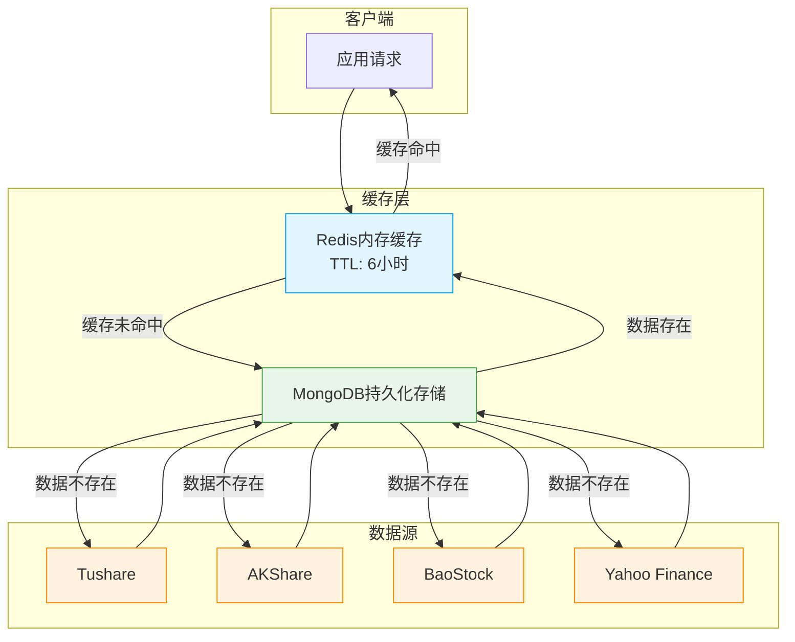
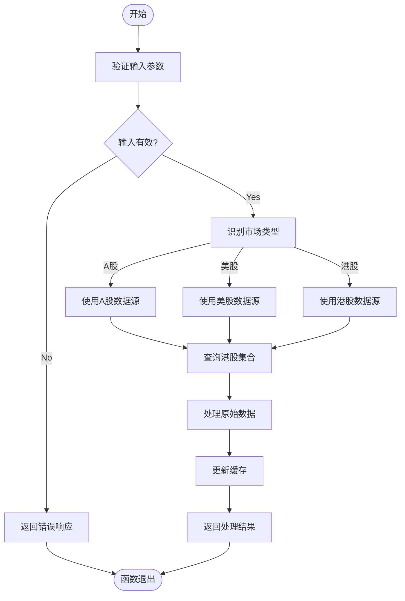
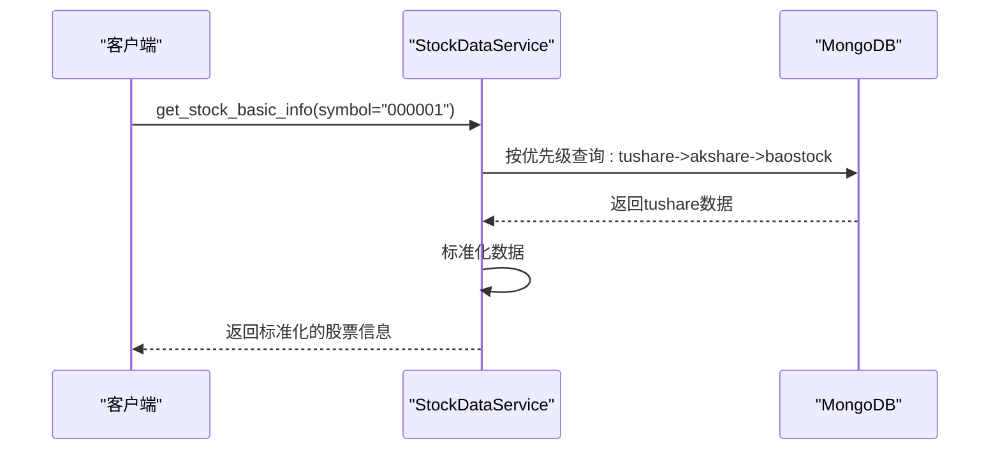
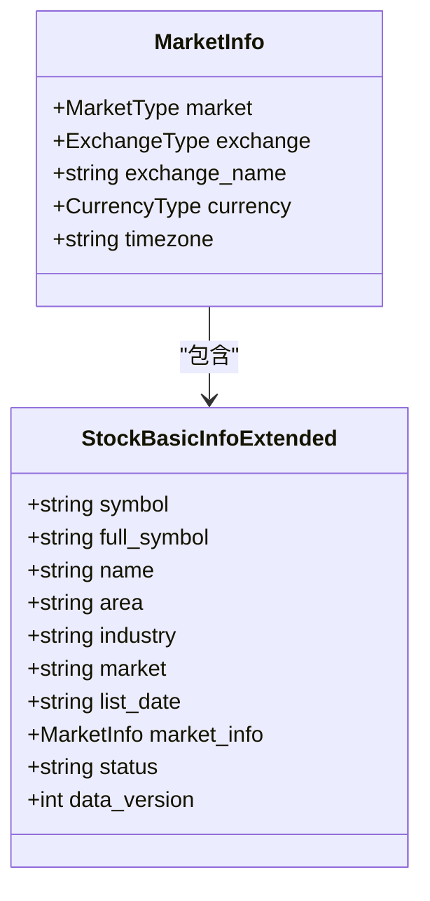
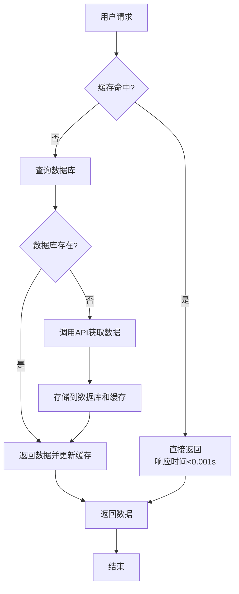

# 股票数据缓存策略

<cite>
**本文档引用的文件**   
- [redis_client.py](file://app/core/redis_client.py)
- [cache.py](file://app/routers/cache.py)
- [quotes_service.py](file://app/services/quotes_service.py)
- [stock_data_service.py](file://app/services/stock_data_service.py)
- [unified_config.py](file://app/core/unified_config.py)
- [stock_models.py](file://app/models/stock_models.py)
- [db_cache.py](file://tradingagents/dataflows/cache/db_cache.py)
- [file_cache.py](file://tradingagents/dataflows/cache/file_cache.py)
- [mongodb_cache_adapter.py](file://tradingagents/dataflows/cache/mongodb_cache_adapter.py)
</cite>

## 目录
1. [引言](#引言)
2. [缓存架构设计](#缓存架构设计)
3. [多市场数据隔离存储](#多市场数据隔离存储)
4. [数据源优先级与一致性](#数据源优先级与一致性)
5. [实时行情缓存策略](#实时行情缓存策略)
6. [基础信息长期缓存管理](#基础信息长期缓存管理)
7. [缓存更新与失效机制](#缓存更新与失效机制)
8. [性能监控与优化建议](#性能监控与优化建议)
9. [缓存管理API](#缓存管理api)
10. [结论](#结论)

## 引言

本文档详细阐述了股票数据缓存系统的整体策略，旨在为用户提供一个高效、可靠的数据访问机制。系统通过多层次的缓存架构，有效减少了对上游数据源API的直接调用，显著提升了数据获取的响应速度和系统整体性能。缓存策略覆盖了A股、港股、美股等多个市场，针对不同数据类型（如实时行情、基础信息、财务数据）设计了差异化的存储和更新方案。通过Redis和MongoDB的结合使用，实现了高性能的读取速度与数据的持久化保障。

**Section sources**
- [redis_client.py](file://app/core/redis_client.py#L1-L203)
- [db_cache.py](file://tradingagents/dataflows/cache/db_cache.py#L1-L578)

## 缓存架构设计

系统采用分层缓存架构，结合了内存缓存（Redis）和持久化存储（MongoDB）的优势，形成了一套高性能、高可用的数据缓存解决方案。



**Diagram sources **
- [db_cache.py](file://tradingagents/dataflows/cache/db_cache.py#L1-L578)
- [redis_client.py](file://app/core/redis_client.py#L1-L203)

**Section sources**
- [db_cache.py](file://tradingagents/dataflows/cache/db_cache.py#L1-L578)
- [file_cache.py](file://tradingagents/dataflows/cache/file_cache.py#L1-L686)

## 多市场数据隔离存储

为支持A股、港股、美股等不同市场的数据，系统采用了分市场存储的策略。这种设计不仅提高了查询性能，也便于针对不同市场的特性进行优化。

### 集合命名规范

系统通过在MongoDB集合名称后添加市场后缀来实现数据隔离，具体规范如下：

| 市场 | 后缀 | 示例集合 |
| :--- | :--- | :--- |
| A股 | 无后缀 | `stock_basic_info` |
| 港股 | `_hk` | `stock_basic_info_hk` |
| 美股 | `_us` | `stock_basic_info_us` |

此设计确保了现有A股数据的兼容性，同时为新市场的扩展提供了清晰的结构。

### 市场类型自动识别

系统能够根据股票代码的格式自动识别其所属市场：
- **A股**：6位纯数字代码（如`000001`）
- **美股**：字母代码（如`AAPL`）
- **港股**：根据特定规则识别



**Diagram sources **
- [file_cache.py](file://tradingagents/dataflows/cache/file_cache.py#L100-L109)
- [mongodb_cache_adapter.py](file://tradingagents/dataflows/cache/mongodb_cache_adapter.py#L91-L104)

**Section sources**
- [file_cache.py](file://tradingagents/dataflows/cache/file_cache.py#L1-L686)
- [mongodb_cache_adapter.py](file://tradingagents/dataflows/cache/mongodb_cache_adapter.py#L1-L424)

## 数据源优先级与一致性

系统支持Tushare、AkShare、BaoStock等多个数据源，并通过优先级配置确保数据的一致性和高质量。

### 数据源优先级配置

当查询股票数据时，系统会按照预设的优先级顺序依次尝试获取数据。默认优先级顺序为：`Tushare > AkShare > BaoStock`。

```python
source_priority = ["tushare", "multi_source", "akshare", "baostock"]
```

此优先级配置可以在数据库的`system_configs`集合中进行动态修改，无需重启服务。

### 缓存一致性保障

为确保多数据源场景下的缓存一致性，系统采用了以下措施：
1. **联合唯一索引**：在MongoDB中，使用`(code, source)`作为联合唯一索引，确保同一股票在不同数据源下的数据记录是独立且可区分的。
2. **统一查询接口**：通过`MongoDBCacheAdapter`提供统一的查询接口，该接口会自动按照优先级顺序查询数据源，返回最优数据。
3. **数据标准化**：所有从不同数据源获取的数据在存储前都会经过标准化处理，确保字段名称和数据格式的一致性。



**Diagram sources **
- [stock_data_service.py](file://app/services/stock_data_service.py#L59-L69)
- [unified_config.py](file://app/core/unified_config.py#L259-L325)
- [mongodb_cache_adapter.py](file://tradingagents/dataflows/cache/mongodb_cache_adapter.py#L57-L66)

**Section sources**
- [stock_data_service.py](file://app/services/stock_data_service.py#L1-L403)
- [unified_config.py](file://app/core/unified_config.py#L1-L501)
- [mongodb_cache_adapter.py](file://tradingagents/dataflows/cache/mongodb_cache_adapter.py#L1-L424)

## 实时行情缓存策略

实时行情数据对时效性要求极高，系统为此设计了专门的内存缓存策略。

### 内存TTL缓存

`QuotesService`类负责提供A股的实时快照行情。它使用一个简单的内存字典作为缓存，并设置了30秒的TTL（Time To Live）。

```python
class QuotesService:
    def __init__(self, ttl_seconds: int = 30) -> None:
        self._ttl = ttl_seconds
        self._cache_ts: float = 0.0
        self._cache: Dict[str, Dict[str, Optional[float]]] = {}
        self._lock = asyncio.Lock()
```

当请求到达时，服务会首先检查缓存是否有效（未超时）。如果有效，则直接返回缓存数据；否则，会从AKShare接口获取最新的全市场快照数据并更新缓存。

### 缓存更新频率

实时行情的缓存更新频率由TTL值决定。当前配置为每30秒更新一次全市场数据。这种策略在保证数据新鲜度的同时，也避免了过于频繁的API调用。

**Section sources**
- [quotes_service.py](file://app/services/quotes_service.py#L1-L112)

## 基础信息长期缓存管理

股票基础信息（如公司名称、上市日期、行业等）变化频率较低，适合长期缓存。

### 长期缓存机制

基础信息主要存储在MongoDB中，并通过Redis进行加速。其缓存策略如下：
- **Redis缓存**：TTL设置为6小时，提供快速读取。
- **MongoDB持久化**：作为数据的最终存储，保证数据不丢失。

当用户请求基础信息时，系统会优先从Redis读取。如果Redis中不存在，则从MongoDB读取，并将结果回填到Redis缓存中。

### 数据标准化

系统通过`StockBasicInfoExtended`模型对基础信息进行标准化，确保不同数据源的数据具有统一的结构。例如，无论原始数据源如何，最终都会生成`full_symbol`（如`000001.SZ`）和`market_info`等标准化字段。



**Diagram sources **
- [stock_models.py](file://app/models/stock_models.py#L54-L151)
- [stock_data_service.py](file://app/services/stock_data_service.py#L274-L351)

**Section sources**
- [stock_models.py](file://app/models/stock_models.py#L1-L246)
- [stock_data_service.py](file://app/services/stock_data_service.py#L1-L403)

## 缓存更新与失效机制

系统实现了自动化的缓存更新和失效机制，以确保数据的准确性和存储空间的有效利用。

### 缓存更新

缓存更新主要通过以下两种方式触发：
1. **主动更新**：后台任务（如`multi_source_sync_service`）会定期从上游数据源同步最新数据，并更新数据库和缓存。
2. **被动更新**：当缓存过期后，下一次请求会触发数据的重新获取和缓存更新。

### 缓存失效

系统通过TTL（生存时间）机制自动使缓存失效。不同数据类型的TTL设置如下：
- **美股历史数据**：2小时
- **A股历史数据**：1小时
- **美股新闻**：6小时
- **A股新闻**：4小时
- **美股基本面数据**：24小时
- **A股基本面数据**：12小时

### 缓存清理

系统提供了手动清理过期缓存的功能。`clear_old_cache`方法可以清理指定天数前的缓存文件，帮助用户释放磁盘空间。

```python
def clear_old_cache(self, max_age_days: int = 7):
    """清理过期缓存"""
    cutoff_time = datetime.now() - timedelta(days=max_age_days)
    # ... 删除过期文件
```

**Section sources**
- [file_cache.py](file://tradingagents/dataflows/cache/file_cache.py#L554-L579)
- [db_cache.py](file://tradingagents/dataflows/cache/db_cache.py#L538-L556)

## 性能监控与优化建议

系统内置了完善的性能监控机制，并提供了优化建议。

### 性能监控指标

用户可以通过`/api/cache/stats`接口获取以下缓存统计信息：
- `totalFiles`：缓存文件总数
- `totalSize`：缓存总大小（字节）
- `stockDataCount`：股票数据缓存数量
- `newsDataCount`：新闻数据缓存数量
- `analysisDataCount`：分析数据缓存数量

### 缓存命中率优化建议

1. **调整TTL**：根据网络条件和使用频率，适当调整不同类型数据的TTL。例如，对于网络较慢的用户，可以适当延长TTL以减少API调用。
2. **启用Redis**：如果条件允许，务必启用Redis，它可以将缓存读取性能提升99%以上。
3. **定期清理**：定期执行缓存清理，避免磁盘空间被过期数据占用。



**Diagram sources **
- [redis_client.py](file://app/core/redis_client.py#L1-L203)
- [db_cache.py](file://tradingagents/dataflows/cache/db_cache.py#L1-L578)

**Section sources**
- [cache.py](file://app/routers/cache.py#L1-L212)
- [file_cache.py](file://tradingagents/dataflows/cache/file_cache.py#L580-L657)

## 缓存管理API

系统提供了一套RESTful API用于缓存管理，方便用户进行监控和维护。

### API端点

| 端点 | 方法 | 描述 |
| :--- | :--- | :--- |
| `/api/cache/stats` | GET | 获取缓存统计信息 |
| `/api/cache/details` | GET | 获取缓存详情列表 |
| `/api/cache/cleanup` | DELETE | 清理指定天数前的缓存 |
| `/api/cache/clear` | DELETE | 清空所有缓存 |

### 使用示例

```bash
# 获取缓存统计
curl http://localhost:8000/api/cache/stats

# 清理7天前的缓存
curl -X DELETE "http://localhost:8000/api/cache/cleanup?days=7"
```

**Section sources**
- [cache.py](file://app/routers/cache.py#L1-L212)

## 结论

本文档全面介绍了股票数据缓存系统的策略与实现。系统通过分层缓存架构、多市场数据隔离、智能数据源优先级和自动化更新机制，构建了一个高效、稳定的数据访问平台。用户可以根据实际需求，通过调整配置和使用管理API来优化缓存性能。未来，系统将继续优化缓存策略，以支持更多市场和数据类型，为用户提供更优质的服务。