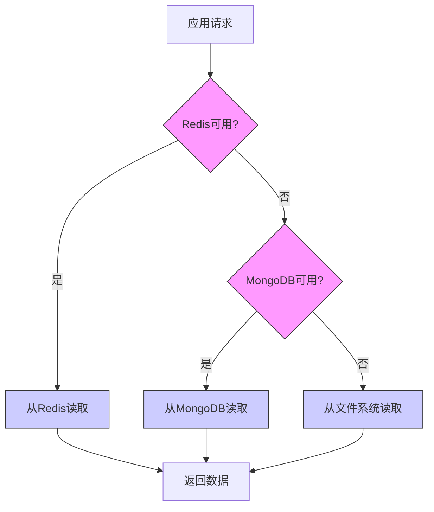

# 财务数据缓存策略

<cite>
**本文档引用文件**   
- [financial_data.py](file://app/routers/financial_data.py)
- [financial_data_service.py](file://app/services/financial_data_service.py)
- [financial_data_sync_service.py](file://app/worker/financial_data_sync_service.py)
- [realtime_metrics.py](file://tradingagents/dataflows/realtime_metrics.py)
- [file_cache.py](file://tradingagents/dataflows/cache/file_cache.py)
- [CACHE_CONFIGURATION.md](file://docs/configuration/CACHE_CONFIGURATION.md)
- [realtime-pe-pb-implementation.md](file://docs/changes/realtime-pe-pb-implementation.md)
- [2025-10-28-multi-source-architecture-and-realtime-enhancements.md](file://docs/blog/2025-10-28-multi-source-architecture-and-realtime-enhancements.md)
- [2025-10-28-realtime-pe-pb-calculation-with-fallback-strategy.md](file://docs/blog/2025-10-28-realtime-pe-pb-calculation-with-fallback-strategy.md)
- [multi_period_historical_data/README.md](file://docs/guides/multi_period_historical_data/README.md)
- [financial_data_system/README.md](file://docs/guides/financial_data_system/README.md)
</cite>

## 目录
1. [引言](#引言)
2. [PE/PB等估值指标的特殊缓存处理机制](#pepb等估值指标的特殊缓存处理机制)
3. [财务数据缓存的时效性要求和更新触发条件](#财务数据缓存的时效性要求和更新触发条件)
4. [数据源不可用时的缓存降级和容错策略](#数据源不可用时的缓存降级和容错策略)
5. [历史财务数据的版本管理方案](#历史财务数据的版本管理方案)
6. [多周期财务数据的缓存组织结构](#多周期财务数据的缓存组织结构)
7. [跨市场财务数据的统一查询接口实现](#跨市场财务数据的统一查询接口实现)
8. [缓存空间占用评估和清理策略](#缓存空间占用评估和清理策略)
9. [结论](#结论)

## 引言

本文档旨在深入阐述系统中财务数据缓存的完整策略。随着系统对数据实时性和准确性的要求不断提高，传统的静态缓存模式已无法满足需求。为此，系统设计并实现了一套混合式、多层次的缓存架构，特别针对PE（市盈率）、PB（市净率）等关键估值指标，引入了实时计算与智能降级相结合的创新机制。该策略不仅确保了在数据源波动或不可用时系统的高可用性，还通过精细化的TTL（生存时间）管理和多周期数据组织，实现了性能与稳定性的最佳平衡。本文将从核心机制、更新策略、容错方案、数据组织和空间管理等多个维度，全面解析这一复杂的缓存体系。

## PE/PB等估值指标的特殊缓存处理机制

针对PE、PB等对股价变动极为敏感的估值指标，系统摒弃了传统的“静态缓存”模式，转而采用“实时计算+降级缓存”的混合策略。这一机制的核心在于将估值计算从“数据获取”环节解耦，使其能够基于最新的市场行情动态生成。

### 实时计算与降级策略

系统通过`tradingagents/dataflows/realtime_metrics.py`模块实现了`get_pe_pb_with_fallback`函数，该函数执行一个三层的智能降级策略，确保在任何情况下都能返回有效的估值数据：

1.  **第一层：实时计算（最高优先级）**
    *   **机制**：优先从`market_quotes`集合（每30秒更新一次）获取股票的实时股价。
    *   **计算**：结合`stock_basic_info`集合中Tushare提供的`pe_ttm`（滚动市盈率）和`total_mv`（总市值），通过反推公式计算出TTM净利润。然后，利用实时股价重新计算出动态的PE_TTM和PB。
    *   **优势**：数据时效性极高，从“每日”提升到“秒级”，能真实反映股价波动对估值的影响。
    *   **优化**：系统会智能判断`stock_basic_info`的更新时间。如果其更新时间在当日收盘后（15:00之后），则直接使用其数据，避免不必要的重复计算。

2.  **第二层：数据库缓存值（降级）**
    *   **机制**：当实时计算因数据缺失（如缺少实时行情或Tushare数据）而失败时，系统会查询`stock_basic_info`集合中已缓存的静态PE/PB值。
    *   **数据源**：这些值通常来自Tushare、AKShare或BaoStock等数据源的每日同步，基于前一个交易日的收盘价计算得出。
    *   **特点**：虽然时效性不如实时计算，但数据稳定可靠，作为实时计算的有效补充。

3.  **第三层：历史数据（最终降级）**
    *   **机制**：如果前两层均失败，系统会尝试从`stock_financial_data`集合中查询历史财务数据，并基于历史股价进行计算。
    *   **场景**：此层主要用于极端情况，确保系统不会因数据问题而完全失效。

```mermaid
sequenceDiagram
participant Client as "客户端"
participant Service as "估值服务"
participant Quotes as "market_quotes"
participant BasicInfo as "stock_basic_info"
participant FinancialData as "stock_financial_data"
Client->>Service : 请求股票000001的PE/PB
Service->>Quotes : 查询实时股价
alt 实时股价存在
Quotes-->>Service : 返回实时股价
Service->>BasicInfo : 查询Tushare的pe_ttm和total_mv
alt Tushare数据存在
BasicInfo-->>Service : 返回pe_ttm等数据
Service->>Service : 计算动态PE/PB
Service-->>Client : 返回实时估值
else Tushare数据不存在
Service->>BasicInfo : 查询其他数据源的静态PE/PB
alt 静态数据存在
BasicInfo-->>Service : 返回静态PE/PB
Service-->>Client : 返回缓存估值
else 静态数据不存在
Service->>FinancialData : 查询历史财务数据
alt 历史数据存在
FinancialData-->>Service : 返回历史数据
Service->>Service : 计算历史PE/PB
Service-->>Client : 返回历史估值
else 历史数据不存在
Service-->>Client : 返回空值
end
end
end
else 实时股价不存在
Service->>BasicInfo : 查询静态PE/PB
... (后续流程同上)
end
Note over Service,FinancialData : 三层降级策略确保数据可用性
```

**Diagram sources**
- [realtime_metrics.py](file://tradingagents/dataflows/realtime_metrics.py#L323-L440)
- [2025-10-28-multi-source-architecture-and-realtime-enhancements.md](file://docs/blog/2025-10-28-multi-source-architecture-and-realtime-enhancements.md#L217-L289)

**Section sources**
- [realtime_metrics.py](file://tradingagents/dataflows/realtime_metrics.py#L1-L440)
- [2025-10-28-multi-source-architecture-and-realtime-enhancements.md](file://docs/blog/2025-10-28-multi-source-architecture-and-realtime-enhancements.md#L217-L289)
- [2025-10-28-realtime-pe-pb-calculation-with-fallback-strategy.md](file://docs/blog/2025-10-28-realtime-pe-pb-calculation-with-fallback-strategy.md#L46-L79)

## 财务数据缓存的时效性要求和更新触发条件

财务数据的缓存策略严格区分了不同类型数据的时效性要求，并设计了相应的更新机制，以平衡数据新鲜度与系统性能。

### 时效性要求与TTL配置

系统根据数据的更新频率和重要性，为不同类型的财务数据设置了差异化的TTL（Time To Live）策略。该配置在`tradingagents/dataflows/cache/file_cache.py`中定义，确保了缓存的有效性：

| 数据类型 | 市场 | TTL（小时） | 说明 |
| :--- | :--- | :--- | :--- |
| `us_stock_data` | 美股 | 2 | 考虑到美股API调用限制，缓存2小时 |
| `china_stock_data` | A股 | 1 | A股实时性要求高，缓存1小时 |
| `us_fundamentals` | 美股 | 24 | 美股基本面数据每日更新，缓存24小时 |
| `china_fundamentals` | A股 | 12 | A股基本面数据每日更新，缓存12小时 |

这种精细化的TTL管理，使得高频变动的行情数据能快速更新，而更新较慢的基本面数据则可以长时间缓存，有效减少了对数据源的请求压力。

### 更新触发条件

财务数据的更新主要通过两种模式触发，形成“定期同步”与“实时计算”的混合模式：

1.  **定期同步（Scheduled Sync）**
    *   **机制**：通过后台任务（`app/worker/financial_data_sync_service.py`）定期执行。
    *   **频率**：通常在每个交易日收盘后（15:00之后）自动触发，或由管理员手动启动。
    *   **范围**：可配置为同步所有股票，或指定股票列表、数据源和报告类型（季报/年报）。
    *   **流程**：服务会依次调用Tushare、AKShare、BaoStock等数据源的API，获取最新的财务数据，并通过`financial_data_service.py`保存到`stock_financial_data`集合中。此过程会更新缓存的TTL计时器。

2.  **实时计算（On-Demand Calculation）**
    *   **机制**：如上文所述，对于PE/PB等指标，系统在每次被查询时，都会尝试基于最新的`market_quotes`进行实时计算。
    *   **触发**：由用户查询请求直接触发。
    *   **特点**：这是一种“按需”更新，不依赖于后台同步任务，因此能提供最高级别的实时性。

## 数据源不可用时的缓存降级和容错策略

系统设计了强大的容错机制，确保在单个或多个数据源不可用时，核心功能依然可用。

### 三层缓存架构

系统采用“内存+持久化+文件”的三层缓存架构，形成自动降级链：

1.  **Redis（内存缓存）**：速度最快（微秒级），用于存储高频访问的临时数据。当Redis不可用时，系统自动降级。
2.  **MongoDB（持久化缓存）**：速度较快（毫秒级），数据持久化存储，即使服务重启也不会丢失。当MongoDB不可用时，系统继续降级。
3.  **文件系统（降级缓存）**：速度一般，但不依赖任何外部服务，作为最后的保障。



**Diagram sources**
- [CACHE_CONFIGURATION.md](file://docs/configuration/CACHE_CONFIGURATION.md#L116-L126)
- [2025-11-11-us-data-source-and-cache-system-overhaul.md](file://docs/blog/2025-11-11-us-data-source-and-cache-system-overhaul.md#L125-L132)

### 数据源优先级与回退

在获取财务数据时，系统也遵循明确的优先级和回退逻辑：
*   **首选**：`Tushare`，因其数据结构最完整，包含`pe_ttm`等关键字段。
*   **次选**：`AKShare` 和 `BaoStock`。
*   **回退**：当首选数据源不可用或数据缺失时，系统会自动尝试次选数据源。例如，在计算PE/PB时，如果Tushare数据缺失，会尝试使用AKShare或BaoStock的数据作为降级方案。

## 历史财务数据的版本管理方案

系统通过数据库的元数据和索引设计，实现了对历史财务数据的有效版本管理。

### 数据库结构与版本控制

`stock_financial_data`集合是历史财务数据的核心存储，其结构设计支持版本管理：

*   **唯一索引**：`(symbol, report_period, data_source)` 确保了同一股票、同一报告期、同一数据源的数据记录是唯一的，避免了重复。
*   **时间戳字段**：`created_at` 和 `updated_at` 字段精确记录了数据的创建和最后更新时间，为数据版本提供了时间维度。
*   **数据源字段**：`data_source` 字段明确标识了数据来源，便于追溯和对比不同数据源的数据。
*   **版本号**：`version` 字段（目前为1）为未来的数据结构升级预留了空间。

### 查询与追溯

通过`financial_data_service.py`提供的API，可以方便地查询特定版本的历史数据：
*   **按报告期查询**：通过`report_period`字段精确获取某一季度或年度的财务数据。
*   **按时间范围查询**：通过`created_at`或`updated_at`字段查询特定时间段内更新的数据。
*   **按数据源查询**：通过`data_source`字段对比不同数据源提供的同一期财务数据。

## 多周期财务数据的缓存组织结构

系统通过统一的数据库设计，支持对日线、周线、月线等多种周期的财务数据进行组织和管理。

### 统一的数据库模型

`stock_daily_quotes`集合（尽管名称为“daily”，但实际支持多周期）通过`period`字段来区分不同周期的数据：

```javascript
{
  "symbol": "000001",
  "trade_date": "2024-01-15",
  "period": "daily",            // 数据周期 (daily/weekly/monthly)
  "data_source": "tushare",
  "open": 12.50,
  "close": 12.65,
  // ... 其他字段
}
```

### 索引优化

为支持高效的多周期查询，系统创建了多个专用索引：
*   **唯一索引**：`(symbol, trade_date, data_source, period)` 防止数据重复。
*   **周期索引**：`(period)` 用于快速筛选特定周期的数据。
*   **复合索引**：`(symbol, period, trade_date)` 支持最常见的“按股票、周期、时间范围”查询。

### 统一查询接口

`app/routers/multi_period_sync.py`提供了统一的API来查询不同周期的数据：
```bash
GET /api/historical-data/query/000001?period=daily&limit=100
GET /api/historical-data/query/000001?period=weekly&start_date=2024-01-01
```

**Section sources**
- [multi_period_historical_data/README.md](file://docs/guides/multi_period_historical_data/README.md#L80-L155)
- [app/routers/multi_period_sync.py](file://app/routers/multi_period_sync.py#L265-L310)

## 跨市场财务数据的统一查询接口实现

系统通过服务层的抽象和标准化，实现了对A股、港股、美股等跨市场财务数据的统一查询。

### 统一的服务接口

`app/services/financial_data_service.py`中的`FinancialDataService`类提供了统一的API，屏蔽了底层数据源的差异：
*   **标准化方法**：`get_financial_data`, `get_latest_financial_data`等方法接受`symbol`、`data_source`等参数，无论查询哪个市场的数据，调用方式都是一致的。
*   **数据标准化**：`_standardize_financial_data`方法会根据不同的数据源（Tushare, AKShare, BaoStock）将原始数据转换为统一的内部格式，确保上层应用接收到的数据结构是标准化的。

### 统一的API路由

`app/routers/financial_data.py`暴露了RESTful API，为前端和外部系统提供了统一的访问入口：
*   **查询端点**：`/api/financial-data/query/{symbol}` 可以查询任意市场的股票财务数据。
*   **参数化**：通过`data_source`和`market`参数，可以指定查询特定市场和数据源的数据。

这种设计使得上层应用无需关心数据来自哪个市场或哪个API，只需调用统一的接口即可。

**Section sources**
- [financial_data_service.py](file://app/services/financial_data_service.py#L164-L231)
- [financial_data.py](file://app/routers/financial_data.py#L49-L87)

## 缓存空间占用评估和清理策略

系统通过配置化管理和定期维护，确保缓存空间的合理占用和系统的长期稳定运行。

### 缓存空间评估

系统在`file_cache.py`中为不同类型的缓存设置了`max_files`限制，以控制磁盘空间占用：
*   `us_stock_data`: 1000个文件
*   `china_stock_data`: 1000个文件
*   `us_news`: 500个文件
*   `china_news`: 500个文件
*   `us_fundamentals`: 200个文件
*   `china_fundamentals`: 200个文件

### 清理策略

系统主要依赖以下机制进行缓存清理：
1.  **TTL自动过期**：这是最主要的清理方式。当缓存数据的生存时间超过预设的TTL后，系统在下次访问时会自动判定其为无效并丢弃。
2.  **文件数量限制**：当某一类缓存文件数量达到`max_files`上限时，系统会触发清理逻辑，删除最旧的文件以腾出空间。
3.  **手动清理**：管理员可以通过调用API或执行脚本（如`scripts/development/adaptive_cache_manager.py`中的功能）来手动清理缓存。

## 结论

本财务数据缓存策略文档详细阐述了一套先进、健壮且高效的缓存体系。该体系的核心创新在于对PE/PB等关键指标的“实时计算+智能降级”机制，极大地提升了数据的时效性和准确性。通过“Redis+MongoDB+File”的三层缓存架构和自动降级策略，系统在面对数据源波动时表现出极强的容错能力。同时，通过精细化的TTL配置、多周期数据组织和统一的跨市场查询接口，系统在性能、灵活性和易用性之间取得了完美的平衡。这套策略不仅满足了当前业务的需求，其模块化和可扩展的设计也为未来的功能演进（如支持分钟级数据、更复杂的降级逻辑）奠定了坚实的基础，确保了系统能够长期稳定、高效地运行。