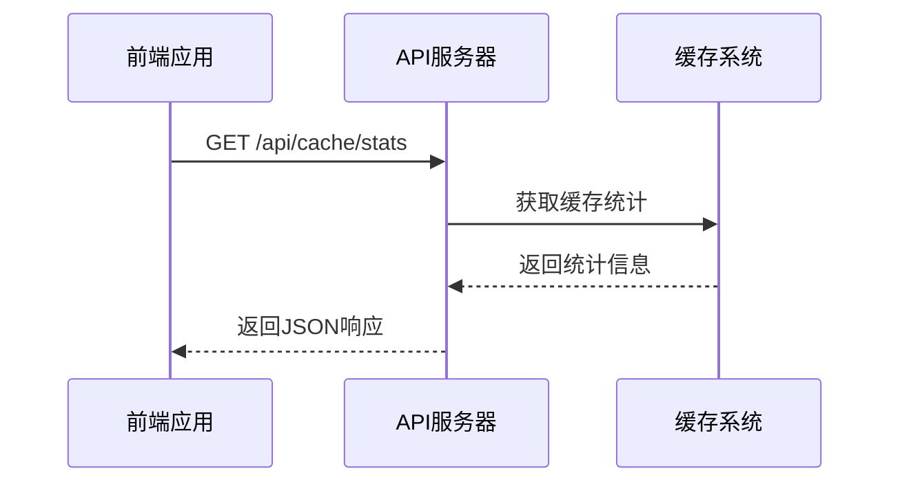
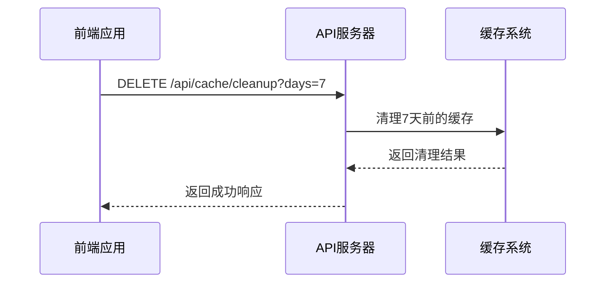
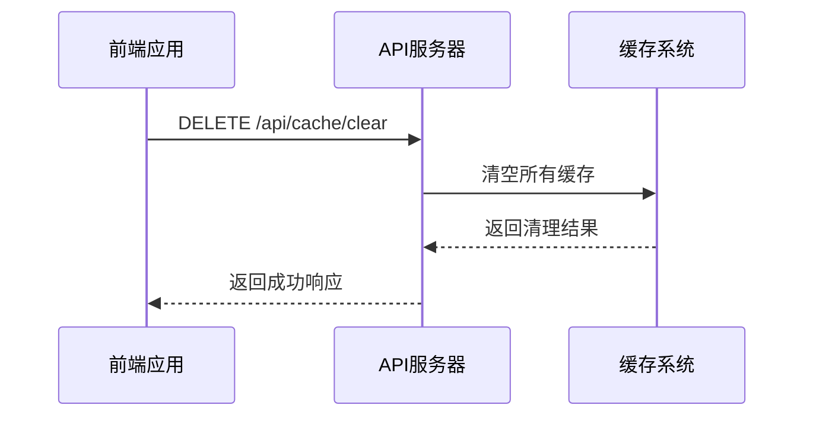
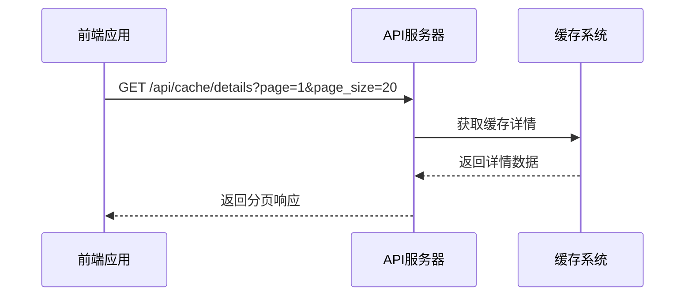
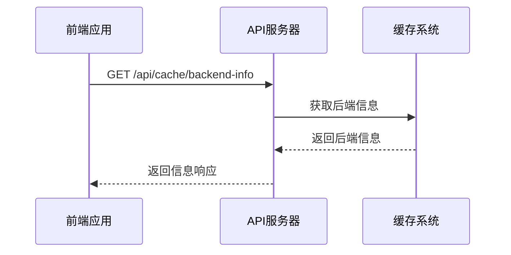
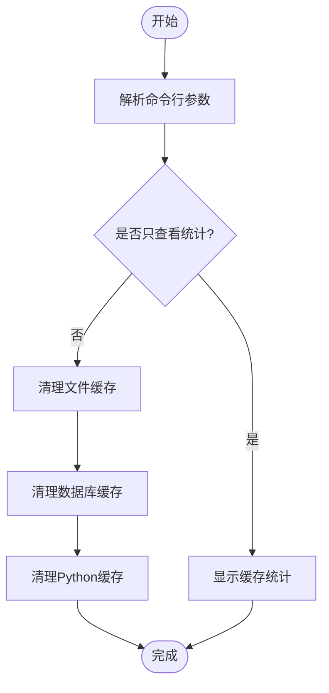
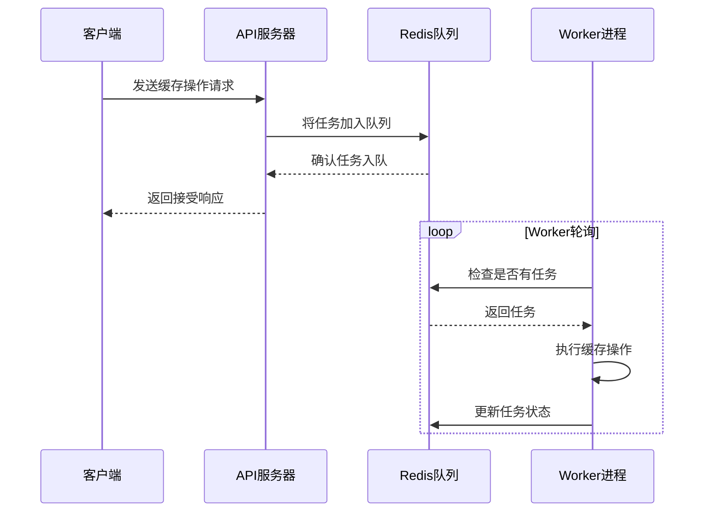
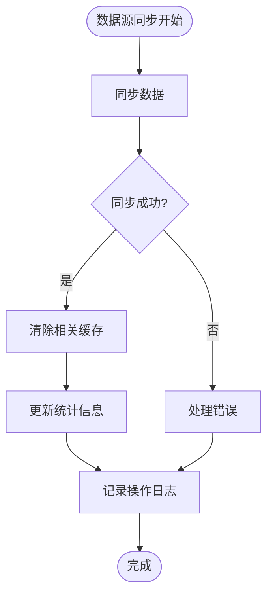
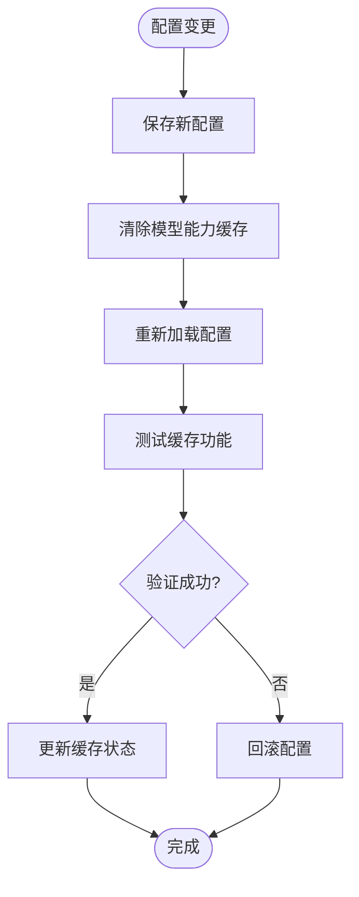
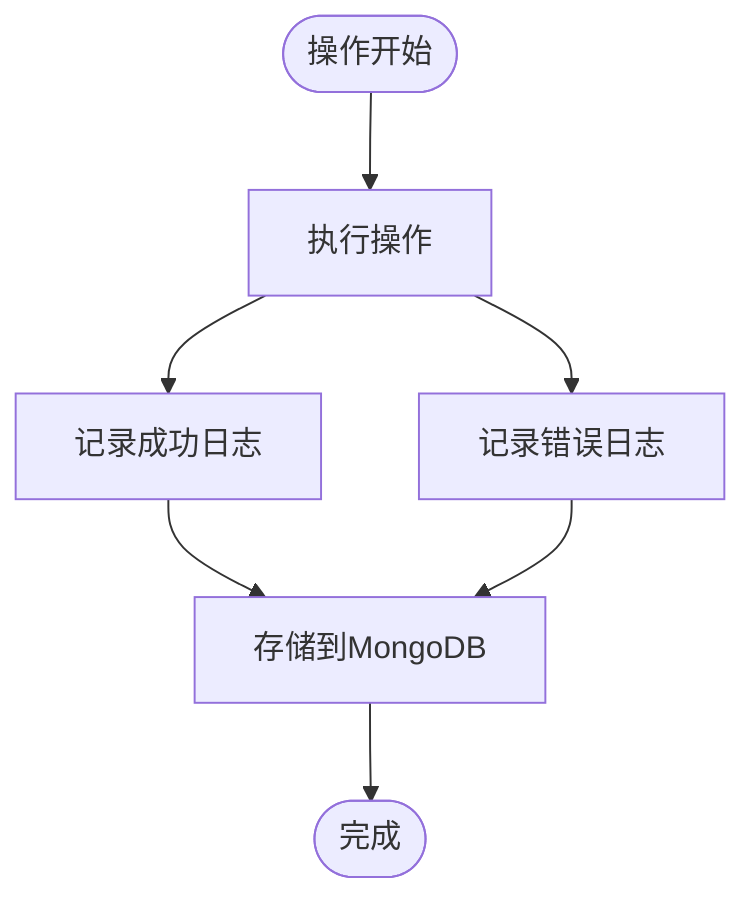

# 缓存操作指南

<cite>
**本文档引用的文件**  
- [cache.py](file://app/routers/cache.py)
- [redis_client.py](file://app/core/redis_client.py)
- [cleanup_cache.py](file://scripts/maintenance/cleanup_cache.py)
- [integrated.py](file://tradingagents/dataflows/cache/integrated.py)
- [cache.ts](file://frontend/src/api/cache.ts)
</cite>

## 目录
1. [简介](#简介)
2. [API接口操作](#api接口操作)
3. [命令行工具使用](#命令行工具使用)
4. [异步队列系统](#异步队列系统)
5. [实际操作示例](#实际操作示例)
6. [错误处理与日志查看](#错误处理与日志查看)

## 简介
本指南为开发者和系统管理员提供完整的缓存管理操作说明。系统采用多层缓存架构，支持文件缓存、Redis和MongoDB等多种后端存储。缓存系统通过API接口、命令行工具和队列系统三种方式提供管理功能，确保在不同场景下都能高效地执行缓存操作。

**Section sources**
- [cache.py](file://app/routers/cache.py#L1-L212)
- [integrated.py](file://tradingagents/dataflows/cache/integrated.py#L1-L500)

## API接口操作
通过RESTful API接口可以执行缓存的清理、刷新和预热等操作。所有API请求都需要进行身份验证，使用JWT令牌进行认证。

### 缓存统计信息
获取缓存的统计信息，包括文件数量、总大小、各类数据的缓存数量等。

**Diagram sources**
- [cache.py](file://app/routers/cache.py#L18-L47)
- [cache.ts](file://frontend/src/api/cache.ts#L54-L58)

### 清理过期缓存
清理指定天数前的过期缓存文件，释放存储空间。

**Diagram sources**
- [cache.py](file://app/routers/cache.py#L56-L84)
- [cache.ts](file://frontend/src/api/cache.ts#L65-L71)

### 清空所有缓存
清空所有缓存数据，包括过期和未过期的缓存，用于强制刷新整个缓存系统。

**Diagram sources**
- [cache.py](file://app/routers/cache.py#L93-L116)
- [cache.ts](file://frontend/src/api/cache.ts#L76-L80)

### 获取缓存详情
分页获取缓存详情列表，用于监控和分析缓存使用情况。

**Diagram sources**
- [cache.py](file://app/routers/cache.py#L125-L165)
- [cache.ts](file://frontend/src/api/cache.ts#L88-L93)

### 获取缓存后端信息
获取缓存系统的后端配置信息，包括使用的缓存系统、主后端类型和可用性状态。

**Diagram sources**
- [cache.py](file://app/routers/cache.py#L174-L204)
- [cache.ts](file://frontend/src/api/cache.ts#L97-L103)

**Section sources**
- [cache.py](file://app/routers/cache.py#L1-L212)
- [cache.ts](file://frontend/src/api/cache.ts#L1-L104)

## 命令行工具使用
通过命令行工具可以执行更复杂的缓存管理操作，适合在维护脚本或自动化任务中使用。

### 运行清理脚本
使用`cleanup_cache.py`脚本进行全量或按类型清理缓存。

**Diagram sources**
- [cleanup_cache.py](file://scripts/maintenance/cleanup_cache.py#L139-L177)

### 脚本参数说明
| 参数 | 说明 | 默认值 |
|------|------|--------|
| `--days` | 清理多少天前的缓存 | 7 |
| `--type` | 清理类型 (all/file/database/python) | all |
| `--stats` | 只显示统计信息，不清理 | false |

**Section sources**
- [cleanup_cache.py](file://scripts/maintenance/cleanup_cache.py#L1-L178)

## 异步队列系统
通过队列系统异步执行大规模缓存操作，避免阻塞主服务。

### 队列工作流程

**Diagram sources**
- [queue_service.py](file://app/services/queue_service.py#L45-L134)
- [worker.py](file://app/worker.py#L121-L125)

### 队列键名约定
| 键名 | 说明 |
|------|------|
| `user:{user_id}:pending` | 用户待处理队列 |
| `user:{user_id}:processing` | 用户处理中集合 |
| `global:pending` | 全局待处理队列 |
| `task:{task_id}:progress` | 任务进度信息 |
| `batch:{batch_id}:tasks` | 批次任务集合 |

**Section sources**
- [queue_service.py](file://app/services/queue_service.py#L1-L134)
- [keys.py](file://app/services/queue/keys.py#L1-L50)

## 实际操作示例
提供常见场景下的缓存操作示例。

### 数据源同步后清除缓存
在数据源同步完成后，清除相关缓存以确保数据一致性。

**Diagram sources**
- [sync.py](file://app/routers/sync.py#L1-L100)
- [cache.py](file://app/routers/cache.py#L93-L116)

### 配置变更后刷新模型能力缓存
当系统配置变更后，刷新模型能力相关的缓存。

**Diagram sources**
- [model_capabilities.py](file://app/routers/model_capabilities.py#L1-L300)
- [config_service.py](file://app/services/config_service.py#L1-L200)

**Section sources**
- [sync.py](file://app/routers/sync.py#L1-L100)
- [model_capabilities.py](file://app/routers/model_capabilities.py#L1-L300)

## 错误处理与日志查看
提供错误处理机制和操作审计日志的查看方法。

### 常见错误码
| 状态码 | 错误信息 | 说明 |
|--------|---------|------|
| 500 | 获取缓存统计失败 | 内部服务器错误 |
| 500 | 清理缓存失败 | 缓存清理过程中发生错误 |
| 500 | 清空缓存失败 | 缓存清空过程中发生错误 |
| 401 | 未授权 | 缺少或无效的身份验证令牌 |

### 操作审计日志
系统记录所有缓存操作日志，可通过操作日志服务查看。

**Diagram sources**
- [operation_log_service.py](file://app/services/operation_log_service.py#L1-L200)
- [operation_log.py](file://app/models/operation_log.py#L1-L138)

**Section sources**
- [cache.py](file://app/routers/cache.py#L48-L53)
- [operation_log_service.py](file://app/services/operation_log_service.py#L65-L186)
- [operation_log.py](file://app/models/operation_log.py#L1-L138)