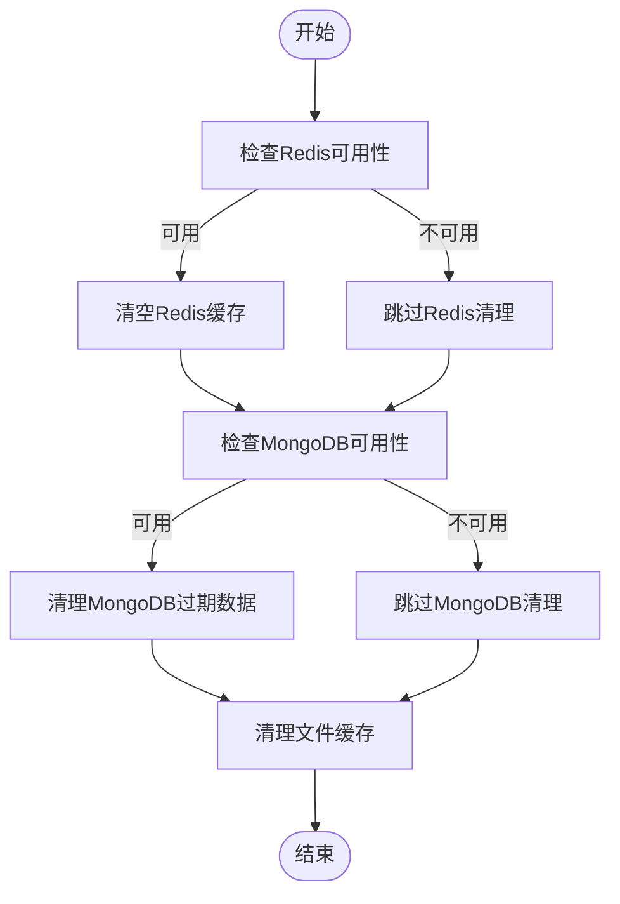

# 缓存清理策略

<cite>
**本文档引用的文件**   
- [integrated.py](file://tradingagents/dataflows/cache/integrated.py)
- [file_cache.py](file://tradingagents/dataflows/cache/file_cache.py)
- [db_cache.py](file://tradingagents/dataflows/cache/db_cache.py)
- [cache.py](file://app/routers/cache.py)
- [cleanup_cache.py](file://scripts/maintenance/cleanup_cache.py)
- [scheduler_service.py](file://app/services/scheduler_service.py)
- [CACHE_CONFIGURATION.md](file://docs/configuration/CACHE_CONFIGURATION.md)
</cite>

## 目录
1. [引言](#引言)
2. [缓存清理机制](#缓存清理机制)
3. [缓存类型与优先级](#缓存类型与优先级)
4. [配置参数说明](#配置参数说明)
5. [清理任务调度](#清理任务调度)
6. [性能影响评估](#性能影响评估)
7. [最佳实践建议](#最佳实践建议)
8. [附录](#附录)

## 引言
本文档详细说明了系统的自动与手动缓存清理机制。系统采用分层缓存架构，支持文件缓存、MongoDB和Redis等多种存储方式，并通过自适应策略智能选择最优缓存后端。缓存清理机制包括基于TTL（Time-To-Live）的过期数据自动清除逻辑，以及当磁盘使用率达到阈值时触发的主动清理流程。不同类型的缓存数据（如分析结果、行情数据、新闻数据）具有不同的保留周期和清理优先级。

**Section sources**
- [CACHE_CONFIGURATION.md](file://docs/configuration/CACHE_CONFIGURATION.md)

## 缓存清理机制

系统实现了多层级的缓存清理机制，确保缓存数据的有效性和存储空间的合理利用。

### 自动过期清理（TTL机制）
系统通过TTL机制自动清理过期缓存数据。不同类型的缓存数据具有不同的过期时间设置：
- **美股数据**：缓存2小时
- **A股数据**：缓存1小时
- **美股新闻**：缓存6小时
- **A股新闻**：缓存4小时
- **美股基本面数据**：缓存24小时
- **A股基本面数据**：缓存12小时

Redis缓存利用其内置的TTL机制自动过期数据，无需额外清理操作。


**Diagram sources**
- [file_cache.py](file://tradingagents/dataflows/cache/file_cache.py#L239-L262)

### 手动清理流程
系统提供了手动清理接口，允许管理员根据需要清理缓存。清理操作分为两种：
1. **清理过期缓存**：只清理已过期的数据
2. **清空所有缓存**：清除所有缓存数据

清理流程按优先级执行：
1. 清理Redis缓存（如果可用）
2. 清理MongoDB缓存（如果可用）
3. 清理文件缓存



**Diagram sources**
- [integrated.py](file://tradingagents/dataflows/cache/integrated.py#L285-L334)

**Section sources**
- [integrated.py](file://tradingagents/dataflows/cache/integrated.py#L265-L337)
- [db_cache.py](file://tradingagents/dataflows/cache/db_cache.py#L538-L556)
- [file_cache.py](file://tradingagents/dataflows/cache/file_cache.py#L554-L578)

## 缓存类型与优先级

系统支持多种缓存类型，每种类型具有不同的清理优先级和策略。

### 缓存类型
| 缓存类型 | 数据内容 | 存储位置 | TTL（小时） |
|---------|---------|---------|------------|
| 股票行情数据 | 历史股价、成交量等 | 按市场分类的子目录 | 1-2 |
| 新闻数据 | 股票相关新闻 | 按市场分类的子目录 | 4-6 |
| 基本面数据 | 财务指标、分析报告 | 按市场分类的子目录 | 12-24 |

### 清理优先级
清理优先级按照数据价值和更新频率确定：
1. **最低优先级**：文件缓存中的过期数据
2. **中等优先级**：MongoDB中的过期记录
3. **最高优先级**：Redis中的过期键（自动处理）

当磁盘空间不足时，系统会优先清理低价值的缓存数据，如长时间未访问的新闻数据。

**Section sources**
- [file_cache.py](file://tradingagents/dataflows/cache/file_cache.py#L55-L85)

## 配置参数说明

系统提供了丰富的配置参数，用于控制缓存行为和清理策略。

### 主要配置参数
| 参数名称 | 默认值 | 说明 |
|---------|-------|------|
| `max_age_days` | 7 | 清理多少天前的缓存数据 |
| `enable_length_check` | false | 是否启用内容长度检查 |
| `max_content_length` | 50000 | 单个缓存项的最大字符数 |
| `TA_CACHE_STRATEGY` | file | 缓存策略：file或integrated |

### TTL配置
TTL配置通过缓存类型和市场类型组合确定：
```python
cache_type = f"{market_type}_{data_type}"
max_age_hours = self.cache_config.get(cache_type, {}).get('ttl_hours', 24)
```

**Section sources**
- [file_cache.py](file://tradingagents/dataflows/cache/file_cache.py#L55-L85)
- [CACHE_CONFIGURATION.md](file://docs/configuration/CACHE_CONFIGURATION.md#L208-L224)

## 清理任务调度

缓存清理任务通过Scheduler服务进行调度管理，支持定时执行和手动触发。

### 调度方式
清理任务可以通过以下方式执行：
1. **定时调度**：通过APScheduler定期执行
2. **手动触发**：通过API接口或管理界面手动执行
3. **脚本执行**：通过维护脚本直接运行

### 调度配置


**Diagram sources**
- [scheduler_service.py](file://app/services/scheduler_service.py#L45-L800)
- [integrated.py](file://tradingagents/dataflows/cache/integrated.py#L30-L400)

### API接口
系统提供了RESTful API接口用于缓存管理：


**Diagram sources**
- [cache.py](file://app/routers/cache.py#L56-L90)

**Section sources**
- [scheduler_service.py](file://app/services/scheduler_service.py#L45-L800)
- [cache.py](file://app/routers/cache.py#L1-L212)
- [cleanup_cache.py](file://scripts/maintenance/cleanup_cache.py#L1-L178)

## 性能影响评估

缓存清理操作对系统性能有一定影响，需要合理规划执行时机。

### 性能影响因素
1. **I/O负载**：大量文件删除操作会增加磁盘I/O
2. **内存使用**：扫描缓存元数据需要内存资源
3. **CPU占用**：计算文件过期状态需要CPU处理

### 影响程度
| 清理类型 | I/O影响 | 内存影响 | CPU影响 | 建议执行时间 |
|---------|--------|--------|--------|------------|
| 过期清理 | 中等 | 低 | 低 | 任意时间 |
| 全量清理 | 高 | 中等 | 中等 | 夜间或低峰期 |

### 监控指标
系统提供以下监控指标：
- 缓存清理耗时
- 清理的文件数量
- 释放的磁盘空间
- 清理操作的错误率

**Section sources**
- [integrated.py](file://tradingagents/dataflows/cache/integrated.py#L230-L263)
- [db_cache.py](file://tradingagents/dataflows/cache/db_cache.py#L474-L536)

## 最佳实践建议

### 配置建议
1. **生产环境**：建议启用集成缓存策略，结合MongoDB和Redis使用
2. **开发环境**：使用默认的文件缓存策略，简化配置
3. **分布式部署**：必须使用集成缓存，确保多实例间缓存一致性

### 清理策略
1. **定期清理**：设置每日凌晨执行过期缓存清理
2. **监控预警**：当磁盘使用率超过80%时发出预警
3. **分批清理**：对于大规模缓存，采用分批清理避免系统卡顿

### 监控与维护
1. **定期检查**：每周检查缓存统计信息
2. **容量规划**：根据业务增长预估缓存空间需求
3. **备份重要数据**：对有价值但不常访问的数据进行归档

**Section sources**
- [CACHE_CONFIGURATION.md](file://docs/configuration/CACHE_CONFIGURATION.md#L264-L329)

## 附录

### 缓存统计信息结构
```json
{
  "total_files": 1500,
  "stock_data_count": 800,
  "news_count": 500,
  "fundamentals_count": 200,
  "total_size": 104857600,
  "total_size_mb": 100.0,
  "backend_info": {
    "mongodb": {
      "available": true,
      "collections": {
        "stock_data": {"count": 800, "size_mb": 60.0},
        "news_data": {"count": 500, "size_mb": 30.0},
        "fundamentals_data": {"count": 200, "size_mb": 10.0}
      }
    },
    "redis": {
      "available": true,
      "keys": 1500,
      "memory_usage": "100MB"
    }
  }
}
```

**Section sources**
- [db_cache.py](file://tradingagents/dataflows/cache/db_cache.py#L474-L536)
- [file_cache.py](file://tradingagents/dataflows/cache/file_cache.py#L580-L657)