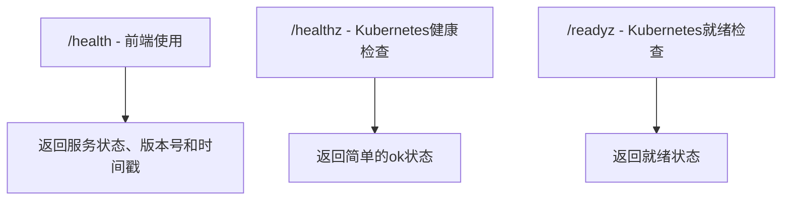
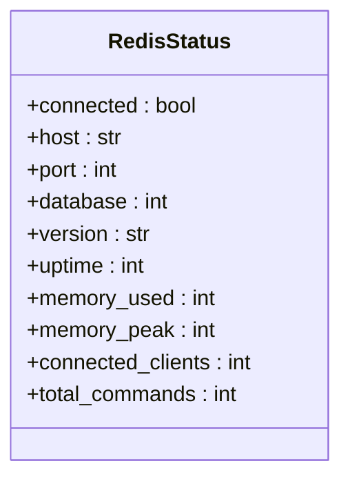
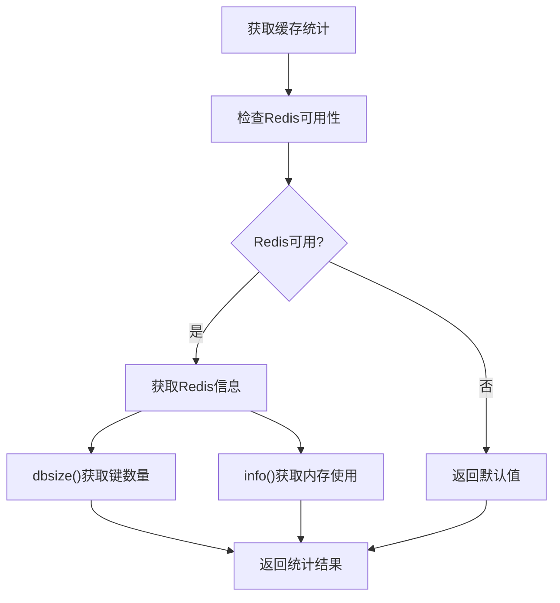
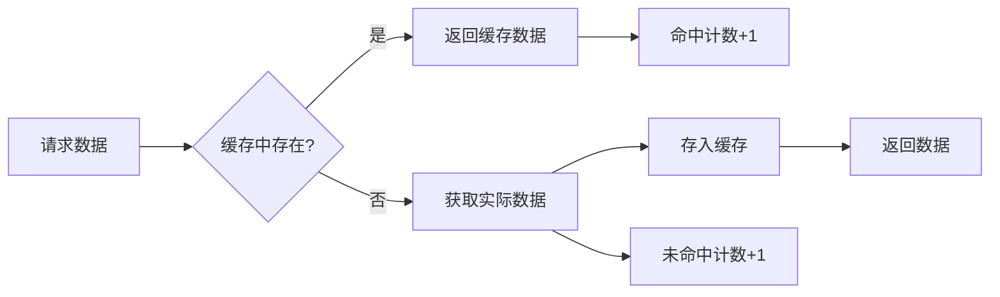
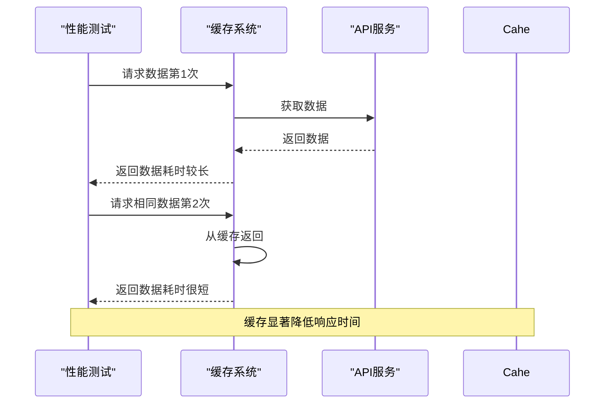
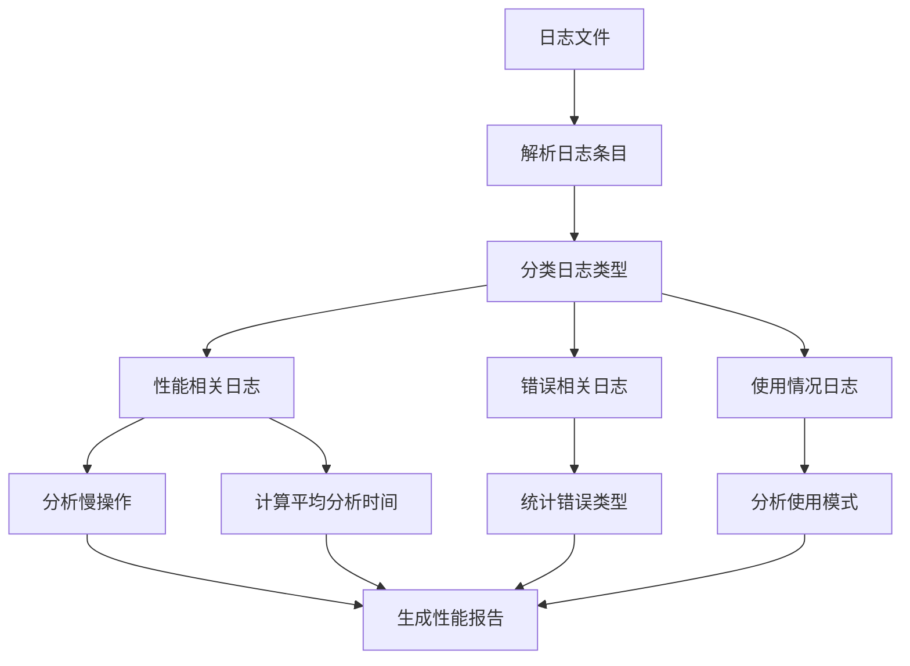
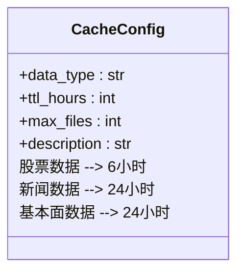
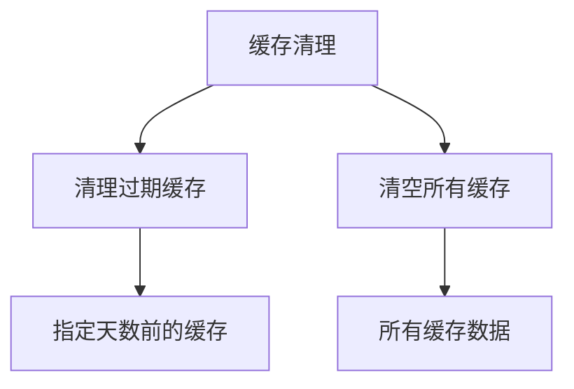

# 缓存监控与分析

<cite>
**本文档引用的文件**   
- [cache.py](file://app/routers/cache.py)
- [health.py](file://app/routers/health.py)
- [cache_management.py](file://web/modules/cache_management.py)
- [check_redis_cache.py](file://scripts/check_redis_cache.py)
- [check_us_cache_status.py](file://scripts/check_us_cache_status.py)
- [log_analyzer.py](file://scripts/log_analyzer.py)
- [__init__.py](file://tradingagents/dataflows/cache/__init__.py)
</cite>

## 目录
1. [引言](#引言)
2. [健康检查接口](#健康检查接口)
3. [缓存统计指标](#缓存统计指标)
4. [性能监控与分析](#性能监控与分析)
5. [日志分析方法](#日志分析方法)
6. [缓存策略优化](#缓存策略优化)
7. [结论](#结论)

## 引言

缓存系统在提高应用性能、降低API调用成本和提升用户体验方面起着至关重要的作用。本文档旨在指导用户如何有效监控缓存系统的健康状态和性能表现，通过健康检查接口获取核心指标，分析关键性能数据，并基于监控结果优化缓存策略。

**Section sources**
- [cache.py](file://app/routers/cache.py)
- [health.py](file://app/routers/health.py)

## 健康检查接口

系统提供了多个健康检查接口，用于监控服务的运行状态。这些接口可以帮助用户快速了解缓存服务的连接状态和基本运行情况。

### 健康检查端点

系统提供了以下健康检查端点：



**Diagram sources**
- [health.py](file://app/routers/health.py#L19-L41)

`/health` 接口提供详细的健康信息，包括：
- 服务状态（status）
- 版本号（version）
- 时间戳（timestamp）
- 服务名称（service）

这些信息对于前端应用和服务监控非常有用。

**Section sources**
- [health.py](file://app/routers/health.py#L19-L41)

## 缓存统计指标

系统提供了丰富的缓存统计指标，帮助用户全面了解缓存系统的运行状况。

### Redis连接状态

通过 `get_redis_status` 函数可以获取Redis的连接状态和详细信息：



**Diagram sources**
- [status_checks.py](file://app/services/database/status_checks.py#L40-L64)

该函数返回的指标包括：
- 连接状态（connected）
- 主机和端口信息
- Redis版本
- 运行时间（uptime）
- 内存使用情况（memory_used, memory_peak）
- 客户端连接数（connected_clients）
- 处理的命令总数（total_commands）

### 缓存核心指标

系统通过多种方式提供缓存核心指标，包括键数量、内存使用率等。



**Diagram sources**
- [database_manager.py](file://tradingagents/config/database_manager.py#L326-L344)

**Section sources**
- [database_manager.py](file://tradingagents/config/database_manager.py#L308-L344)
- [cache.py](file://app/routers/cache.py#L18-L53)

## 性能监控与分析

### 缓存命中率

缓存命中率是衡量缓存效果的关键指标。系统通过比较缓存访问和实际数据获取来计算命中率。



虽然系统没有直接提供命中率计算接口，但可以通过分析日志中的缓存访问模式来推算命中率。

### 平均响应时间

平均响应时间是衡量系统性能的重要指标。系统通过性能测试脚本来监控响应时间：



**Diagram sources**
- [test_redis_performance.py](file://tests/test_redis_performance.py#L54-L89)

**Section sources**
- [test_redis_performance.py](file://tests/test_redis_performance.py#L54-L89)

## 日志分析方法

### 基于日志的缓存访问分析

系统提供了日志分析工具，可以帮助识别热点数据和潜在的缓存穿透风险。



**Diagram sources**
- [log_analyzer.py](file://scripts/log_analyzer.py#L22-L373)

日志分析器可以识别以下关键信息：
- 慢操作（耗时超过5秒的操作）
- 平均分析时间
- API调用成本
- 错误类型分布
- 使用频率最高的模块

**Section sources**
- [log_analyzer.py](file://scripts/log_analyzer.py#L22-L373)

### 识别热点数据

通过分析日志中的数据访问模式，可以识别出被频繁访问的热点数据：

```python
# 伪代码：识别热点数据
def identify_hot_data(log_entries):
    data_access_count = defaultdict(int)
    
    for entry in log_entries:
        if "获取数据" in entry.message:
            symbol = extract_symbol(entry.message)
            data_access_count[symbol] += 1
    
    # 按访问频率排序
    hot_data = sorted(data_access_count.items(), key=lambda x: x[1], reverse=True)
    return hot_data[:10]  # 返回访问最频繁的10个数据
```

### 识别缓存穿透风险

缓存穿透是指查询不存在的数据，导致每次请求都穿透到后端数据库。系统可以通过以下方式识别潜在的缓存穿透风险：

```python
# 伪代码：识别缓存穿透
def detect_cache_penetration(log_entries):
    failed_queries = defaultdict(int)
    
    for entry in log_entries:
        if "数据不存在" in entry.message or "未找到" in entry.message:
            symbol = extract_symbol(entry.message)
            failed_queries[symbol] += 1
    
    # 高频查询但不存在的数据可能是缓存穿透风险
    penetration_risk = {k: v for k, v in failed_queries.items() if v > 10}
    return penetration_risk
```

## 缓存策略优化

### 调整TTL

根据监控数据，可以优化缓存的TTL（Time To Live）设置。系统支持不同数据类型的差异化TTL策略：



**Diagram sources**
- [cache_management.py](file://web/modules/cache_management.py#L142-L163)

### 预热关键数据集

基于热点数据分析结果，可以预热关键数据集，提高系统响应速度：

```python
# 伪代码：预热关键数据集
def warm_up_cache(hot_data_list):
    cache = get_cache()
    
    for symbol, access_count in hot_data_list:
        # 预先加载高频访问的数据
        try:
            cache.get_stock_data(symbol)
            logger.info(f"✅ 已预热 {symbol} 的数据")
        except Exception as e:
            logger.error(f"❌ 预热 {symbol} 数据失败: {e}")
```

### 缓存清理策略

系统提供了多种缓存清理策略，可以根据需要进行选择：



**Diagram sources**
- [cache.py](file://app/routers/cache.py#L56-L123)

**Section sources**
- [cache.py](file://app/routers/cache.py#L56-L123)

## 结论

通过综合运用健康检查接口、缓存统计指标、性能监控和日志分析方法，用户可以全面了解缓存系统的运行状况。基于这些监控数据，可以有效优化缓存策略，包括调整TTL设置和预热关键数据集，从而进一步提升系统性能和用户体验。