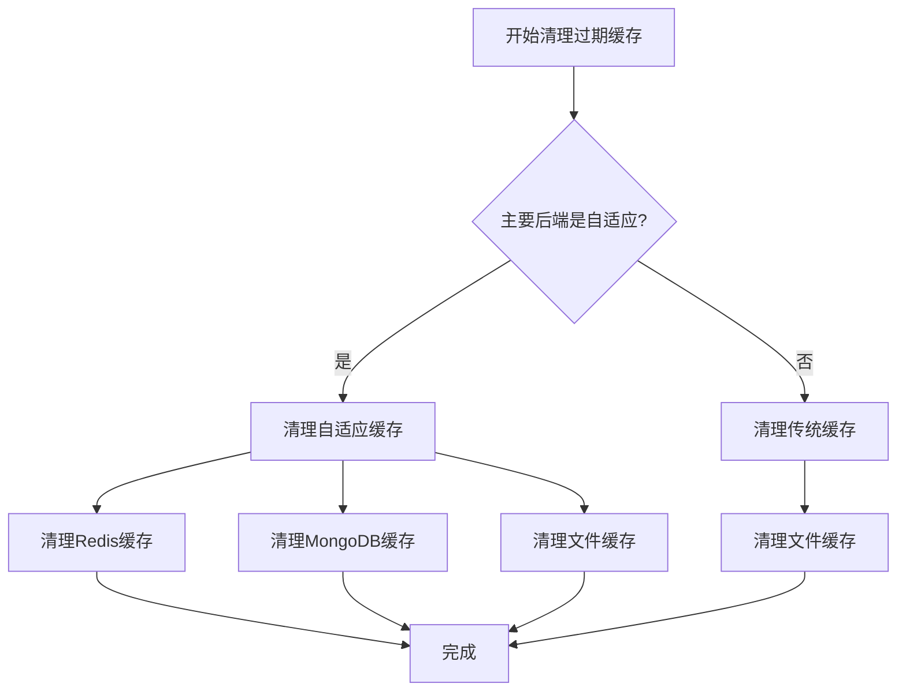
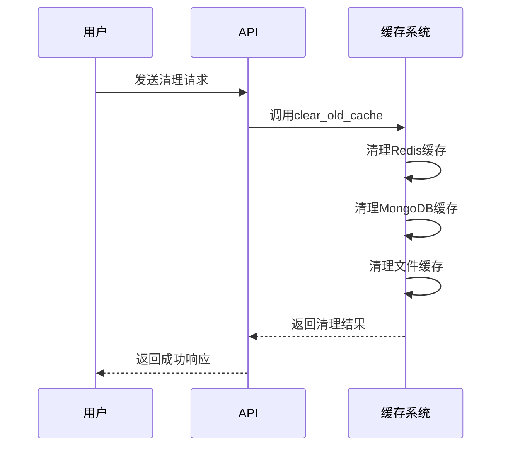

# 缓存管理策略

<cite>
**本文档引用的文件**   
- [cache.py](file://app/routers/cache.py)
- [CACHE_CONFIGURATION.md](file://docs/configuration/CACHE_CONFIGURATION.md)
- [integrated.py](file://tradingagents/dataflows/cache/integrated.py)
- [adaptive.py](file://tradingagents/dataflows/cache/adaptive.py)
- [file_cache.py](file://tradingagents/dataflows/cache/file_cache.py)
- [cleanup_cache.py](file://scripts/maintenance/cleanup_cache.py)
- [get_cache](file://tradingagents/dataflows/cache/__init__.py)
</cite>

## 目录
1. [引言](#引言)
2. [缓存生命周期管理](#缓存生命周期管理)
3. [自动清理策略](#自动清理策略)
4. [手动清理操作](#手动清理操作)
5. [缓存容量监控与性能分析](#缓存容量监控与性能分析)
6. [缓存预热机制](#缓存预热机制)
7. [最佳实践](#最佳实践)

## 引言
本缓存管理策略文档全面介绍了系统的缓存生命周期管理机制。系统支持多种缓存策略，包括文件缓存和集成缓存（MongoDB + Redis + File），可根据部署环境和性能需求灵活选择。文档详细说明了基于TTL的过期清理和基于磁盘使用率的主动清理等自动清理策略，以及通过管理API或命令行工具清除特定类型缓存的手动清理操作。同时，提供了缓存容量监控和性能分析工具的使用指南，包括如何查看缓存命中率、内存使用情况等关键指标，并解释了缓存预热机制的配置方法及在系统启动或数据更新后的最佳实践。

**Section sources**
- [CACHE_CONFIGURATION.md](file://docs/configuration/CACHE_CONFIGURATION.md)

## 缓存生命周期管理
系统的缓存生命周期管理机制通过自适应缓存系统实现，能够根据数据库可用性自动选择最佳缓存策略。缓存系统支持多种后端，包括文件、MongoDB和Redis，并根据配置的TTL（Time To Live）值自动管理缓存的有效期。

缓存键的生成基于股票代码、日期范围、数据源和数据类型等参数，通过MD5哈希算法生成唯一标识。缓存的有效性检查结合了TTL机制和缓存数据的实际使用情况，确保缓存数据的时效性和准确性。

对于不同类型的市场数据，系统配置了不同的TTL值：
- 美股历史数据：2小时
- A股历史数据：1小时
- 美股新闻数据：6小时
- A股新闻数据：4小时
- 美股基本面数据：24小时
- A股基本面数据：12小时

**Section sources**
- [adaptive.py](file://tradingagents/dataflows/cache/adaptive.py)
- [file_cache.py](file://tradingagents/dataflows/cache/file_cache.py)

## 自动清理策略
系统实现了基于TTL的过期清理和基于磁盘使用率的主动清理两种自动清理策略。

### 基于TTL的过期清理
TTL（Time To Live）机制是缓存自动清理的核心。系统为不同类型的缓存数据配置了不同的TTL值，当缓存数据超过其有效期后，系统会自动将其标记为过期并清理。

在自适应缓存系统中，TTL机制的实现方式因后端而异：
- **Redis后端**：利用Redis自身的TTL机制，设置键的过期时间，Redis会自动清理过期的键。
- **MongoDB后端**：在文档中设置`expires_at`字段，通过MongoDB的TTL索引自动清理过期文档。
- **文件后端**：系统定期扫描缓存文件，检查其创建时间是否超过TTL，若超过则删除文件。



**Diagram sources**
- [integrated.py](file://tradingagents/dataflows/cache/integrated.py)

### 基于磁盘使用率的主动清理
系统通过`clear_old_cache`方法实现基于磁盘使用率的主动清理。该方法允许用户指定清理多少天前的缓存，或清理所有缓存。

清理过程按以下顺序执行：
1. **清理Redis缓存**：如果Redis可用，根据指定的天数清理过期数据，或使用`flushdb`命令清空所有缓存。
2. **清理MongoDB缓存**：如果MongoDB可用，根据指定的天数清理过期数据，或删除所有缓存集合。
3. **清理文件缓存**：清理指定天数前的缓存文件，或清空所有缓存目录。

**Section sources**
- [integrated.py](file://tradingagents/dataflows/cache/integrated.py)
- [adaptive.py](file://tradingagents/dataflows/cache/adaptive.py)

## 手动清理操作
系统提供了多种手动清理缓存的操作方式，包括通过管理API和命令行工具。

### 通过管理API清理
系统提供了RESTful API接口用于手动清理缓存，主要接口包括：

- **获取缓存统计信息**：`GET /api/cache/stats`
  返回缓存的总文件数、总大小、各类数据的缓存数量等统计信息。

- **清理过期缓存**：`DELETE /api/cache/cleanup`
  清理指定天数前的过期缓存，参数`days`指定清理多少天前的缓存。

- **清空所有缓存**：`DELETE /api/cache/clear`
  清空所有缓存，包括过期和未过期的缓存。

- **获取缓存详情**：`GET /api/cache/details`
  获取缓存详情列表，支持分页查询。

- **获取缓存后端信息**：`GET /api/cache/backend-info`
  获取缓存后端的配置信息，包括系统类型、主要后端、降级支持等。



**Diagram sources**
- [cache.py](file://app/routers/cache.py)

### 通过命令行工具清理
系统提供了`scripts/maintenance/cleanup_cache.py`脚本用于命令行清理缓存。该脚本支持多种清理选项：

```bash
# 查看缓存统计信息
python scripts/maintenance/cleanup_cache.py --stats

# 清理7天前的缓存（默认）
python scripts/maintenance/cleanup_cache.py

# 清理3天前的缓存
python scripts/maintenance/cleanup_cache.py --days 3

# 只清理文件缓存
python scripts/maintenance/cleanup_cache.py --type file

# 只清理数据库缓存
python scripts/maintenance/cleanup_cache.py --type database

# 只清理Python缓存文件
python scripts/maintenance/cleanup_cache.py --type python
```

**Section sources**
- [cleanup_cache.py](file://scripts/maintenance/cleanup_cache.py)

## 缓存容量监控与性能分析
系统提供了完善的缓存容量监控和性能分析工具，帮助用户了解缓存的使用情况和性能表现。

### 缓存统计信息
通过`get_cache_stats`方法可以获取详细的缓存统计信息，包括：
- `total_files`: 缓存文件总数
- `total_size`: 缓存总大小（字节）
- `stock_data_count`: 股票数据缓存数量
- `news_count`: 新闻数据缓存数量
- `fundamentals_count`: 基本面数据缓存数量
- `backend_info`: 后端详细信息，包括数据库可用性、Redis内存使用情况等

### 性能分析工具
系统提供了性能测试功能，可以评估缓存的性能表现。通过模拟API调用和缓存读取，计算性能改进百分比：

```python
# 假设API调用需要2秒
api_simulation_time = 2.0
improvement = ((api_simulation_time - avg_load_time) / api_simulation_time) * 100
print(f"性能改进: {improvement:.1f}%")
```

当性能改进超过90%时，系统会提示"性能改进显著！"。

**Section sources**
- [integrated.py](file://tradingagents/dataflows/cache/integrated.py)
- [adaptive.py](file://tradingagents/dataflows/cache/adaptive.py)

## 缓存预热机制
系统通过自适应缓存系统实现了智能的缓存预热机制。缓存预热主要在系统启动和数据更新后进行，以确保关键数据在需要时已经存在于缓存中。

### 配置方法
缓存预热的配置主要通过环境变量和`.env`文件进行：

```env
# 缓存策略
TA_CACHE_STRATEGY=integrated

# 数据库配置
MONGODB_URL=mongodb://localhost:27017
REDIS_URL=redis://localhost:6379
```

### 最佳实践
1. **系统启动时**：在系统启动过程中，优先加载常用股票的基本面数据和近期历史行情数据到缓存中。
2. **数据更新后**：当基础数据更新后，立即触发相关股票的缓存预热，确保新数据能够及时被使用。
3. **高峰期前**：在交易高峰期前，预热热门股票的完整数据集，提高系统响应速度。
4. **监控与调整**：定期监控缓存命中率，根据实际使用情况调整预热策略。

**Section sources**
- [CACHE_CONFIGURATION.md](file://docs/configuration/CACHE_CONFIGURATION.md)
- [adaptive.py](file://tradingagents/dataflows/cache/adaptive.py)

## 最佳实践
1. **开发环境**：使用文件缓存，简单快速，无需配置外部依赖。
2. **生产环境**：使用集成缓存，配置MongoDB + Redis，获得最佳性能。
3. **统一入口**：始终使用`from tradingagents.dataflows.cache import get_cache`获取缓存实例。
4. **环境变量**：通过环境变量切换缓存策略，不修改代码。
5. **自动降级**：依赖集成缓存的自动降级机制，确保系统稳定。
6. **定期清理**：定期执行缓存清理，避免磁盘空间被过度占用。
7. **监控告警**：设置缓存命中率和内存使用率的监控告警，及时发现性能问题。