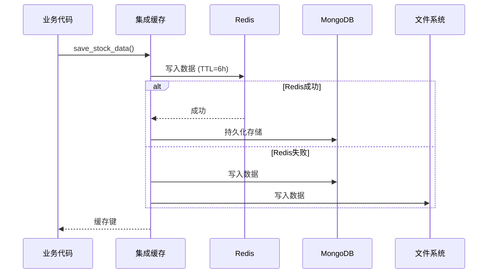
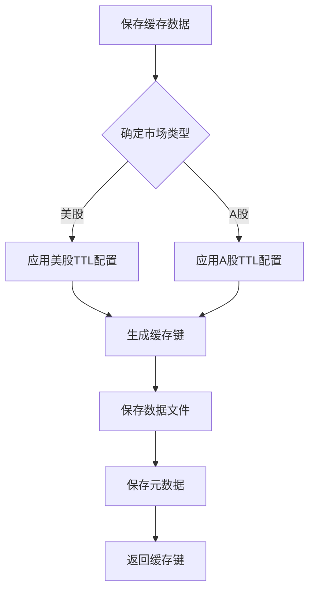
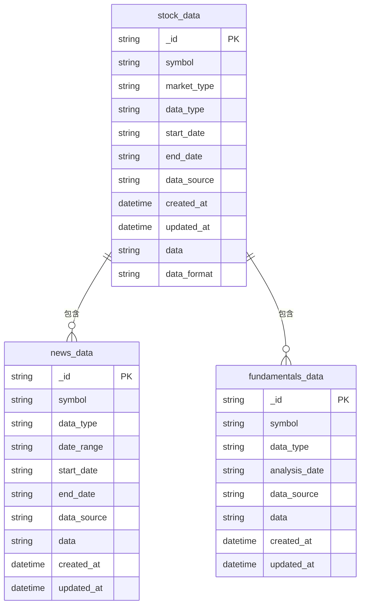
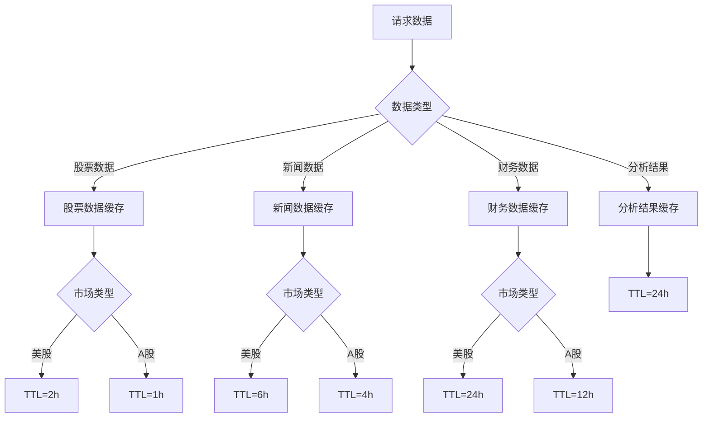
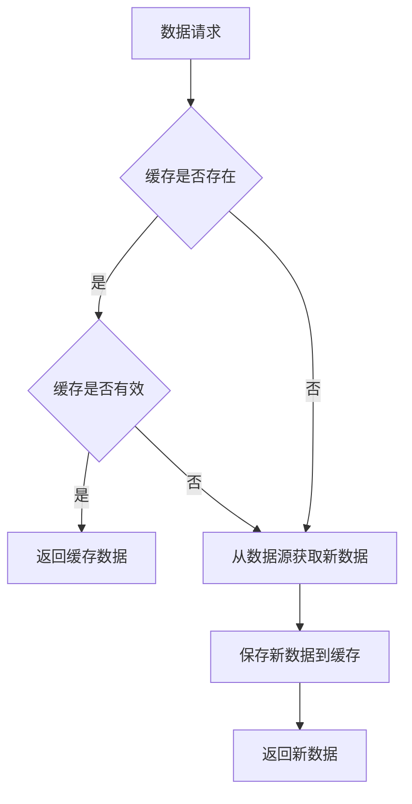

# 缓存配置

<cite>
**本文档引用的文件**  
- [CACHE_CONFIGURATION.md](file://docs/configuration/CACHE_CONFIGURATION.md)
- [config.py](file://app/core/config.py)
- [file_cache.py](file://tradingagents/dataflows/cache/file_cache.py)
- [db_cache.py](file://tradingagents/dataflows/cache/db_cache.py)
- [integrated.py](file://tradingagents/dataflows/cache/integrated.py)
- [mongodb_cache_adapter.py](file://tradingagents/dataflows/cache/mongodb_cache_adapter.py)
- [adaptive_cache_manager.py](file://scripts/development/adaptive_cache_manager.py)
- [enable_mongodb_cache.py](file://scripts/enable_mongodb_cache.py)
- [cleanup_cache.py](file://scripts/maintenance/cleanup_cache.py)
- [cache_management.py](file://web/modules/cache_management.py)
</cite>

## 目录
1. [多层缓存架构](#多层缓存架构)
2. [Redis缓存配置](#redis缓存配置)
3. [文件系统缓存配置](#文件系统缓存配置)
4. [MongoDB缓存配置](#mongodb缓存配置)
5. [缓存分区策略](#缓存分区策略)
6. [缓存清理与容量管理](#缓存清理与容量管理)
7. [缓存一致性维护](#缓存一致性维护)

## 多层缓存架构

本系统采用多层缓存架构，支持多种缓存策略以适应不同部署环境和性能需求。系统提供文件缓存、Redis缓存和MongoDB缓存三种主要缓存后端，可根据配置自动选择最佳缓存策略。

缓存系统通过环境变量`TA_CACHE_STRATEGY`进行配置，支持以下策略：
- **文件缓存**（`file`）：默认策略，简单稳定，不依赖外部服务
- **集成缓存**（`integrated`）：高性能模式，优先使用Redis和MongoDB，自动降级到文件缓存
- **自适应缓存**（`adaptive`）：同集成缓存，为别名

系统采用统一的缓存入口`get_cache()`，业务代码通过此接口获取缓存实例，无需关心底层实现细节。这种设计实现了缓存策略的解耦，使系统能够在不同环境中灵活切换缓存后端。

```mermaid
graph TD
A[业务代码] --> B[统一缓存入口 get_cache()]
B --> C{缓存策略}
C --> |TA_CACHE_STRATEGY=file| D[文件缓存]
C --> |TA_CACHE_STRATEGY=integrated| E[集成缓存管理器]
E --> F{后端可用性}
F --> |Redis可用| G[Redis缓存]
F --> |MongoDB可用| H[MongoDB缓存]
F --> |均不可用| I[文件缓存]
D --> J[本地文件系统]
G --> K[Redis服务器]
H --> L[MongoDB数据库]
I --> J
```

**Diagram sources**
- [CACHE_CONFIGURATION.md](file://docs/configuration/CACHE_CONFIGURATION.md#缓存策略对比)
- [integrated.py](file://tradingagents/dataflows/cache/integrated.py#L30-L389)

**Section sources**
- [CACHE_CONFIGURATION.md](file://docs/configuration/CACHE_CONFIGURATION.md)
- [integrated.py](file://tradingagents/dataflows/cache/integrated.py)

## Redis缓存配置

Redis作为主要的内存缓存后端，提供高速的数据访问能力。系统通过Redis实现快速缓存，减少对数据库和文件系统的访问压力。

### 连接参数配置

Redis连接参数通过配置文件或环境变量进行设置，主要配置项包括：

| 配置项 | 默认值 | 说明 |
|--------|--------|------|
| `REDIS_HOST` | localhost | Redis服务器主机地址 |
| `REDIS_PORT` | 6379 | Redis服务器端口 |
| `REDIS_PASSWORD` | 空 | Redis认证密码 |
| `REDIS_DB` | 0 | Redis数据库编号 |
| `REDIS_MAX_CONNECTIONS` | 20 | 最大连接数 |
| `REDIS_RETRY_ON_TIMEOUT` | true | 超时时是否重试 |

这些配置在`app/core/config.py`中定义，系统通过`REDIS_URL`属性构建连接字符串：
```
redis://:{password}@{host}:{port}/{db}
```

### 序列化格式

系统使用JSON格式序列化缓存数据，确保数据的可读性和兼容性。对于Pandas DataFrame等复杂数据类型，系统采用JSON序列化并保留数据结构信息。

```python
# Redis数据结构示例
{
    "data": "序列化的数据内容",
    "data_format": "dataframe_json",  # 或 "text"
    "symbol": "股票代码",
    "data_source": "数据源",
    "created_at": "创建时间"
}
```

### 过期策略

Redis缓存采用TTL（Time To Live）机制管理数据过期，不同数据类型设置不同的过期时间：

- **股票数据**：6小时过期
- **新闻数据**：24小时过期
- **基本面数据**：24小时过期

系统在写入Redis时自动设置过期时间，无需手动清理过期数据。当Redis不可用时，系统会自动降级到文件缓存，确保功能正常。



**Diagram sources**
- [db_cache.py](file://tradingagents/dataflows/cache/db_cache.py#L246-L264)
- [config.py](file://app/core/config.py#L58-L64)

**Section sources**
- [db_cache.py](file://tradingagents/dataflows/cache/db_cache.py)
- [config.py](file://app/core/config.py)

## 文件系统缓存配置

文件系统缓存作为基础缓存策略，提供简单稳定的缓存解决方案，不依赖任何外部服务。

### 配置选项

文件系统缓存的主要配置参数包括：

| 配置项 | 默认值 | 说明 |
|--------|--------|------|
| `CACHE_TTL` | 3600 | 通用缓存过期时间（秒） |
| `SCREENING_CACHE_TTL` | 1800 | 筛选结果缓存过期时间（秒） |

这些配置在`app/core/config.py`中定义，系统根据数据类型和市场自动调整实际的TTL值。

### 目录结构

文件缓存采用分类存储策略，按数据类型和市场类型创建不同的子目录：

```
data_cache/
├── us_stocks/           # 美股股票数据
├── china_stocks/        # A股股票数据
├── us_news/             # 美股新闻数据
├── china_news/          # A股新闻数据
├── us_fundamentals/     # 美股基本面数据
├── china_fundamentals/  # A股基本面数据
└── metadata/            # 元数据文件
```

### 智能TTL管理

系统根据数据类型和市场自动确定缓存过期时间，实现智能TTL管理：

| 数据类型 | 美股TTL | A股TTL | 说明 |
|----------|---------|--------|------|
| 股票数据 | 2小时 | 1小时 | A股实时性要求更高 |
| 新闻数据 | 6小时 | 4小时 | 新闻时效性管理 |
| 基本面数据 | 24小时 | 12小时 | 基本面更新频率 |

系统通过`_determine_market_type()`方法自动识别股票代码的市场类型，并根据`cache_config`配置应用相应的TTL策略。



**Diagram sources**
- [file_cache.py](file://tradingagents/dataflows/cache/file_cache.py#L55-L85)
- [config.py](file://app/core/config.py#L120-L121)

**Section sources**
- [file_cache.py](file://tradingagents/dataflows/cache/file_cache.py)
- [config.py](file://app/core/config.py)

## MongoDB缓存配置

MongoDB作为持久化缓存后端，提供数据的持久化存储和分布式访问能力。

### 启用配置

要启用MongoDB缓存，需设置环境变量或在`.env`文件中配置：

```env
TA_CACHE_STRATEGY=integrated
MONGODB_URL=mongodb://localhost:27017
```

系统通过`enable_mongodb_cache.py`脚本可一键启用MongoDB缓存，该脚本会自动更新`.env`文件并验证配置。

### 连接参数

MongoDB连接参数通过配置文件设置：

| 配置项 | 默认值 | 说明 |
|--------|--------|------|
| `MONGODB_HOST` | localhost | MongoDB主机地址 |
| `MONGODB_PORT` | 27017 | MongoDB端口 |
| `MONGODB_USERNAME` | 空 | 认证用户名 |
| `MONGODB_PASSWORD` | 空 | 认证密码 |
| `MONGODB_DATABASE` | tradingagents | 数据库名称 |
| `MONGO_URI` | 动态生成 | 完整连接字符串 |

系统通过`MONGO_URI`属性动态构建连接字符串，支持认证配置。

### 索引优化

系统为常用查询字段创建索引，提高查询性能：

- **股票数据**：`(symbol, data_source, start_date, end_date)`
- **新闻数据**：`(symbol, data_source, date_range)`
- **基本面数据**：`(symbol, data_source, analysis_date)`

这些索引在`_create_mongodb_indexes()`方法中定义，确保高频查询的性能。



**Diagram sources**
- [db_cache.py](file://tradingagents/dataflows/cache/db_cache.py#L143-L169)
- [enable_mongodb_cache.py](file://scripts/enable_mongodb_cache.py)
- [config.py](file://app/core/config.py#L30-L37)

**Section sources**
- [db_cache.py](file://tradingagents/dataflows/cache/db_cache.py)
- [enable_mongodb_cache.py](file://scripts/enable_mongodb_cache.py)

## 缓存分区策略

系统采用精细化的缓存分区策略，根据不同数据类型和市场特性配置不同的缓存参数。

### 分析结果缓存

分析结果缓存主要用于存储LLM生成的分析报告，配置特点：

- **过期时间**：24小时
- **存储位置**：文件系统`metadata/`目录
- **容量限制**：50,000字符
- **内容检查**：启用长度检查，超长内容跳过缓存

系统通过`should_skip_cache_for_content()`方法检查内容长度，避免缓存过大内容。

### 股票数据缓存

股票数据缓存根据市场类型采用不同的分区策略：

| 市场 | TTL | 最大文件数 | 存储目录 |
|------|-----|------------|----------|
| 美股 | 2小时 | 1000 | us_stocks/ |
| A股 | 1小时 | 1000 | china_stocks/ |

系统通过`_determine_market_type()`方法自动识别市场类型，并应用相应的缓存配置。

### 财务数据缓存

财务数据缓存配置如下：

| 市场 | TTL | 最大文件数 | 存储目录 |
|------|-----|------------|----------|
| 美股 | 24小时 | 200 | us_fundamentals/ |
| A股 | 12小时 | 200 | china_fundamentals/ |

财务数据通常变化较慢，因此设置较长的TTL，减少重复计算。



**Diagram sources**
- [file_cache.py](file://tradingagents/dataflows/cache/file_cache.py#L55-L85)
- [integrated.py](file://tradingagents/dataflows/cache/integrated.py#L369-L379)

**Section sources**
- [file_cache.py](file://tradingagents/dataflows/cache/file_cache.py)
- [integrated.py](file://tradingagents/dataflows/cache/integrated.py)

## 缓存清理与容量管理

系统提供完善的缓存清理机制和容量管理策略，确保缓存系统的稳定运行。

### 清理策略

系统支持多种缓存清理方式：

1. **自动清理**：通过`clear_old_cache()`方法定期清理过期缓存
2. **手动清理**：通过`cleanup_cache.py`脚本执行清理任务
3. **Web界面清理**：通过`cache_management.py`提供的Web界面操作

清理策略根据缓存类型采用不同方法：
- **文件缓存**：直接删除过期文件
- **Redis缓存**：依赖TTL自动过期，支持`flushdb`清空
- **MongoDB缓存**：执行`delete_many`删除过期记录

### 容量管理

系统通过以下方式管理缓存容量：

- **文件数量限制**：为不同类型缓存设置最大文件数
- **磁盘空间监控**：通过`get_cache_stats()`获取缓存统计信息
- **内容长度检查**：避免缓存超长内容

```python
# 缓存统计信息示例
{
    'total_files': 150,
    'stock_data_count': 100,
    'news_count': 30,
    'fundamentals_count': 20,
    'total_size_mb': 2.5,
    'backend_info': {
        'mongodb': {'available': True, 'collections': {...}},
        'redis': {'available': True, 'keys': 50, 'memory_usage': '1.2MB'}
    }
}
```

### 清理脚本使用

`cleanup_cache.py`脚本提供灵活的清理选项：

```bash
# 查看缓存统计
python scripts/maintenance/cleanup_cache.py --stats

# 清理7天前的缓存
python scripts/maintenance/cleanup_cache.py --days 7

# 只清理文件缓存
python scripts/maintenance/cleanup_cache.py --type file
```

**Section sources**
- [cleanup_cache.py](file://scripts/maintenance/cleanup_cache.py)
- [file_cache.py](file://tradingagents/dataflows/cache/file_cache.py#L554-L578)
- [db_cache.py](file://tradingagents/dataflows/cache/db_cache.py#L538-L556)
- [cache_management.py](file://web/modules/cache_management.py)

## 缓存一致性维护

系统通过多种机制维护缓存一致性，确保数据的准确性和时效性。

### 自动降级机制

系统采用"最佳后端优先"策略，当首选缓存后端不可用时自动降级：

1. **首选**：Redis（最快）
2. **次选**：MongoDB（持久化）
3. **备选**：文件系统（最稳定）

这种机制确保在任何情况下系统都能正常运行，不会因缓存问题导致服务中断。

### 数据源优先级

系统通过`_get_data_source_priority()`方法确定数据源优先级，确保获取最新数据：

```python
# 数据源优先级顺序
['tushare', 'akshare', 'baostock']
```

系统按优先级顺序查询数据，优先使用高质量数据源。

### 一致性检查

系统提供多种一致性维护机制：

- **TTL检查**：通过`is_cache_valid()`方法检查缓存有效性
- **元数据管理**：每个缓存文件对应元数据，记录创建时间等信息
- **缓存统计**：通过`get_cache_stats()`监控缓存状态

### 一致性维护流程



系统通过这种流程确保始终返回最新有效的数据，同时最大化缓存利用率。

**Section sources**
- [integrated.py](file://tradingagents/dataflows/cache/integrated.py#L369-L379)
- [mongodb_cache_adapter.py](file://tradingagents/dataflows/cache/mongodb_cache_adapter.py#L81-L158)
- [file_cache.py](file://tradingagents/dataflows/cache/file_cache.py#L233-L264)